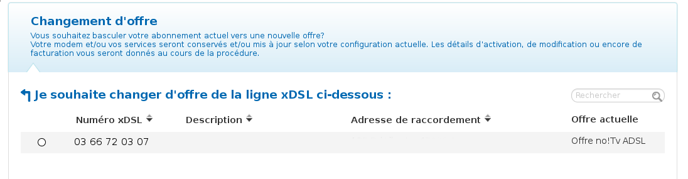
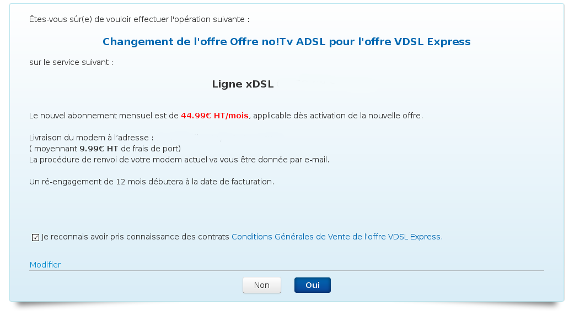

### Préambule {#préambule}

Lorsque vous possédez un accès ADSL en collecte et que votre ligne est éligible, vous pouvez demander à migrer vers un accès VDSL avec un débit maximum de 50 Mbps en download et 8 Mbps en upload si votre accès est en collecte.

Si votre modem est déjà synchronisé à un débit de VDSL, la modification sera effective sous quelques heures. Si votre accès est sur des débits ADSL, la commande de VDSL sera plus longue : 5 à 7 jours ouvrés en moyenne. Si votre modem ne supporte pas le VDSL, un nouvel équipement vous sera envoyé.

La migration vers une offre VDSL impose un réengagement de 12 Mois.

**Sommaire :**

Niveau : Débutant

------------------------------------------------------------------------

### Prérequis {#prérequis}

Pour pouvoir migrer vers une offre VDSL vous devez avoir :

-   un accès ADSL sur collecte de l'opérateur historique ;
-   accès à votre Espace Client.

------------------------------------------------------------------------

### Lancer la migration {#lancer-la-migration}

Pour lancer la migration de votre accès :

-   Connectez vous à votre Espace Client : <https://www.ovhtelecom.fr/espaceclient/>
-   Cliquez sur "**Gestion des offres**".
-   Cliquez sur "**Changer d'offre**".
-   Sélectionnez l'accès à migrer puis cliquez sur "**Suivant**".

{.thumbnail}

-   Sélectionnez l'offre VDSL de votre choix : **VDSL Express**ou **VDSL Entreprise** puis cliquez sur **Suivant**.

Si vous possédez un ancien modem non compatible avec le VDSL, une étape supplémentaire est affichée vous demandant de sélectionner le mode de livraison : via **Mondial Relay** (Gratuit) ou via **DHL** (9.99 € HT).

-   La dernière étape est la confirmation de la commande. Il vous suffit de lire et de cliquer sur "**Je reconnais avoir pris connaissance des contratsConditions Générales de Vente de l'offre VDSL Express.**" Pour valider la commande, cliquez sur "**Oui**".

{.thumbnail}
