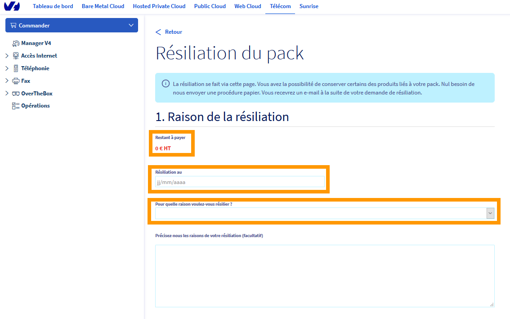
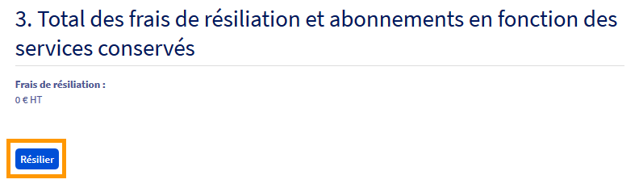
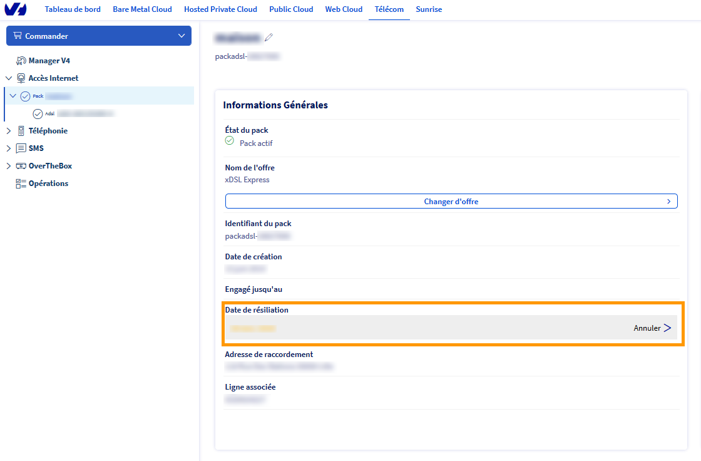

## Objectif

Votre offre internet ne vous convient plus, vous pouvez alors demander la résiliation de votre offre actuelle.

La résiliation sera effective à la prochaine facturation de votre accès et les instructions pour retourner votre modem vous seront envoyées.

**Sommaire :**

Niveau : Débutant

------------------------------------------------------------------------

## Prérequis

- Disposer d'un accès xDSL/FTTH actif.
- Être connecté à l’[espace client OVHcloud](https://www.ovhtelecom.fr/manager/), partie `Télécom`.

------------------------------------------------------------------------

## Demander la résiliation

Connectez-vous à votre [Espace Client OVHcloud](https://www.ovhtelecom.fr/manager/), puis sélectionnez votre pack dans la rubrique "**Accès Internet**".
 Cliquez ensuite sur le bouton `Résilier` dans la catégorie "**Informations Générales**".

{.thumbnail}

Si vous êtes toujours engagé pour cet accès, le montant des frais de résiliation sera indiqué dans la rubrique "restant à payer".
 Choisissez la **date** souhaitée pour cette résiliation ainsi que la raison decette dernière.

{.thumbnail}

Il vous sera ensuite possible de demander à conserver certains services liés à votre pack (s'ils ont été auparavant activés) tel que :
- lignes voip/fax
- numéro(s) porté(s)
- compte exchange (si pack xDSL entreprise)
- nom de domaine (si pack xDSL entreprise)

{.thumbnail}

Une fois vos choix effectué, cliquez sur le bouton `Résilier` en bas de page

{.thumbnail}

Vous recevrez un e-mail vous confirmant la prise en compte de la demande de résiliation ainsi qu'un mail avec le bon de retour de votre modem.

------------------------------------------------------------------------

## Annuler la résiliation

Cette action n'est possible que si la demande de résiliation a été effectuée au cours du mois.
  Cette annulation peut être réalisée jusqu'à la veille de la date de résiliation.

Connectez-vous à votre [Espace Client OVHcloud](https://www.ovhtelecom.fr/manager/), puis sélectionnez votre pack dans la rubrique "**Accès Internet**".
 Dans le cadre "**Informations générales**", cliquez sur le bouton `Annuler` à droite de la date de résiliation.

{.thumbnail}

 Afin de valider cette annulation, cliquez sur le bouton `Annuler la résiliation en cours`

{.thumbnail}

Vous recevrez un e-mail vous confirmant la prise en compte de l'annulation de la résiliation.
