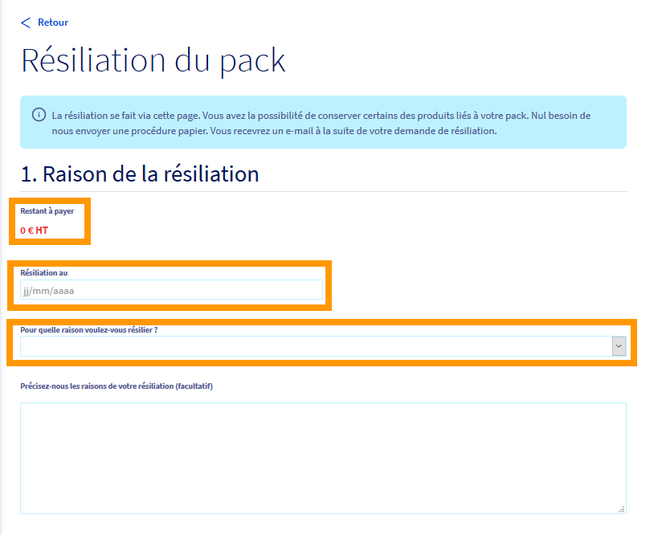

**Dernière mise à jour le 10/10/2022**

## Objectif

Votre offre d'accès à Internet ne vous convient plus, vous pouvez en demander la résiliation depuis votre espace client OVHcloud.
La résiliation sera effective à la prochaine facturation de votre accès à Internet. Les instructions pour retourner votre modem vous seront envoyées par e-mail.

## Prérequis

- Disposer d'un accès xDSL/FTTH actif.
- Être connecté à l’[espace client OVHcloud](https://www.ovh.com/auth/?action=gotomanager&from=https://www.ovh.com/fr/&ovhSubsidiary=fr), partie `Télécom`.

> [!primary]
> La résiliation d'un [pack SIP Trunk](https://www.ovhtelecom.fr/telephonie/sip-trunk/) doit faire l'objet d'une [« demande d'assistance »](https://www.ovh.com/manager/dedicated/index.html#/support/tickets) via l'espace-client OVHcloud afin que les équipes du support la mettent en place.
> 

## En pratique

### Demander la résiliation

Connectez-vous à votre [espace client OVHcloud](https://www.ovh.com/auth/?action=gotomanager&from=https://www.ovh.com/fr/&ovhSubsidiary=fr), partie `Télécom`, puis sélectionnez votre pack dans le menu `Accès Internet`.
 Cliquez alors sur le bouton `Résilier`{.action} dans le cadre « Informations Générales ».

{.thumbnail}

Si vous êtes toujours engagé pour cet accès, le montant des frais de résiliation sera indiqué dans la rubrique « Restant à payer ».
 Choisissez la date souhaitée pour cette résiliation ainsi que la raison de cette dernière.

{.thumbnail}

Il vous sera alors possible de demander à conserver certains services liés à votre pack (s'ils ont été auparavant activés) tels que :

- lignes VoIP/Fax
- numéro(s) porté(s)
- compte Exchange (si pack xDSL Entreprise)
- nom de domaine (si pack xDSL Entreprise)

Pour cela, il vous suffit de cocher les cases correspondant aux services que vous souhaitez conserver.

{.thumbnail}

Une fois vos choix effectués, cliquez sur le bouton `Résilier`{.action} en bas de page.

Vous recevrez un e-mail vous confirmant la prise en compte de la demande de résiliation ainsi qu'un e-mail contenant le bon de retour de votre modem.

### Annuler la résiliation

Cette action n'est possible que si la demande de résiliation a été effectuée au cours du mois.
  Cette annulation peut être réalisée jusqu'à la veille de la date de résiliation.

Connectez-vous à votre [Espace Client OVHcloud](https://www.ovh.com/auth/?action=gotomanager&from=https://www.ovh.com/fr/&ovhSubsidiary=fr), partie `Télécom`, puis sélectionnez votre pack dans le menu `Accès Internet`.

 Dans le cadre « Informations Générales », cliquez sur le bouton `Annuler`{.action} à droite de la date de résiliation.

{.thumbnail}

 Afin de valider cette annulation, cliquez sur le bouton `Annuler la résiliation en cours`{.action}.

{.thumbnail}

Vous recevrez un e-mail vous confirmant la prise en compte de l'annulation de la résiliation.

## Aller plus loin

Échangez avec notre communauté d'utilisateurs sur <https://community.ovh.com>.
