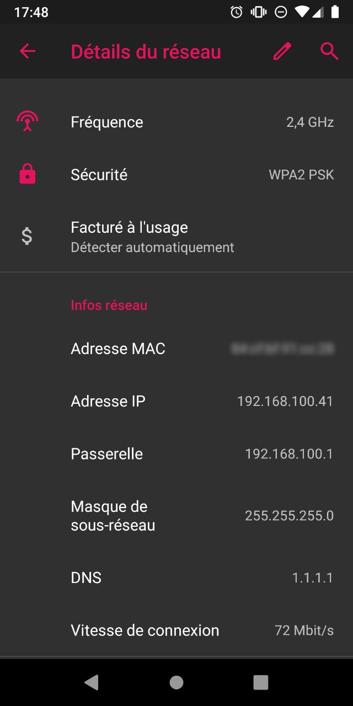
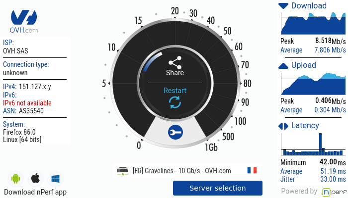

**Dernière mise à jour le 16/02/2021**

## Objectif

Lorsque vous connectez une OverTheBox au dos de votre modem zyxel, les réseaux WiFi de ce dernier n'utilisent pas l'OverTheBox.
Bien que fonctionnelle, une connexion via le WiFi ne vous permet pas de profiter des fonctionnalités de l'OverTheBox (redondances, agrégation de liens, tunnel chiffré).
Dès lors, l'utilisation de ces réseaux WiFi présente nettement moins d'intérêt, sauf à utiliser un Point d'Accès WiFi dédié pour profiter du WiFi avec l'OverTheBox.

Dans ce guide, vous verrez comment tirer parti de l'interface du modem Zyxel pour vous permettre d'isoler les réseaux WiFi dans leurs propres sous-réseaux et ainsi profiter de toutes les fonctionnalités de l'OverTheBox en WiFi, sans équipements supplémentaires.

**Découvrez comment réutiliser le WiFi d'un modem Zyxel avec une OverTheBox**

## Prérequis

- Disposer d’un [accès internet xDSL ou fibre OVHcloud](https://www.ovhtelecom.fr/offre-internet/){.external} et d'un modem Zyxel fourni par OVHcloud.
- Être connecté à l'[espace client OVHcloud](https://www.ovh.com/auth?onsuccess=https%3A%2F%2Fwww.ovhtelecom.fr%2Fmanager&ovhSubsidiary=fr){.external} dans la partie `Accès Internet`{.action}.
- Disposer d'un [service et d'un boitier OverThebox](https://www.ovhtelecom.fr/overthebox/)
- La configuration à distance du modem doit être [désactivée](#desactiver-configuration-distance).
- Une OverTheBox Plus ou une OverTheBox IT v2 (boitier bleu avec 4 ports), ces modèles fonctionnant sans nécessité de modifuer le DHCP des modems.
- Deux cables Ethernet RJ45. Le premier servira à brancher le port LAN1 du modem vers un des ports WAN de l'OverTheBox. Le second pour brancher le port LAN4 du modem vers un des port LAN de l'OverTheBox.

## En pratique

> [!primary]
>
> Ce guide ne concerne que les modems de marque Zyxel. Si vous possedez un modem Thomson ou Technicolor, vous pouvez demander un échange de confort facturé 70 € HT (84 € TTC). Pour cela, depuis votre [espace client OVHcloud](https://www.ovh.com/auth?onsuccess=https%3A%2F%2Fwww.ovhtelecom.fr%2Fmanager&ovhSubsidiary=fr){.external} partie « Télécom », cliquez sur `Accès Internet`{.action}, puis sélectionnez le pack et l’accès à Internet concerné. Assurez-vous d'être positionné sur l'onglet `Mon Accès`{.action}. En bas de la page à gauche, cliquez sur le bouton `Echanger mon modem`{.action}.
>

### Étape 1 : désactiver la configuration à distance 

Connectez-vous à votre [espace client OVHcloud](https://www.ovh.com/auth?onsuccess=https%3A%2F%2Fwww.ovhtelecom.fr%2Fmanager&ovhSubsidiary=fr){.external}, partie « Télécom ». Cliquez sur `Accès Internet`{.action} puis sélectionnez le pack et l’accès à Internet concerné. Assurez-vous d'être positionné sur l'onglet `Mon modem`{.action}.

Dans le cadre « Configuration à distance », vérifiez que la case à côté de `Configuration à distance activée` est bien décochée. Dès lors, deux possibilités :

- **La configuration à distance est désactivée**: Poursuivez la lecture de cette documentation à l'étape 2 « [Connectez-vous à l'interface locale du modem](#interface-locale) » ;

- **la configuration à distance est activée**: Vous devez désactiver la configuration à distance si vous souhaitez paramétrer votre modem Zyxel localement. Pour ce faire, décochez la case à côté de `Configuration à distance activée`, confirmez la manipulation, puis patientez quelques minutes le temps de la désactivation.

{.thumbnail}

### Étape 2 : se connecter à l'interface locale du modem 

Connectez-vous à l'interface locale du modem, celle-ci est disponible à l'adresse IP locale de votre modem, *192.168.1.1* par défaut. Si vous avez modifié l'adresse IP locale de votre modem via la configuration du LAN, utilisez l'adresse IP que vous avez définie.

Un couple user/password vous est alors demandé :

- Si la configuration à distance de votre modem était déjà désactivée à l'étape 1, saisissez l'utilisateur **admin** ainsi que le mot de passe que vous avez personnalisé.
- Si la configuration à distance de votre modem était déjà désactivée et que vous avez effectué un reset, saisissez l'utilisateur **admin** ainsi que le mot de passe sur l'étiquette au dos du modem.
- Si la configuration à distance de votre modem n'était pas désactivée, saisissez l'utilisateur **admin** ainsi que le mot de passe qui vous a été transmis par e-mail. L'objet de cet e-mail contient la mention « Réinitialisation du mot de passe du modem de votre accès ».

{.thumbnail}

> [!primary]
> L'ensemble des e-mails envoyés par OVHcloud sont accessibles depuis votre espace client. Pour retrouver vos derniers identifiants de connexion reçus par e-mail, connectez-vous à votre [espace client OVHcloud](https://www.ovh.com/auth/?action=gotomanager&from=https://www.ovh.com/fr/&ovhSubsidiary=fr) depuis un autre accès à Internet ou un smartphone. Une fois connecté, cliquez sur sur `E-mails de service`{.action} à droite de l'écran.
>

### Étape 3 : accéder aux options de groupe d'interfaces

Une fois connecté à l'interface locale du modem, cliquez sur l'icône de menu en haut à droite, puis sur `Interface Grouping`{.action} dans le menu `Network Setting`.

{.thumbnail}

Sur cette page, cliquez sur le bouton `+ Add New Interface Group`{.action}.

{.thumbnail}

Donnez un nouveau nom au groupe (`OverTheBox` dans cet exemple). Sélectionnez l'interface WAN utilisée par votre modem. En cas de doute, le type de votre connexion est disponible sur l'espace client OVHcloud (voir image ci-dessous).

- **PTM Type - VDSL**: pour une connexion de type VDSL
- **ATM Type - ADSL**: pour une connexion de type ADSL
- **ETH Type - ETHWAN**: pour une connexion de type FTTH

Dans la dernière partie apparaissent deux listes, `Available LAN Interfaces` et `Selected LAN Interfaces`.
 Vous devez déplacer vers la droite les interfaces que vous souhaitez ajouter au LAN de votre OverTheBox. Dans le cadre de ce guide, il vous faut déplacer vers la droite au moins un port LAN, ainsi que les réseaux WiFi présents sur le modem.
 Si vous le souhaitez, vous pouvez également déplacer les port LAN2 et LAN3 afin qu'ils soient également présents dans le LAN de votre OverTheBox.

Une fois les interfaces souhaitées déplacées dans la section `Selected LAN Interfaces`, cliquez sur `OK`{.action} pour valider votre choix. Le modem va alors déplacer les interfaces dans le groupe `OverTheBox`. Un délai peut être nécessaire avant que ne s'affichent les deux groupes d'interfaces `Default` et `OverTheBox`.

{.thumbnail}

### Étape 4 : modifier la gestion du DHCP pour le groupe OverTheBox

Accédez maintenant à la page `Home Networking`{.action} qui se trouve également dans le menu `Network Settings`. Depuis cette page, il vous faut désactiver le DHCP du modem sur le groupe `OverTheBox`, afin que le serveur DHCP utilisé soit celui de l'OverTheBox.

{.thumbnail}

Dans la section `Interface Group` sélectionnez le groupe `OverTheBox`.
 Dans le cadre de ce guide, nous utilisons le DHCP par défaut de l'OverTheBox (192.168.100/24). La section `LAN IP Setup` n'a donc pas besoin d'être modifiée. Elle peut nécessiter une modification si vous utilisee une autre plage pour le DHCP de votre OverTheBox, ceci pour eviter les conflits.
 Une fois connecté sur le LAN de l'OverTheBox, l'interface web du modem Zyxel sera accessible via l'IP indiquée (192.168.2.1 dans le cadre ce ce guide).

Enfin, dans la partie `DHCP Server State`, cliquez sur `Disable`{.action} afin de ne pas utiliser le DHCP.

Une fois les modifications effectuées, cliquez sur le bouton `Apply`{.action} pour appliquer votre configuration.

### Étape 5 : relier physiquement le groupe OverTheBox au LAN de votre boîtier OverTheBox

Pour que le groupe `OverTheBox` configuré sur votre modem Zyxel soit inclus dans le LAN de votre boîtier OverTheBox, il faut les relier physiquement à l'aide du cable Ethernet RJ45.

Branchez la première extrémité du câble dans le port LAN4 du modem Zyxel, la seconde extrémité dans le port LAN1 de votre boîtier OverTheBox.
 Vous pouvez également vous brancher sur un switch derrière votre boîtier OverTheBox, l'important est que le port LAN4 du modem Zyxel soit bien branché dans le LAN de votre OverTheBox.

### Étape 6 : tester votre nouvelle configuration

A l'aide d'un appareil pouvant se connecter au WiFi, connectez vous au WiFi partagé par votre modem Zyxel

Si vous avez besoin d'aide pour configurer le réseau WiFi de votre modem Zyxel, vous pouvez consulter le [guide utilisateur Zyxel (en anglais)](http://files.isp.ovh.net/zyxel/VMG8825-T50K_V5.13_5.50-1.pdf){.external}.

Une fois votre appareil connecté au WiFi, vérifiez que votre addresse IP correspond au DHCP de l'OverTheBox. Dans l'image ci-dessous, sur un téléphone Android, l'addresse IP 192.168.100.189 est bien incluse dans la plage d'addresses du DHCP de l'OverTheBox (192.168.100.0/24). L'IP de la passerelle, 192.168.100.1, correspond bien à l'IP du boitier OverTheBox au sein du LAN.

{.thumbnail}

Pour vérifier que votre appareil utilise bien le service OverTheBox, vous pouvez faire un test de débit sur notre site [proof.ovh.net](http://proof.ovh.net){.external} et vérifier que le champ IPv4 correspond à l'addresse IP publique de votre service OverTheBox (151.127.x.y dans l'image).

{.thumbnail}

## Aller plus loin

N'hésitez pas à échangez avec notre communauté d'utilisateurs sur vos produits Télécom sur notre site [OVHcloud Community](https://community.ovh.com/c/telecom)
