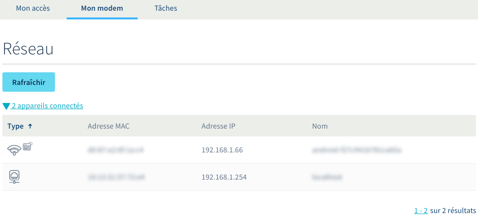
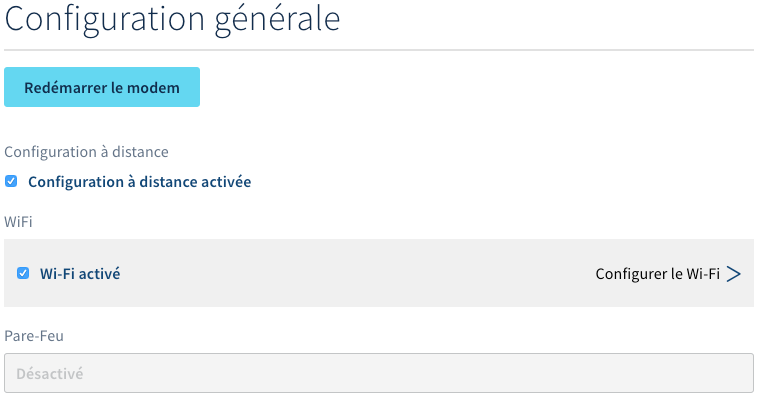
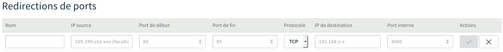

**Dernière mise à jour le 10/11/2022**

## Objectif

Afin de faciliter la gestion de votre accès à Internet, vous avez la possibilité de paramétrer votre box OVHcloud directement depuis votre espace client. Vous pouvez ainsi changer cette configuration à distance, sans devoir vous connecter à l'interface de votre box. Autre avantage, vous disposez toujours d'une sauvegarde de vos paramètres.

**Découvrez comment configurer à distance votre box OVHcloud depuis l'espace client.**

## Prérequis

- Disposer d'un [accès à Internet OVHcloud](https://www.ovhtelecom.fr/offre-internet/){.external}. 
- Avoir activé la gestion de votre box à distance.
- Être connecté à l’[espace client OVHcloud](https://www.ovhtelecom.fr/manager/index.html#/){.external}, partie `Télécom`{.action}.

## En pratique

### Étape 1 : accéder à la gestion de votre box

Connectez-vous à votre [espace client OVHcloud](https://www.ovh.com/auth?onsuccess=https%3A%2F%2Fwww.ovhtelecom.fr%2Fmanager&ovhSubsidiary=fr){.external}, partie « Télécom ». Cliquez sur `Accès Internet`{.action}, puis sélectionnez l'accès concerné.

Positionnez-vous alors sur l'onglet `Mon modem`{.action}. Dans la page qui s'affiche, vérifiez que la case à côté de `Configuration à distance activée` est bien cochée. Dès lors, deux possibilités :

- **la configuration à distance est activée** : poursuivez la lecture de cette documentation à l'étape 2 « [Personnaliser la configuration de votre box](./#etape-2-personnaliser-la-configuration-de-votre-box) » ;

- **la configuration à distance n'est pas activée** : vous devez l'activer si vous souhaitez paramétrer votre box OVHcloud à distance. Pour ce faire, cochez la case à côté de `Configuration à distance activée`, confirmez la manipulation, puis patientez quelques minutes le temps de l'activation.

> [!warning]
>
> L'activation de la configuration à distance écrasera le paramétrage actuel de votre box. Si une configuration spécifique est actuellement en place, celle-ci sera alors effacée.
>

{.thumbnail}

### Étape 2 : personnaliser la configuration de votre box

Pour paramétrer votre box depuis l'[espace client OVHcloud](https://www.ovh.com/auth?onsuccess=https%3A%2F%2Fwww.ovhtelecom.fr%2Fmanager&ovhSubsidiary=fr){.external}, assurez-vous d'être positionné sur l'onglet `Mon modem`{.action} de l'accès à Internet concerné. **Pour rappel, il est impératif que la configuration à distance soit activée pour que cette gestion soit possible.**

Depuis l'onglet `Mon modem`{.action}, vous retrouvez alors plusieurs sections. Chacune d'elles permet d'interagir avec la configuration de votre box. Poursuivez alors selon la manipulation que vous souhaitez effectuer :

|Section|Permet de :|
|---|---|
|[Réseau](./#21-reseau)|- Rafraîchir la liste des équipements connectés à votre box|
|[Configuration générale](./#22-configuration-generale)|- Redémarrer votre box - Activer ou désactiver la configuration à distance de votre box - Paramétrer votre réseau Wi-Fi|
|[Configuration réseau](./#23-configuration-reseau)|- Configurer l'IP LAN de la box - Configurer le DHCP et les baux DHCP de la box - Configurer des redirections de ports|
|[Configurations avancées](./#24-configurations-avancees)|- Réinitialiser votre box  - Activer le mode bridge - Configurer le MTU - Configurer une DMZ - Choisir le fichier de configuration (_firmware_) de votre box|
|[Services](./#25-services)|- Activer un service additionnel parmi ceux disponibles|

#### 2.1 Réseau

Depuis cette partie, vous obtenez la liste des équipements connectés sur le réseau de votre box. Ces derniers apparaissent dans le tableau en dessous du nombre d'appareils connectés. Vous pouvez visualiser pour chaque équipement : 

- le type de connexion (câble ou Wi-Fi) ;
- son système d'exploitation (Windows, Android, etc.) ;
- son adresse MAC ;
- son adresse IP locale ;
- son nom diffusé sur le réseau. 

Vous avez la possibilité d'actualiser cette liste en cliquant sur le bouton `Rafraîchir`{.action}.

{.thumbnail}

#### 2.2 Configuration générale

Depuis cette partie, plusieurs possibilités s'offrent à vous.

- **Redémarrer à distance votre box** : pour cela, cliquez sur le bouton `Redémarrer le modem`{.action} puis confirmez l'action. Patientez alors le temps que votre box redémarre.

- **Activer ou désactiver la configuration à distance de votre box** : pour cela, cochez ou décochez la case à côté de `Configuration à distance activée`. L'activation écrasera le paramétrage actuel de votre box. La désactivation rendra impossible la configuration de votre box depuis l'espace client OVHcloud, celle-ci conservera cependant les paramètres en place au moment de la désactivation. Lors de la désactivation, un nouveau mot de passe est généré et transmis par e-mail pour vous permettre d'accéder à l'interface locale du modem.

- **Pare-feu** : lorsque vous gérez votre box à distance, le pare-feu n’est pas paramétrable. Celui-ci s’adapte automatiquement aux configurations en place dans l’espace client.

- **Paramétrer l'utilisation du réseau Wi-Fi** : cochez la case à côté de `Wi-Fi activé` pour décider d'activer ou de désactiver son utilisation. Pour accéder à la page des paramètres Wi-Fi, cliquez sur `Configurer le Wi-Fi`{.action}.

{.thumbnail}

Personnalisez alors les champs pour modifier la configuration du réseau Wi-Fi. Selon la box dont vous disposez, il se peut que vous puissiez modifier les paramètres Wi-Fi d'un ou de plusieurs réseaux, dont ceux dits « Invités ».

|Champ|Description|
|---|---|
|Activer le Wi-Fi|Utilisez les boutons « Oui » ou « Non » pour activer ou désactiver le réseau Wi-Fi.|
|Identifiant de réseau ou SSID|Il s'agit du nom de votre réseau Wi-Fi. Celui-ci apparaîtra sur vos appareils lorsque vous afficherez la liste des réseaux disponibles. Vous avez la possibilité de personnaliser ce nom si vous le souhaitez.|
|Visibilité du réseau|Permet de rendre visible ou de masquer la diffusion du nom du réseau Wi-Fi. Si vous décidez de le masquer, celui-ci n'apparaîtra plus dans la liste des réseaux disponibles sur vos appareils. Pour vous connecter une première fois à ce réseau, vous devrez le paramétrer manuellement sur vos appareils.|
|Sécurité|Il s'agit du type de sécurité de votre réseau Wi-Fi. Pour une utilisation optimale, nous vous recommandons le `WPA2`. Pour des raisons de sécurité, nous vous déconseillons le `WEP`.|
|Clé Wi-Fi|Permet de changer la clé Wi-Fi par celle de votre choix. Vous devrez également la confirmer.|
|Canal|Par défaut, le canal est en `Auto` ; la box sélectionne le premier canal disponible. Vous pouvez sélectionner un canal en particulier depuis la liste. Si cela s'avère nécessaire, effectuez plusieurs tests afin de trouver le plus stable et le mieux adapté à votre environnement.|

Une fois le réseau Wi-Fi modifié, cliquez sur le bouton `Valider`{.action}.

{.thumbnail}

#### 2.3 Configuration réseau

Depuis cette partie, plusieurs possibilités de configuration s'offrent à vous.

- **Configurer l'IP LAN de la box** : permet de personnaliser l'adresse IP privée de votre box. C'est avec celle-ci que vous pourrez communiquer sur votre réseau local avec votre box.

Pour cela, cliquez sur l'icône en forme de crayon à droite du tableau. Vous devrez alors choisir entre une configuration `Statique` ou `DHCP`.

|Configuration|Description|
|---|---|
|Statique|En choisissant cette configuration, vous devrez définir l'adresse IP et le masque de sous-réseau de votre box.|
|DHCP|En choisissant cette configuration, la box se comportera comme n'importe quel équipement réseau. Elle effectuera une demande DHCP auprès d'un serveur et récupérera un bail DHCP pour un temps donné.|

Une fois la configuration de l'IP LAN modifiée, validez le changement avec le bouton d'action correspondant.

{.thumbnail}

- **Configurer le DHCP** : permet de personnaliser la configuration du serveur DHCP de votre box. Modifiez-la uniquement dans le cas d'une utilisation avancée de votre service.

Pour cela, cliquez sur l'icône en forme de crayon à droite du tableau. Vous pouvez alors choisir d'activer ou de désactiver le DHCP sur votre box, par le biais d'une case à cocher. Si le DHCP est actif, vous avez la possibilité de paramétrer des éléments supplémentaires :

|Configuration|Description|
|---|---|
|Passerelle|Elle correspond à l'adresse IP locale de votre box OVHcloud. Celle-ci peut être différente dans des cas très spécifiques, comme avec des pare-feu ou OverTheBox.|
|DNS|Les DNS primaires et secondaires sont les options DNS attribuées à un équipement lors d'une demande DHCP. Ils ne modifient pas les DNS internes de la box.|
|Nom de domaine DHCP|Permet l'ajout d'un suffixe DNS à votre réseau local.|
|Plages DHCP|Correspond au début et à la fin de la plage.|
|Durée d'allocation d'une adresse IP|Temps, en secondes, avant que l’équipement ne relâche le bail DHCP qui lui a été attribué. Un renouvellement du bail DHCP est effectué à 80 % du temps total.|

Une fois la configuration DHCP modifiée, validez le changement avec le bouton d'action correspondant.

{.thumbnail}

- **Configurer les baux DHCP** : permet de réserver des baux DHCP afin qu'un ou plusieurs équipements récupèrent toujours la même adresse IP locale. 

Pour cela, cliquez sur le bouton `Ajouter un Bail`{.action} puis complétez les informations demandées. 

|Information|Description|
|---|---|
|Nom du Bail|Spécifiez un nom vous permettant de mieux identifier ce bail par la suite dans le tableau. Il ne remplace pas celui diffusé sur le [réseau](./#21-reseau).|
|Adresse IP|Indiquez l'adresse IP locale réservée à l'équipement concerné.|
|Adresse MAC|Renseignez l'adresse MAC de l'équipement concerné.|

Une fois les baux DHCP modifiés, validez le changement avec le bouton d'action correspondant.

{.thumbnail}

- **Configurer des redirections de ports** : permet de rediriger des paquets réseau reçus sur un port ou une plage de ports par votre box vers un équipement local de votre réseau. 

Pour cela, cliquez sur le bouton `Ajouter une Redirection de Ports`{.action} puis complétez les informations demandées. 

|Information|Description|
|---|---|
|Nom|Spécifiez un nom vous permettant de mieux identifier la redirection de ports dans le tableau par la suite.|
|IP source|Permet de restreindre le champ d'application de la redirection de ports à une seule IP source. Laissez cet espace vide pour que celle-ci s'applique qu'importe la source.|
|Port de début / Port de fin|Définissez le port ou la plage de ports sur lequel la redirection s'appliquera. Pour rediriger un seul port, renseignez-le en tant que port de début et de fin.|
|Protocole|Précisez le protocole sur lequel votre redirection s'appliquera. Pour l'appliquer aux deux protocoles, vous devrez créer la redirection une seconde fois en sélectionnant l'autre protocole.|
|IP de destination|Indiquez l'adresse IP sur le réseau local vers qui transmettre la redirection. Pour que celle-ci fonctionne, l'équipement cible doit posséder comme passerelle par défaut celle de la box qui transmet la redirection.|
|Port interne|Indiquez le port sur lequel l'équipement du réseau local cible écoute.|

Une fois les informations complétées, validez l'ajout avec le bouton d'action correspondant.

{.thumbnail}

#### 2.4 Configurations avancées

Depuis cette partie, plusieurs possibilités s'offrent à vous.

- **Réinitialiser votre box** : permet de réinitialiser les paramètres de votre box, tout en conservant les configurations définies dans votre espace client. Pour cela, cliquez sur le bouton `Réinitialiser le modem`{.action} puis confirmez l'action. Patientez alors le temps que la manipulation s'effectue.

- **Réinitialiser la configuration OVHcloud** : permet de réinitialiser les paramètres de votre box sans conserver les configurations définies dans votre espace client. Pour cela, cliquez sur le bouton `Réinitialiser la configuration OVH`{.action} puis confirmez l'action. Patientez alors le temps que la manipulation s'effectue.

- **Activer le mode bridge** : permet d'activer ou de désactiver le mode bridge de votre box. En l'activant, votre box OVHcloud n'agira plus en tant que routeur. Pour gérer ce mode, vous devez cocher ou décocher la case à côté `Mode bridge activé`.

> [!primary]
>
> À utiliser uniquement dans le cas où vous disposez d'un équipement pouvant agir en tant que routeur sur votre réseau local. Il gérera alors intégralement votre connexion locale, OVHcloud ne pouvant pas intervenir sur celui-ci.
Si votre modem est de marque Zyxel, veuillez suivre le guide [Comment activer le bridge sur un modem zyxel](../comment-activer-bridge-zyxel/).
>

- **Configurer le MTU** : lors d'une transmission de données informatiques, le Maximum Transmission Unit (MTU) est la taille maximale d'un paquet pouvant être échangé en une seule fois (c'est-à-dire sans fragmentation) sur une interface. Le MTU par défaut d'un accès OVHcloud en PPPoe est de 1 492.

Pour le modifier, sélectionnez la nouvelle valeur dans la liste déroulante puis cliquez sur `Valider`{.action}.

- **Configurer une DMZ** : ceci permet de renvoyer tous les flux réseau vers un autre équipement réseau (un pare-feu, par exemple). Usuellement, la DMZ doit être sur un sous-réseau, séparé du réseau local et d'Internet par un pare-feu. Ce sous-réseau contient les machines susceptibles d'être contactées depuis Internet.

Pour configurer une DMZ, cliquez sur le bouton `Configurer`{.action} en dessous de DMZ. Dans la nouvelle page, sélectionnez le bouton d'action à droite du tableau, éditez l'adresse IP de la DMZ, puis validez la manipulation en cliquant sur le bouton d'action correspondant.

> [!warning]
>
> Une fois la DMZ activée, vous devenez responsable de la sécurité de votre réseau.
>

- **Choisir le fichier de configuration (_firmware_) de votre box** : selon la box dont vous disposez, il se peut que plusieurs fichiers de configuration (_firmwares_) soient proposés. De manière générale — et pour éviter tout problème éventuel — les mises à jour dites « non critiques » ne sont pas effectuées automatiquement. Vous avez cependant la possibilité de les réaliser manuellement.

Pour cela, choisissez dans la liste le fichier de configuration que vous souhaitez appliquer, puis cliquez sur le bouton `Valider`{.action}.

{.thumbnail}

#### 2.5 Services

Vous avez la possibilité dans cette partie d'activer ou de désactiver des services additionnels de votre box. Vous devrez alors utiliser le bouton d'activation à côté du service concerné. **Selon la box dont vous disposez, certains services de la liste ci-dessous peuvent ne pas être disponibles.**

|Services|Description|
|---|---|
|Bloc IP|Si vous [disposez d'un bloc IP](../comment-commander-et-gerer-un-bloc-ip-29/), vous pouvez activer ou désactiver celui-ci. Toute la configuration de votre box va alors s'adapter automatiquement (par exemple : désactivation pare-feu + NAT).|
|Partage de contenu|**Concerne uniquement les box Thomson (TG7XX).** Par défaut, le partage de contenu est activé pour ces dernières, ce qui utilise une adresse IP supplémentaire.   Depuis l’espace client, il n’est pas possible de configurer ce partage mais vous pouvez le désactiver via l’accès à distance afin de libérer l’IP utilisée par défaut. La configuration du partage de contenu s'effectue uniquement en local.|
|FTP|Active où désactive le serveur FTP de votre box.|
|UPnP|Active où désactive la fonction UPnP de votre box (ouverture automatique des ports).|
|Mise en attente d’appel|Active ou désactive la mise en attente des appels, directement depuis la box (uniquement pour les téléphones branchés sur les prises RJ11 de la box).|
|SIP ALG|Active où désactive le SIP ALG. L’ALG permet de contrôler (en autorisant ou refusant) du trafic vers une application de serveur.|
|IPsec ALG|Active où désactive le processus ALG pour le tunneling IPsec.|

{.thumbnail}

## Aller plus loin

Échangez avec notre communauté d'utilisateurs sur <https://community.ovh.com>.
