### Préambule {#préambule}

Le modem xDSL mis à votre disposition lors de la mise en service de votre lien peut être paramétré de deux manières différentes : configuration bridge ("pont") ou routeur. Nous allons voir ici comment configurer ces deux modes.

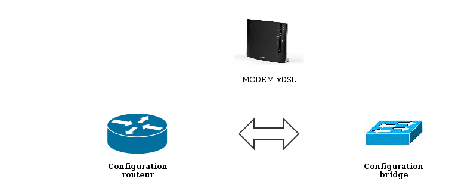{.thumbnail}

**Sommaire :**

Niveau : Débutant

------------------------------------------------------------------------

### DSL/VDSL {#dslvdsl}

-   #### Mode routeur {#mode-routeur}

Par défaut, le modem est livré en **configuration routeur**. Toutefois, si vous êtes amené à devoir reconfigurer le modem en mode routeur, vous pouvez utiliser**l'assistant de configuration du modem**.

Dans un premier temps, accédez à l'interface web du modem à l'aide de son adresse IP par défaut -&gt;**192.168.1.254**

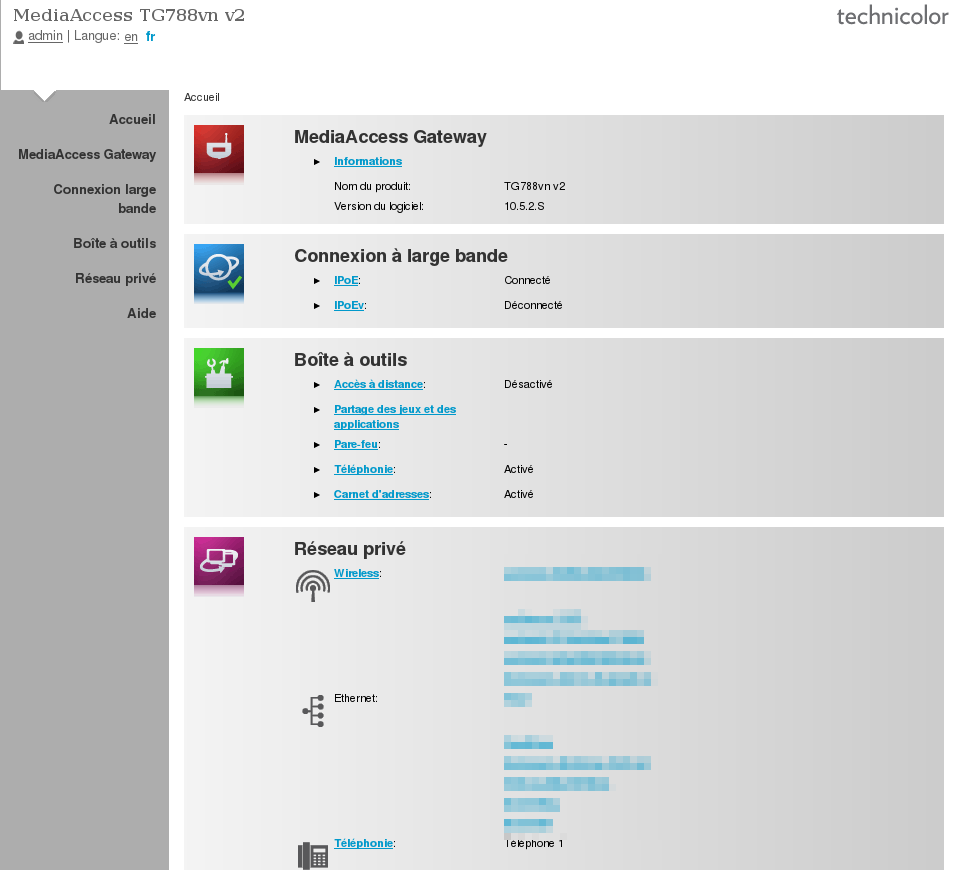{.thumbnail}

Ouvrez le menu "**MediaAccess Gateway**" puis cliquez sur la tâche "**Configurez le MediaAccess Gateway**".

Suivant la version de votre modem, le menu peut s'intituler "**Thomson Gateway**".

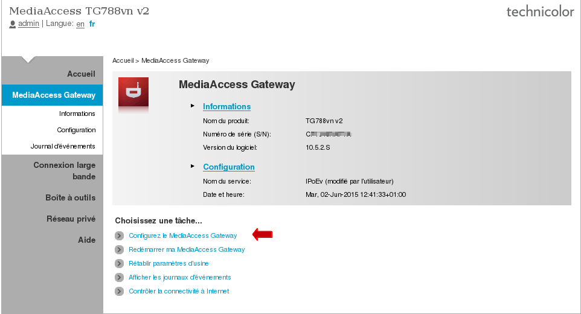{.thumbnail}

Un assistant de configuration va s'afficher :

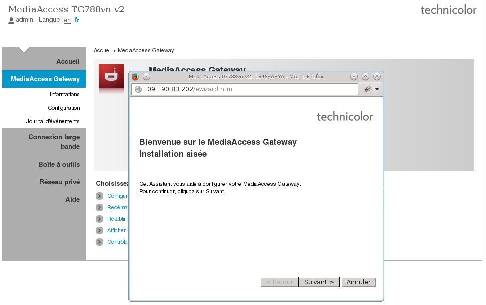{.thumbnail}

Cliquez sur "Suivant". Au formulaire suivant, il vous sera demandé de sélectionner le service souhaité :

→ **Pont** (dit aussi "Bridge").

→ **Routeur**.

→ Routeur vocal *(non utilisé*).

Sélectionnez le **mode routeur**et cliquez sur**"Suivant"** :

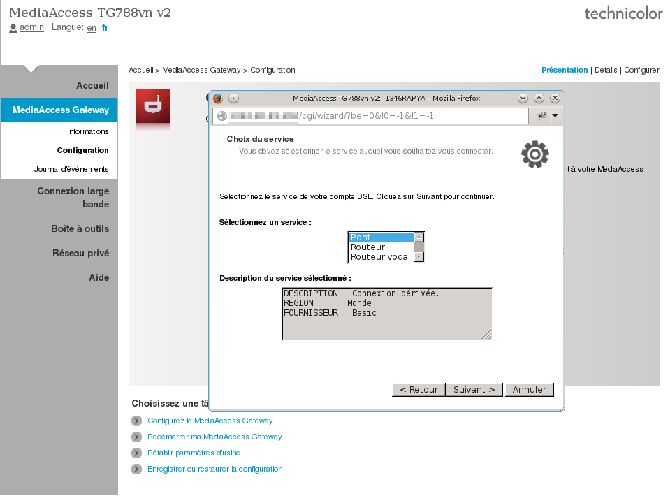{.thumbnail}

Dans le champ "VPI/VCI", indiquez "8.35" et cochez "PPP sur Ethernet (PPPoE)" en tant que « Connexion Internet routée ». Puis cliquez sur "Suivant".

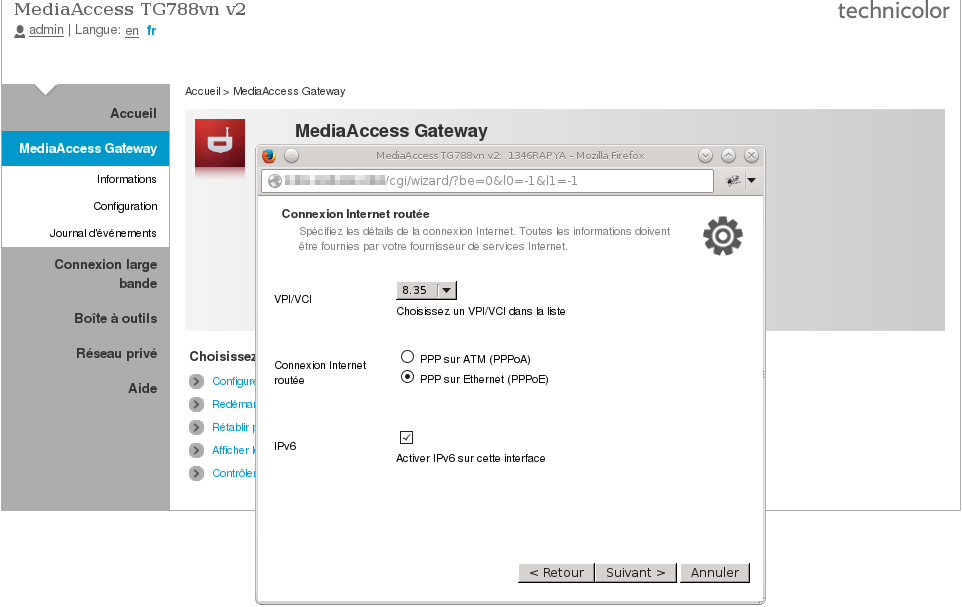{.thumbnail}

S'affiche ensuite la fenêtre vous invitant à renseigner vos identifiants ADSL avec plusieurs champs à remplir :

Dans le cas d'un accès sur un **NRA OVH**,**il n'y a pas d'identifiant**. Renseignez alors **<config@ovh.ipadsl>** en tant que nom d'utilisateur et **ovh** en mot de passe.

-   "**Nom d'utilisateur**" : renseignez l'identifiant de connexion ADSL OVH que vous avez reçu par e-mail, cet identifiant étant composé du suffixe : @**ovh.ipadsl**, @**adsl.ovh ou **@xdsl.ovh****.
-   "**Mot de passe**" : indiquez le mot de passe associé, reçu avec votre identifiant.
-   "**Confirmer le mot de passe**" : entrez à nouveau ce mot de passe pour le confirmer.

Cliquez sur « **Suivant** ».

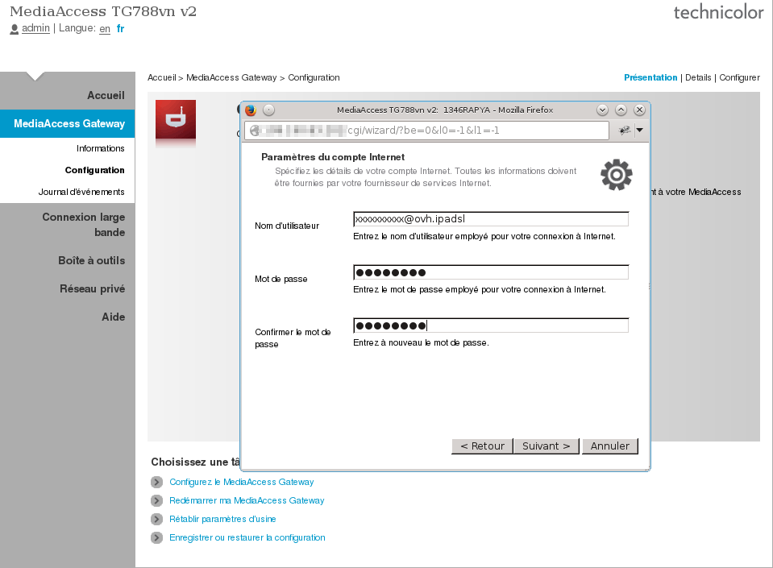{.thumbnail}

Si vous souhaitez définir un mot de passe pour le compte "**Administrator**" (utilisateur par défaut) afin de protéger l'accès à l'interface web de votre modem, renseignez-le dans les champs "**Mot de passe**" et "**Confirmer le mot de passe**" puis cliquez sur « **Suivant** » pour valider. Sinon, laisser les champs vides.

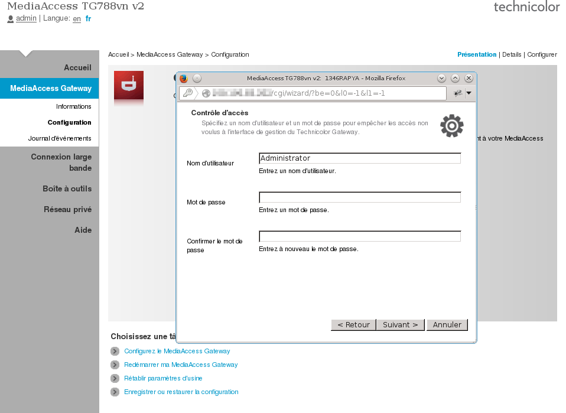{.thumbnail}

Votre modem est alors configuré. Pour établir la connexion à Internet, cliquez sur « Démarrer ».

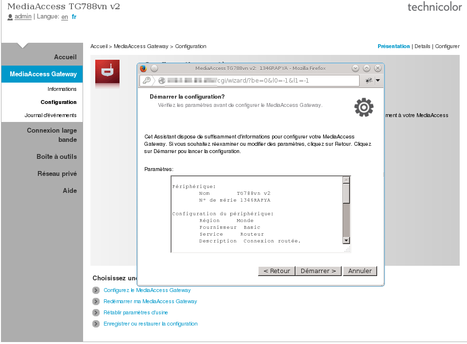{.thumbnail}

-   #### **Mode bridge** {#mode-bridge}

Vous souhaitez une configuration bridge ("Pont") sur votre modem afin que tout votre réseau local soit paramétré via un autre équipement. Vous devez utiliser le même assistant de configuration, sauf qu'à la place de sélectionner "Routeur", il faut sélectionner "Pont" (bridge).

Les formulaires via l'assistant sont les mêmes que pour le mode routeur :

{.thumbnail}{.thumbnail}

Vous aurez ce formulaire qui vous sera proposé :

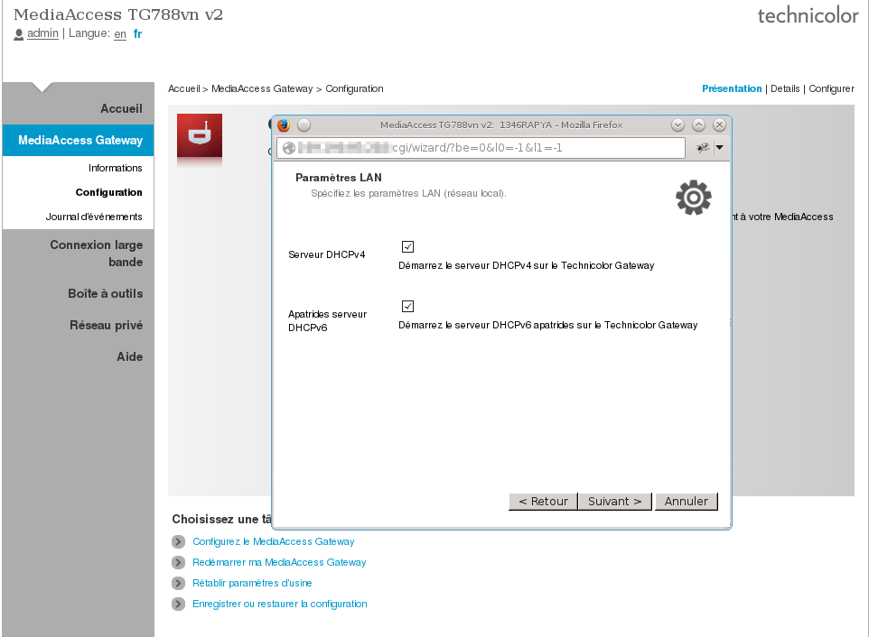{.thumbnail}

Si vous avez besoin d'un serveur DHCP (v4 ou v6), il vous sera proposé d'activer ce service.

Une fois que vous lancez le démarrage de la configuration, cela engendre un **redémarrage de votre modem**.

### Paramétrer sa configuration via les fichiers de configuration {#paramétrer-sa-configuration-via-les-fichiers-de-configuration}

Sur les modems OVH, il est possible de sauvegarder la configuration dans un fichier afin de la réimporter plus tard.

Une banque de fichiers de configuration basique est disponible via le lien <ftp://ftp.ovh.net/made-in-ovh/xdsl/modems/>

Sur certains types de connexion, l'importation d'un fichier de configuration est obligatoire afin d'établir la connexion, c'est le cas par exemple pour les accès SDSL.

Pour importer le fichier de configuration, merci de suivre les instructions suivantes.

→ Accédez à l'interface WEB de votre modem, par défaut : 192.168.1.254

→ Sélectionner dans le menu de gauche "**Thomson Gateway**", "**Configuration**", "**Enregistrer ou restaurer la configuration**".

{.thumbnail}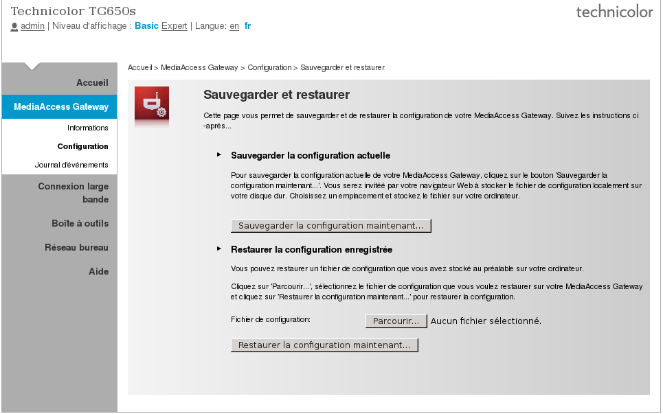{.thumbnail}

→ Charger le fichier .ini récupérer via le FTP.

**Le chargement du fichier .ini entrainera un redémarrage de votre modem.**

------------------------------------------------------------------------

### Paramétrer sa configuration via l'espace client {#paramétrer-sa-configuration-via-lespace-client}

Votre espace client Telecom, vous donne la possibilité de pouvoir **configurer votre modem en "mode Bridge"**.

Pour activer le mode bridge,

-   Rendez vous dans votre****Espace Client****sur <https://www.ovhtelecom.fr/espaceclient/>
-   Choisissez sur **votre accès**
-   Cliquez sur **"Mon modem"**
-   Cochez la case **"Activer le mode bridge"** dans la partie Configurations avancées.
-   Cliquez sur **"OK"** lors de la confirmation.

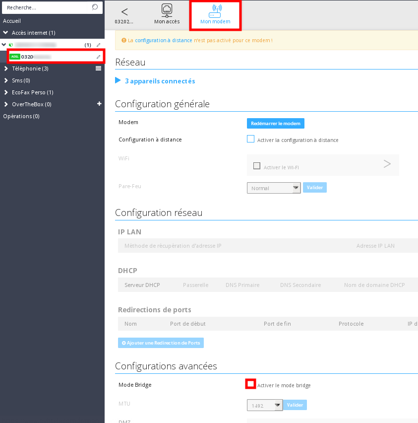{.thumbnail}

Pour **désactiver le mode bridge**, il suffit de réinitialiser physiquement votre modem. Il faut tout de même décocher l'activation du bridge via l'espace client.

------------------------------------------------------------------------

