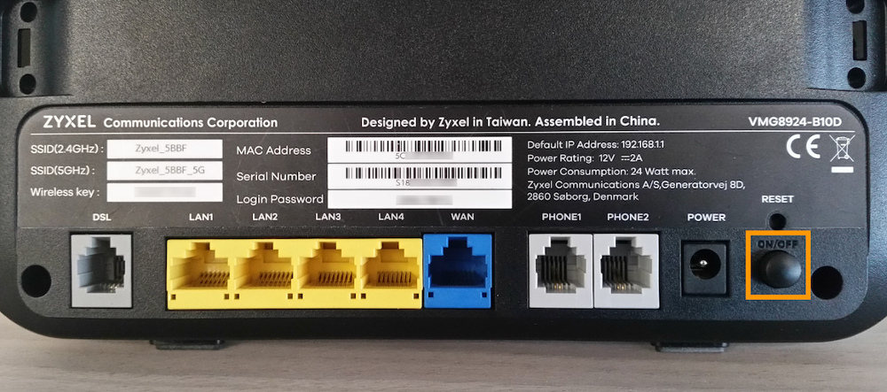
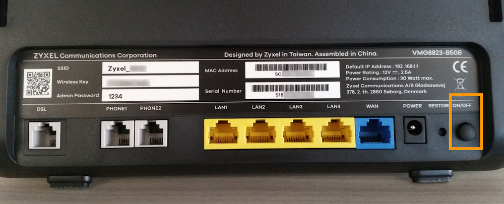
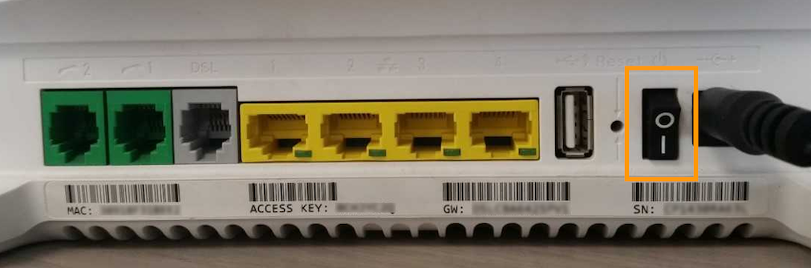

**Dernière mise à jour le 18/09/2018**

## Objectif

Vous n'avez actuellement pas accès à Internet ou vous rencontrez des coupures intermittentes ? Nous vous proposons quelques vérifications et manipulations simples pouvant vous permettre de vous dépanner seul et de rétablir votre service.

**Découvrez comment rétablir votre service suite à sa coupure complète ou partielle.**

> [!primary]
>
> Pour vous accompagner au mieux dans le rétablissement de vos services, vous avez également la possibilité d'utiliser notre assistant de dépannage. Pour y accéder, connectez-vous à votre [espace client OVH](https://www.ovhtelecom.fr/manager/auth/?action=gotomanager){.external} dans la section « Télécom ». Une fois positionné sur l'accès internet concerné, cliquez sur `Lancer le diagnostic`{.action}. 
>

## Prérequis

- Se trouver physiquement près du modem pour effectuer les actions.

## En pratique

Avant de débuter, il est essentiel de pouvoir vérifier les voyants lumineux de votre modem afin d'identifier la nature de la coupure que vous rencontrez. Une fois les voyants sous vos yeux, poursuivez la lecture de cette documentation en fonction de l'état de ces derniers.

- [Aucun voyant n'est allumé sur votre modem](https://docs.ovh.com/fr/xdsl/interruption-de-service/#si-aucun-voyant-nest-allume){.external}.
- [Des voyants sont allumés (clignotant ou fixe)](https://docs.ovh.com/fr/xdsl/interruption-de-service/#si-des-voyants-sont-allumes-clignotant-ou-fixe){.external}.

### Si aucun voyant n'est allumé

Vérifiez d'abord l'alimentation électrique de votre modem en réalisant les manipulations ci-dessous :

- **branchez l'alimentation de votre modem sur une autre prise électrique.** Ceci vous permettra de vérifier si l'incident provient de la prise actuellement utilisée. N'hésitez pas à débrancher puis rebrancher l'alimentation de votre modem pour écarter un éventuel mauvais contact ;

- **débranchez puis rebranchez le câble d'alimentation électrique situé à l'arrière de votre modem.** Ceci vous permettra d'écarter une nouvelle fois un mauvais contact éventuel ;

- **assurez-vous que le bouton d'alimentation de votre modem est en position « 1 », « ON » ou simplement enfoncé.** Cette position est différente selon le modem que vous utilisez. Vous trouverez ci-dessous des photos vous permettant de mieux identifier l'endroit où se situe le bouton d'alimentation selon votre modem.

|Modem|Branchement|
|---|---|
|Zyxel B10D|{.thumbnail}|
|Zyxel B50B|{.thumbnail}|
|Technicolor TG789vn|{.thumbnail}|
|Technicolor TG799vac|{.thumbnail}|
|Technicolor TG788vn|{.thumbnail}|
|Technicolor TG788vn v2|{.thumbnail}|

Si, malgré ces manipulations, votre modem ne s'allume toujours pas, effectuez une réinitialisation de ce dernier. Si besoin, reportez-vous aux instructions décrites dans notre documentation « [Redémarrer ou réinitialiser un modem ADSL OVH](https://docs.ovh.com/fr/xdsl/redemarrer-reinitialiser-modem-adsl-ovh/){.external} ».

### Si des voyants sont allumés (clignotant ou fixe)

Si des voyants sont allumés sur votre modem, cela indique que celui-ci semble fonctionner correctement. Il vous reste maintenant à déterminer la cause de l'incident que vous rencontrez.

> [!warning]
>
> Avant de poursuivre, vérifiez si votre accès est affecté par un incident en cours en vous rendant sur le lien suivant : <https://www.ovhtelecom.fr/xdsl/incident/#/>. Si c'est le cas, prenez connaissance des éléments renseignés sur la page, puis patientez le temps de sa résolution.
>

Si aucun incident déclaré n'est en cours, la coupure peut provenir de trois sources :

- **un défaut de configuration** : un élément, souvent lié à la configuration de votre ordinateur ou à vos branchements, pertube le bon fonctionnement de votre connexion ;
- **un défaut de connexion** : votre modem est correctement synchronisé, mais n'a pas la possibilité de vous connecter à Internet ; 
- **une perte de synchronisation** : un perturbateur se situant entre votre modem et le noeud de raccordement des abonnés (ou « NRA » ; soit la centrale téléphonique) perturbe le bon fonctionnement de votre accès. Dans la majorité des cas, ce perturbateur se situe à votre domicile. 

> [!primary]
>
> On parle de synchronisation lorsque votre modem réussit à se synchroniser à l'équipement opérateur se trouvant dans le noeud de raccordement des abonnés (ou « NRA »). Cette synchronisation est indispensable pour que votre accès, et donc votre connexion, soit fonctionnelle.
>

L'état des voyants de votre modem vous aidera à déterminer la cause de l'incident que vous rencontrez. Aidez-vous des informations du tableau ci-dessous :

|Voyant Broadband|Voyant Internet|Signification|Détails|
|---|---|---|---|
|Vert fixe|Vert fixe|Service fonctionnel|Le service jusqu'à votre modem est fonctionnel et peut être utilisé.| 
|Vert fixe|Vert clignotant|Service fonctionnel|Le modem échange actuellement des données (un appareil utilise le service ou le monitoring de la ligne est actif).| 
|Vert clignotant|Éteint|Perte de synchronisation|Votre modem essaye de rétablir la synchronisation de votre accès.| 
|Éteint|Éteint|Pas de synchronisation|Votre modem n'est actuellement pas synchronisé.| 
|Vert fixe|Éteint|Défaut de connexion|Votre modem est synchronisé, mais n'a pas la possibilité de vous connecter à Internet.| 
|Vert fixe|Rouge fixe|Défaut de connexion|Votre modem est synchronisé, mais n'a pas la possibilité de vous connecter à Internet.| 

Dès lors, en fonction des voyants, vous avez plusieurs possibilités :

- **le service jusqu'à votre modem est fonctionnel** : vérifiez les branchements de votre modem jusqu'à vos appareils (un ordinateur par exemple) ainsi que la configuration de ces derniers ;
- **la coupure est liée à un défaut de connexion** : essayez de redémarrer ou de réinitialiser votre modem. Si besoin, reportez-vous aux instructions décrites dans notre documentation « [Redémarrer ou réinitialiser un modem ADSL OVH](https://docs.ovh.com/fr/xdsl/redemarrer-reinitialiser-modem-adsl-ovh/){.external} ».
- **la coupure est liée à une perte de synchronisation** : reportez-vous aux instructions décrites dans notre documentation « [Rétablir la synchronisation d'une connexion suite à une coupure](https://docs.ovh.com/fr/xdsl/retablir-synchronisation-suite-coupure/){.external} ».

## Aller plus loin

Échangez avec notre communauté d'utilisateurs sur <https://community.ovh.com>.