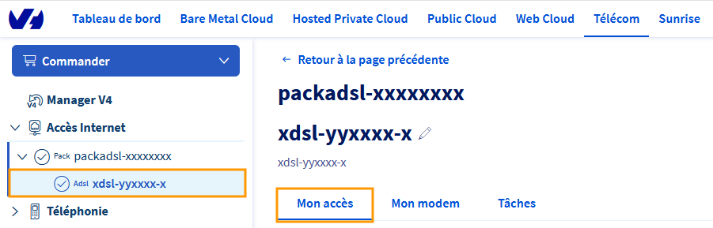
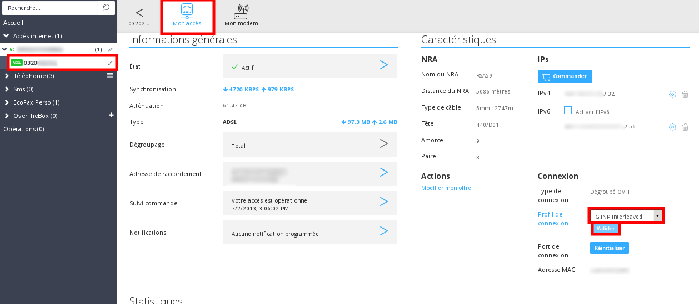

**Dernière mise à jour le 24/11/2020**

## Objectif

Votre espace client Telecom regroupe un certain nombre de fonctionnalités, dont la gestion de vos profils de synchronisation.

## Prérequis

-   Disposer d'un accès xDSL actif.
-   Être raccordé sur un NRA dégroupé par OVHcloud.

## En pratique

### Ligne dégroupée OVHcloud

### Comment accéder au changement de profil

Connectez-vous à la rubrique `Telecom` de votre [espace client Telecom OVHcloud](https://www.ovh.com/auth/?action=gotomanager). Cliquez ensuite sur `Accès Internet`{.action} dans le menu de gauche et sélectionnez votre pack, vous êtes par défaut sur l'onglet `Mon accès`.
 
{.thumbnail}

Vous retrouverez au niveau des `Caractéristiques`, la possibilité de modifier le profil de synchronisation de votre accès.

Pour un accès ADSL :

{.thumbnail}

Pour un accès VDSL :

{.thumbnail}

### Explication des différents profils

Généralement, on applique un nouveau profil quand on souhaite obtenir un débit plus important ou corriger une instabilité. Les profils permettent d'agir directement sur la **marge au bruit (SNR)** de votre ligne.

Lors de son activation, votre accès est livré sur le profil **par défaut**, avec une marge au bruit à 6 dB lors de la synchronisation.

Suivant le SNR défini, le débit sera plus ou moins élevé et l'accès subira plus ou moins de perturbations.

> [!primary]
> Plus concrètement :
>
> Plus le SNR est faible, meilleur est le débit mais moins stable est la ligne;
>  Plus le SNR est élevé, moins bon est le débit et plus stable est la ligne.
>

La correspondance des profils avec leur SNR :

-   **Par défaut** : SNR 6
-   **512K** : SNR 6 avec limite de débit à 512K
-   **2M** : SNR 6 avec limite de débit à 2M
-   **24M** : SNR 6 sans limite de débit
-   **SAFE1** : SNR 10
-   **SAFE2** : SNR 16
-   **PERF1** : SNR 3
-   **PERF2** : SNR 1

**24M est le débit maximum atteignable avec un SNR à 6 dB.**

Si vous êtes juste à côté du NRA vous aurez peut-être 24M.
Cependant si vous êtes à 1 km , 24M ne sera pas atteignable vous aurez peut-être 15M, ceci dépendra de la ligne et de la marge sur bruit.

En VDSL, d’autres modulations de fréquence s’offrent à vous.

-  **17a**, recommandé pour les lignes de moins de 1 km : le profil 17a permet aux abonnés se trouvant à moins d’un kilomètre du NRA de bénéficier des meilleures performances sur leur ligne. Pour connaître cette distance, il suffit de tester son numéro sur le [test d’éligibilité OVHcloud Télécom](https://www.ovhtelecom.fr/offre-internet/eligibilite/). En fonction de la qualité de la ligne, le profil 17a ne sera pas systématiquement la meilleure option pour un abonné se trouvant à moins d’un kilomètre du NRA.
-  **8b**, pour les lignes plus longues : de manière générale, le profil 8b sera plus avantageux pour les abonnés situés à plus d’un kilomètre du nœud de raccordement téléphonique.

### Ligne non dégroupée OVHcloud

Malheureusement, cette option n'est pas disponible pour les lignes raccordées sur les équipements d'opérateurs de collecte.

## Aller plus loin

Échangez avec notre communauté d'utilisateurs sur <https://community.ovh.com>
