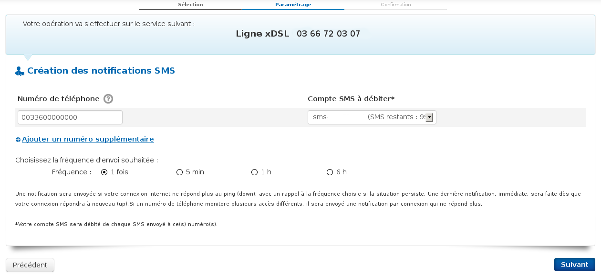

### Préambule {#préambule}

Le monitoring permet de vous alerter lorsque votre accès n'est plus joignable selon une fréquence définie. Les notifications sont envoyées par e-mail ou par SMS. (Il faut que votre compte SMS soit crédité.)

**Sommaire :**

Niveau : Débutant

------------------------------------------------------------------------

### Prérequis {#prérequis}

-   Disposer d'un accès ADSL / SDSL qui répond aux requête ICMP (OK par défaut sur les modems distribués par OVH).
-   Une adresse e-mail pour recevoir les notifications.
-   Un compte SMS crédité si vous souhaitez recevoir les SMS de notifications sur votre mobile.

------------------------------------------------------------------------

### Notifications par e-mail {#notifications-par-e-mail}

Pour créer une notification par e-mail :

-   Connectez-vous à votre Espace Client : <https://www.ovhtelecom.fr/espaceclient/>.
-   Cliquez sur l'onglet "**Configuration**".
-   Cliquez sur l'icône "**xDSL**".
-   Cliquez sur "**Notifications Monitoring**".
-   Cliquez ensuite sur "**Créer des notifications e-mail**".
-   Sélectionnez la ligne xDSL pour laquelle vous souhaitez recevoir les notifications par e-mail.
-   Vous arrivez alors sur le formulaire de création de notification.

{.thumbnail}

-   Dans le champ "**e-mail**", entrez l'adresse à notifier.
-   Le lien "**Ajouter un e-mail supplémentaire**" vous permet d'ajouter d'autres adresses e-mails à notifier.
-   La partie "**fréquence**" vous permet de choisir la fréquence des notifications e-mail lors d'une coupure.

Si vous ajoutez une adresse commune à plusieurs accès, vous recevrez un seul e-mail contenant toutes les notifications de coupure.

-   Cliquez sur le bouton "**Suivant**" pour accéder à la confirmation de création.
-   Cliquez sur "**Oui**" pour valider la création.

Les notifications seront effectives lorsque votre accès ne répondra plus aux requêtes ICMP (ping).

------------------------------------------------------------------------

### Notifications par SMS {#notifications-par-sms}

-   Connectez-vous à votre Espace Client : <https://www.ovhtelecom.fr/espaceclient/>.
-   Cliquez sur l'onglet "**Configuration**".
-   Cliquez sur l'icône "**xDSL**".
-   Cliquez sur "**Notifications Monitoring**".
-   Cliquez ensuite sur "**Créer des notifications SMS**".
-   Sélectionnez la ligne xDSL pour laquelle vous souhaitez recevoir les notifications par e-mail.
-   Vous arrivez alors sur le formulaire de création de notification :

{.thumbnail}

-   Dans le champ "**Numéro de téléphone**", entrez le numéro de mobile à notifier au format **International**.
-   Dans le champ "**Compte SMS à débiter**", choisissez le compte SMS à utiliser pour envoyer les notifications.
-   Dans la partie "**Fréquence**", choisissez la fréquence des notifications SMS lors d'une coupure.
-   Cliquez sur le bouton "**Suivant**" pour accéder à la confirmation de création.

-   Cliquez sur "**Oui**" pour valider la création.

    {.thumbnail}

Vous recevrez un SMS indiquant la perte de votre accès.

------------------------------------------------------------------------

### Supprimer les notifications {#supprimer-les-notifications}

Vous pouvez, si vous le souhaitez, supprimer une ou la totalité des notifications en place. Pour ce faire :

-   Connectez-vous à votre Espace Client : <https://www.ovhtelecom.fr/espaceclient/>.
-   Cliquez sur l'onglet "**Configuration**".
-   Cliquez sur l'icône "**xDSL**".
-   Cliquez sur "**Notifications Monitoring**".
-   Sélectionnez l'accès concerné par les suppressions.
-   Cochez la ou les notifications à supprimer.

{.thumbnail}

-   Cliquez sur "**Suivant**" pour accéder à la confirmation de suppression.
-   Cliquez sur "**Oui**" pour confirmer la suppression.

