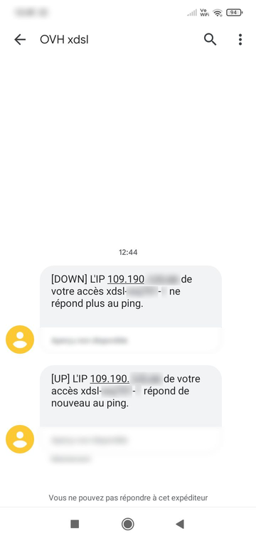

**Dernière mise à jour le 16/02/2022**

## Objectif

Le monitoring permet de vous alerter, selon une fréquence définie par vos soins, lorsque votre accès n'est plus joignable. Les notifications seront envoyées lorsque votre accès ne répondra plus aux requêtes ICMP (ping).
Les notifications sont envoyées par e-mail ou par SMS (il est alors nécessaire de disposer d'un compte SMS OVHcloud crédité).

**Découvrez comment activer des alertes de monitoring sur un accès à Internet OVHcloud.**

### Prérequis

- Disposer d'un accès ADSL / SDSL / FTTH qui répond aux requêtes ICMP (c'est le cas par défaut sur les modems distribués par OVHcloud).
- Une adresse e-mail pour recevoir les notifications.
- Un [compte SMS crédité](https://www.ovhtelecom.fr/sms/) si vous souhaitez recevoir les SMS de notifications sur votre mobile.
- Etre connecté à votre [espace client OVHcloud](https://www.ovh.com/auth?onsuccess=https%3A%2F%2Fwww.ovhtelecom.fr%2Fmanager&ovhSubsidiary=fr).

## En pratique

Pour pouvoir gérer vos alertes, connectez-vous à votre [espace client OVHcloud](https://www.ovh.com/auth?onsuccess=https%3A%2F%2Fwww.ovhtelecom.fr%2Fmanager&ovhSubsidiary=fr) dans la partie `Telecom`{.action}. 
 Cliquez sur `Accès Internet`{.action}, sélectionnez votre offre puis votre accès à Internet.

Dans l'onglet `Mon accès`{.action}, cliquez sur `Afficher les alertes`{.action} dans le cadre `Informations générales`.

{.thumbnail}

Vous arrivez alors sur le formulaire de création de notifications.

{.thumbnail}

### Activer les notifications par e-mail

Pour créer une notification par e-mail, cliquez sur `Ajouter une alerte`{.action}. 

Sélectionnez « E-mail » dans le menu déroulant correspondant au type de notification.

Renseignez l'adresse e-mail à notifier dans le champ `Contact à notifier en cas d'alertes`.
 Précisez, dans le champ `Fréquence d'envoi`, la fréquence d'envoi des notifications par e-mail lors d'une coupure. Si vous sélectionnez « Une fois », vous recevrez un e-mail lors de la coupure et un e-mail lors du rétablissement de l’accès à Internet concerné.

Validez l'alerte via le bouton dédié, à droite de la ligne.

Si vous ajoutez une adresse commune à plusieurs accès, vous recevrez un seul e-mail contenant toutes les notifications de coupure.

{.thumbnail}

### Activer les notifications par SMS

Pour créer une notification par SMS, cliquez sur `Ajouter une alerte`{.action}.

Sélectionnez « SMS » dans le menu déroulant correspondant au type de notification. 

Choisissez, dans le champ `Compte SMS à débiter`, le compte SMS à utiliser pour envoyer les notifications. 
 Renseignez, dans le champ `Numéro de téléphone`, le numéro de mobile à notifier, au format international (00336xxxxxxxx).
 Précisez, dans le champ `Fréquence d'envoi`, la fréquence d'envoi des notifications SMS lors d'une coupure.Si vous sélectionnez « Une fois », vous recevrez un SMS lors de la coupure et un SMS lors du rétablissement de l’accès à Internet concerné.

Validez l'alerte via le bouton dédié, à droite de la ligne.

{.thumbnail}

Les SMS vous prévenant de l'injoignabilité de votre accès à Internet, ou de son rétablissement, se présentent sous la forme suivante :

{.thumbnail}

### Supprimer une alerte

Pour supprimer une alerte préalablement activée, cliquez sur l'icône prévue à cet effet à droite de l'alerte. Confirmez la suppression en cliquant sur `OK`{.action}.

## Aller plus loin

Échangez avec notre communauté d'utilisateurs sur <https://community.ovh.com>.
