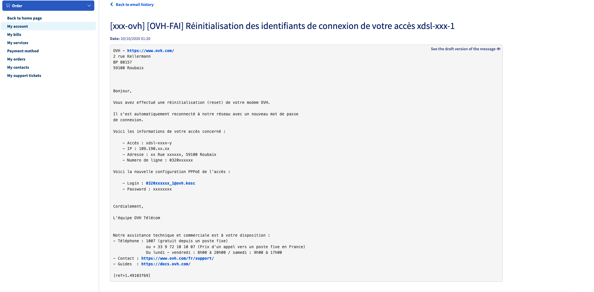

**Dernière mise à jour le 21/05/2021**

## Objectif

Cette documentation a pour objectif de vous permettre d'obtenir vos identifiants PPPoE afin de connecter votre routeur personnel sur votre offre XDSL/FTTH OVHCloud.

## Prérequis

- Disposer d'un abonnement xDSL ou FTTH OVHCloud actif.
- Être connecté sur la page web des [API OVHcloud](https://api.ovh.com/){.external}. 
- Consulter le guide [Premiers pas avec les API OVHcloud](../../api/api-premiers-pas/) pour vous familiariser avec l'utilisation des APIv6 OVHcloud.

N'hésitez pas à suivre le guide de premier pas à l'API pour y être bien connecté avant toute chose :

https://docs.ovh.com/fr/api/api-premiers-pas/

## En pratique

Vos identifiants PPPoE sont envoyés pendant la livraison de votre accès, sur votre accès mail de contact. Ces derniers vous permettent de configurer votre équipement OVHCloud ou un équipement personnel pour l’usage de votre accès internet. 

Si vous disposez d’un modem fournit par OVHCloud avec mon offre, ils sont envoyés systématiquement après chaque reset de votre modem. Le login est identique, le mot de passe lui est modifié pour des raisons de sécurité.

Si vous ne disposez pas d’un modem OVHCloud ou si vous utilisez directement un équipement , vous avez alors la possibilité d’utiliser l’API suivante afin de déclencher l’envoi du mail quand vous le désirez. 

L'adresse à utiliser est la suivante : 

https://api.ovh.com/console/#/xdsl/%7BserviceName%7D/requestPPPLoginMail#POST

Attention : 

Chaque utilisation de l'API vous enverra un nouveau mot de passe, si la session est active elle sera donc coupée. N'utilisez donc l'API qu'en étant certain de pouvoir reconfigurer votre équipement personnel dans la foulée. 

#### Aperçu

{.thumbnail}

Le champ servicename correspond à la référence de votre accès :

 - Pour un accès xdsl vous aurez cela sous la forme : xdsl-nichandle-x 

 - Pour un accès ftth : ftth-nichandle-x 

En utilisant le bouton execute : l'API répondra alors "null" en cas de succès confirmant la bonne pris en compte de votre demande. Dans le cas contraitre n'hésitez à faire le point avec votre support.

Sous un délai d'environ deux à trois minutes, vous receverez un mail sur votre adresse de contact contenant les informations avec votre identifiant PPPoE et le mot de passe.

#### Retrouver ce mail dans mon espace client

Depuis votre espace client dans les emails de service : 

{.thumbnail}

{.thumbnail}

{.thumbnail}

## Aller plus loin

Échangez avec notre communauté d'utilisateurs sur [https://community.ovh.com](https://community.ovh.com).
