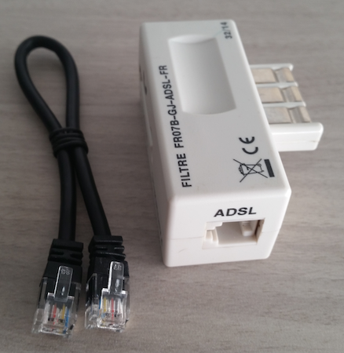

**Dernière mise à jour le 18/09/2018**

## Objectif

Une coupure de synchronisation est généralement occasionnée par un élément se situant à votre domicile. Quelques vérifications et manipulations simples peuvent vous permettre de dépanner vous-même la situation et de rétablir votre accès à Internet.

**Découvrez comment rétablir la synchronisation de votre ligne xDSL OVH suite à une coupure.**

> [!primary]
>
> Pour vous accompagner au mieux dans le rétablissement de vos services, vous avez également la possibilité d'utiliser notre assistant de dépannage. Pour y accéder, connectez-vous à votre [espace client OVH](https://www.ovh.com/auth/?action=gotomanager&from=https://www.ovh.com/fr/&ovhSubsidiary=fr){.external} dans la section « Télécom ». Une fois positionné sur l'accès internet concerné, cliquez sur `Lancer le diagnostic`{.action}. 
>

## Prérequis

- Se trouver physiquement près du modem pour effectuer les actions.

## En pratique

### Étape 1 : reconnaître un défaut de synchronisation

Avant de débuter, assurez-vous que la panne que vous rencontrez actuellement est bien liée à une coupure de synchronisation. Aidez-vous des voyants de votre modem pour le vérifier. 

Si cela est nécessaire, reportez-vous aux instructions décrites dans notre documentation « [Rétablir son service suite à une coupure complète ou partielle](https://docs.ovh.com/fr/xdsl/interruption-de-service/){.external} » afin de vous en assurer. Dès lors, si la panne rencontrée est bien liée à une coupure de synchronisation, poursuivez la lecture de cette documentation afin de réaliser quelques vérifications préalables. 

### Étape 2 : réaliser des vérifications préalables

Ces quelques vérifications peuvent vous permettre de savoir si le dysfonctionnement rencontré est lié à un élément extérieur à votre installation personnelle. Si tel est le cas, cela pourrait expliquer la coupure de synchronisation que vous rencontrez. 

#### 1. Si un incident déclaré est en cours

Rendez-vous sur la page <https://www.ovhtelecom.fr/xdsl/incident/#/> et vérifiez si votre accès est affecté par incident en cours. Dès lors, deux possibilités :

- **votre accès est affecté** : prenez connaissance des éléments renseignés sur la page, puis patientez le temps de la résolution de l'incident ;

- **votre accès n'est pas affecté** : poursuivez vers la vérification suivante.

#### 2. Si vous possédez une ligne fixe

Assurez-vous que celle-ci fonctionne correctement : identifiez-vous des grésillements ou des coupures lors de vos appels ? Êtes-vous toujours joignable ? Votre numéro est-il toujours présenté lorsque vous appelez un correspondant ? 

Ces éléments peuvent vous indiquer qu'une panne plus globale peut affecter par répercussion votre connexion. Cette dernière utilise en effet votre ligne fixe et peut donc affecter votre accès à Internet si celle-ci dysfonctionne. Pour le savoir, prenez contact avec l'opérateur gérant votre ligne fixe afin qu'il puisse la tester. Dès lors, deux possibilités :

- **votre ligne fixe dysfonctionne** : reportez-vous aux instructions communiquées par votre opérateur, puis patientez jusqu'à la résolution de l'incident ;

- **votre ligne fixe fonctionne correctement** : poursuivez vers la vérification suivante.

> [!primary]
>
> Avant de prendre contact avec votre opérateur, nous vous conseillons d'effectuer les tests décrits dans cette documentation à l'étape 3  « Effectuer des tests », car ils peuvent vous être demandés par ce dernier. 
>

#### 3. Si vous avez constaté un incident extérieur

Si, en même temps que votre coupure de synchronisation, vous constatez un incident à l'extérieur de votre domicile, prenez quelques instants afin de vous assurer que celui-ci n'est pas la cause réelle de la panne que vous rencontrez. 

Par exemple, si vous constatez que le poteau où se trouve le câble de votre ligne fixe est arraché ou mal attaché, il est impératif de le déclarer sur le site ci-dessous en y communiquant un maximum d'informations : <https://dommages-reseaux.orange.fr/>. 

Une fois ceci fait, prenez contact avec nos services afin que nous puissions également déclarer l'incident. **Notez cependant que si votre connexion est de nouveau fonctionnelle, nous ne pourrons pas effectuer la déclaration.**

### Étape 3 : effectuer des tests

Les tests listés ci-dessous doivent être réalisés dans l'ordre, jusqu'à la résolution du dysfonctionnement.

#### 1. Réaliser un test neutre

Débranchez d'abord tous les équipements connectés sur les prises téléphoniques de votre domicile, sauf votre modem. 

Une fois cette action effectuée, redémarrez votre modem. Si besoin, reportez-vous aux instructions décrites dans notre documentation « [Redémarrer ou réinitialiser un modem ADSL OVH](https://docs.ovh.com/fr/xdsl/redemarrer-reinitialiser-modem-adsl-ovh/){.external} ».

#### 2. Vérifier l'environnement électromagnétique

Éteignez et/ou éloignez le plus possible toutes les sources électriques proches de votre modem ainsi que du câble téléphonique. Ces éléments électriques peuvent générer un champ électromagnétique pertubant le bon fonctionnement de votre service. 

#### 3. Vérifier le branchement du câble téléphonique RJ11

Assurez-vous que le câble reliant votre modem à la prise téléphonique est correctement branché à ses deux extrémités. Pour rappel, ce dernier doit être branché à votre modem sur le port gris « DSL » jusqu'à votre prise téléphonique. Vérifiez également que le câble n'est pas endommagé à un endroit où dénudé à ses extrémités. 

#### 4. Remplacer le câble téléphonique RJ11 et le filtre ADSL

Même si le test précédent n'a pas montré une détérioration du câble téléphonique RJ11, il est tout de même préférable d'essayer de le remplacer. Pour cela, munissez-vous d'un autre câble RJ11 (par exemple, entre un téléphone et son combiné) puis réalisez le remplacement.

Si cela est également possible, faites de même pour le filtre ADSL. Ce dernier doit justement se trouver à l'une des extrémités du câble téléphonique RJ11. Sachez qu'en cas d'orage, le filtre ADSL peut avoir été endommagé même si son aspect extérieur ne le laisse pas présumer. Nous vous recommandons de ce fait de le remplacer le temps d'un test.

> [!primary]
> 
> Il n'est pas nécessaire de posséder des filtres ADSL sur toutes prises téléphoniques de votre logement, mais seulement sur celles où vous branchez un équipement.
> 

{.thumbnail}

#### 5. Vérifier la prise téléphonique 

Assurez-vous de l'état global de votre prise téléphonique. Pour rappel, il s'agit de la prise murale dans laquelle le câble téléphonique ou le filtre ADSL est relié. Nous vous invitons également, et plus particulièrement pour les prises téléphonique dites « prises gigognes » (ou aussi appelées « prise en T »), à vérifier l'état des lamelles métalliques se trouvant à l'intérieur de la prise. Des impuretés ou de l'oxydation peuvent perturber le signal réceptionné par votre prise.

Vérifiez également la présence d'un module RC (ou aussi appelé « condensateur ») dans votre prise téléphonique. Ce dernier ressemble à un petit boîtier de la taille d'un sucre et doit être positionné dans la prise elle-même. Il en existe deux différents : un à deux pattes et un autre à trois pattes. 

Celui à trois pattes pouvant perturber le signal DSL, nous vous recommandons de le retirer. Celui à deux pattes n'occasionne normalement pas de perturbation du signal, sauf s'il a été endommagé (à la suite d'un orage par exemple).

#### 6. Tester votre accès sur une autre prise téléphonique

Testez à présent votre modem sur une autre prise téléphonique se trouvant dans votre logement. En fonction de votre installation locale, ce test peut être effectué de deux manières :

- **vous disposez d'une prise de test « DTI »** : cette dernière est installée en amont de votre installation. Elle a l'avantage de tester votre ligne en entrée tout en isolant le reste de votre installation (cela signifie qu'en reliant quelque chose dessus, toutes les autres prises téléphoniques ne fonctionneront plus pendant ce laps de temps). Si vous disposez d'une telle prise dans votre logement, nous vous recommandons vivement d'effectuer le test sur cette dernière ;

- **vous ne disposez pas d'une prise de test « DTI »** : dans ce cas, nous vous recommandons d'effectuer le test sur la première prise téléphonique installée dans votre logement. Cette dernière se situe généralement près de votre compteur électrique ou de la gaine technique de votre habitation. 

#### 7. Effectuer un test croisé

Assurez-vous finalement que votre modem n'est pas à l'origine de la panne que vous rencontrez. Pour cela, réaliser un test croisé est indispensable, en particulier suite à un orage ou des coupures électriques à votre domicile.

> [!primary]
>
> Le test croisé permet de tester plusieurs éléments de votre installation : modem, câbles, filtres et prises ; il est donc indispensable. Si cela est possible, nous vous invitons à effectuer plusieurs combinaisons de tests afin d'identifier précisément l'origine du dysfonctionnement que vous rencontrez.
>

Deux tests croisés sont possibles :

- **tester votre modem chez une personne disposant d'un accès DSL fonctionnel** : vous devrez relier votre modem au câble téléphonique utilisé chez cette autre personne. Une fois votre modem sous tension, vérifiez le voyant « broadband ». S'il reste allumé fixe, cela indique que votre modem a réussi à se synchroniser et qu'il fonctionne correctement. Auquel cas, effectuez plusieurs combinaisons de tests croisés en testant vos câbles et vos filtres afin d'identifier précisément l'origine du dysfonctionnement ;

- **tester un autre modem à votre domicile** : si vous possédez un autre modem, testez-le directement sur votre prise de test « DTI » ou la première prise installée dans votre logement. Si cet autre modem réussit à se synchroniser, ceci indique que votre modem ne fonctionne pas correctement.

#### 8. Réinitialiser le modem

Le dernier test possible consiste à réinitialiser votre modem. Si besoin, reportez-vous aux instructions décrites dans notre documentation « [Redémarrer ou réinitialiser un modem ADSL OVH](https://docs.ovh.com/fr/xdsl/redemarrer-reinitialiser-modem-adsl-ovh/){.external} ».

## Aller plus loin

Échangez avec notre communauté d'utilisateurs sur <https://community.ovh.com>.