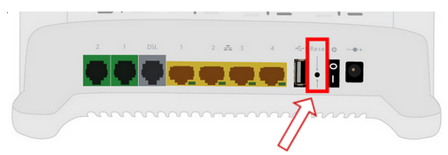
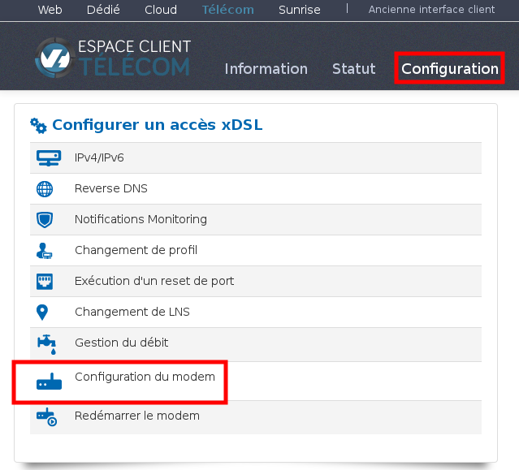

Préambule {#préambule}
---------

La réinitialisation est une manipulation permettant de restaurer les paramètres d'usine du modem ou les paramètres pré-enregistrés sur votre manager.

Cette manipulation sera donc très utile si un défaut non identifié est présent dans la configuration du modem ou simplement si vous souhaitez faire une mise à zéro de ce dernier.

Niveau : Débutant

### Réinitialisation manuelle {#réinitialisation-manuelle}

Le reset manuel nécessite que vous soyez physiquement à côté du modem.

Si votre modem n'est pas connecté à Internet, cette manipulation est la seule permettant d'effectuer une réinitialisation. Il faudra donc l'utiliser en cas de panne par exemple.

SI cette manipulation est effectuée, la modem perdra alors toute la configuration qui a été ajoutée sauf-ci cette configuration est enregistrée dans votre manager et que le modem se connecte à Internet suite au reset.

Pour effectuer cette manipulation, il faudra appuyer sur le bouton dissimulé dans le trou "reset" sur la face arrière du modem, comme sur l'illustration suivante :

{.thumbnail}

Il faudra alors vous munir d'un objet pointu tels qu'un cure-dent, trombone ou autre fil de métal.

Appuyer 10 secondes sur ce bouton jusqu'à l'extinction de tous les voyants lumineux situés sur la face avant du modem.

La réinitialisation est maintenant terminée. Si aucun défaut n'est présent sur le réseau ADSL, il faudra attendre quelques minutes afin que le modem se connecte automatiquement à Internet.

### Réinitialisation à distance {#réinitialisation-à-distance}

Sur votre manager, il existe une fonctionnalité permettant de réinitialiser votre modem à distance, il n'est donc pas nécessaire de se trouver à côté du modem pour l’exécuter.

Cette manipulation n'est possible que si le modem est connecté à Internet, elle ne pourra donc pas être utilisée pour résoudre une panne de connexion.

Afin de réaliser cette manipulation :

-   Connectez-vous à votre Espace Client OVH : <https://www.ovhtelecom.fr/espaceclient/>
-   Cliquez sur **"Configuration"**
-   Cliquez sur **"xDSL"**
-   Cliquez sur **"Configuration du modem"**

{.thumbnail}

Si la configuration de votre modem dans le manager est déjà activée, vous pouvez passer directement au paragraphe [Restaurer la configuration initiale](#Réinitialisationdumodem-Restaurer)

#### Activer / désactiver la configuration du modem {#activer-désactiver-la-configuration-du-modem}

****

Afin de pouvoir effectuer le reset via le manager, il faut activer la configuration du modem sur ce manager :

-   Cliquez sur **"Activer / désactiver la configuration du modem"**
-   Cochez la case correspondant à votre accès
-   Cliquez sur**"Suivant"**
-   Cliquez sur**"Oui"** lors de la confirmation

Il faudra ensuite attendre quelques minutes afin que la manipulation soit prise en compte

Toute la configuration qui sera enregistrée dans le manager après cette activation (configuration Wifi perso, DHCP...) sera récupérée automatiquement par le modem après la réinitialisation

#### Restaurer la configuration initiale {#restaurer-la-configuration-initiale}

Afin de réinitialiser la configuration du modem :

-   Cliquez sur****"Restaurer la configuration initiale"****
-   Cochez la case correspondant à votre accès
-   Cliquez sur**"Suivant"**
-   Cliquez sur**"Oui"** lors de la confirmation

La manipulation est alors terminée. Après quelques minutes, le modem va se réinitialiser et récupérer automatiquement la configuration enregistrée sur le manager (restauration d'usine si vous ne l'avez pas modifiée)
