## 
Il est possible de réinitialiser de plusieurs façon votre modem :

- Depuis votre espace client en ayant activé au préalable le contrôle du modem;
- Physiquement sur le modem;
- Par une commande Telnet.

## 
Rendez-vous dans la partie "Configuration" puis "xDSL" de votre [espace client ](https://www.ovhtelecom.fr/espaceclient/login.html)

{.thumbnail}

## 
Pour effectuez une réinitialisation de votre modem, cliquez sur "Configuration du modem" puis "Restaurer la configuration initiale".

{.thumbnail}

## 
Sélectionnez l'accès concerné dans la liste.

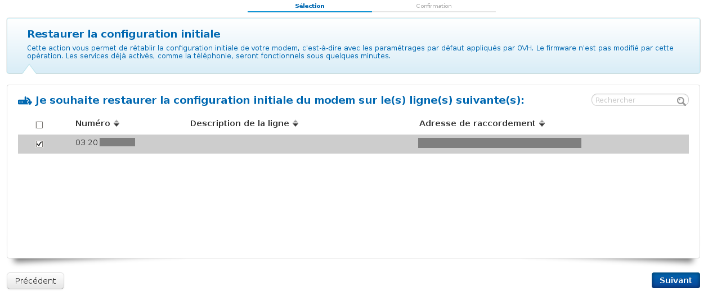{.thumbnail}

## 
Validez la demande de confirmation de réinitialisation de votre modem.
Celle-ci sera effective sous 10 minutes.

{.thumbnail}

## 
Pour effectuer une réinitialisation directement sur le modem, munissez-vous d'un trombone ou d'un cure-dent afin d'exercer une pression sur le bouton "Reset".

## 
Sur le modèle Thomson 788, le bouton "Reset" se situe au dos du modem.
Il suffit alors de le laisser enfoncé pendant 10-15 secondes jusqu’à ce que le voyant "Upgrade" en façade du modem passe au bleu.

Relâcher alors la pression : le modem est en phase de réinitialisation.

Il faut compter en moyenne 2 minutes pour que le modem retrouve sa configuration d'origine et redevienne fonctionnel.

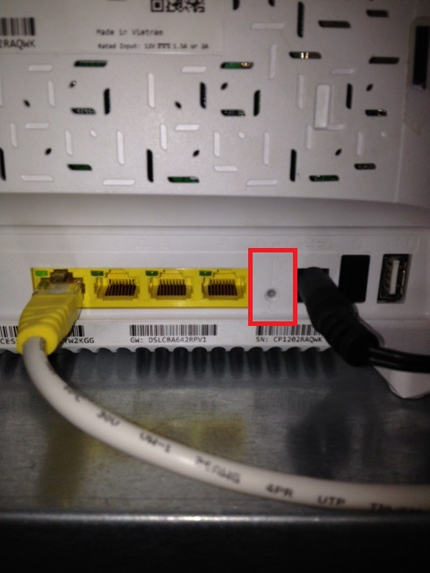{.thumbnail}

## Sur Windows
Modems compatibles: TG784 / TG788 / TG789

Étape 1 : Connexion en Telnet au modem (via une invite de commande)

telnet 192.168.1.254

- user: Administrator
- password: (aucun)

## 
Étape 2 : Renseignez la commande ci-dessous

system reset factory yes proceed yes

\\Ainsi, le modem retrouve ses réglages d'usine (reset) et se réinitialise totalement. 

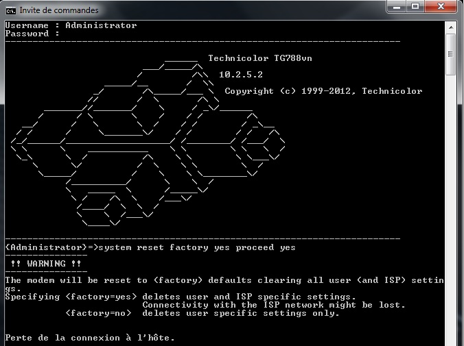{.thumbnail}

## Sur Windows (installation Telnet)
Si vous obtenez ce message d'erreur (cf capture ci-contre) lors d'une connexion Telnet par invite de commande, il est probable que le service Telnet ne soit pas activé sur votre machine.

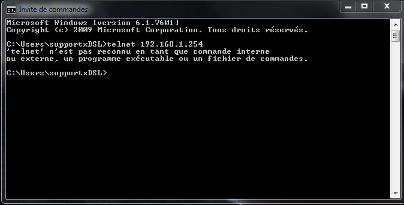{.thumbnail}

## 
Dans ce cas, rendez-vous dans le "Menu" de votre Windows 
puis "Panneau de configuration".

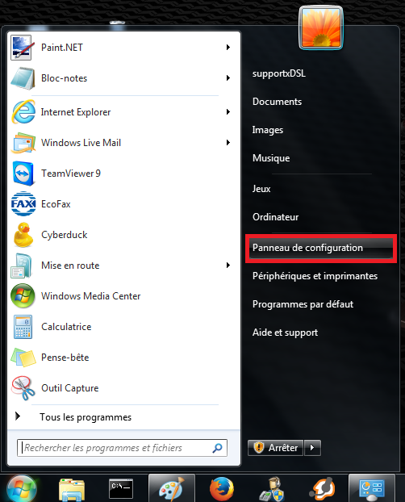{.thumbnail}

## 
Rendez-vous ensuite dans "Programmes et fonctionnalités".

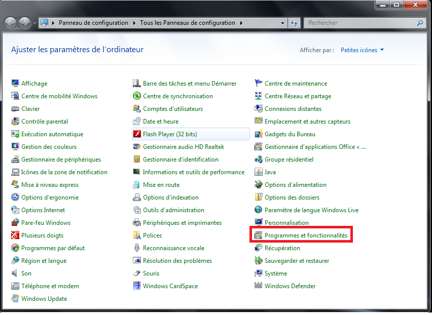{.thumbnail}

## 
Cliquez sur "Activer ou désactiver des fonctionnalités Windows".

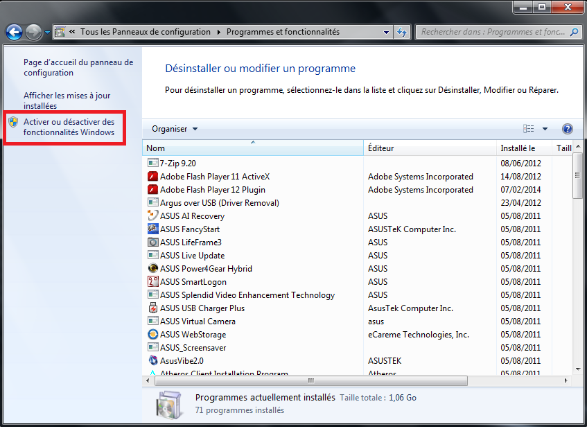{.thumbnail}

## 
Cochez "Client Telnet" puis "OK".

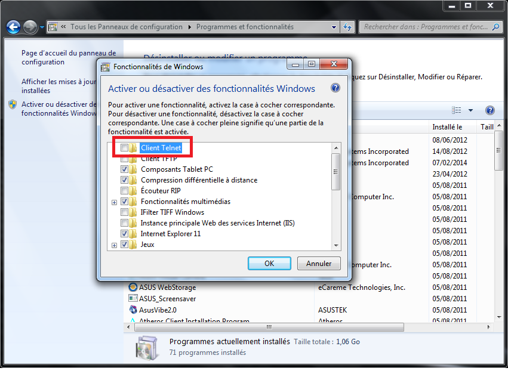{.thumbnail}

## 
Il faut compter plusieurs minutes pour que les modifications soient prises en compte.

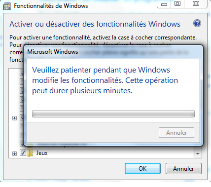{.thumbnail}

## Sur Mac
Sur Mac, il faut passer par le "Terminal" afin de renseigner la commande Telnet.

Pour cela rendez-vous dans le menu "Aller" puis "Utilitaires".

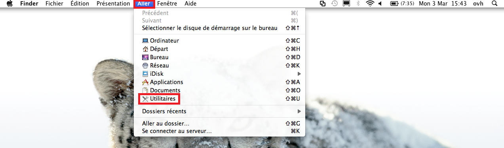{.thumbnail}

## 
Sélectionnez enfin "Terminal" et renseignez la commande Telnet fournie ci-dessous

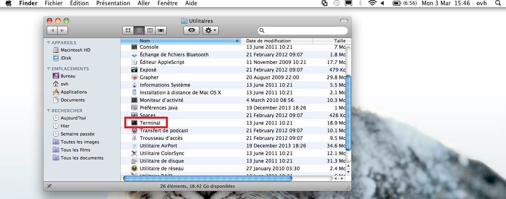{.thumbnail}

## 
Étape 1 : Connexion en telnet au modem

telnet 192.168.1.254

- user: Administrator
- password: (aucun)

## 
Étape 2 : Renseignez la commande ci-dessous

system reset factory yes proceed yes

\\ Ainsi, le modem retrouve ses réglages d'usine (reset) et se réinitialise totalement.

