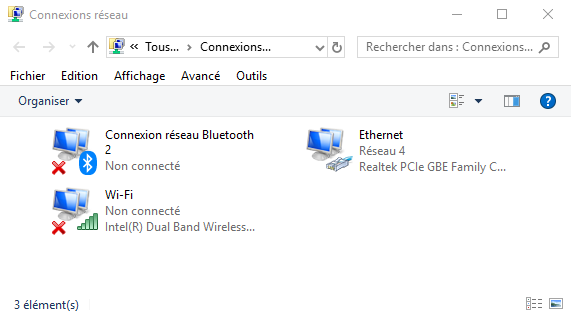
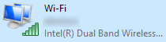
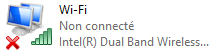

**Dernière mise à jour le 15/09/2022**

## Objectif

Une interruption ou des lenteurs de navigation sur Internet peuvent être occasionnées par un élément perturbateur, généralement situé dans votre domicile. Celui-ci peut être lié à l'un de vos équipements (votre ordinateur, par exemple) ou à une mauvaise configuration. Quelques vérifications et manipulations vous permettent, dans la plupart des cas, de rétablir votre accès à Internet ou d'identifier l'élément perturbateur.

**Découvrez comment résoudre une interruption ou des lenteurs de navigation sur votre connexion OVHcloud.**

## Prérequis

- Disposer d'un ordinateur relié à votre modem OVHcloud via un câble Ethernet ou en Wi-Fi.

## En pratique

### Étape 1 : reconnaître une interruption ou des lenteurs de navigation

Avant de débuter, assurez-vous qu'aucun élément plus global ne perturbe votre connexion Internet. Pour cela, vérifiez que :

- **le service jusqu'à votre modem est fonctionnel** : l'état des voyants de celui-ci peut vous fournir une indication. Pour cela, reportez-vous aux instructions décrites dans notre documentation « [Rétablir son service suite à une coupure complète ou partielle](https://docs.ovh.com/fr/xdsl/interruption-de-service/){.external} » ;

- **le service n'est pas dégradé suite à une saturation de votre connexion** : il est possible que votre connexion fonctionne correctement mais qu'un élément relié à votre modem accapare le débit disponible. Reportez-vous alors aux instructions décrites dans notre documentation « [Vérifier si son lien xDSL est saturé](https://docs.ovh.com/fr/xdsl/verifier-lien-xdsl-sature/){.external} » ;

- **aucun incident sur votre ligne n'est en cours** : un incident plus global pourrait perturber votre accès. Rendez-vous donc sur la page <https://www.ovhtelecom.fr/xdsl/incident/#/> ou sur notre site [status-ovhcloud.com](https://web-cloud.status-ovhcloud.com/){.external} ;

- **le service fonctionne sur un autre équipement** : si vous en avez la possibilité, testez votre connexion depuis un équipement différent (tel qu'un autre ordinateur ou un téléphone).

Une fois ces vérifications réalisées, il est probable que la panne rencontrée soit liée à l'équipement que vous utilisez (votre ordinateur, par exemple). Dès lors, poursuivez vers l'étape suivante de cette documentation. 

### Étape 2 : réaliser des vérifications préalables

Elles peuvent vous permettre d'identifier l'origine de la panne sur votre ordinateur.

Sachez cependant que les informations ci-dessous ont pour but de vous accompagner dans certaines tâches liées à la configuration de votre ordinateur. Elles ne se substituent pas à l'accompagnement d'un professionnel, comme un technicien informatique, si vous rencontrez des difficultés.

#### 1. Vérifier l'environnement entre votre modem et l'ordinateur

Il se peut qu'un élément perturbe la liaison entre votre modem et votre ordinateur. Pour le déterminer, réalisez les vérifications et manipulations ci-dessous :

- éteignez et/ou éloignez le plus possible toutes les sources électriques proches de votre modem (base téléphonique, enceinte, chargeur, lampe, etc.) ;

- si votre modem et votre ordinateur communiquent en Wi-Fi, connectez-les via un câble Ethernet. Si cela n'est pas possible, essayez de les rapprocher le plus possible (au minimum dans une même pièce) et vérifiez si la situation s'améliore ;

- si vous utilisez un équipement tiers entre votre modem et votre ordinateur (comme un répéteur Wi-Fi, des boîtiers CPL, un switch ou un hub), écartez-le afin de connecter directement votre modem et l'ordinateur.

Si votre connexion fonctionne de nouveau, un élément perturbe donc bien la liaison entre votre modem et votre ordinateur : écartez-le afin de résoudre la panne. Si votre connexion ne fonctionne toujours pas, poursuivez la lecture de cette documentation.

#### 2. Vérifier quelques éléments basiques de votre ordinateur

Il se peut qu'un élément basique de votre ordinateur (comme la configuration de votre navigateur internet ou de l'ordinateur lui-même) perturbe le bon fonctionnement de votre connexion. Pour le déterminer, réalisez les vérifications et manipulations ci-dessous :

- essayez de vous connecter via un onglet de « navigation privée » sur votre navigateur internet ;

- utilisez, si cela est possible, un autre navigateur internet ;

- vérifiez que votre antivirus ou pare-feu ne ralentit pas ou ne bloque pas la connexion sur votre ordinateur ;

- vérifiez que la date et l'heure sont à jour sur votre ordinateur. Si ce n'est pas le cas, l'accès à certains sites bénéficiant d'un certificat SSL pourrait ne plus fonctionner ;

- si vous avez activé le protocole **IPv6** sur votre accès internet OVHcloud, assurez-vous que le ou les sites qui ne fonctionnent pas sont bien accessibles via ce protocole. Si ce n'est pas le cas, désactiver l'IPv6 pourrait rétablir l'accès à ces pages. Cette gestion s'effectue dans l'espace client depuis l'onglet `Mon accès`{.action} de l'accès à Internet concerné, puis la section `Caractéristiques`.

Si votre connexion fonctionne de nouveau, un élément perturbe donc bien son fonctionnement sur votre ordinateur. Reconfigurez, réinitialisez ou écartez cet élément afin de résoudre la panne. Si votre connexion ne fonctionne toujours pas, poursuivez la lecture de cette documentation.

### Étape 3 : effectuer des tests

Les différents tests ci-dessous ont été réalisés depuis un ordinateur utilisant le système d'exploitation **Windows 10**. Ils doivent être effectués dans l’ordre, jusqu’à la résolution du dysfonctionnement. Si vous n'utilisez pas le système d'exploitation **Windows 10**, les manipulations peuvent vous donner quelques pistes à explorer de votre côté.

Sachez cependant que les informations ci-dessous ont pour but de vous accompagner dans certaines tâches liées à la configuration de votre ordinateur. Elles ne se substituent pas à l'aide d'un professionnel, comme un technicien informatique, si vous rencontrez des difficultés.

#### 1. Vérifier l'état de la carte réseau

Effectuez un clic droit sur l'image en bas à gauche représentant le logo **Windows** et cliquez sur `Connexions réseau`{.action}. Dans la fenêtre qui apparaît, assurez-vous d'être bien positionné sur l'onglet `État`{.action} dans la barre de menu à gauche, puis cliquez sur `Modifier les options d'adaptateur`{.action}.

{.thumbnail}

Dans la nouvelle fenêtre qui apparaît, les différentes cartes réseau (Wi-Fi ou Ethernet) installées sur votre ordinateur s'affichent. 

Si l'une de vos cartes n'apparaît pas dans la liste, c'est que celle-ci n'est pas installée ou qu'elle est hors service. Auquel cas, vous devez vous rapprocher d'un professionnel, tel qu'un technicien informatique. 

{.thumbnail}

Vous pouvez remarquer différents états concernant les cartes réseau.

|États|Illustration|Description|
|---|---|---|
|Active et connectée||La carte réseau est activée et vous êtes connecté au modem. La connexion depuis cette carte doit donc être fonctionnelle.|
|Active et non connectée||La carte réseau est activée mais vous n'êtes pas connecté au modem. La connexion depuis cette carte n'est donc pas fonctionnelle.|
|Désactivée||La carte réseau est désactivée. La connexion depuis cette carte n'est donc pas fonctionnelle.|

Poursuivez la lecture de cette documentation selon l'état de la carte réseau qui doit être utilisée par votre ordinateur.

**Carte réseau désactivée** :

Pour l'activer, faites un clic droit sur l'image représentant la carte puis cliquez sur `Activer`{.action}. Patientez alors le temps de son activation. Si la manipulation échoue, la carte est peut-être mal installée ou hors service. Auquel cas, vous devrez vous rapprocher d'un professionnel, tel qu'un technicien informatique. 

{.thumbnail}

**Carte réseau active et non connectée** :

Selon votre méthode de connexion, une icône (Wi-Fi ou câble) sera présente en bas à droite de votre écran.

- **Pour une connexion WIFI** (image de gauche) : l'icône indique que des connexions sont disponibles et vous invite à vous connecter à un réseau Wi-Fi. Pour cela, cliquez sur l'icône, sélectionnez le nom de votre réseau Wi-Fi (*SSID*), puis renseignez le mot de passe correspondant (*wifi key*). Si besoin, ces informations se situent à l'arrière de votre modem OVHcloud.

- **Pour une connexion Ethernet par câble** (image de droite) : l'icône indique qu'aucune connexion n'est disponible et vous précise que la liaison entre votre ordinateur et votre modem OVHcloud n'est pas détectée. Vérifiez alors si un câble est bien présent entre ces deux équipements, ainsi que son état. Si possible, essayez un autre câble. Enfin, testez de relier ce câble à un autre port Ethernet derrière votre modem OVHcloud. 

{.thumbnail}

**Carte réseau active et connectée** :

Selon votre méthode de connexion, une icône de connexion Wi-Fi (image de gauche) ou de connexion câble (image de droite) sera présente en bas à droite de votre écran. Cette icône indique que vous disposez d'un accès à Internet.

{.thumbnail}

Si un triangle jaune est positionné sur l'icône de connexion (Wi-Fi ou câble), ceci indique que votre ordinateur est bien connecté à votre modem mais qu'il ne dispose pas d'un accès à Internet. 

Plusieurs causes peuvent expliquer cet état. Nous vous conseillons alors de :

- vérifier si votre modem est toujours connecté à Internet. Pour cela, reportez-vous aux instructions décrites dans notre documentation « [Rétablir son service suite à une coupure complète ou partielle](https://docs.ovh.com/fr/xdsl/interruption-de-service/){.external} » ;
- vous assurer que la clef Wi-Fi utilisée est correcte. Tentez de vous connecter de nouveau en renseignant la bonne clef ;
- redémarrer votre modem ainsi que votre ordinateur. Si nécessaire, reportez-vous aux instructions décrites dans notre documentation « [Redémarrer ou réinitialiser un modem ADSL OVHcloud](https://docs.ovh.com/fr/xdsl/redemarrer-reinitialiser-modem-adsl-ovh/){.external} ».

{.thumbnail}

#### 2. Vérifier la configuration Wi-Fi de votre modem

> [!primary]
>
> Si vous n'utilisez pas une connexion Wi-Fi, poursuivez dès à présent vers la vérification suivante : « [3. Vérifier la configuration réseau de votre modem](https://docs.ovh.com/fr/xdsl/resoudre-interruption-lenteurs-navigation/#3-verifier-la-configuration-reseau-de-votre-modem){.external} ».
>

Votre connexion Wi-Fi n'est toujours pas fonctionnelle ? Deux vérifications peuvent ici vous permettre de rétablir votre accès.

- **Changer le canal Wi-Fi** : le réseau Wi-Fi est diffusé sur une plage de fréquences comportant 13 canaux. Si plusieurs modems diffusent sur le même canal, des lenteurs de navigation, des coupures, voire une impossibilité de se connecter au réseau Wi-Fi peuvent survenir. Il est donc intéressant de tester différents canaux Wi-Fi, afin de trouver celui le plus stable et le mieux adapté à votre situation ;

- **Modifier la clef Wi-Fi** : votre réseau Wi-Fi étant accessible par le biais d'une clef, il est possible que celle que vous utilisez ne soit pas correcte. Il est alors conseillé de modifier la clef Wi-Fi, afin d'être sûr d'en utiliser une fonctionnelle.

Pour accéder à la configuration de votre réseau Wi-Fi OVHcloud, connectez-vous à votre [espace client OVHcloud](https://www.ovh.com/auth/?action=gotomanager&from=https://www.ovh.com/fr/&ovhSubsidiary=fr){.external}, partie `Télécom`. Cliquez sur `Accès Internet`{.action} puis sélectionnez le pack et l'accès Internet concerné. Positionnez-vous sur l'onglet `Mon modem`{.action} et cliquez sur `Configurer les réseaux Wi-Fi`{.action} dans la section `Configuration générale`{.action}.

{.thumbnail}

Dans la page qui apparaît, cliquez sur le bouton représentant des points de suspension (à droite du réseau Wi-Fi que vous souhaitez configurer), puis sur `Éditer`{.action}. La configuration actuelle s'affiche en dessous du tableau. Vous pouvez y modifier le canal Wi-Fi ainsi que la clef Wi-Fi. 

Validez vos changements grâce au bouton `Valider`{.action} et **patientez cinq minutes le temps que la modification soit prise en compte par votre modem.** Si nécessaire, effectuez plusieurs tests concernant le canal Wi-Fi afin de trouver celui le plus stable et le mieux adapté à votre situation.

{.thumbnail}

#### 3. Vérifier la configuration réseau de votre modem

Si la connexion n'est toujours pas fonctionnelle, vérifier que la configuration réseau du modem peut permettre de rétablir votre accès.

Pour cela, connectez-vous à votre [espace client OVHcloud](https://www.ovh.com/auth/?action=gotomanager&from=https://www.ovh.com/fr/&ovhSubsidiary=fr){.external}, partie `Télécom`. Cliquez sur `Accès Internet`{.action} puis sélectionnez le pack et l'accès Internet concerné. Positionnez-vous sur l'onglet `Mon modem`{.action} et descendez dans la page jusqu'à voir la section `Configuration réseau`{.action}.

Nous allons nous intéresser spécifiquement aux tableaux `IP LAN` et `DHCP`.

{.thumbnail}

Si vous n'avez pas modifié la configuration réseau de votre modem, vous devriez trouver les informations ci-dessous :

- **Pour la configuration IP LAN** :

|Méthode de récupération d'adresse IP|Adresse IP LAN|Masque de sous-réseau|
|---|---|---|
|Statique|192.168.1.254|255.255.255.0|

- **Pour la configuration DHCP** :

|Serveur DHCP|Passerelle|DNS Primaire|DNS Secondaire|Nom de domaine DHCP|Plage DHCP|Durée d'allocation d'une adresse|
|---|---|---|---|---|---|---|
|Actif|192.168.1.254|91.121.161.184|188.165.197.144|lan|192.168.1.64|86400|

Si vous ne retrouvez pas ces éléments dans la configuration de votre modem, c'est qu'elle a été modifiée. Rapprochez-vous alors de la personne gérant votre installation informatique ou réseau, afin qu'elle puisse s'assurer que la configuration en place est bien fonctionnelle.

Vous avez également la possibilité de réinitialiser la configuration de votre modem. Toutefois, assurez-vous que cette opération ne provoquera pas l'indisponibilité d'éléments de votre réseau local. 

Pour réinitialiser la configuration de votre modem, depuis l'onglet `Mon modem`{.action}, descendez dans la page jusqu'à voir la section `Configurations avancées`{.action}, puis cliquez sur `Réinitialiser la configuration OVHcloud`{.action}. **Patientez cinq minutes le temps que la modification soit prise en compte par votre modem.**

{.thumbnail}

#### 4. Vérifier la configuration de la carte réseau

Si la connexion n'est toujours pas fonctionnelle sur votre ordinateur, vérifier la configuration de la carte réseau utilisée sur celui-ci peut permettre de rétablir votre accès.

Pour cela, effectuez un clic droit sur l'image en bas à gauche représentant le logo **Windows** et cliquez sur `Connexions réseau`{.action}. Dans la fenêtre qui apparaît, assurez-vous d'être bien positionné sur l'onglet `État`{.action} dans la barre de menu à gauche, puis cliquez sur `Modifier les options d'adaptateur`{.action}.

{.thumbnail}

Dans la nouvelle fenêtre qui apparaît, les différentes cartes réseau (Wi-Fi ou Ethernet) installées sur votre ordinateur s'affichent. Effectuez un clic droit sur la carte (Wi-Fi ou câble) concernée, puis sélectionnez `Propriétés`{.action}. Assurez-vous que la case à côté de `Protocole Internet version 4 (TCP/IPv4)` est bien cochée. Ensuite, cliquez sur le nom `Protocole Internet version 4 (TCP/IPv4)` pour qu'il s'affiche en surbrillance, puis cliquez sur le bouton `Propriétés`{.action}.

Au sein de cette nouvelle fenêtre, assurez-vous que `Obtenir une adresse IP automatiquement` et `Obtenir les adresses des serveurs DNS automatiquement` sont bien cochés. Cliquez finalement sur les boutons `OK`{.action} pour valider vos modifications, le cas échéant. 

{.thumbnail}

## Aller plus loin

Échangez avec notre communauté d'utilisateurs sur <https://community.ovh.com>.