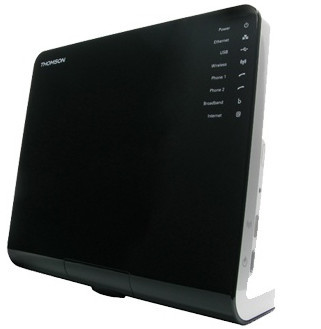
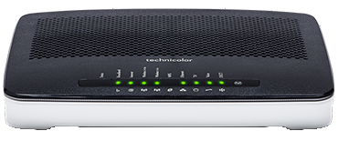
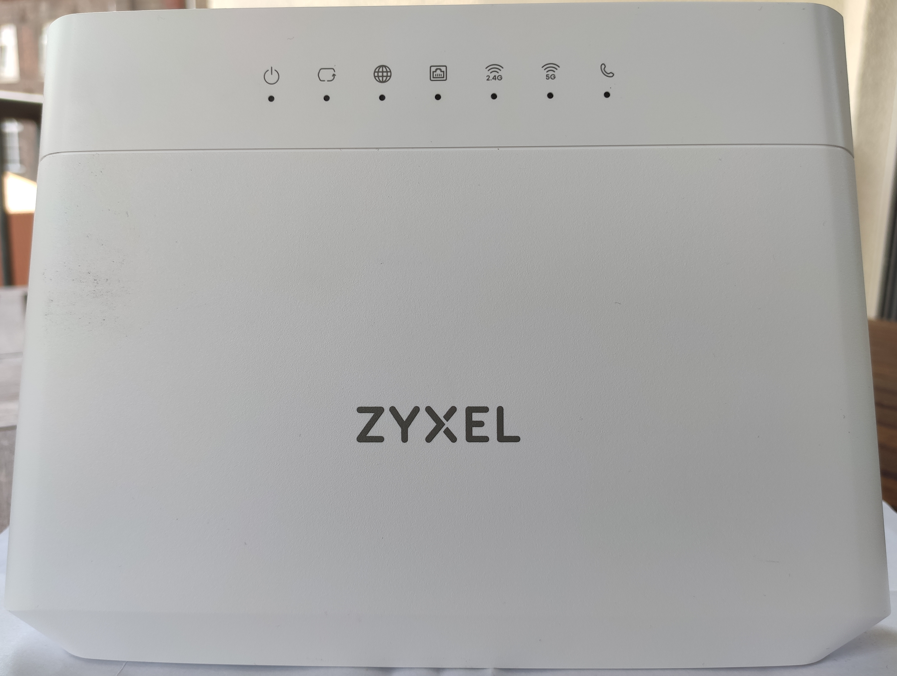
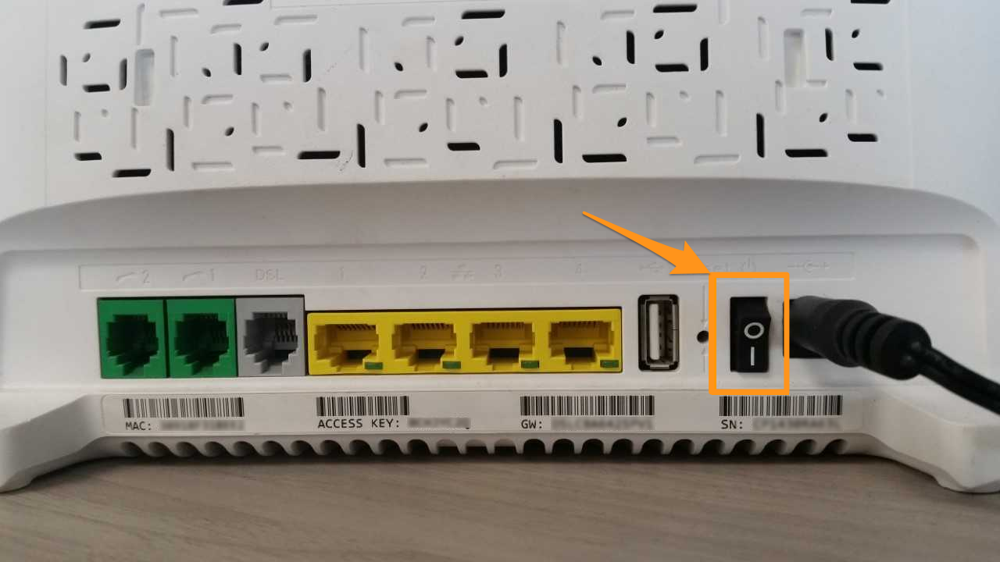
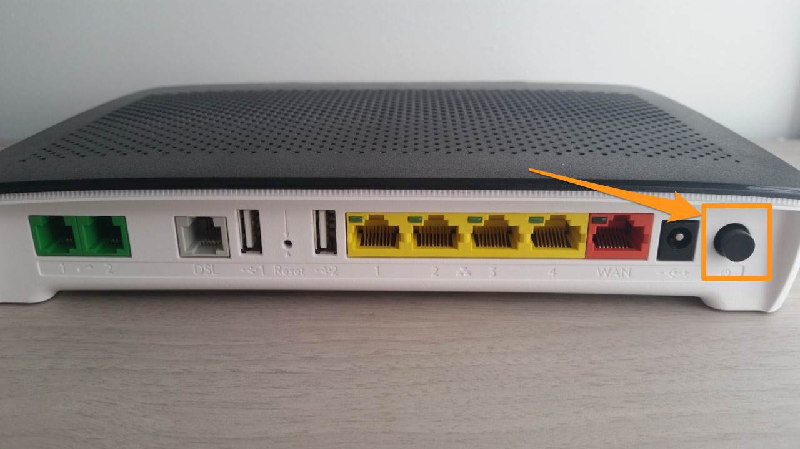
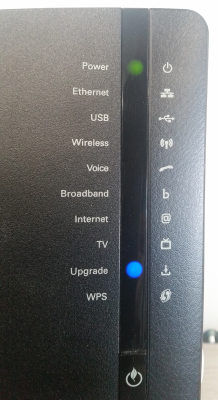
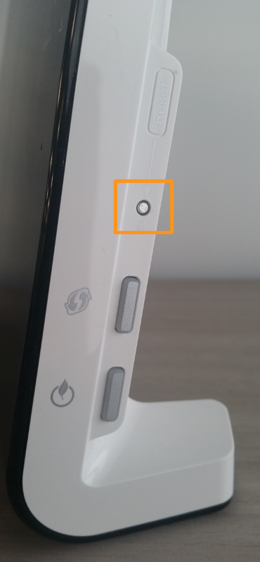
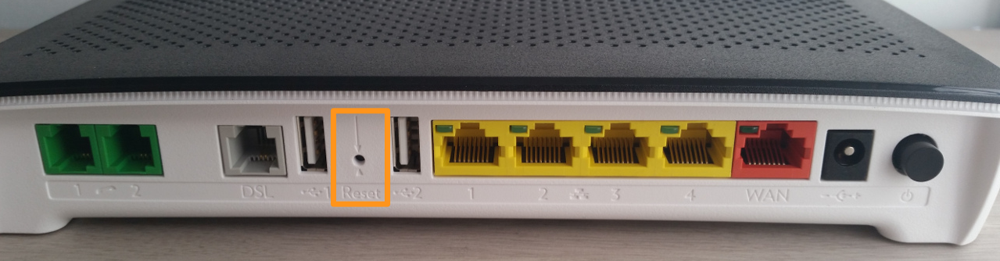

**Dernière mise à jour le 23/07/2021**

## Objectif

En cas de difficultés avec votre accès à Internet, il est parfois nécessaire de redémarrer – voire de réinitialiser – votre box.

**Découvrez comment effectuer le redémarrage et la réinitialisation de votre box OVHcloud.**

## Prérequis

- Se trouver physiquement près de votre box pour effectuer les actions.
- Être connecté à l’[espace client OVHcloud](https://www.ovhtelecom.fr/manager/index.html#/){.external}, partie `Accès Internet`{.action}.

## En pratique

### Redémarrer votre box OVHcloud

La manipulation est différente selon le modèle de votre box. Rapprochez-vous de celle-ci afin de pouvoir l'identifier, en vous aidant du tableau ci-dessous. Puis poursuivez vers le modèle concerné.

|[TG788vn/TG788vn V2](./#redemarrer-un-modele-tg788vn-ou-tg788vn-v2)|[TG789vn](./#redemarrer-un-modele-tg789vn)|
|---|---|
|{.thumbnail}|{.thumbnail}|
|[TG799vac](./#redemarrer-un-modele-tg799vac)| |
|{.thumbnail}| |
|[Zyxel VMG8924-B10D](./#redemarrer-un-modele-zyxel-vmg8924-b10d)|[Zyxel VMG8823-B50B](./#redemarrer-un-modele-zyxel-vmg8823-b50b)|
|{.thumbnail}|{.thumbnail}|
|[Zyxel VMG8825-T50](./#redemarrer-un-modele-zyxel-vmg8825-t50)|[Zyxel VMG8623-T50B](./#redemarrer-un-modele-zyxel-vmg8623-t50b)|
|{.thumbnail}|{.thumbnail}|

#### Redémarrer un modèle TG788vn ou TG788vn V2

Le redémarrage électrique de votre box consiste simplement à mettre celle-ci hors tension, puis à l'alimenter de nouveau. Pour cela, deux solutions sont disponibles :

- débrancher puis rebrancher électriquement la box  ;
- actionner le bouton ON/OFF à l'arrière comme indiqué ci-dessous.

{.thumbnail}

#### Redémarrer un modèle TG789vn

Le redémarrage électrique de votre box consiste simplement à mettre celle-ci hors tension, puis à l'alimenter de nouveau. Pour cela, deux solutions sont disponibles :

- débrancher puis rebrancher électriquement la box  ;
- actionner le bouton ON/OFF à l'arrière comme indiqué ci-dessous.

{.thumbnail}

#### Redémarrer un modèle TG799vac

Le redémarrage électrique de votre box consiste simplement à mettre celle-ci hors tension, puis à l'alimenter de nouveau. Pour cela, deux solutions sont disponibles :

- débrancher puis rebrancher électriquement la box  ;
- actionner le bouton ON/OFF à l'arrière comme indiqué ci-dessous.

{.thumbnail}

#### Redémarrer un modèle Zyxel VMG8924-B10D

Le redémarrage électrique de votre box consiste simplement à mettre celle-ci hors tension, puis à l'alimenter de nouveau. Pour cela, deux solutions sont disponibles :

- débrancher puis rebrancher électriquement la box  ;
- actionner le bouton ON/OFF à l'arrière comme indiqué ci-dessous.

{.thumbnail}

#### Redémarrer un modèle Zyxel VMG8823-B50B

Le redémarrage électrique de votre box consiste simplement à mettre celle-ci hors tension, puis à l'alimenter de nouveau. Pour cela, deux solutions sont disponibles :

- débrancher puis rebrancher électriquement la box  ;
- actionner le bouton ON/OFF à l'arrière comme indiqué ci-dessous.

{.thumbnail}

#### Redémarrer un modèle Zyxel VMG8825-T50

Le redémarrage électrique de votre box consiste simplement à mettre celle-ci hors tension, puis à l'alimenter de nouveau. Pour cela, deux solutions sont disponibles :

- débrancher puis rebrancher électriquement la box  ;
- actionner le bouton ON/OFF à l'arrière comme indiqué ci-dessous.

{.thumbnail}

#### Redémarrer un modèle Zyxel VMG8623-T50B

Le redémarrage électrique de votre box consiste simplement à mettre celle-ci hors tension, puis à l'alimenter de nouveau. Pour cela, deux solutions sont disponibles :

- débrancher puis rebrancher électriquement la box  ;
- actionner le bouton ON/OFF à l'arrière comme indiqué ci-dessous.

{.thumbnail}

### Réinitialiser votre box OVHcloud

> [!warning]
>
> Avant de réinitialiser votre équipement, assurez-vous que celui-ci est et restera allumé (alimenté électriquement) durant la manipulation. Si vous avez déjà paramétré votre box via l'interface, sauvegardez ou récupérez les informations de configuration existantes si vous souhaitez les conserver.
>

Il existe deux possibilités pour réinitialiser votre box OVHcloud :

- **depuis l'[espace client](https://www.ovhtelecom.fr/manager/index.html#/){.external}** : positionnez-vous sur l'onglet `Mon modem`{.action} de l'accès à Internet concerné, puis utilisez le bouton `Réinitialiser le modem`{.action}. Cette solution est commune à tous les modèles de box. Si nécessaire, reportez-vous à notre guide « [Configurer sa box à partir de l'espace client OVHcloud](../configuration_du_modem_a_partir_de_votre_espace_client/#22-configuration-generale) » ;

- **par le biais d'une manipulation manuelle sur votre box** : la marche à suivre est différente selon le modèle de votre box. Rapprochez-vous de celle-ci afin de pouvoir l'identifier, en vous aidant du tableau ci-dessous. Puis poursuivez vers le modèle concerné.

|[TG788vn/TG788vn V2](./#reinitialiser-un-modele-tg788vn-ou-tg788vn-v2)|[TG789vn](./#reinitialiser-un-modele-tg789vn)|
|---|---|
|{.thumbnail}|{.thumbnail}|
|[TG799vac](./#reinitialiser-un-modele-tg799vac)| |
|{.thumbnail}| |
|[Zyxel VMG8924-B10D](./#reinitialiser-un-modele-zyxel-vmg8924-b10d)|[Zyxel VMG8823-B50B](./#reinitialiser-un-modele-zyxel-vmg8823-b50b)|
|{.thumbnail}|{.thumbnail}|
|[Zyxel VMG8825-T50](./#reinitialiser-un-modele-zyxel-vmg8825-t50)|[Zyxel VMG8623-T50B](./#reinitialiser-un-modele-zyxel-vmg8623-t50b)|
|{.thumbnail}|{.thumbnail}|

#### Réinitialiser un modèle TG788vn ou TG788vn V2

Débranchez tous les câbles de type RJ45 (ports jaunes sur la photo ci-dessous). Puis appuyez sur le bouton dans le trou `reset` (à l'aide d'un objet pointu) jusqu'à ce que le voyant `Upgrade` passe en bleu (environ 15 secondes, bien attendre même si les voyants s'éteignent). Vous pouvez ensuite relâcher.

> [!primary]
>
> Durant la réinitialisation, le voyant `Power` sera orange et clignotera sur la box TG788vn V2 ; il sera vert sur la box TG788vn.
>

{.thumbnail}

{.thumbnail}

La box va redémarrer plusieurs fois avant d'être pleinement opérationnelle. Ce processus devrait durer au total une quinzaine de minutes.

#### Réinitialiser un modèle TG789vn

Débranchez tous les câbles de type RJ45 (ports jaunes sur la photo ci-dessous). Puis appuyez sur le bouton dans le trou `reset` (à l'aide d'un objet pointu) jusqu'à ce que le voyant `Power` passe à l'orange (environ 15 secondes). Vous pouvez ensuite relâcher.

> [!primary]
> 
> Durant l'appui sur le bouton `Reset`, les voyants s'éteindront à l'exception de celui `Power` : il passera au vert avec un petit claquement, puis deviendra orange.
>

{.thumbnail}

La box va redémarrer plusieurs fois avant d'être pleinement opérationnelle. Ce processus devrait durer au total une quinzaine de minutes.

#### Réinitialiser un modèle TG799vac

Débranchez tous les câbles de type RJ45 (les ports jaunes sur la photo ci-dessous). Puis appuyez dans le trou `reset` (à l'aide d'un objet pointu) pendant au moins 15 secondes. Vous pouvez ensuite relâcher.

Rien ne se passera, c'est normal. Il faut attendre environ 30 secondes après avoir relâché pour que le modem réagisse.

> [!primary]
> 
> Le voyant `Status` sera d'abord rouge. Ensuite, tous les voyants s'allumeront. Et, enfin, le voyant `Status` deviendra orange.
>

{.thumbnail}

La box va redémarrer plusieurs fois avant d'être pleinement opérationnelle. Ce processus devrait durer au total une quinzaine de minutes.

#### Réinitialiser un modèle Zyxel VMG8924-B10D

Débranchez tous les câbles de type RJ45 (les ports jaunes sur la photo ci-dessous). Puis appuyez dans le trou `reset` (à l'aide d'un objet pointu) pendant au moins 10 secondes. Attendez alors, tout en maintenant ce bouton, que le voyant `Power` commence à clignoter. Dès que cela sera le cas, vous pourrez relâcher.

{.thumbnail}

La box va redémarrer plusieurs fois avant d'être pleinement opérationnelle. Ce processus devrait durer au total une quinzaine de minutes.

#### Réinitialiser un modèle Zyxel VMG8823-B50B

Débranchez tous les câbles de type RJ45 (les ports jaunes sur la photo ci-dessous). Puis appuyez dans le trou `reset` (à l'aide d'un objet pointu) pendant au moins 10 secondes. Attendez alors, tout en maintenant ce bouton, que le voyant `Power` commence à clignoter. Dès que cela sera le cas, vous pourrez relâcher.

{.thumbnail}

La box va redémarrer plusieurs fois avant d'être pleinement opérationnelle. Ce processus devrait durer au total une quinzaine de minutes.

#### Réinitialiser un modèle Zyxel VMG8825-T50

Débranchez tous les câbles de type RJ45 (les ports jaunes sur la photo ci-dessous). Puis appuyez dans le trou `reset` (à l'aide d'un objet pointu) pendant au moins 10 secondes. Attendez alors, tout en maintenant ce bouton, que le voyant `Power` commence à clignoter. Dès que cela sera le cas, vous pourrez relâcher.

{.thumbnail}
{.thumbnail}

La box va redémarrer plusieurs fois avant d'être pleinement opérationnelle. Ce processus devrait durer au total une quinzaine de minutes.

#### Réinitialiser un modèle Zyxel VMG8623-T50B

Débranchez tous les câbles de type RJ45 (les ports jaunes sur la photo ci-dessous). Puis appuyez dans le trou `reset` (à l'aide d'un objet pointu) pendant au moins 10 secondes. Attendez alors, tout en maintenant ce bouton, que le voyant `Power` commence à clignoter. Dès que cela sera le cas, vous pourrez relâcher.

{.thumbnail}
{.thumbnail}

La box va redémarrer plusieurs fois avant d'être pleinement opérationnelle. Ce processus devrait durer au total une quinzaine de minutes.
## Aller plus loin

Échangez avec notre communauté d'utilisateurs sur <https://community.ovh.com>.
