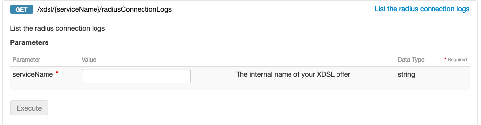

---
title: "Vérifier la stabilité de son accès OVHCloud"
slug: connectivity-api
excerpt: 'Découvrez comment vérifier la stabilité de votre accès OVHCloud via les API'
section: 'Configurations techniques avancées'
order: 5
---

**Dernière mise à jour le 24/05/2021**

## Objectif

Cette documentation a pour objectif de vous permettre de vérifier la stabilité de votre accès via les logs Radius disponible par API en complément de la réponse au ping de votre lien.

Ce guide n'a pas vocation à expliquer le fonctionnement d'une connexion PPPoE mais d'utiliser les logs pour déduire de la stabilité d'un lien.

## Prérequis

- Disposer d'un abonnement xDSL ou FTTH OVHCloud actif.
- Être sur la page web des [API OVHcloud](https://api.ovh.com/){.external}.
- Consulter le guide [Premiers pas avec les API OVHcloud](../../api/api-premiers-pas/) pour vous familiariser avec l'utilisation des APIv6 OVHcloud.

## En pratique

Lors de la connexion de votre routeur sur les équipements OVHCloud, une trace est systématiquement laissé à notre niveau sur les logs de l’équipement nommé radius. 

Suite à cela chaque reconnexion du lien, laisse une nouvelle trace horodatée de la connexion. Tout cela permet de vérifier la date de la dernière connexion et la fréquence à laquelle votre équipement se connecte chez nous. Une coupure électrique entraînerai donc une reconnexion de votre routeur dans les minutes qui suivent par exemple.

L’API permettant de récupérer ces informations est disponible ici : 

https://api.ovh.com/console/#/xdsl/%7BserviceName%7D/radiusConnectionLogs#GET

Il est en revanche important de noter que seules les reconnexions sont indiquées, une déconnexion serait alors supposée si l'accès (répondant au ping en temps normal, n'y réponds plus).

#### Aperçu

{.thumbnail}

Le champ servicename correspond à la référence de votre accès :

 - Pour un accès xdsl vous aurez cela sous la forme : xdsl-nichandle-x 

 - Pour un accès ftth : ftth-nichandle-x 

En utilisant le bouton execute : l'API répondra alors : 

{.thumbnail}

#### Retrouver ce mail dans mon espace client

Depuis votre espace client dans les emails de service : 

{.thumbnail}

{.thumbnail}

{.thumbnail}

## Aller plus loin

Échangez avec notre communauté d'utilisateurs sur [https://community.ovh.com](https://community.ovh.com).
