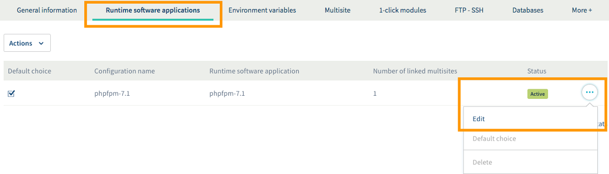
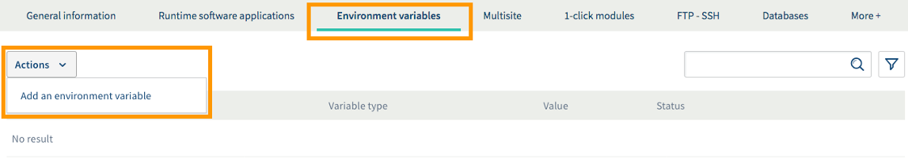
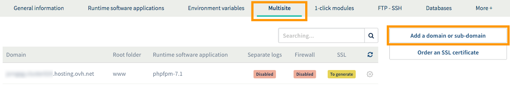
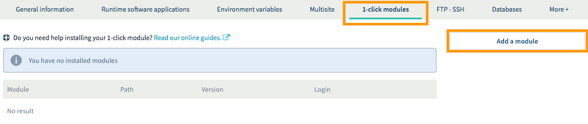

**Last updated 11th July 2018**

## Objective

For our new [Cloud Web](https://www.ovh.co.uk/web-hosting/cloud-web.xml) solution, we have combined 20 years of experience in web hosting with the power of our Public Cloud. Like our standard hosting plans, your websites are hosted on a service that is managed 24/7. However, [Cloud Web](https://www.ovh.co.uk/web-hosting/cloud-web.xml) offers an even wider range of features, and higher performance levels for hardware such as SSD disks.

**Find out how to get started with a Cloud Web hosting plan.**

## Requirements

- a [Cloud Web hosting plan](https://www.ovh.co.uk/web-hosting/cloud-web.xml)
- an email confirming that your hosting plan has been set up
- a [domain name](https://www.ovh.co.uk/domains/) for your website
- access to the [OVH Control Panel](https://www.ovh.com/auth/?action=gotomanager)

## Instructions

### Step 1: Define your project.

OVH [Cloud Web](https://www.ovh.co.uk/web-hosting/cloud-web.xml) hosting offers a wider range of configuration options than standard web hosting plans, so that you can tailor your plan to suit your project. To ensure that your project is a success, it is important to have a clear idea of your objective. To do this, you should:

- **Define what you want to set up.** Are you creating a blog, or an online store? Do you want to share your passion, or boost your company’s online profile? It is best to define your project clearly before you get started.

- **Research the technical requirements for setting up your project.** Your project may have specific technical requirements. Make sure you are aware of them in advance.

- **Ensure that your project is technically compatible with Cloud Web hosting.** Need a particular runtime software type or SQL? If you have not already done so, check that what you need is available with your [Cloud Web](https://www.ovh.co.uk/web-hosting/cloud-web.xml) hosting plan.

Once you have explored the various options available and carefully defined your project, you can then start getting it online.

### Step 2: Choose a runtime software application.

With [Cloud Web](https://www.ovh.co.uk/web-hosting/cloud-web.xml), you can choose from a range of different coding languages to build your project. If you would like to use a language other than PHP, which is the default selection, you will need to select a runtime software application that corresponds to your coding language.

The languages currently available are PHP and Node.js.

To access the runtime software applications for your [Cloud Web](https://www.ovh.co.uk/web-hosting/cloud-web.xml) hosting plan, log in to the [OVH Control Panel](https://www.ovh.com/auth/?action=gotomanager){.external}, click `Web Hosting`{.action} in the services bar on the left-hand side, then select the name of the Cloud Web hosting plan concerned. Next, go to the `Runtime software`{.action} tab.

When you set up your hosting plan, a runtime software application will be created automatically. It is included as the `Default choice` in the table that appears. To modify a runtime software that has already been set, click on the three dots next to it, then `Modify`{.action}. 

Depending on which [Cloud Web](https://www.ovh.co.uk/web-hosting/cloud-web.xml) hosting plan you have chosen, you can also add additional runtime software applications by clicking the `Actions`{.action} button, then `Add a runtime software application`{.action}. Please note that the maximum number of runtime software applications will vary, depending on which [Cloud Web](https://www.ovh.co.uk/web-hosting/cloud-web.xml) solution you have ordered.

Once you have done this, please ensure that you have the runtime software application (or applications) required for your project before you continue:

{.thumbnail}

### Step 3: Create environment variables (optional).

If you would like to deploy your project several times in different environments (e.g. development, test and production), you will need to provide variables in order for your code to run properly. To do this, [Cloud Web](https://www.ovh.co.uk/web-hosting/cloud-web.xml) prompts you to define environment variables that can be accessed by the code for your website or web application.

For example, this way you can leave out the .env file in the PHP Laravel framework, as described in this guide: <https://laravel.com/docs/5.6/configuration>.

To add an environment variable, stay in the section for the Cloud Web hosting plan concerned, and click on the `Environment variables`{.action} tab. A table will display the environment variables created for your solution. To add a new one, click on the `Actions`{.action} button, then `Add an environment variable`{.action}. Follow the appropriate instructions for the variable you would like to create:

{.thumbnail}

If you do not use a development framework that includes the environment variables, or would simply like to check that your variables are working properly, you can create a script to do this. Below are examples of two scripts that can help you with this process, although they are no substitute for the assistance of a webmaster:

- **for PHP**:

```php
<?php echo "ENV: " . $_ENV['DB_DATABASE']; ?>
```

- **for Node.js**:

```sh
var http = require('http');

http.createServer(function(request, response) {  
    response.writeHeader(200, {"Content-Type": "text/html"});  

    response.write( process.env.DB_DATABASE);

    response.end();  
}).listen(80);
```

Make sure you replace the generic information included in these scripts (e.g. DB_DATABASE) with the environment variable concerned.

### Step 4: Configure the additional domains as multisites (optional).

Now that the technical environment of your [Cloud Web](https://www.ovh.co.uk/web-hosting/cloud-web.xml) hosting plan is ready, you can configure additional domain names on it as multisites. This way, you can partition your space in order to host several websites on it, for example. If you would like to do this for your project, in the section for the Cloud Web hosting plan concerned, click on the `Multisite`{.action} tab.

The table displayed will contain all of the domain names that have been added to your hosting plan. Some of these will have been created automatically, when your hosting plan was set up. To add a new one, click on the `Add a domain or subdomain`{.action} button, and follow the instructions that appear. The method may be different, depending on whether the domain name concerned is registered with OVH. 

We strongly advise taking special care when you enter the following information:

- **Root directory.** The directory where the domain name entered must be hosted on the storage space for your Cloud Web hosting plan. 

- **Runtime software application.** The runtime software application previously set, which will be used by the multisite you are currently configuring.

> [!warning]
>
> If you have added a domain name that is considered to be external, you will need to add a TXT record called **ovhcontrol** to its DNS configuration. This way, OVH can ensure that the domain addition is approved. If you do not do this, your domain addition will be cancelled. Adding this TXT record is therefore an essential step. 
>

Repeat this step if you would like to add several domain names to your Cloud Web hosting plan. For more information on adding a domain name as a multisite, please read the following guide: [Hosting multiple websites on your Web Hosting plan](https://docs.ovh.com/gb/en/hosting/multisites-configuring-multiple-websites/){.external}.

{.thumbnail}

### Step 5: Set up your project on the Cloud Web hosting plan.

There are two ways of setting up your project. Once you have picked the technique that best suits you, please repeat the process as needed if you are putting several websites online.

#### 1. Use our 1-click modules.

By using our 1-click modules, you will get a ready-to-use website template that you can customise with a variety of themes, texts, and much more. OVH offers four structures with its 1-click modules. You can find out more about them by browsing our webpage on [Creating a website with 1-click modules](https://www.ovh.co.uk/web-hosting/website/){.external}.

If your choice of method involves using our 1-click modules, stay on the section for the [Cloud Web](https://www.ovh.co.uk/web-hosting/cloud-web.xml) hosting plan concerned, click on the  `1-click modules`{.action} tab, then click `Add a module`{.action}. You can then choose whether to install it in ‘basic’ mode (non-customisable), or ‘advanced’ mode (customisable).

If you need more information on OVH 1-click modules, please read our guide: [Setting up your website with 1-click modules](https://docs.ovh.com/gb/en/hosting/web_hosting_web_hosting_modules/){.external}.

> [!primary]
>
> In order to use these modules, you must use the PHP runtime software application.
>

{.thumbnail}

#### 2. Set up your project manually.

Whether you are building a website from scratch or migrating an existing website, manual setup may require a much higher degree of technical skill, and you will need to rely on your own knowledge. We recommend contacting a specialist provider and/or the service’s software publisher if you encounter any difficulties. 

If you have chosen to set up your website manually, you must have all of the website or application files that you would like to set up on your hosting plan. If you have created any databases on your Cloud Web hosting plan, you will also need to have their details and credentials to hand. If you are migrating a website, please ensure that you create a backup copy of all your website files.

There is no clear-cut, single approach to take since every project is different, but our guides to [Publishing a website on your Web Hosting space](https://docs.ovh.com/gb/en/hosting/web_hosting_how_to_get_my_website_online/){.external} and [Migrating your website and emails to OVH](https://docs.ovh.com/gb/en/hosting/migrating-website-to-ovh/){.external} should be able to help you establish how to proceed.

### Step 6: Create your email addresses.

Now that you have set up your project on your Cloud Web hosting plan, you can start creating email addresses. If you do not want to create any email addresses, please skip this step and move on to step 7.

To create one or more email addresses, in the [OVH Control Panel](https://www.ovh.com/auth/?action=gotomanager){.external} click on `Emails`{.action} in the services bar on the left-hand side, then choose the domain name attached to your hosting plan.

To create a new email address, click on `Create email address`{.action}, then follow the steps that appear. If you need any further assistance, please read this guide: [Creating an email address with your MX Plan package](https://docs.ovh.com/gb/en/emails/hosted_email_how_to_set_up_an_email_address/){.external}.

{.thumbnail}

### Step 7: Modify your domain name’s configuration.

At this stage, your project must be set up on your OVH Cloud Web hosting plan, and if applicable, your email addresses must be created. If your email addresses do not work, it may be because your domain name is not correctly configured. If this is the case, or you are unsure about where the error is, we would recommend following this step.

However, please note that if you are in the process of migrating your services to OVH, the changes associated with the DNS may result in your services becoming unavailable if they are not completed at the right time. As described in our guide to [Migrating your website and emails to OVH](https://docs.ovh.com/gb/en/hosting/migrating-website-to-ovh/){.external}, please note that you must edit your domain’s DNS servers as a final part of the process.

#### 1. Familiarise yourself with OVH DNS records. 

There are several OVH DNS records. We will focus on two particular records, which keep your website accessible and allow you to receive emails on your OVH email addresses. Please follow the instructions below to find out where to find them:

|DNS record|Associated service|Where to find it|
|---|---|---|
|A|For the website|In the [OVH Control Panel](https://www.ovh.com/auth/?action=gotomanager){.external}, go to the `Hosting`{.action} section for the hosting plan concerned. Copy the IP address that appears next to "IPv4" in the `General information`{.action} tab.|
|MX|For emails|In the [OVH Control Panel](https://www.ovh.com/auth/?action=gotomanager){.external}, go to the `Emails`{.action} section for the domain name concerned. Copy the information that appears next to “MX records” in the `General information`{.action} tab.|

#### 2. Check and/or modify the DNS records.

Now that you are more familiar with the OVH DNS records for your [Cloud Web](https://www.ovh.co.uk/web-hosting/cloud-web.xml) hosting plan and your OVH email solution, you can check if they have been configured properly, and edit them if required. These two changes must be made with the service provider managing your domain name’s DNS configuration (DNS zone).

> [!warning]
>
> - If your domain name does not use the OVH DNS configuration, you will need to make changes using the interface given by the service provider managing your domain name.
> 
> - If your domain name is registered with OVH, you can check if the domain name is using our DNS configuration. To do this, go to the [Control Panel](https://www.ovh.com/auth/?action=gotomanager){.external}, select the domain name concerned, and go to the `DNS servers`{.action} tab.
>

Please read the instructions below to see where you should make the changes:

|DNS configuration used|Where to make the changes|
|---|---|
|OVH|In the [OVH Control Panel](https://www.ovh.com/auth/?action=gotomanager){.external}, go to the `Domains`{.action} section for the domain name concerned. Then in the DNS zone tab, check and edit the information as required. If you need any further assistance, you can read our guide to [Editing an OVH DNS zone](https://docs.ovh.com/gb/en/domains/web_hosting_how_to_edit_my_dns_zone/){.external}.|
|Other|From the interface given by the service provider managing your domain name’s DNS configuration. Please contact your service provider if you encounter any difficulties making these changes.|

Once you have modified your domain name’s DNS configuration, you will need to allow a maximum of 24 hours for the changes to fully propagate and take effect. If you have added several domain names to your Cloud Web hosting plan as a multisite, you will need to make these two changes for each individual domain name. 

### Step 8: Customise your website.

This stage is optional if you have migrated an existing website that is already customised! However, if you have just set up a new website using our modules, you can customise it by editing the theme, and start publishing your content on it.

If you need help with your website’s features, we would recommend that you go to the CMS publisher’s official website, which will contain documentation to support you in this regard.

### Step 9: Use your email addresses.

Now, you just need to use your email addresses. To do this, OVH offers an online application (webmail): RoundCube. RoundCube is available at the following address: <https://www.ovh.co.uk/mail/>. You will need to enter the credentials for the email address that you created with OVH.

If you would like to configure your email address on an email client or device (e.g. a smartphone or tablet), please refer to our documentation via this portal: <https://docs.ovh.com/gb/en/emails/>.

## Go further

[Migrating your website and emails to OVH](https://docs.ovh.com/gb/en/hosting/migrating-website-to-ovh/){.external}

[Publishing a website on your Web Hosting space](https://docs.ovh.com/gb/en/hosting/web_hosting_how_to_get_my_website_online/){.external}

[Setting up your website with 1-click modules](https://docs.ovh.com/gb/en/hosting/web_hosting_web_hosting_modules/){.external}

[Hosting multiple websites on your Web Hosting plan](https://docs.ovh.com/gb/en/hosting/multisites-configuring-multiple-websites/){.external}

[Creating an email address with your MX Plan package](https://docs.ovh.com/gb/en/emails/hosted_email_how_to_set_up_an_email_address/){.external}

Join our community of users on <https://community.ovh.com/en/>.