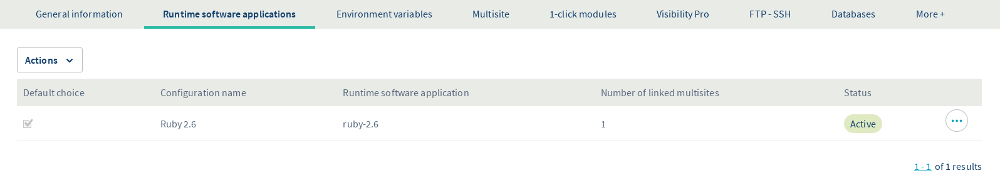
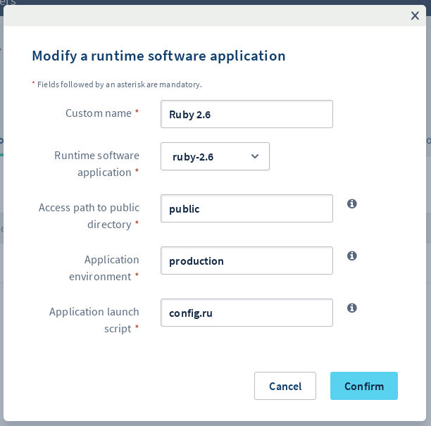
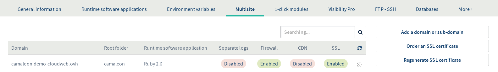
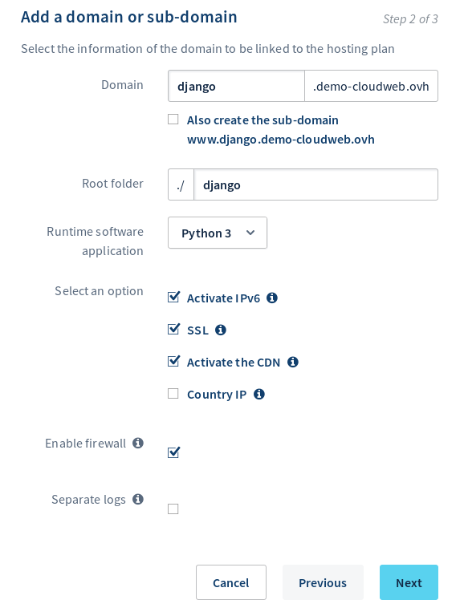
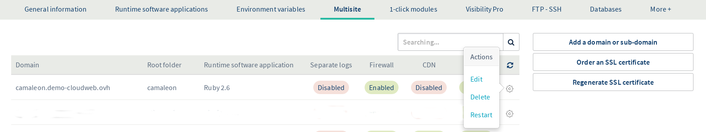

## Introduction

[Camaleon CMS](http://camaleon.tuzitio.com/){.external} est un système de gestion de contenu (Content System Management, CMS en anglais) écrit en Ruby, basé sur le framework web [Ruby on Rails](https://rubyonrails.org/){.external}. L’[hébergement Cloud Web OVH](https://www.ovh.com/fr/hebergement-web/cloud-web.xml) permet d’utiliser Ruby comme moteur d’exécution pour vos sites web et donc d’y installer et héberger Camaleon CMS ou toute autre application web conçue en Ruby. Dans ce tutoriel, nous allons installer un site web avec Camaleon CMS sur un hébergement Cloud Web d’OVH et le mettre à disposition derrière votre nom de domaine.


## Prérequis

### Ce que vous devez savoir

*   Connaître les bases de l’écosystème Ruby.
*   Se connecter enSSH.
*   Éditer un fichier en ligne de commande via Vim, Emacs ou Nano parexemple.

### Ce que vous devez avoir

*   Disposer d’un [hébergement Cloud WebOVH](https://www.ovh.com/fr/hebergement-web/cloud-web.xml).
*   Être connecté à votre [espace client OVH](https://www.ovh.com/auth/?action=gotomanager), partie `Web`.


## En pratique

### Étape 1 : activer Ruby comme moteur d’exécution

Pour accéder aux moteurs d’exécution de votre hébergement Cloud Web, connectez-vous à votre [espace client OVH](https://www.ovh.com/auth/?action=gotomanager). Cliquez sur `Hébergements` dans la barre de services à gauche, puis choisissez le nom de l’hébergement Cloud Web concerné. Positionnez-vous enfin sur l’onglet `Moteurs d'exécution`. 

Le tableau qui apparaît affiche les moteurs d’exécution ajoutés actuellement. Assurez-vous alors que le moteur d’exécution Ruby est bien activé. Si tel est le cas, poursuivez vers l’étape 2  *Associer Ruby à un multisite* 

{.thumbnail} 

Si ce n’est pas le cas, ajoutez-en un nouveau (si votre offre vous le permet) ou modifiez le moteur d’exécutionexistant.

*   **Si vous souhaitez ajouter un moteur** : cliquez sur `Actions` au-dessus du tableau, puis sur `Ajouter un moteur d'exécution`.
*   **Si vous souhaitez modifier un moteur** : cliquez sur le bouton `...` à droite du moteur concerné, puis sur `Modifier`.

Dans la fenêtre qui s’affiche, complétez les informations demandées avec les valeurs suivantes de notre exemple ou adaptez-les à votre situationpersonnelle.

| Information                                  | Valeur  renseigner            |
|----------------------------------------------|-------------------------------|
|  Nom personnalisé                            |    Ruby 2.6                   |
|  Moteur d'exécution                          |    ruby-2.6                   |
|  Chemin d'accès au répertoire public         |    public                     |
|  Environnement de l'application              |    production                 |
|  Script de lancement de l'application        |    config.ru                  |


Une fois les informations complétées, cliquez sur `Valider`. Si vous souhaitez obtenir plus d’informations sur la gestion des moteurs d’exécution, reportez-vous à notre guide *[Gérer les moteurs d’exécution de Cloud Web](../gerer-moteurs-execution-runtime-cloud-web/)*. 

{.thumbnail} 


### Étape 2 : associer Ruby à unmultisite

Maintenant que Ruby est activé en tant que moteur d’exécution, vous devez l’associer à l’un de vos multisites. Pour cela, positionnez-vous sur l’onglet `Multisite`. Le tableau qui s’affiche contient tous les noms de domaine qui ont été ajoutés en tant que multisite. 

{.thumbnail} 

Deux colonnes doivent retenir votre attention dans le tableau ci-dessus. Vérifiez alors que le moteur d’exécution Ruby est bien lié aux domaines concernés et que le dossier racine est correct. Aidez-vous des informations ci-dessous si nécessaire. Si tel est le cas, poursuivez vers l’étape 3 *Se connecter à votre Cloud Web via SSH*.

| Colonne                     | Description                                                                  |
|-----------------------------|------------------------------------------------------------------------------|
| Dossier racine              | Il s'agit du dossier racine qui devra contenir le code source du domaine concerné (il correspond au « DocumentRoot »). Dans notre exemple, nous choisissons de spécifier « camaleon ». Celui-ci devra donc contenir notre code source Ruby. |
| Moteur d'exécution          | Il s'agit du moteur d'exécution associé au domaine concerné. Le nom qui s’affiche correspond au *Nom personnalisé* que vous avez défini lors de la création du moteur d'exécution. Dans notre exemple, vous devriez retrouver *Ruby 2.6*.  |


Si ce n’est pas le cas, ajoutez un nouveau multisite ou modifiez celui existant.

*   **Si vous souhaitez ajouter un multisite** : cliquez sur `Ajouter un domaine ou sous-domaine` à droite dutableau.
*   **Si vous souhaitez modifier un multisite** : cliquez sur le bouton en forme de roue dentée à droite du nom de domaine concerné, puis sur `Modifier`.

Dans la fenêtre qui s’affiche, complétez les informations demandées selon votre situation personnelle. Le tableau ci-dessous montre celles utilisées pour cetutoriel.


| Information                | Valeur utilisée en exemple pour ce tutoriel            |
|----------------------------|--------------------------------------------------------|
| Domaine                    |  `camaleon.demo-cloudweb.ovh`                          |
| Dossier racine             |  `camaleon`                                            |
| Moteur d'exécution         |  Ruby 2.6                                              |


En ce qui concerne les options supplémentaires, choisissez celles que vous souhaitez activer. Une fois les informations complétées, cliquez sur `Suivant`, puis finalisez la manipulation. Cet ajout peut prendre jusqu’à une heure. Cependant, la modification de la configuration DNS peut prendre jusqu’à 24 heures avant d’être pleinement effective. Si vous souhaitez obtenir plus d’informations sur la gestion des multisites, reportez-vous à notre guide « [Partager son hébergement entre plusieurs sites](https://docs.ovh.com/fr/hosting/multisites-configurer-un-multisite-sur-mon-hebergement-web/) ». 

{.thumbnail} 


### Étape 3 : se connecter à votre Cloud Web via SSH

Récupérez d’abord les informations vous permettant de vous connecter. Pour cela, positionnez-vous sur l’onglet `FTP - SSH`. Si celui-ci n’apparaît pas dans la liste, appuyez au préalable sur le bouton représentant trois barres. Les informations liées à votre espace de stockage apparaissent alors. Repérez celles mentionnées à côté des élémentssuivants :

- Accès SSH au cluster 

  L'élément qui apparaît vous permet de récupérer deux informations : 
  
  - **l'adresse de serveur** : elle débute après `ssh://` et se termine avant les `:`
  - **le port de connexion** : le numéro est mentionné après les `:`
  
  On pourrait par exemple retrouver : `ssh://sshcloud.cluster024.hosting.ovh.net:12345`, donc `sshcloud.cluster024.hosting.ovh.net` en adresse de serveur et `12345` en port de connexion.

- Login SSH principal

  Il s'agit de l'identifiant SSH principal créé sur votre hébergement.

Si vous ne connaissez plus le mot de passe de l’utilisateur SSH, cliquez sur le bouton `...` à droite de l’utilisateur concerné dans le tableau, puis sur `Changer le mot de passe`. 

{.thumbnail} 

À présent, pour vous connecter en SSH, vous devez utiliser un terminal. Cet outil est installé par défaut sur macOS ou Linux. Un environnement Windows nécessitera l’installation d’un logiciel comme PuTTY ou l’ajout de la fonctionnalité « OpenSSH ». Cette démarche étant spécifique au système d’exploitation que vous utilisez, nous ne pouvons pas la détailler dans cettedocumentation. 

Voici l’exemple d’une ligne de commande que vous pouvez utiliser. Remplacez les éléments « sshlogin », « sshserver » et « connectionport » par ceux adaptés à votre situation personnelle. Une fois la commande envoyée, vous serez invité à renseigner le mot de passe de l’utilisateur SSH.

```
ssh sshlogin@sshserver -p connectionport
````

### Étape 4 : préparer l'environnement Ruby

Nous allons maintenant préparer l'environnement Ruby nécessaire pour héberger notre application Camaleon CMS. Depuis la connexion SSH ouverte sur votre Cloud Web, définissez les variables d'environnement PATH et GEM\_HOME

```bash
democld@cloudweb-ssh:~ $ export PATH=$PATH:/usr/local/ruby2.6/bin:~/.gem/ruby/2.6.0/bin
democld@cloudweb-ssh:~ $ export GEM_HOME=~/.gem/ruby/2.6.0
```

Vous pouvez persister ces changements en ajoutant les exports dans le fichier `~/.profile` :

```bash
democld@cloudweb-ssh:~ $ echo 'export PATH=$PATH:/usr/local/ruby2.6/bin:~/.gem/ruby/2.6.0/bin' >> ~/.profile
democld@cloudweb-ssh:~ $ echo 'export GEM_HOME=~/.gem/ruby/2.6.0' >> ~/.profile
```

Installez le framework Ruby on Rails

```bash
democld@cloudweb-ssh:~ $ gem install rails --user --no-doc
Fetching thread_safe-0.3.6.gem
Fetching rack-test-1.1.0.gem
Fetching mini_portile2-2.4.0.gem
...
Successfully installed sprockets-3.7.2
Successfully installed sprockets-rails-3.2.1
Successfully installed rails-5.2.3
37 gems installed
democld@cloudweb-ssh:~ $ rails -v
Rails 5.2.3
```

Vous pouvez maintenant vous placer dans le dossier "`camaleon`" et créer votre projet :

```bash
democld@cloudweb-ssh:~ $ cd camaleon/
democld@cloudweb-ssh:~/camaleon $ rm -f config.ru
democld@cloudweb-ssh:~/camaleon $ RAILS_ENV=production rails new .
exist 
create  README.md
create  Rakefile
identical  .ruby-version
create  config.ru
create  .gitignore
create  Gemfile
run  git init from "."
...
run  bundle exec spring binstub --all
* bin/rake: Spring inserted
* bin/rails: Spring inserted
```


### Étape 5 : Installer et configurer Camaleon CMS

Modification du Gemfile pour installer Camaleon CMS ( source : [https://github.com/owen2345/camaleon-cms](https://github.com/owen2345/camaleon-cms){.external} )

```bash
democld@cloudweb-ssh:~/camaleon $ echo 'gem "camaleon_cms",  ">= 2.4.6"' >> Gemfile
democld@cloudweb-ssh:~/camaleon $ echo 'gem "draper", "~> 3"' >> Gemfile
```

Installation des prérequis et des dépendances

```bash
democld@cloudweb-ssh:~/camaleon $ bundle install
Fetching gem metadata from https://rubygems.org/.........
Fetching gem metadata from https://rubygems.org/.
Resolving dependencies.....
Using rake 12.3.2
Using concurrent-ruby 1.1.5
...
Using uglifier 4.1.20
Using web-console 3.7.0
Bundle complete! 20 Gemfile dependencies, 103 gems now installed.
Use bundle info [gemname] to see where a bundled gem is installed.
```
  
Camaleon CMS utilise execjs qui nécessite un moteur d'exécution JS. Nous allons utiliser NodeJS 8 comme moteur d'exécution JS

```bash
democld@cloudweb-ssh:~/camaleon $ sed -i 's@\["nodejs", "node"\],@["/usr/local/nodejs8/bin/node"],@' ${GEM_HOME}/gems/execjs-2.7.0/lib/execjs/runtimes.rb
```


Installation de Camaleon CMS (pour la démo on utilisera une base de données SQLite)

```bash
democld@cloudweb-ssh:~/camaleon $ RAILS_ENV=production rails generate camaleon_cms:install
rails generate camaleon_cms:install
Running via Spring preloader in process 12603
create  config/system.json
create  lib/plugin_routes.rb
exist  app/apps
create  app/apps/themes/readme.txt
exist  app/apps/themes
...
create  app/apps/themes/new/views/post_type.html.erb
create  app/apps/themes/new/views/search.html.erb
append  Gemfile
democld@cloudweb-ssh:~/camaleon $ RAILS_ENV=production rake camaleon_cms:generate_migrations
Copied migration 20190625130636_create_active_storage_tables.active_storage.rb from active_storage
Copied migration 20190625130637_create_db_structure.cama_contact_form_engine.rb from cama_contact_form_engine
Copied migration 20190625130638_post_table_into_utf8.camaleon_cms_engine.rb from camaleon_cms_engine
Copied migration 20190625130639_rename_column_posts.camaleon_cms_engine.rb from camaleon_cms_engine
Copied migration 20190625130640_add_confirm_token_to_users.camaleon_cms_engine.rb from camaleon_cms_engine
Copied migration 20190625130641_add_feature_to_posts.camaleon_cms_engine.rb from camaleon_cms_engine
Copied migration 20190625130642_move_first_name_of_users.camaleon_cms_engine.rb from camaleon_cms_engine
Copied migration 20190625130643_improve_menus_structure.camaleon_cms_engine.rb from camaleon_cms_engine
Copied migration 20190625130644_add_group_to_custom_field_values.camaleon_cms_engine.rb from camaleon_cms_engine
Copied migration 20190625130645_install_migrated_seo_plugin.camaleon_cms_engine.rb from camaleon_cms_engine
Copied migration 20190625130646_drop_user_relationship_table.camaleon_cms_engine.rb from camaleon_cms_engine
Copied migration 20190625130647_create_media.camaleon_cms_engine.rb from camaleon_cms_engine
Copied migration 20190625130648_adjust_field_length.camaleon_cms_engine.rb from camaleon_cms_engine
democld@cloudweb-ssh:~/camaleon $ RAILS_ENV=production rake db:migrate
== 20190625130636 CreateActiveStorageTables: migrating ========================
-- create_table(:active_storage_blobs)
-> 0.0076s
-- create_table(:active_storage_attachments)
-> 0.0170s
...
-- change_column("cama_term_taxonomy", :name, :text, {})
-> 0.1065s
== 20190625130648 AdjustFieldLength: migrated (0.2999s) =======================
democld@cloudweb-ssh:~/camaleon $ RAILS_ENV=production rake assets:precompile
```


### Étape 6 : redémarrer le *daemon* Ruby

Pour redémarrer le *daemon* Ruby, retournez sur votre [espace client OVH](https://www.ovh.com/auth/?action=gotomanager). Positionnez-vous sur l’onglet `Multisite`, cliquez à droite du nom de domaine concerné sur le bouton représentant une roue dentée, puis sur `Redémarrer`. 

Une fois ceci fait, l’application sera accessible via le nom de domaine choisi dans la configuration de votremultisite. 

{.thumbnail} 

Félicitation, votre site utilisant Camaleon CMS est maintenant disponible ! Il ne vous reste plus qu'à le configurer.  


### Étape 7 : utiliserHTTPS

Pour plus de sécurité sur votre site, vous pouvez mettre en place une redirection automatique HTTP vers HTTPS. Pour ce faire, toujours positionné dans le dossier `camaleon`, créez un fichier `.htaccess` avec le contenu suivant:

```
RewriteEngine On
RewriteCond %{ENV:HTTPS} !on
RewriteRule (.*) https://%{HTTP_HOST}%{REQUEST_URI} [R=301,L]
```


## Conclusion

Nous avons vu comment installer une application Ruby sur un hébergement Cloud Web en respectant les différentes étapes. Il ne vous reste plus qu’à utiliser Camaleon CMS et y publier vos premiers contenus! Vous trouverez plus de documentation propre à Camaleon CMS et ses fonctionnalités sur la [documentation officielle du projet](http://camaleon.tuzitio.com/){.external}.