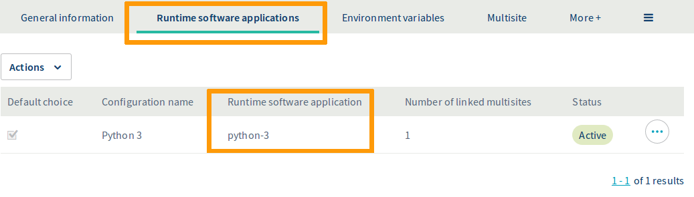
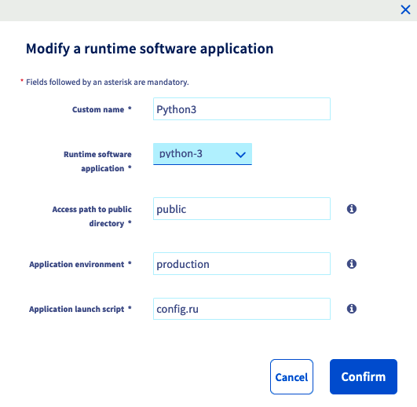
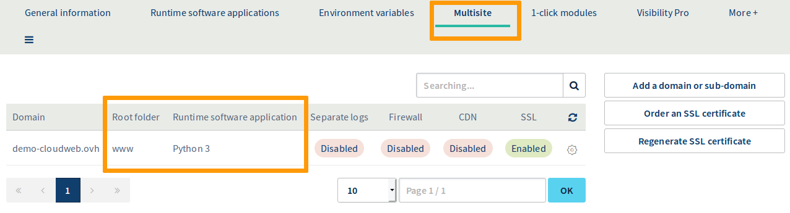
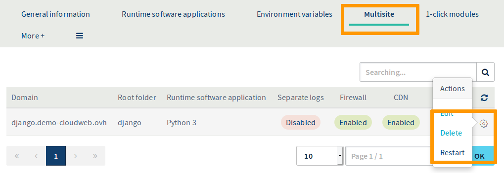

## Introduction

Django CMS est un système de gestion de contenu (CMS) écrit en Python et basé sur le framework web Django.

L’[hébergement Cloud Web d'OVH](https://www.ovh.com/fr/hebergement-web/cloud-web.xml) permet d’utiliser Python comme moteur d’exécution pour vos sites web. Vous pouvez donc y installer et héberger Django CMS, ainsi que toute autre application web conçue dans ce langage.

À travers ce tutoriel, nous allons installer un site web avec Django CMS sur un hébergement Cloud Web d’OVH. Puis nous le mettrons à disposition derrière votre nom de domaine.

## Prérequis

### Ce que vous devez savoir

*     Connaître les bases de l’écosystème Python.
*     Avoir la capacité de se connecter en SSH.
*     Savoir éditer un fichier en ligne de commande, via Vim, Emacs ou Nano par exemple.

### Ce que vous devez avoir

*     Disposer d’un [hébergement Cloud Web d'OVH](https://www.ovh.com/fr/hebergement-web/cloud-web.xml).
*     Être connecté à votre [espace client](https://www.ovh.com/auth/?action=gotomanager), partie Web.

## En pratique

### Étape 1 : activez Python comme moteur d’exécution

Pour accéder aux moteurs d’exécution de votre hébergement Cloud Web, connectez-vous à votre [espace client OVH](https://www.ovh.com/auth/?action=gotomanager). Cliquez sur `Hébergements`{.action} dans la barre de services à gauche, puis choisissez le nom de l’hébergement Cloud Web concerné. Positionnez-vous enfin sur l’onglet `Moteurs d'exécution`{.action}.

Le tableau qui apparaît affiche les moteurs d’exécution ajoutés actuellement. Assurez-vous alors que le moteur d’exécution Python est bien activé. Si tel est le cas, poursuivez vers l’étape 2 : [« Associez Python à un multisite »](./#etape-2-associez-python-a-un-multisite).

{.thumbnail}

Si ce n’est pas le cas, ajoutez-en un nouveau (si votre offre vous le permet) ou modifiez le moteur d’exécution existant.

*     **Si vous souhaitez ajouter un moteur** : cliquez sur `Actions`{.action} au-dessus du tableau, puis sur `Ajouter un moteur d'exécution`{.action}.
*     **Si vous souhaitez modifier un moteur** : cliquez sur le bouton `...`{.action} à droite du moteur concerné, puis sur `Modifier`{.action}.

Dans la fenêtre qui s’affiche, complétez les informations demandées avec les valeurs suivantes de notre exemple ou adaptez-les à votre situation.

|  Information  |  Valeur à renseigner  |
|  :-----          |  :-----          |
|  Nom personnalisé |  Python 3 |
|  Moteur d'exécution |  python-3 |
|  Chemin d'accès au répertoire public |  public |
|  Environnement de l'application |  production |
|  Script de lancement de l'application |  server.py |

Une fois les informations complétées, cliquez sur `Valider`{.action}. Si vous souhaitez obtenir plus d’informations sur la gestion des moteurs d’exécution, reportez-vous à notre guide [« Gérer les moteurs d’exécution de Cloud Web »](https://docs.ovh.com/fr/cloud-web/gerer-moteurs-execution-runtime-cloud-web/).

{.thumbnail}

### Étape 2 : associez Python à un multisite

Maintenant que Python est activé en tant que moteur d’exécution, vous devez l’associer à l’un de vos multisites. Pour cela, positionnez-vous sur l’onglet `Multisite`{.action}. Le tableau qui s’affiche contient tous les noms de domaine qui ont été ajoutés en tant que multisite.

{.thumbnail}

Deux colonnes doivent retenir votre attention dans le tableau ci-dessus. Vérifiez alors que le moteur d’exécution Python est bien lié aux domaines concernés et que le dossier racine est correct ; aidez-vous des informations ci-dessous si nécessaire. Si tel est le cas, poursuivez vers l’étape 3 : [« Connectez-vous à votre Cloud Web via SSH »](./#etape-3-se-connecter-a-votre-cloud-web-via-ssh).

|  Colonne  |  Description  |
|  :-----          |  :-----          |
|  Dossier racine |  Il s'agit du dossier racine qui devra contenir le code source du domaine concerné (il correspond au « DocumentRoot »). Dans notre exemple, nous choisissons de spécifier « django ». Celui-ci devra donc contenir notre code source Python. |
|  Moteur d'exécution |  Il s'agit du moteur d'exécution associé au domaine concerné. Le nom qui s’affiche correspond au « Nom personnalisé » que vous avez défini lors de la création du moteur d'exécution. Dans notre exemple, vous devriez retrouver « Python 3 ». |

Si ce n’est pas le cas, ajoutez un nouveau multisite ou modifiez celui existant.

*     **Si vous souhaitez ajouter un multisite** : cliquez sur `Ajouter un domaine ou sous-domaine`{.action} à droite du tableau.
*     **Si vous souhaitez modifier un multisite** : cliquez sur le bouton en forme de roue dentée à droite du nom de domaine concerné, puis sur `Modifier`{.action}.

Dans la fenêtre qui s’affiche, complétez les informations demandées selon votre situation personnelle. Le tableau ci-dessous montre celles utilisées pour ce tutoriel.

|  Information  |  Valeur utilisée en exemple pour ce tutoriel  |
|  :-----          |  :-----          |
|  Domaine |  django.demo-cloudweb.ovh |
|  Dossier racine |  django |
|  Moteur d'exécution |  Python 3 |

En ce qui concerne les options supplémentaires, choisissez celles que vous souhaitez activer. Une fois les informations complétées, cliquez sur `Suivant`{.action}, puis finalisez la manipulation. Cet ajout peut prendre jusqu’à une heure. Cependant, la modification de la configuration DNS nécessite jusqu’à 24 heures avant d’être pleinement effective. Si vous désirez obtenir plus d’informations sur la gestion des multisites, reportez-vous à notre guide [« Partager son hébergement entre plusieurs sites »](https://docs.ovh.com/fr/hosting/multisites-configurer-un-multisite-sur-mon-hebergement-web/).

{.thumbnail}

### Étape 3 : connectez-vous à votre Cloud Web via SSH

Récupérez d’abord les informations vous permettant de vous connecter. Pour cela, positionnez-vous sur l’onglet `FTP - SSH`{.action}. Si celui-ci n’apparaît pas dans la liste, appuyez au préalable sur le bouton représentant trois barres. Les informations liées à votre espace de stockage s'affichent alors. Repérez celles mentionnées à côté des éléments suivants :

|  Éléments  |  Description  |
|  :-----          |  :-----          |
|  Accès SSH au cluster |  L'élément qui apparaît vous permet de récupérer deux informations : l'adresse de serveur (elle débute après « ssh:// » et se termine avant les « : ») et le port de connexion (le numéro est mentionné après les « : »). Nous pourrions par exemple retrouver : _ssh://sshcloud.cluster024.hosting.ovh.net:12345/_, donc « _sshcloud.cluster024.hosting.ovh.net_ » en adresse de serveur et « 12345 » en port de connexion. |
|  Login SSH principal |  Il s'agit de l'identifiant SSH principal créé sur votre hébergement. |

Si vous ne connaissez plus le mot de passe de l’utilisateur SSH, cliquez sur le bouton `...`{.action} à droite de l’utilisateur concerné dans le tableau, puis sur `Changer le mot de passe`{.action}.

{.thumbnail}

À présent, pour vous connecter en SSH, vous devez utiliser un terminal. Cet outil est installé par défaut sur macOS ou Linux. Un environnement Windows nécessitera l’installation d’un logiciel comme PuTTY ou l’ajout de la fonctionnalité « OpenSSH ». Cette démarche étant spécifique au système d’exploitation que vous utilisez, nous ne pouvons pas la détailler dans cette documentation.

Voici l’exemple d’une ligne de commande que vous pouvez utiliser. Remplacez les éléments « sshlogin », « sshserver » et « connectionport » par ceux adaptés à votre situation personnelle. Une fois la commande envoyée, vous serez invité à renseigner le mot de passe de l’utilisateur SSH.

```sh
ssh sshlogin@sshserver -p connectionport
```

### Étape 4 : préparez l'environnement Python

Nous allons maintenant préparer l'environnement Python nécessaire pour héberger notre application Django CMS. Le but est d'isoler les fichiers Python ainsi que les dépendances de notre application du reste des fichiers et librairies Python présents sur le système. Dans l'écosystème Python cette isolation est simple à mettre en place grâce à l'utilitaire `virtualenv`.

Depuis la connexion SSH ouverte sur votre Cloud Web, installez virtualenv via pip (il s'agit du gestionnaire de paquets le plus répandu pour le langage Python) :

```sh
democld@cloudweb-ssh:~ $ pip3 install --user virtualenv
Collecting virtualenv
  Downloading https://files.pythonhosted.org/packages/4f/ba/6f9315180501d5ac3e707f19fcb1764c26cc6a9a31af05778f7c2383eadb/virtualenv-16.5.0-py2.py3-none-any.whl (2.0MB)
    100% |################################| 2.0MB 164kB/s
Installing collected packages: virtualenv
Successfully installed virtualenv-16.5.0
```
Modifiez la variable d'environnement PATH pour y ajouter la commande « virtualenv » fraîchement installée :

```sh
democld@cloudweb-ssh:~ $ export PATH=$PATH:~/.local/bin
democld@cloudweb-ssh:~ $ virtualenv --version
16.5.0
```
Vous avez la possibilité de faire persister ce changement dans votre « PATH », en ajoutant l’export dans le fichier « ~/.profile » :

```sh
democld@cloudweb-ssh:~ $ echo "export PATH=$PATH:~/.local/bin" >> ~/.profile
```
Vous pouvez maintenant vous placer dans le dossier « django » et créer un _virtualenv_, que nous nommerons « venv » pour ce tutoriel.

```sh
democld@cloudweb-ssh:~ $ cd django/
 
democld@cloudweb-ssh:~/django $ virtualenv venv
Using base prefix '/usr'
New python executable in /home/democld/django/venv/bin/python3
Not overwriting existing python script /azehome/democld/django/venv/bin/python (you must use /home/democld/django/venv/bin/python3)
Installing setuptools, pip, wheel...
done.
```

Maintenant que votre _virtualenv_ est en place, vous pouvez y accéder via la commande « source < nom du virtualenv >bin/activate ». Une fois dans votre _virtualenv_, tous les paquets et librairies que vous installerez le seront uniquement ici.

Quand votre _virtualenv_ est activé, vous voyez dans votre terminal votre prompt précédé de « (venv) » (ou un autre nom, si vous en avez choisi un différent au moment de la création du _virtualenv_). Vous pouvez sortir de ce _virtualenv_ à tout moment, en utilisant la commande « deactivate ».
    
```sh
democld@cloudweb-ssh:~/django $ source venv/bin/activate
(venv) democld@cloudweb-ssh:~/django $
```
### Étape 5 : installez et configurez Django CMS
    
Django CMS met à disposition un utilitaire nommé « djangocms-installer » pour faciliter son installation. 

Toujours depuis votre _virtualenv_, installez cet utilitaire avec pip :

```sh
(venv) democld@cloudweb-ssh:~/django $ pip install djangocms-installer
Collecting djangocms-installer
  Downloading https://files.pythonhosted.org/packages/b9/32/882c86fd8efe8c1bb802f04a8ed649e8b74ff77a83f4201b37073c6d9b8f/djangocms_installer-1.1.0-py2.py3-none-any.whl (55kB)
     |################################| 61kB 4.2MB/s
Collecting six (from djangocms-installer)
  Downloading https://files.pythonhosted.org/packages/73/fb/00a976f728d0d1fecfe898238ce23f502a721c0ac0ecfedb80e0d88c64e9/six-1.12.0-py2.py3-none-any.whl
Collecting dj-database-url>=0.4 (from djangocms-installer)
  Downloading https://files.pythonhosted.org/packages/d4/a6/4b8578c1848690d0c307c7c0596af2077536c9ef2a04d42b00fabaa7e49d/dj_database_url-0.5.0-py2.py3-none-any.whl
Requirement already satisfied: pip in ./venv/lib/python3.5/site-packages (from djangocms-installer) (19.1)
Collecting tzlocal (from djangocms-installer)
  Downloading https://files.pythonhosted.org/packages/cb/89/e3687d3ed99bc882793f82634e9824e62499fdfdc4b1ae39e211c5b05017/tzlocal-1.5.1.tar.gz
Collecting pytz (from tzlocal->djangocms-installer)
  Downloading https://files.pythonhosted.org/packages/3d/73/fe30c2daaaa0713420d0382b16fbb761409f532c56bdcc514bf7b6262bb6/pytz-2019.1-py2.py3-none-any.whl (510kB)
     |################################| 512kB 1.4MB/s
Building wheels for collected packages: tzlocal
  Building wheel for tzlocal (setup.py) ... done
  Stored in directory: /home/democld/.cache/pip/wheels/15/ae/df/a67bf1ed84e9bf230187d36d8dcfd30072bea0236cb059ed91
Successfully built tzlocal
Installing collected packages: six, dj-database-url, pytz, tzlocal, djangocms-installer
Successfully installed dj-database-url-0.5.0 djangocms-installer-1.1.0 pytz-2019.1 six-1.12.0 tzlocal-1.5.1
 
(venv) democld@cloudweb-ssh:~/django $ which djangocms
/home/democld/django/venv/bin/djangocms
```
    
Maintenant que cet utilitaire est installé, nous allons l'utiliser pour créer notre application Django CMS. Toujours depuis votre _virtualenv_ et placé dans le répertoire racine de votre site (django dans ce tutoriel), lancez la commande suivante :
    
```sh
djangocms -f -p . mysite -s
```

Voici des informations concernant la signification des options (vous pouvez retrouver toutes les options disponibles via la commande « djangocms --help ») :

*     -f : installe et configure les plugins « django-filer » ;
*     -p . : utilise le dossier courant comme dossier parent de notre nouveau projet Django CMS ;
*     mysite : nom de votre nouveau projet ;
*     -s : ne pas vérifier si le dossier courant est vide.

```sh
(venv) democld@cloudweb-ssh:~/django $ djangocms -f -p . mysite -s
Creating the project
Please wait while I install dependencies
If I am stuck for a long time, please check for connectivity / PyPi issues
Dependencies installed
Creating the project
Operations to perform:
  Apply all migrations: admin, auth, cms, contenttypes, djangocms_column, djangocms_file, djangocms_googlemap, djangocms_link, djangocms_picture, djangocms_snippet, djangocms_style, djangocms_text_ckeditor, djangocms_video, easy_thumbnails, filer, menus, sessions, sites
Running migrations:
  Applying contenttypes.0001_initial... OK
  Applying auth.0001_initial... OK
  Applying admin.0001_initial... OK
  .....
  Applying sites.0002_alter_domain_unique... OK
Creating admin user
All done!
Get into "/home/democld/django" directory and type "python manage.py runserver" to start your project
 
(venv) democld@cloudweb-ssh:~/django $ ls -l
total 778
drwxr-xr-x 2 democld democld      3 Apr 30 16:21 __pycache__
-rwxr-xr-x 1 democld democld    804 May  7 10:54 manage.py
drwxr-xr-x 2 democld democld      2 May  7 10:54 media
drwxr-xr-x 5 democld democld      9 May  7 10:54 mysite
-rw-r--r-- 1 democld democld 741376 May  7 10:55 project.db
drwxr-xr-x 2 democld democld      2 Apr 30 15:09 public
-rw-r--r-- 1 democld democld    451 May  7 10:55 requirements.txt
lrwxrwxrwx 1 democld democld     21 Apr 30 16:20 server.py -> /usr/share/ovh/app.py
drwxr-xr-x 2 democld democld      2 May  7 10:54 static
drwxr-xr-x 4 democld democld      4 May  6 11:33 venv
```

### Étape 6 : faites le lien entre Django CMS et le moteur d'exécution de votre Cloud Web

Django CMS est désormais installé sur votre Cloud Web.

Le fichier « manage.py » a été créé automatiquement lors de cette opération. Modifiez-le avec le contenu suivant :
    
```sh
(venv) democld@cloudweb-ssh:~/django $ cat /dev/null > manage.py
 
(venv) democld@cloudweb-ssh:~/django $ vim manage.py
import sys, os
 
cwd = os.getcwd()
INTERP = cwd+'/venv/bin/python'
if sys.executable != INTERP: os.execl(INTERP, INTERP, *sys.argv)
  
sys.path.append(cwd)
sys.path.append(cwd + '/venv')
  
sys.path.insert(0,cwd+'/venv/bin')
sys.path.insert(0,cwd+'/venv/lib/python3.5/site-packages')
  
os.environ['DJANGO_SETTINGS_MODULE'] = "mysite.settings"
from django.core.wsgi import get_wsgi_application
application = get_wsgi_application()
```

Lors de la configuration du moteur d’exécution Python (voir l'étape 1), nous avons défini le script de lancement de notre application comme étant « server.py ». Hors Django CMS utilise un fichier nommé « manage.py ». Pour faire le lien entre Django CMS et votre moteur d'exécution, créez donc un lien symbolique entre « server.py » et « manage.py » :
    
```sh
(venv) democld@cloudweb-ssh:~/django $ ln -fs manage.py server.py
(venv) democld@cloudweb-ssh:~/django $ ls -l
total 778
drwxr-xr-x 2 democld democld      3 Apr 30 16:21 __pycache__
-rwxr-xr-x 1 democld democld    804 May  7 10:54 manage.py
drwxr-xr-x 2 democld democld      2 May  7 10:54 media
drwxr-xr-x 5 democld democld      9 May  7 10:54 mysite
-rw-r--r-- 1 democld democld 741376 May  7 10:55 project.db
drwxr-xr-x 2 democld democld      2 Apr 30 15:09 public
-rw-r--r-- 1 democld democld    451 May  7 10:55 requirements.txt
lrwxrwxrwx 1 democld democld      9 May  7 11:32 server.py -> manage.py
drwxr-xr-x 2 democld democld      2 May  7 10:54 static
drwxr-xr-x 4 democld democld      4 May  6 11:33 venv
```

Modifiez le fichier « mysite/settings.py » avec la commande suivante, en remplaçant « django.demo-cloudweb.ovh » par l'adresse de votre multisite (configuré lors de l'étape 2) :

```sh
(venv) democld@cloudweb-ssh:~/django $ sed -i "s/ALLOWED_HOSTS = \[\]/ALLOWED_HOSTS = ['django.demo-cloudweb.ovh']/" mysite/settings.py
```
    
### Étape 7 : redémarrez le _daemon_ Python

Pour redémarrer le _daemon_ Python, retournez dans votre [espace client OVH](https://www.ovh.com/auth/?action=gotomanager). Positionnez-vous sur l’onglet `Multisite`{.action}, cliquez à droite du nom de domaine concerné sur le bouton représentant une roue dentée, puis choisissez `Redémarrer`{.action}.

Une fois ceci fait, l’application sera accessible via le nom de domaine choisi dans la configuration de votre multisite.
    
{.thumbnail}
    
Félicitations, votre site utilisant Django CMS est maintenant disponible ! Un compte administrateur a été créé par défaut, avec pour login/password « admin »/« admin ». Pensez à changer ce mot de passe.
    
{.thumbnail}
    
### Étape 8 : utilisez HTTPS

Pour plus de sécurité sur votre site, vous pouvez mettre en place une redirection automatique HTTP vers HTTPS. Pour ce faire, toujours positionné dans le dossier django, créez un fichier .htaccess avec le contenu suivant :

```sh
RewriteEngine On
RewriteCond %{ENV:HTTPS} !on
RewriteRule (.*) https://%{HTTP_HOST}%{REQUEST_URI} [R=301,L]
```

### Conclusion

Nous avons vu comment installer une application Python sur un hébergement Cloud Web, en respectant les différentes étapes. Il ne vous reste plus qu’à utiliser Django CMS et à y publier vos premiers contenus !

Vous trouverez plus d'informations sur Django CMS et ses fonctionnalités dans la [documentation officielle du projet](http://docs.django-cms.org/en/latest/).
