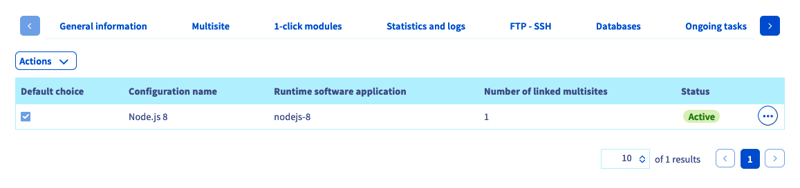
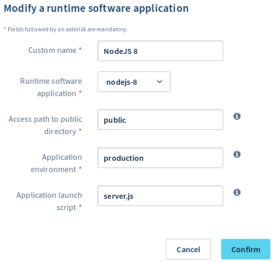
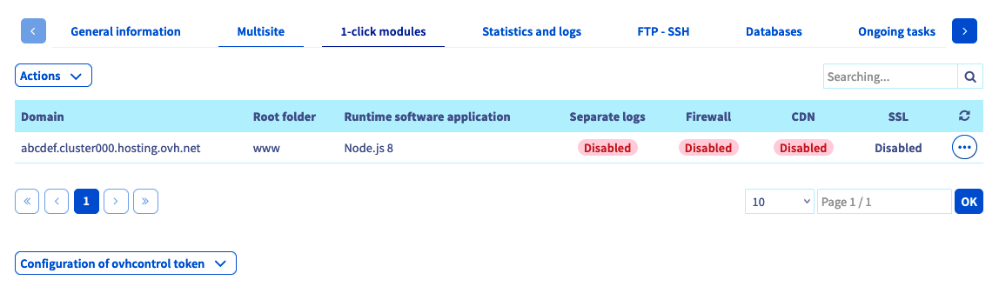
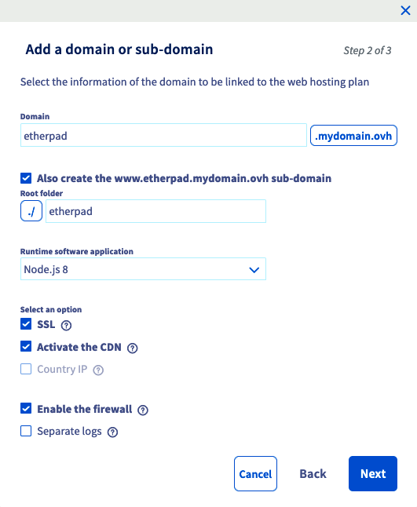
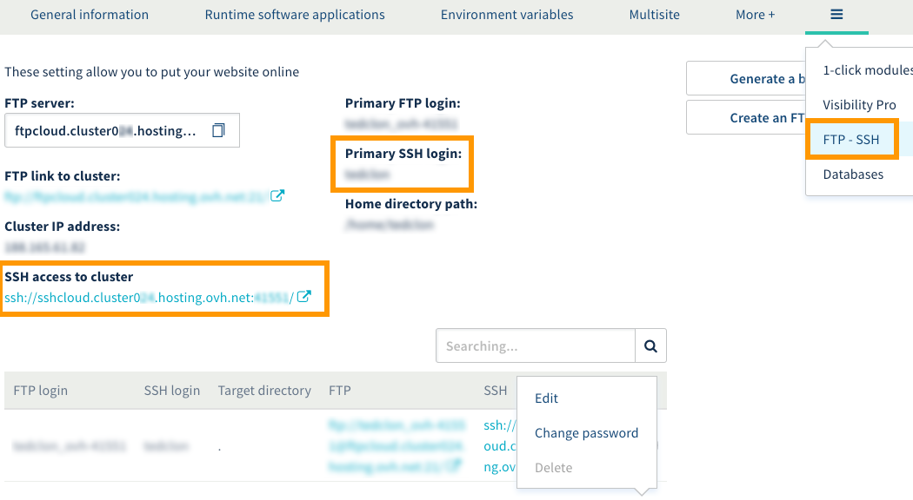
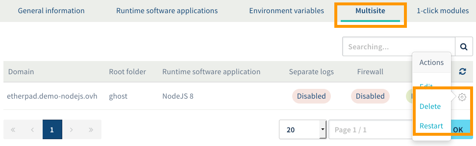

## Introduction

[Etherpad](https://etherpad.org/){.external} est un éditeur de texte en ligne collaboratif en temps réel. Il permet à plusieurs personnes d'écrire simultanément des fichiers texte via une interface web. Etherpad est écrit en JavaScript et utilise Node.js, une plateforme logicielle permettant de créer vos sites et API en JavaScript côté serveur.

L'[hébergement Cloud Web OVH]({ovh_www}/hebergement-web/cloud-web.xml){.external} vous permet d'utiliser Node.js comme moteur d'exécution pour vos sites web, et donc d'y installer Etherpad ou toute autre application conçue pour Node.js.

**Dans ce tutoriel, nous allons installer un serveur Etherpad sur un hébergement Cloud Web d'OVH et le mettre à disposition derrière votre nom de domaine.**

## Prérequis

### Ce que vous devez savoir

- Connaître les bases de l'écosystème Node.js.
- Se connecter en SSH.

### Ce que vous devez avoir

- Disposer d'un [hébergement Cloud Web OVH]({ovh_www}/hebergement-web/cloud-web.xml){.external}.
- Avoir activé Node.js comme moteur d'exécution.
- Avoir ajouté le nom de domaine concerné en tant que multisite et avoir défini Node.js comme étant son moteur d'exécution.
- Être connecté à votre [espace client OVH](https://ca.ovh.com/auth/?action=gotomanager){.external}, partie `Web`{.action}.

## En pratique

### Étape 1 : activer Node.js comme moteur d'exécution

Pour accéder aux moteurs d'exécution de votre hébergement Cloud Web, connectez-vous à votre [espace client OVH](https://ca.ovh.com/auth/?action=gotomanager){.external}. Cliquez sur `Hébergements`{.action} dans la barre de services à gauche, puis choisissez le nom de l'hébergement Cloud Web concerné. Positionnez-vous enfin sur l'onglet `Moteurs d'exécution`{.action}.

Le tableau qui apparaît affiche les moteurs d’exécution ajoutés actuellement. Assurez-vous alors que le moteur d'exécution Node.js est bien activé. Si tel est le cas, poursuivez vers l'étape 2 « [Associer Node.js à un multisite](./#etape-2-associer-nodejs-a-un-multisite) ».

{.thumbnail}

Si ce n'est pas le cas, ajoutez-en un nouveau, si votre offre vous le permet, ou modifiez le moteur d'exécution existant.

- **Si vous souhaitez ajouter un moteur** : cliquez sur `Actions`{.action} au-dessus du tableau, puis sur `Ajouter un moteur d'exécution`{.action}.
- **Si vous souhaitez modifier un moteur** : cliquez sur le bouton `...`{.action} à droite du moteur concerné, puis sur `Modifier`{.action}.

Dans la fenêtre qui s'affiche, complétez les informations demandées avec les valeurs suivantes de notre exemple ou adaptez-les à votre situation personnelle :

|Information|Valeur à renseigner| 
|---|---| 
|Nom personnalisé|NodeJS 8|
|Moteur d'exécution|nodejs-8|
|Chemin d'accès au répertoire public|public|
|Environnement de l'application|production|
|Script de lancement de l'application|server.js|

Une fois les informations complétées, cliquez sur `Valider`{.action}. Si vous souhaitez obtenir plus d'informations sur la gestion des moteurs d'exécution, reportez-vous à notre guide « [Gérer les moteurs d’exécution de Cloud Web](../gerer-moteurs-execution-runtime-cloud-web/){.external} ».

{.thumbnail}

### Étape 2 : associer Node.js à un multisite

Maintenant que Node.js est activé en tant que moteur d'exécution, vous devez l'associer à l'un de vos multisites. Pour cela, positionnez-vous sur l'onglet `Multisite`{.action}. Le tableau qui s’affiche contient tous les noms de domaine qui ont été ajoutés en tant que multisite. Deux colonnes doivent retenir votre attention.

|Colonne|Description| 
|---|---| 
|Dossier racine|Il s'agit du dossier racine qui devra contenir le code source du domaine concerné et correspond au « DocumentRoot ». Dans notre exemple, nous choisissons de spécifier « etherpad ». Celui-ci devra donc contenir notre code source Node.js.|
|Moteur d'exécution|Il s'agit du moteur d'exécution associé au nom de domaine concerné. Le nom qui s’affiche correspond au « Nom personnalisé » que vous avez défini lors de la création du moteur d'exécution. Dans notre exemple, vous devriez retrouver « NodeJS 8 ».|

Dans le tableau, vérifiez que le moteur d'exécution Node.js est bien lié aux domaines concernés et que le dossier racine est correct. Si tel est le cas, poursuivez vers l'étape 3 « [Se connecter à votre Cloud Web via SSH](./#etape-3-se-connecter-a-cotre-cloud-web-via-ssh) ».

{.thumbnail}

Si ce n'est pas le cas, ajoutez un nouveau multisite ou modifiez celui existant.

- **Si vous souhaitez ajouter un multisite** : cliquez sur `Ajouter un domaine ou sous-domaine`{.action} à droite du tableau.
- **Si vous souhaitez modifier un multisite** : cliquez sur le bouton en forme de roue dentée à droite du domaine concerné, puis sur `Modifier`{.action}.

Dans la fenêtre qui s'affiche, complétez les informations demandées selon votre situation personnelle. Voici celles que nous avons utilisées pour ce tutoriel :

|Information|Valeur utilisée en exemple pour ce tutoriel| 
|---|---| 
|Nom de domaine|etherpad.demo-nodejs.ovh|
|Dossier racine|etherpad|
|Moteur d'exécution|NodeJS 8|

En ce qui concerne les options supplémentaires, choisissez celles que vous souhaitez activer. Une fois les informations complétées, cliquez sur `Suivant`{.action}, puis finalisez la manipulation. Cet ajout peut prendre jusqu’à une heure. Cependant, la modification de la configuration DNS peut prendre jusqu'à 24 heures avant d’être pleinement effective. Si vous souhaitez obtenir plus d'informations sur la gestion des multisites, reportez-vous à notre guide « [Partager son hébergement entre plusieurs sites](../../multisites-configurer-un-multisite-sur-mon-hebergement-web/){.external} ».

{.thumbnail}

### Étape 3 : se connecter à votre Cloud Web via SSH

Commencez en  récupérant les informations vous permettant de vous connecter. Pour cela, positionnez-vous sur l'onglet `FTP - SSH`{.action}. Si celui-ci n'apparaît pas dans la liste, appuyez au préalable sur le bouton représentant trois barres. Les informations liées à votre espace de stockage apparaissent alors. Repérez celles mentionnées à côté des éléments suivants :

|Éléments|Description| 
|---|---| 
|Accès SSH au cluster|L'élément qui apparaît vous permet de récupérer deux informations : <br>**- l'adresse de serveur** : elle débute après « ssh:// » et se termine avant les « : » ;<br> **- le port de connexion** : le numéro est mentionné après les « : ». <br><br>On pourrait par exemple retrouver : ssh://`sshcloud.cluster024.hosting.ovh.net`:`12345`/, donc « sshcloud.cluster024.hosting.ovh.net » en adresse de serveur et « 12345 » en port de connexion.|
|Login SSH principal|Il s'agit de l'identifiant SSH principal créé sur votre hébergement.|

Si vous ne connaissez plus le mot de passe de l'utilisateur SSH, cliquez sur le bouton `...`{.action} à droite de l'utilisateur concerné dans le tableau, puis sur `Changer le mot de passe`{.action}.

{.thumbnail}

À présent, pour vous connecter en SSH, vous devez utiliser un terminal. Cet outil est installé par défaut sur macOS ou Linux. Un environnement Windows nécessitera l’installation d’un logiciel comme PuTTY ou l’ajout de la fonctionnalité « OpenSSH ». Cette démarche étant spécifique au système d’exploitation que vous utilisez, nous ne pouvons pas la détailler dans cette documentation.

Voici l'exemple d'une ligne de commande que vous pouvez utiliser. Remplacez les éléments « sshlogin », « sshserver » et « connectionport » par ceux adaptés à votre situation personnelle. Une fois la commande envoyée, vous serez invité à renseigner le mot de passe de l’utilisateur SSH.

```sh
ssh sshlogin@sshserver -p connectionport
```

### Étape 4 : installer Etherpad

Commencez en vous plaçant dans le dossier racine que vous avez spécifié [lors de l'étape 2](./#etape-2-associer-nodejs-a-un-multisite). Dans notre tutoriel, il s'agit du répertoire « etherpad ». Vous pourrez alors y récupérer le code de l'application.

```sh
demonon@cloudweb-ssh:~ $ cd etherpad/
demonon@cloudweb-ssh:~/etherpad $ git init
demonon@cloudweb-ssh:~/etherpad $ git remote add origin https://github.com/ether/etherpad-lite.git
demonon@cloudweb-ssh:~/etherpad $ git pull origin master
remote: Enumerating objects: 29763, done.
remote: Total 29763 (delta 0), reused 0 (delta 0), pack-reused 29763
Receiving objects: 100% (29763/29763), 9.80 MiB | 6.34 MiB/s, done.
Resolving deltas: 100% (21100/21100), done.
From https://github.com/ether/etherpad-lite
 * branch            master     -> FETCH_HEAD
 * [new branch]      master     -> origin/master
```

Installez alors les dépendances d'Etherpad :

```sh
demonon@cloudweb-ssh:~/etherpad [master]$ export PATH=$PATH:/usr/local/nodejs8/bin  
demonon@cloudweb-ssh:~/etherpad [master]$ bash bin/installDeps.sh
 
Copy the settings template to settings.json...
Ensure that all dependencies are up to date...  If this is the first time you have run Etherpad please be patient.
...
> wd@1.10.3 install /home/demonon/etherpad/src/node_modules/wd
> node scripts/build-browser-scripts
  
added 1094 packages in 34.97s
Ensure jQuery is downloaded and up to date...
Clearing minified cache...
Ensure custom css/js files are created...
```

Pour Etherpad, l'installation des dépendances est effectuée par un script Bash. De manière générale, pour les applications Node.js, l'installation de ces dépendances se fera via la commande « npm-node8 install ».

La configuration réalisée en Node.js s'attend à trouver un fichier « server.js » dans le dossier racine de votre multisite (que vous avez paramétré [lors de l'étape 1](./#etape-1-activer-nodejs-comme-moteur-dexecution)). Nous allons alors créer un lien symbolique permettant de faire pointer « server.js » vers le fichier du même nom d'Eteherpad.

```sh
demonon@cloudweb-ssh:~/etherpad [master]$ ln -fs node_modules/ep_etherpad-lite/node/server.js server.js
```

### Étape 5 : redémarrer le *daemon* Node.js

Pour redémarrer le *daemon* Node.js, retournez sur votre [espace client OVH](https://ca.ovh.com/auth/?action=gotomanager){.external}. Positionnez-vous sur l'onglet `Multisite`{.action}, cliquez à droite du nom de domaine concerné sur le bouton représentant une roue dentée, puis sur `Redémarrer`{.action}

Une fois ceci fait, l'application sera accessible via le nom de domaine choisi dans la configuration de votre multisite.

{.thumbnail}

## Conclusion

Nous avons vu comment installer une application Node.js sur un hébergement Cloud Web en respectant les différentes étapes. Il ne vous reste plus qu'à utiliser Etherpad et à collaborer tous ensemble ! 