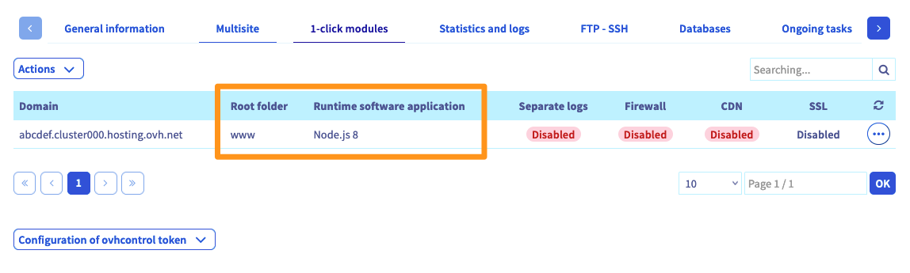
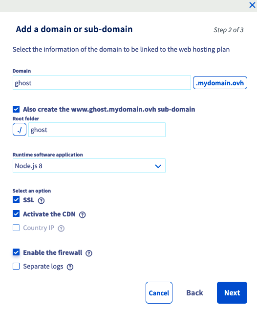
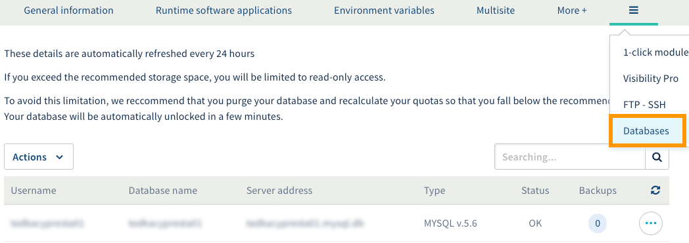
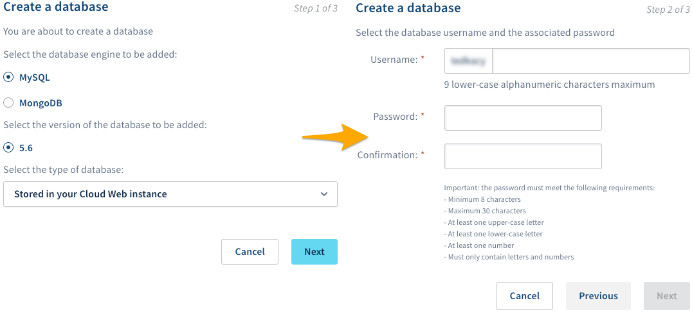
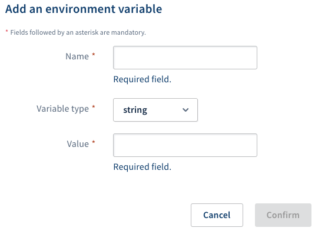
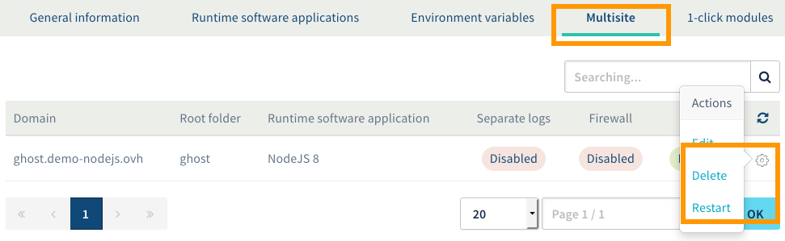

## Introducción

[Ghost](https://ghost.org/){.external} es un gestor de contenidos open source destinado a blogueros o periodistas que simplifica el proceso de publicación en internet. El programa está escrito en JavaScript y utiliza [Node.js](https://nodejs.org/){.external}, un entorno de ejecución que permite crear sitios web y API en JavaScript del lado del servidor.

En el [hosting Cloud Web de OVH]({ovh_www}/hosting/cloud-web.xml){.external}, es posible elegir Node.js como motor de ejecución de sitios web y, por lo tanto, permite instalar y alojar Ghost o cualquier otra aplicación diseñada para Node.js.

Este tutorial explica cómo instalar un blog con Ghost en un hosting Cloud Web de OVH y cómo publicarlo para que se pueda acceder a él a través de un dominio.

## Requisitos

### Conocimientos necesarios

- Estar familiarizado con el ecosistema Node.js.
- Conectarse por SSH.
- Editar un archivo en línea de comandos con Vim, Emacs o Nano, por ejemplo.

### Hardware y software necesarios

- Tener contratado un plan de [hosting Cloud Web]({ovh_www}/hosting/cloud-web.xml){.external} de OVH.
- Haber activado Node.js como motor de ejecución.
- Haber añadido el dominio correspondiente como multisitio y haber establecido Node.js como motor de ejecución.
- Estar conectado al [área de cliente de OVH](https://www.ovh.com/auth/?action=gotomanager){.external}, en la sección `Web`{.action}.

## Procedimiento

### 1. Activar el motor de ejecución Node.js

Para ver los motores de ejecución de su hosting Cloud Web, conéctese al [área de cliente de OVH](https://www.ovh.com/auth/?action=gotomanager){.external}, haga clic en `Alojamientos`{.action} en la columna izquierda y seleccione el alojamiento Cloud Web correspondiente. A continuación, abra la pestaña `Motores de ejecución`{.action}.

Se mostrará una tabla con los motores de ejecución que haya añadido hasta ese momento. Asegúrese de que el motor de ejecución Node.js esté activado. Si lo está, vaya al apartado [2. Asociar Node.js a un multisitio](./#2-asociar-nodejs-a-un-multisitio).

{.thumbnail}

De lo contrario, añada un nuevo motor de ejecución (si su plan lo permite) o modifique el motor existente.

- **Si quiere añadir un motor de ejecución**, haga clic en el botón `Acciones`{.action} situado sobre la tabla y seleccione `Añadir un motor de ejecución`{.action}.
- **Si quiere modificar un motor de ejecución**, haga clic en el botón `···`{.action} situado al final de la línea correspondiente al motor y seleccione `Editar`{.action}.

En la nueva ventana, cumplimente los campos con los valores que indicamos a continuación o adaptados a su caso particular.

|Elemento|Valor que debe introducir| 
|---|---| 
|Nombre personalizado|NodeJS 8|
|Motor de ejecución|nodejs-8|
|Ruta de acceso al directorio público|public|
|Entorno de la aplicación|production|
|Script de ejecución de la aplicación|server.js|

Una vez que haya introducido toda la información, haga clic en `Aceptar`{.action}. Para más información sobre los motores de ejecución, consulte nuestra guía [Gestionar los motores de ejecución en un hosting Cloud Web](../gestionar-motores-ejecucion-hosting-cloud-web/){.external}.

{.thumbnail}

### 2. Asociar Node.js a un multisitio

Ahora que Node.js está activado como motor de ejecución, ya puede asociarlo a un multisitio. Para ello, abra la pestaña `Multisitio`{.action}. Se mostrará una tabla que contiene todos los dominios añadidos como multisitio. 

{.thumbnail}

Preste especial atención a las columnas de la tabla que indican la carpeta raíz y el motor de ejecución, y compruebe que, para el dominio en cuestión, la carpeta sea la correcta y el motor de ejecución sea Node.js. Si necesita ayuda, a continuación explicamos estos valores en mayor profundidad. Si todo es correcto, vaya directamente al apartado [3. Crear una base de datos MySQL](./#3-crear-una-base-de-datos-mysql).

|Columna|Descripción| 
|---|---| 
|Carpeta raíz|Es la carpeta que contendrá el código fuente del dominio (corresponde al *DocumentRoot*). En nuestro ejemplo, vamos a indicar «**ghost**». Por lo tanto, esa será la carpeta en la que deberemos colocar el código fuente Node.js.|
|Motor de ejecución|Se trata del motor de ejecución asociado al dominio. El nombre que aparece corresponde al «Nombre personalizado» que haya indicado al crear el motor de ejecución. En nuestro ejemplo, es «**NodeJS 8**».|

Si los datos que figuran en la tabla no son correctos, añada un nuevo multisitio o modifique el existente.

- **Si quiere añadir un multisitio**, haga clic en el botón `Añadir un dominio o subdominio`{.action} situado a la derecha de la tabla.
- **Si quiere editar el multisitio**, haga clic en el icono con forma de rueda dentada situado al final de la línea correspondiente al dominio y seleccione `Editar`{.action}.

En la nueva ventana, cumplimente los campos según su caso particular. La siguiente tabla muestra los valores utilizados en este tutorial:

|Elemento|Valor utilizado en este tutorial| 
|---|---| 
|Dominio|ghost.demo-nodejs.ovh|
|Carpeta raíz|ghost|
|Motor de ejecución|NodeJS 8|

Active las opciones que desee. Una vez que haya introducido toda la información, haga clic en `Siguiente`{.action} y acepte. El dominio puede tardar un máximo de una hora en añadirse. Sin embargo, la modificación de la configuración DNS puede tardar hasta 24 horas en ser efectiva. Para más información sobre la gestión de multisitios, consulte nuestra guía [Alojar varios sitios web en un mismo hosting](../../hosting/configurar-un-multisitio-en-un-alojamiento-web/){.external}.

{.thumbnail}

### 3. Crear una base de datos MySQL

Abra la pestaña `Bases de datos`{.action} (si no puede verla, haga clic en el botón con tres rayas). La tabla muestra las bases de datos creadas en su alojamiento hasta ese momento. Existen dos formas de crear una nueva base de datos:

- **Si todavía no ha creado ninguna base de datos**, haga clic en el botón `Crear una base de datos`{.action}.
- **Si ya ha creado alguna base de datos**, haga clic en el botón `Acciones`{.action} situado sobre la tabla y seleccione `Crear una base de datos`{.action}.

{.thumbnail}

En la nueva ventana, seleccione «**MySQL**» y elija la versión (para este tutorial, hemos elegido la versión **5.6**). A continuación, seleccione «**Almacenada en la instancia Cloud Web**» y haga clic en `Siguiente`{.action}.

Indique un nombre de usuario y una contraseña. Haga clic en `Siguiente`{.action} y confirme haciendo clic en `Aceptar`{.action}. La base de datos tardará unos minutos en crearse.

{.thumbnail}

### 4. Crear las variables de entorno

Aunque no es obligatorio crear variables de entorno, sí es altamente recomendable. 

En este tutorial vamos a crear variables de entorno para los datos de conexión a nuestra base de datos MySQL. De este modo, si esos datos cambian (por ejemplo, si cambia la contraseña), solo tendrá que modificar el valor de la variable desde el área de cliente, sin necesidad de editar el código fuente.

Para ello, abra la pestaña `Variables de entorno`{.action}. La tabla muestra las variables que haya creado hasta ese momento. Para añadir una nueva, haga clic en el botón `Acciones`{.action} situado sobre la tabla y seleccione `Añadir una variable de entorno`{.action}.

{.thumbnail}

En la nueva ventana, introduzca la información solicitada en función de su caso particular y, a continuación, haga clic en el botón `Aceptar`{.action} para crear la variable. Estas son las variables que hemos creado en este tutorial:

|Nombre|Tipo de variable|Valor| 
|---|---|---|
|database\__connection__host|string|Dirección del servidor MySQL|
|database\__connection__user|string|Nombre de usuario MySQL indicado al crear la base de datos|
|database\__connection__database|string|Nombre de la base de datos MySQL|
|database\__connection__password|password|Contraseña MySQL indicada al crear la base de datos|
|database__client|string|mysql|
|server__port|integer|80|
|server__host|string|0.0.0.0|

{.thumbnail}

### 5. Conectarse al hosting Cloud Web por SSH

Para conectarse al hosting Cloud Web, necesitará los datos de conexión. Para obtenerlos, abra la pestaña `FTP - SSH`{.action} (si no puede verla, haga clic en el botón con tres rayas). Se mostrará la información relativa a su espacio de almacenamiento. Consulte los siguientes elementos:

|Elemento|Descripción| 
|---|---| 
|Acceso SSH al cluster|Este enlace le permite conocer dos datos: <br>**- la dirección del servidor**: empieza después de la doble barra (//) y termina antes de los dos puntos (:);<br> **- el puerto de conexión**: número que aparece tras los dos puntos (:). <br><br>Por ejemplo, en `ssh://sshcloud.cluster024.hosting.ovh.net:12345/`, «sshcloud.cluster024.hosting.ovh.net» sería la dirección y «12345», el puerto de conexión.|
|Usuario SSH principal|Usuario SSH principal creado en el alojamiento.|

Si ha olvidado la contraseña del usuario SSH, haga clic en el botón `···`{.action} situado al final de la línea correspondiente y seleccione `Cambiar la contraseña`{.action}.

{.thumbnail}

Para conectarse por SSH, es necesario tener un terminal. En MacOS y Linux, esta herramienta está instalada por defecto. Si tiene Windows, deberá instalar un programa como PuTTY o añadir la funcionalidad OpenSSH. Esta operación depende del sistema operativo que utilice, por lo que no podemos detallar todos los casos en este tutorial.

No obstante, a continuación ofrecemos un ejemplo de comando que puede utilizar (no olvide sustituir «sshlogin», «sshserver» y «connectionport» por el valor correspondiente). Después de ejecutar el comando, el sistema le pedirá que introduzca la contraseña del usuario SSH.

```sh
ssh sshlogin@sshserver -p connectionport
```

Una vez que se haya conectado, puede comprobar que aparezcan las variables de entorno [anteriormente creadas](./#4-crear-las-variables-de-entorno). Si ha seguido nuestro tutorial, encontrará:

```sh
demonon@cloudweb-ssh:~ $ env | grep "database_"
database__client=mysql
database__connection__host=demononghost.mysql.db
database__connection__user=demononghost
database__connection__password=ZuperZecure123
database__connection__database=demononghost
```

### 6. Instalar Ghost

En primer lugar, sitúese en la carpeta raíz que haya indicado en el [apartado 2](./##2-asociar-nodejs-a-un-multisitio) de este tutorial. En nuestro caso, se trata del directorio «**ghost**».

```sh
demonon@cloudweb-ssh:~ $ ls -l
drwxr-xr-x 3 demonon demonon 4 Mar  6 16:53 ghost
drwx---r-x 3 demonon demonon 5 Mar  6 16:48 www
demonon@cloudweb-ssh:~ $ cd ghost/
demonon@cloudweb-ssh:~/ghost $
```

Descargue la [última versión de Ghost](https://ghost.org/docs/){.external} y descomprima el contenido.

```sh
demonon@cloudweb-ssh:~/ghost $ ls
public  server.js
demonon@cloudweb-ssh:~/ghost $ curl -s -LO https://github.com/TryGhost/Ghost/releases/download/2.16.4/Ghost-2.16.4.zip
demonon@cloudweb-ssh:~/ghost $ unzip Ghost-2.16.4.zip
Archive:  Ghost-2.16.4.zip
   creating: content/
   creating: content/adapters/
  inflating: content/adapters/README.md 
   creating: content/apps/
  inflating: content/apps/README.md 
  ....
demonon@cloudweb-ssh:~/ghost $ rm Ghost-2.16.4.zip
demonon@cloudweb-ssh:~/ghost $ ls
Gruntfile.js  LICENSE  MigratorConfig.js  PRIVACY.md  README.md  content  core  index.js  package.json  public  server.js  yarn.lock
```

Ghost utiliza [Yarn](https://yarnpkg.com/es-ES/){.external}, una alternativa a npm, para gestionar las dependencias de Node.js. Instale Yarn a través de npm y añada estos binarios a su `PATH`:

```sh
demonon@cloudweb-ssh:~/ghost $ npm-node8 install yarn
npm notice created a lockfile as package-lock.json. You should commit this file.
+ yarn@1.13.0
added 1 package and audited 1 package in 2.893s
found 0 vulnerabilities
 
demonon@cloudweb-ssh:~/ghost $ export PATH=$PATH:/usr/local/nodejs8/bin/:~/ghost/node_modules/.bin/
demonon@cloudweb-ssh:~/ghost $ node --version
v8.15.0
demonon@cloudweb-ssh:~/ghost $ yarn --version
1.13.0
```

Puede hacer que los cambios en su `PATH` sean persistentes añadiendo la exportación al archivo **~/.profile**:

```sh
demonon@cloudweb-ssh:~ $ echo "export PATH=$PATH:/usr/local/nodejs8/bin/:~/ghost/node_modules/.bin/" >> ~/.profile
```

A continuación, instale las dependencias de Ghost utilizando Yarn:

```sh
demonon@cloudweb-ssh:~/ghost $ yarn install
yarn install v1.13.0
[1/5] Validating package.json...
[2/5] Resolving packages...
[3/5] Fetching packages...
[4/5] Linking dependencies...
[5/5] Building fresh packages...
success Saved lockfile.
Done in 269.89s.
```

Estando situado en el directorio **~/ghost**, cree un archivo **config.production.json** que contendrá la configuración de Ghost:

```json
{
    "url": "http://ghost.demo-nodejs.ovh",
    "paths": {
        "contentPath": "content/"
    }
}
```

A continuación, haga que el archivo **server.js** (indicado en el [apartado 1 de este tutorial](./#1-activar-el-motor-de-ejecucion-nodejs)) apunte hacia el archivo **index.js** de Ghost:

```sh
demonon@cloudweb-ssh:~/ghost $ unlink  server.js
demonon@cloudweb-ssh:~/ghost $ ln -s index.js server.js
```

Ya hemos terminado de instalar y configurar Ghost. Solo queda reiniciar el demonio Node.js para que se apliquen los cambios realizados en el archivo **~/ghost**.

### 7. Reiniciar el demonio Node.js

Para reiniciar el demonio Node.js, vuelva al [área de cliente de OVH](https://www.ovh.com/auth/?action=gotomanager){.external}. Abra la pestaña `Multisitio`{.action}, haga clic en el icono con forma de rueda dentada situado al final de la línea correspondiente al dominio y seleccione `Reiniciar`{.action}.

A continuación, la aplicación estará accesible desde el dominio indicado en la configuración del multisitio.

{.thumbnail}

### 8. Utilizar HTTPS

Para que su sitio web sea más seguro, puede configurar una redirección HTTP hacia HTTPS. Para ello, estando situado en el directorio **ghost**, cree un archivo **.htaccess** con el siguiente contenido:

```
RewriteCond %{ENV:HTTPS} !on
RewriteRule (.*) https://%{HTTP_HOST}%{REQUEST_URI} [L,R=301]
```

## Conclusiones

En este tutorial hemos explicado cómo instalar una aplicación Node.js en un hosting Cloud Web. ¡Ya puede empezar a utilizar Ghost y publicar en él sus primeros contenidos!