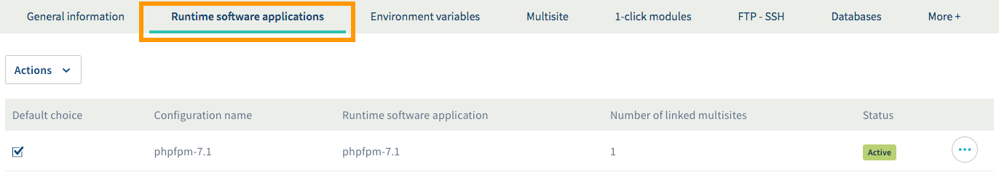
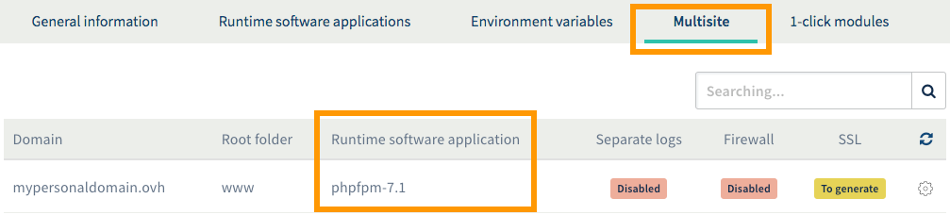
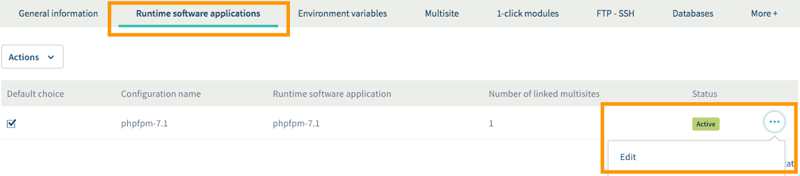
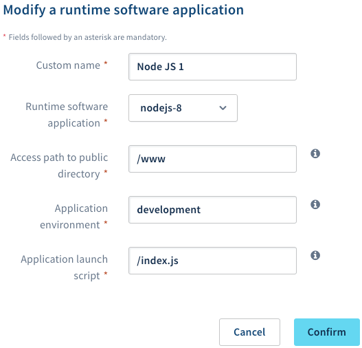
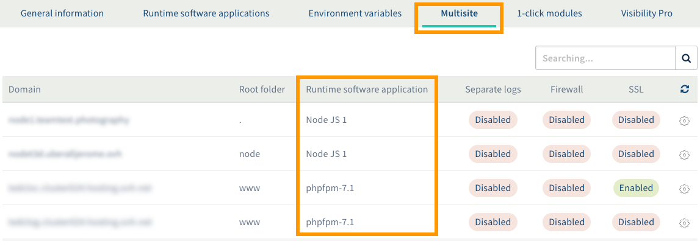
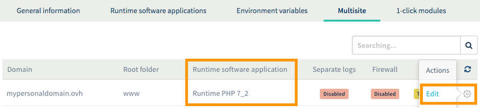
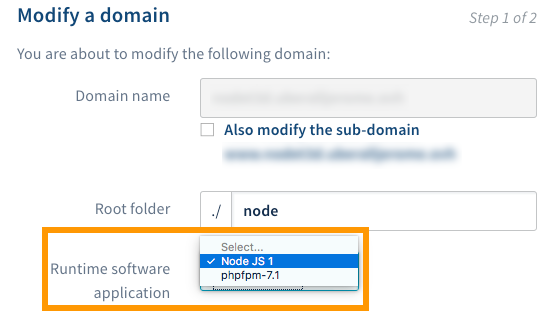

**Last updated 31st January 2019**

## Objective

With Cloud Web, you can choose from a range of different coding languages to build your project. To complete your project successfully, you may need to use a particular runtime software application.

**Find out how to manage runtime software applications in a Cloud Web hosting plan.**

## Requirements

- a [Cloud Web hosting plan](https://www.ovh.co.uk/web-hosting/cloud-web.xml)
- access to the `Web`{.action} section of the [OVH Control Panel](https://www.ovh.com/auth/?action=gotomanager)

## Instructions

With Cloud Web, you can pick from one or more runtime software applications that are best adapted to your project. The runtime software application you choose will depend on the kind of project you want to set up. 

So if you have not done so yet,** please ensure that your project is compatible with your Cloud Web hosting plan**. The available coding languages are listed here: <https://www.ovh.co.uk/web-hosting/cloud-web.xml>. 

Once you have defined the exact runtime software applications you will use, you can start following the steps below.

### Step 1: Access the runtime software application management interface.

To access your Cloud Web hosting plan’s runtime software applications, log in to the [OVH Control Panel](https://www.ovh.com/auth/?action=gotomanager){.external}. Click `Web hosting`{.action} in the services bar on the left-hand side, then choose the name of the Cloud Web hosting plan concerned. Next, go to the `Runtime software applications`{.action} tab.

The table that appears will list the runtime software applications currently added to your Cloud Web hosting plan. Please note that a runtime software application will be created automatically when you set up your Web Hosting plan.

{.thumbnail}

### Step 2: Manage runtime software applications.

There are several different ways you can manage the runtime software applications on your Cloud Web hosting plan:

- [add or modify a runtime software application](./#21-add-or-modify-a-runtime-software-application){.external} (the maximum number of runtime software applications will vary depending on the plan you have selected)
- define a runtime software application as a default choice
- delete a runtime software application

#### 2.1 Add or modify a runtime software application.

> [!primary]
>
> Before you modify a runtime software application, please ensure that any websites or applications using it will not become unavailable as a result. You can view the number of multisites based on your runtime software application using the `Number of linked multisites` column. In the `Multisite`{.action} tab, you can also view the runtime software application used for each domain looking at the table's `Runtime software` column.
> 

To add or modify a runtime software application, go to the `Runtime software application`{.action} tab of the Cloud Web hosting plan concerned. Then:

- **if you want to add a runtime software application**, click `Actions`{.action} above the table, then `Add a runtime software application`{.action}
- **if you want to modify a runtime software application**, click on the `...`{.action} button to the right of the application concerned, then `Edit`{.action}.

{.thumbnail}

Enter the information requested in the pop-up window. Follow the remaining steps according to the runtime software application you have selected:

- [PHP](./#php){.external}
- [Node.js](./#nodejs){.external}

##### PHP

|Information|Description| 
|---|---| 
|Custom name|Enter a name that will distinguish this runtime software application from any other environments in the OVH Control Panel.|  
|Runtime software application|Choose the new runtime software application you want.|  

Once you have entered this information, click `Confirm`{.action}. Please ensure that this runtime software application is definitely used by the multisites you want. To do this, continue to step three: "[Link the runtime software application to a multisite](./#step-3-link-the-runtime-environment-to-a-multisite_2){.external} ".

{.thumbnail}

##### Node.js

|Information|Description| 
|---|---| 
|Custom name|Enter a name that will distinguish this runtime software application from any other environments in the OVH Control Panel.|
|Runtime software application|Choose the new runtime software application you want.|
|Access path to public directory|Specify the directory in which static content will be hosted (the runtime software application will not run this content).|
|Application environment|Specify whether it is a "production", "test" or "development" environment. Please keep in mind that development environments behave differently from production and test environments, displaying errors directly in the web interface.|
|Application launch script|Name the script that will call the Node.js technology.|

Once you have entered this information, click `Confirm`{.action}. Please ensure that this runtime software application is definitely used by the multisites you want. To do this, continue to step three: "[Link the runtime software application to a multisite](./#step-3-link-the-runtime-environment-to-a-multisite_2){.external} ".

{.thumbnail}

### Step 3: Link the runtime software application to a multisite.

Once you have the runtime software applications you need for your project, make sure they are linked to your multisites. To do this, go to the `Multisite`{.action} tab of the Cloud Web hosting plan concerned. 

In the table, check if the displayed runtime software application is correct for the domains concerned in the Runtime software column. The names displayed correspond to the "custom name" you have defined.

{.thumbnail}

If you want to modify a runtime software application associated with a multisite, click on the cogwheel icon to the right of the domain concerned, and click `Edit`{.action}.

{.thumbnail}

Then select the environment next to `Runtime software application` in the pop-up window. As a reminder, the names displayed correspond to the "custom name" you have defined. The website or application accessible from the domain concerned must be compatible with the runtime software application you have chosen. 

Once you have selected it, follow the remaining steps.

{.thumbnail}

## Go further

Join our community of users on <https://community.ovh.com/en/>.