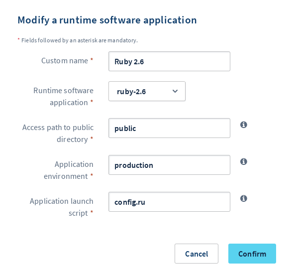

**Dernière mise à jour le 23/01/2020**

## Objectif

Cloud Web met à disposition de multiples langages de développement pour construire votre projet. En effet, pour mener celui-ci à son terme, vous devrez peut-être utiliser un moteur d'exécution plutôt qu'un autre.

**Apprenez à gérer les moteurs d'exécution de votre hébergement Cloud Web.**

## Prérequis

- Disposer d'une offre d'hébergement [Cloud Web](https://www.ovh.com/fr/hebergement-web/cloud-web.xml).
- Être connecté à votre [espace client OVHcloud](https://www.ovh.com/auth/?action=gotomanager), partie `Web`{.action}.

## En pratique

Afin de s'adapter au mieux à votre projet, Cloud Web vous permet de disposer d'un ou de plusieurs moteurs d'exécution. L'utilisation de l'un plutôt qu'un autre dépend alors de ce que vous souhaitez mettre en place. 

Ainsi, si ce n'est pas encore fait, **assurez-vous de la compatibilité technique de votre projet avec votre hébergement Cloud Web**. Les langages sont listés à cette adresse : <https://www.ovh.com/fr/hebergement-web/cloud-web.xml>. 

Après avoir déterminé avec précision le ou les moteurs d'exécution à utiliser, vous pouvez débuter les manipulations décrites ci-dessous.

### Étape 1 : accéder à la gestion des moteurs d'exécution

Pour accéder aux moteurs d'exécution de votre hébergement Cloud Web, connectez-vous à votre [espace client OVHcloud](https://www.ovh.com/auth/?action=gotomanager){.external}. Cliquez sur `Hébergements`{.action} dans la barre de services à gauche, puis choisissez le nom de l'hébergement Cloud Web concerné. Positionnez-vous enfin sur l'onglet `Moteurs d'exécution`{.action}.

Le tableau qui apparaît affiche les moteurs d'exécution ajoutés actuellement à votre hébergement Cloud Web. À noter qu'un moteur a été automatiquement créé lors de l'installation de votre hébergement.

{.thumbnail}

### Étape 2 : gérer les moteurs d'exécution

La gestion des moteurs d'exécution de votre hébergement Cloud Web s'effectue de plusieurs manières :

- [ajouter ou modifier un moteur d'exécution](./#21-ajouter-ou-modifier-un-moteur-dexecution){.external} (le nombre maximum de moteurs dépend de l’[offre choisie](https://www.ovh.com/fr/hebergement-web/cloud-web.xml){.external}) ;
- définir un moteur en tant que choix par défaut ;
- supprimer un moteur d'exécution.

#### 2.1 Ajouter ou modifier un moteur d'exécution

> [!primary]
>
> Avant de modifier un moteur d'exécution, assurez-vous que cela ne rendra pas indisponible un site ou une application l'utilisant. Vous pouvez relever le nombre de multisites s'appuyant sur vos moteurs d'exécution grâce à la colonne `Nombre de multisites liés`. Dans l'onglet `Multisite`{.action}, vous avez également la possibilité de relever le moteur utilisé pour chaque domaine grâce à la colonne `Moteur d'exécution` du tableau.
> 

Pour ajouter ou modifier un moteur d'exécution, positionnez-vous sur l'onglet `Moteurs d'exécution`{.action} de l'hébergement Cloud Web concerné. Puis :

- **si vous souhaitez ajouter un moteur** : cliquez sur `Actions`{.action} au-dessus du tableau, puis sur `Ajouter un moteur d'exécution`{.action} ;
- **si vous souhaitez modifier un moteur** : cliquez sur le bouton `...`{.action} à droite du moteur concerné, puis sur `Modifier`{.action}.

{.thumbnail}

Dans la fenêtre qui s'affiche, complétez les informations demandées. Poursuivez selon le moteur sélectionné :

- [PHP](./#php){.external} 
- [Node.js](./#nodejs){.external}
- [Ruby](./#ruby){.external} 
- [Python](./#python){.external} 

##### **PHP**

|Information|Description| 
|---|---| 
|Nom personnalisé|Renseignez un nom vous permettant de reconnaître ce moteur parmi d'autres affichés dans votre espace client OVHcloud.|  
|Moteur d'exécution|Choisissez le nouveau moteur d'exécution souhaité.|  

Une fois les informations complétées, cliquez sur `Valider`{.action}. Assurez-vous maintenant que ce moteur d'exécution est bien utilisé par le ou les multisites souhaités. Pour cela, poursuivez vers l'étape 3 « [Associer le moteur d'exécution à un multisite](./#etape-3-associer-le-moteur-dexecution-a-un-multisite_2){.external} ».

{.thumbnail}

##### **Node.js**

|Information|Description| 
|---|---| 
|Nom personnalisé|Renseignez un nom vous permettant de reconnaître ce moteur parmi d'autres affichés dans votre espace client OVHcloud.|
|Moteur d'exécution|Choisissez le nouveau moteur d'exécution souhaité.|
|Chemin d'accès au répertoire public|Indiquez le répertoire dans lequel sera hébergé le contenu statique (le moteur n'exécutera pas ce contenu).|
|Environnement de l'application|Précisez s'il s'agit d'un environnement de « production », de « test » ou encore de « development ». À noter que ce dernier a un comportement différent des autres et affiche des erreurs directement dans l'interface web : utilisez-le en connaissance de cause.|
|Script de lancement de l'application|Nommez le script qui appellera la technologie Node.js.|

Une fois les informations complétées, cliquez sur `Valider`{.action}. Assurez-vous maintenant que ce moteur d'exécution est bien utilisé par le ou les multisites souhaités. Pour cela, poursuivez vers l'étape 3 « [Associer le moteur d'exécution à un multisite](./#etape-3-associer-le-moteur-dexecution-a-un-multisite_2){.external} ».

{.thumbnail}

##### **Ruby**

|Information|Description| 
|---|---| 
|Nom personnalisé|Renseignez un nom vous permettant de reconnaître ce moteur parmi d'autres affichés dans votre espace client OVHcloud.|
|Moteur d'exécution|Choisissez le nouveau moteur d'exécution souhaité.|
|Chemin d'accès au répertoire public|Indiquez le répertoire dans lequel sera hébergé le contenu statique (le moteur n'exécutera pas ce contenu).|
|Environnement de l'application|Précisez s'il s'agit d'un environnement de « production », de « test » ou encore de « development ». À noter que ce dernier a un comportement différent des autres et affiche des erreurs directement dans l'interface web : utilisez-le en connaissance de cause.|
|Script de lancement de l'application|Nommez le script qui appellera le moteur d'exécution Ruby.|

Une fois les informations complétées, cliquez sur `Valider`{.action}. Assurez-vous maintenant que ce moteur d'exécution est bien utilisé par le ou les multisites souhaités. Pour cela, poursuivez vers l'étape 3 « [Associer le moteur d'exécution à un multisite](./#etape-3-associer-le-moteur-dexecution-a-un-multisite_2){.external} ».

{.thumbnail}

##### **Python**

|Information|Description| 
|---|---| 
|Nom personnalisé|Renseignez un nom vous permettant de reconnaître ce moteur parmi d'autres affichés dans votre espace client OVHcloud.|
|Moteur d'exécution|Choisissez le nouveau moteur d'exécution souhaité.|
|Chemin d'accès au répertoire public|Indiquez le répertoire dans lequel sera hébergé le contenu statique (le moteur n'exécutera pas ce contenu).|
|Environnement de l'application|Précisez s'il s'agit d'un environnement de « production », de « test » ou encore de « development ». À noter que ce dernier a un comportement différent des autres et affiche des erreurs directement dans l'interface web : utilisez-le en connaissance de cause.|
|Script de lancement de l'application|Nommez le script qui appellera le moteur d'exécution Python.|

Une fois les informations complétées, cliquez sur `Valider`{.action}. Assurez-vous maintenant que ce moteur d'exécution est bien utilisé par le ou les multisites souhaités. Pour cela, poursuivez vers l'étape 3 « [Associer le moteur d'exécution à un multisite](./#etape-3-associer-le-moteur-dexecution-a-un-multisite_2){.external} ».

{.thumbnail}

### Étape 3 : associer le moteur d'exécution à un multisite

> [!primary]
> Dans notre exemple, seul les moteurs PHP et Node.js ont été créés. Il est possible que, dans votre projet, vous utilisiez Ruby ou Python. Dans ce cas, les opérations décrites ci-dessous sont 
> applicables.
> 
> L'utilisation de deux moteurs d’exécution en parallèle sur votre hébergement Cloud Web dépend de [votre offre](https://www.ovh.com/fr/hebergement-web/cloud-web.xml){.external}.
> 

Lorsque vous disposez du ou des moteurs d'exécution nécessaires à votre projet, assurez-vous que ceux-ci sont bien liés à vos multisites. Pour cela, positionnez-vous sur l'onglet `Multisite`{.action} de l'hébergement Cloud Web concerné. 

Dans le tableau, vérifiez pour les domaines concernés si le moteur affiché est correct dans la colonne `Moteur d'exécution`. Les noms qui s'affichent correspondent au « nom personnalisé » que vous avez défini.

{.thumbnail}

Si vous souhaitez modifier un moteur associé à un multisite, cliquez sur le pictogramme en forme de roue dentée à droite du domaine concerné puis cliquez sur `Modifier`{.action}.

{.thumbnail}

Sélectionnez alors le bon moteur à côté de `Moteur d'exécution` dans la fenêtre qui apparaît. Pour rappel, les noms qui s'affichent correspondent au « nom personnalisé » que vous avez défini. Il est impératif que le site ou l'application accessible depuis le domaine concerné soit compatible avec le moteur choisi. 

Une fois sélectionné, suivez les étapes jusqu'à la finalisation.

{.thumbnail}

## Aller plus loin

Échangez avec notre communauté d'utilisateurs sur <https://community.ovh.com>.