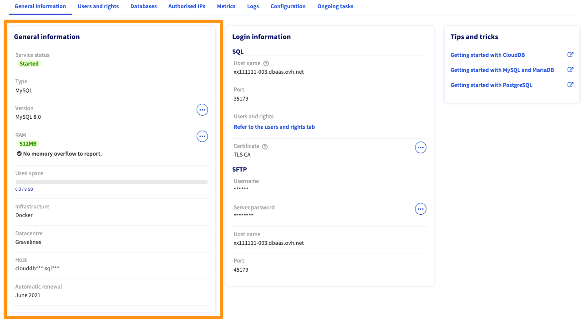
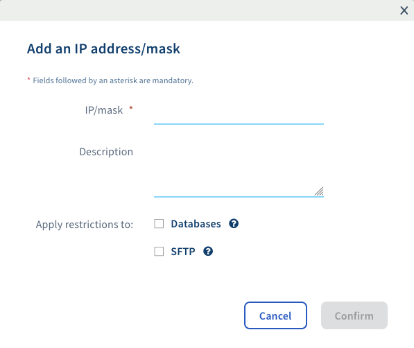
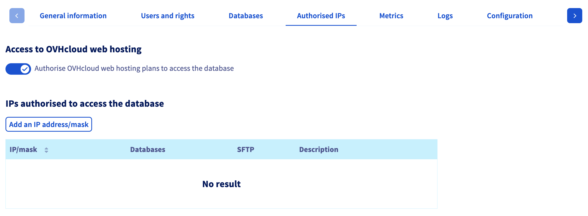
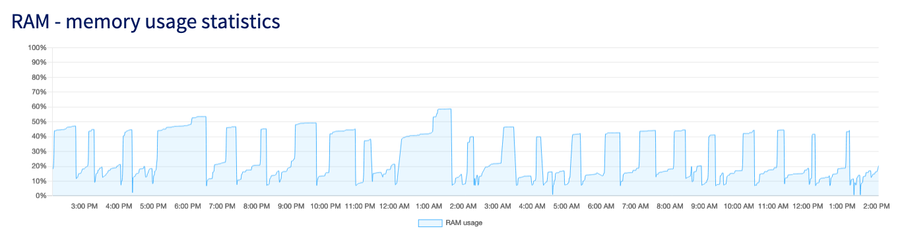

> [!primary]
> Esta tradução foi automaticamente gerada pelo nosso parceiro SYSTRAN. Em certos casos, poderão ocorrer formulações imprecisas, como por exemplo nomes de botões ou detalhes técnicos. Recomendamos que consulte a versão inglesa ou francesa do manual, caso tenha alguma dúvida. Se nos quiser ajudar a melhorar esta tradução, clique em "Contribuir" nesta página.
>

**Última atualização: 30/06/2022**

## Objetivo

Os servidores Web Cloud Databases oferecem-lhe a possibilidade de agir sobre os parâmetros globais do seu servidor. Além disso, tem a hipótese de visualizar a atividade do servidor. 

**Saiba como configurar e otimizar o servidor de bases de dados.**

## Requisitos

- Dispor de uma [instância Web Cloud Databases](https://www.ovh.pt/cloud/cloud-databases/)  (incluída numa oferta de [alojamento web Performance](https://www.ovhcloud.com/pt/web-hosting/).
- Ter acesso à [Área de Cliente OVHcloud](https://www.ovh.com/auth/?action=gotomanager&from=https://www.ovh.pt/&ovhSubsidiary=pt).

## Instruções

### Visualizar as informações gerais do servidor de bases de dados

Na [Área de Cliente OVHcloud](https://www.ovh.com/auth/?action=gotomanager&from=https://www.ovh.pt/&ovhSubsidiary=pt), aceda à secção `Bases de dados`{.action} e clique na instância SQL que pretende configurar. Certifique-se de que está no separador `Informações gerais`{.action}.

Esta secção apresenta as informações essenciais da instância SQL. Sugerimos que dedique alguns minutos para verificar se estão corretas ou se correspondem às indicações descritas a abaixo.

|Informação|Detalhes|
|---|---|
|Estado do serviço|Indica se a instância está ativada, a ser reiniciada ou suspensa. Para configurar a instância SQL, esta tem que estar ativada.|
|Tipo|Indica o sistema de base de dados usado pelo servidor. O sistema «MySQL» é o mais comum, mas existem outros (PostgreSQL, MariaDB). Por exemplo, se o seu site é um WordPress, o sistema MySQL serve perfeitamente.|
|Versão|Indica a versão do sistema da base de dados. Por favor, verifique a compatibilidade do seu site com a versão selecionada.|
|Saturação CPU|Mostra o tempo de saturação de CPU passado nas últimas 24 horas.|
|RAM|Indica a RAM disponível para a instância, e avisa quando os limites da RAM são ultrapassados. O servidor de bases de dados dispõe de recursos dedicados e garantidos: a sua memória RAM. Se precisar de mais recursos, pode fazer um upgrade e receber notificações quando o limite de memória for atingido.|
|Infraestrutura|Indica a infraestrutura / plataforma usada pela sua instância (i.e. informação relativa à infraestrutura da OVHcloud). Trata-se de uma informação inerente à infraestrutura da OVHcloud.|
|Datacenter|Indica o datacenter onde instância está alojada. Certifique-se de que o datacenter da sua instância é o mesmo do alojamento web OVHcloud em que o seu site se encontra, ou se encontrará, alojado.|
|Host|Indica o servidor OVHcloud onde a instância foi criada. Esta informação, inerente à infraestrutura da OVHcloud, poderá ser incluída na página sobre o [Estado dos Serviços](https://web-cloud.status-ovhcloud.com/).|

{.thumbnail}

## Gerir os seus acessos

O seu Web Cloud Databases está acessível a partir dos seus alojamentos web da OVHcloud ou/e a partir da rede pública.

###### Autorizar um endereço IP

Para que o acesso à sua instância Web Cloud Databases funcione, é obrigatório indicar os IP ou intervalos de IP que podem conectar-se às suas bases de dados.

Na [Área de Cliente OVHcloud](https://www.ovh.com/auth/?action=gotomanager&from=https://www.ovh.pt/&ovhSubsidiary=pt), aceda à secção `Bases de dados`{.action} e clique na Web Cloud Databases SQL em causa. 

Clique no separador `IP autorizados`{.action} e a seguir no botão `Adicionar um endereço IP/máscara`{.action}.

{.thumbnail}

Na janela que se abrir, indique em `IP/máscara`{.action} o endereço IP ou a máscara que pretende autorizar e adicione uma descrição se desejar. Decida se quer dar acesso apenas às bases de dados ou ao SFTP. Por fim, clique em `Validar`{.action}.

{.thumbnail}

#### Autorizar conexões a um alojamento web OVHcloud 

Para um alojamento web da OVHcloud, pode simplesmente selecionar `Autorizar os alojamentos web da OVHcloud a aceder à base de dados`.

{.thumbnail}

### Alterar a sua oferta Web Cloud Databases

Para alterar a sua oferta Web Cloud Databases, aceda à [Área de Cliente OVHcloud](https://www.ovh.com/auth/?action=gotomanager&from=https://www.ovh.pt/&ovhSubsidiary=pt). Clique no separador `Web Cloud` e, a seguir, em `Base de dados`{.action}. Selecione o nome do seu servidor de bases de dados.
No separador **«Informações gerais»**, que aparece de forma predefinida, clique em `...`{.action} à direita da menção «RAM» e, depois, em `Alterar o volume de RAM`{.action} de modo a proceder à encomenda desta modificação.

{.thumbnail}

Escolha o volume de RAM desejado e clique no botão `Seguinte`{.action}. Poderá então escolher a duração desejada.

> [!primary]
>
> Um adiamento proporcional será efetuado se lhe faltarem alguns meses antes da expiração. Este pro rata será baseado na data de expiração da sua instância Web Cloud Databases e não na da nota de encomenda.
> 

Após a validação dos contratos, será reencaminhado para a ordem de encomenda a fim de pagar pela alteração. Esta última produzirá efeitos em algumas horas.

> [!warning]
>
> Se dispõe atualmente de um Web Cloud Databases gratuito graças ao seu alojamento Performance, a modificação da oferta fará com que perca a sua gratuidade.
> 

### Alterar a configuração do servidor de bases de dados

Aceda à [Área de Cliente OVHcloud](https://www.ovh.com/auth/?action=gotomanager&from=https://www.ovh.pt/&ovhSubsidiary=pt). Clique no separador `Web Cloud` e, a seguir, em `Base de dados`{.action}. Selecione o nome do seu servidor Web Cloud Databases. 

#### Instância MySQL e MariaDB

- Aceda ao separador `Configuration`.

No quadro **Configuração geral do MySql**, vai encontrar a configuração definida atualmente para a base de dados. Pode alterá-la diretamente e clicar em `Aplicar`{.action}.

{.thumbnail}

- **Tmpdir**: Diretório de ficheiros temporários. **/dev/shm** corresponde à memória RAM da instância. **/tmp** corresponde ao disco rígido da instância.
- **MaxAllowedPacket**: Tamanho máximo dos pacotes.
- **Max_user_connections**: Número de conexões simultâneas autorizadas por utlizador.
- **AutoCommit**: Define se os pedidos são validados (committed) automaticamente.
- **Interactive_timeout**: Tempo (em segundos) que o servidor aguardará atividade numa conexão interativa antes de a fechar.
- **InnodbBufferPoolSize**: Escolha da dimensão do buffer.
- **MaxConnexions**: Número de conexões simultâneas autorizadas no servidor de bases de dados.
- **Wait_timeout**: Tempo (em segundos) que o servidor aguardará atividade numa conexão não interativa antes de a fechar.
- **Event_scheduler**: Permite acionar a execução de pedidos programados diretamente no servidor MySQL.
- **sql_mode**: A opção **sql_mode** afeta a sintaxe SQL e as verificações de validação de dados efetuadas por MySQL/MariaDB.

> [!primary]
> Quando encontra um erro no seu site a indicar **«Too many connections»**, isso deve-se à ultrapassagem do número máximo de conexões simultâneas na base de dados.
> Assim, se a variável **«MaxConnections»** não estiver no máximo, pode aumentá-la.
>

> [!primary]
>
> <b>Tmpdir</b>:
>
> - /dev/shm: O servidor de bases de dados vai alocar para este diretório metade da sua memória RAM, tendo em vista um melhor desempenho.
>
> - /tmp: O servidor vai alocar no disco rígido um espaço ilimitado para este diretório, mas o desempenho será muito inferior. Recomendamos que utilize este diretório apenas para operações pontuais pesadas.
>

> [!primary]
>
> <b>sql_mode</b>:
>
> &emsp;&emsp;Modo predefinido de MariaDB 10.1:
> <pre class="highlight command-prompt"> <span class="prompt">NO_ENGINE_SUBSTITUTION,NO_AUTO_CREATE_USER</span> </pre>
> 
> &emsp;&emsp;Modo predefinido de MariaDB 10.2 e superior:
> <pre class="highlight command-prompt"> <span class="prompt">STRICT_TRANS_TABLES,ERROR_FOR_DIVISION_BY_ZERO,NO_AUTO_CREATE_USER,NO_ENGINE_SUBSTITUTION</span> </pre>
>
> &emsp;&emsp;Modo predefinido de MySQL 5.6:
> <pre class="highlight command-prompt"> <span class="prompt">NO_ENGINE_SUBSTITUTION</span> </pre>
>
> &emsp;&emsp;Modo predefinido de MySQL 5.7 e superior:
> <pre class="highlight command-prompt"> <span class="prompt">ONLY_FULL_GROUP_BY,STRICT_TRANS_TABLES,NO_ZERO_IN_DATE,NO_ZERO_DATE,ERROR_FOR_DIVISION_BY_ZERO,NO_ENGINE_SUBSTITUTION</span> </pre>
>
> Recomendamos que utilize sempre o modo predefinido, exceto se a sua base de dados tiver sido atualizada a partir de uma versão com um modo predefinido diferente da versão atual.
>

Efetue as modificações necessárias e clique em `Confirmar`{.action}.

> [!warning]
>
> Qualquer alteração requer o reinício do servidor de bases de dados.
> 

#### Instance PostgreSQL

Não é possível modificar a configuração de uma instância PostgreSQL. 

No entanto, pode ativar extensões nas bases de dados. Para isso, aceda ao separador `Bases de dados` e clique no ícone da tabela junto à base de dados, sob a coluna **«Extensões»**.

{.thumbnail}

### Alterar a versão MySQL, PostgreSQL ou MariaDB do servidor de bases de dados

Para conhecer a versão de MySQL, PostgreSQL ou MariaDB do seu servidor de bases de dados, deve aceder ao separador **«Informações gerais»** depois de ter escolhido o servidor de bases de dados.

A versão atual surge na linha **«Versão»**.

Para modificar esta versão, clique em `Alterar a versão`{.action}.

{.thumbnail}


#### Como saber a versão exata de PostgreSQL que utilizo?

Introduza este comando no phpPgAdmin, clicando na sua **base de dados**, rubrica **«SQL»**, e a seguir em `Lançar`{.action}:

```sql
select version();
```

#### Como saber a versão exata de MySQL ou MariaDB que utilizo?

Introduza este comando no phpMyAdmin, rubrica **«SQL»**, e a seguir em `Executar`{.action}:

```sql
show variables like "version";
```

> [!primary]
>
> - Antes de migrar para uma versão superior, certifique-se de que a base de dados é compatível com a versão escolhida.
> - A alteração terá efeito minutos mais tarde.
>

> [!warning]
>
> Não é possível passar diretamente de uma versão antiga
> para a mais recente. A passagem por todas as versões intermédias é obrigatória.
> 

### Logs e métricas

#### Conhecer o tempo de execução dos pedidos

Isto permite-lhe visualizar o tempo de execução dos pedidos no servidor de bases de dados nas últimas 24 horas.

Aceda à [Área de Cliente OVHcloud](https://www.ovh.com/auth/?action=gotomanager&from=https://www.ovh.pt/&ovhSubsidiary=pt). Clique no separador `Web Cloud` e, a seguir, em `Base de dados`{.action}. Selecione o nome do seu servidor de bases de dados. 

Aceda ao separador `Métricas` do servidor de bases de dados. Vai encontrar o gráfico **«Estatísticas do tempo de execução dos pedidos»**.

{.thumbnail}

#### Acesso aos logs «Slow Query»

> **Definição dos «slow query logs»**
> 
> São os pedidos que levam mais tempo a ser executados. O valor é definido em 1 segundo nos nossos servidores de bases de dados na variável **«long_query_time»**.

Estes logs, chamados **«slow-query.log»**, podem ser obtidos na raiz do espaço SFTP do servidor de bases de dados. 

Aceda à [Área de Cliente OVHcloud](https://www.ovh.com/auth/?action=gotomanager&from=https://www.ovh.pt/&ovhSubsidiary=pt). Clique no separador `Web Cloud` e, a seguir, em `Base de dados`{.action}. Selecione o nome do seu servidor de bases de dados. 

No separador `Informações gerais`, vai encontrar a secção **«SFTP»** no quadro **«Informações de conexão»**.

{.thumbnail}

Para se conectar em **SFTP**, pode recorrer ao programa Filezilla. Se necessário, consulte o guia: [ «Guia de utilização do FileZilla»](https://docs.ovh.com/pt/hosting/partilhado_guia_de_utilizacao_do_filezilla/).

Se o ficheiro estiver vazio, isso revela a inexistência de pedidos lentos.


#### Acompanhar a RAM consumida

Aceda à [Área de Cliente OVHcloud](https://www.ovh.com/auth/?action=gotomanager&from=https://www.ovh.pt/&ovhSubsidiary=pt). Clique no separador `Web Cloud` e, a seguir, em `Base de dados`{.action}. Selecione o nome do seu servidor de bases de dados. 

Aceda ao separador `Métricas` da Área de Cliente. Vai encontrar o gráfico **«Estatísticas de memória RAM utilizada»**.

{.thumbnail}

#### Acompanhar o número de conexões por minuto

Este gráfico permite acompanhar, relativamente às últimas 24 horas, o volume de conexões por minuto no servidor de bases de dados.

Aceda à [Área de Cliente OVHcloud](https://www.ovh.com/auth/?action=gotomanager&from=https://www.ovh.pt/&ovhSubsidiary=pt). Clique no separador `Web Cloud` e, a seguir, em `Base de dados`{.action}. Selecione o nome do seu servidor de bases de dados. 

Aceda ao separador `Métricas` da Área de Cliente. Vai encontrar o gráfico **«Estatísticas do total de conexões por minuto»**.

{.thumbnail}

### Otimizar as bases de dados

Aconselhamos que faça a manutenção das suas bases de dados para que o seu desempenho permaneça elevado. Um desempenho elevado significa que as informações contidas na base são devolvidas rapidamente ao script que as solicita. Nesse sentido, as bases de dados precisam de ser estruturadas e otimizadas.

#### Indexar a base de dados

Para aumentar a rapidez de pesquisa no seguimento de um pedido, é necessário indexar os campos utilizados nas cláusulas WHERE.

Por exemplo: costuma fazer pesquisas de pessoas relativamente à cidade. Indexe o campo «cidade» com o pedido seguinte:

```sql
ALTER TABLE 'test' ADD INDEX ('city')
```
#### Limpar a base de dados

Já não consulta alguns dos seus dados? Se os arquivar, as tabelas ficarão menos cheias e as pesquisas levarão menos tempo.

#### Limite de exibição

Limite a exibição dos registos a um número fixo (por exemplo, 10 por página) através da parte LIMIT do pedido SQL.

#### Agrupamento dos pedidos

Agrupe os pedidos no início do script da seguinte forma:

```bash
open_connection
request1
request1
...
close_connection
Display...
Treat data
Loop through data...
Display...
...
```
#### Obter apenas dados úteis

Nos pedidos SQL, verifique se seleciona apenas aquilo de que precisa e, principalmente, se não se esqueceu das ligações entre as tabelas.

Por exemplo:

```sql
(where table1.champs = table2.champs2)
```

#### Evitar as opções que consomem demasiados recursos

Por exemplo, evite utilizar **«HAVING»**; isto torna os pedidos mais pesados. Da mesma forma, evite utilizar **«GROUP BY»**, exceto em caso de verdadeira necessidade.

## Quer saber mais?

[Lista dos endereços IP dos clusters e alojamentos web](https://docs.ovh.com/pt/hosting/lista-dos-enderecos-ip-dos-clusters-e-alojamentos-web/)

Para serviços especializados (referenciamento, desenvolvimento, etc), contacte os [parceiros OVHcloud](https://partner.ovhcloud.com/pt/).

Se pretender usufruir de uma assistência na utilização e na configuração das suas soluções OVHcloud, consulte as nossas diferentes [ofertas de suporte](https://www.ovhcloud.com/pt/support-levels/).

Fale com nossa comunidade de utilizadores: <https://community.ovh.com/en/>.
