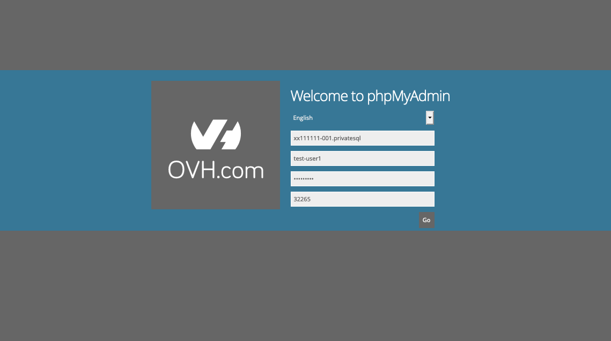
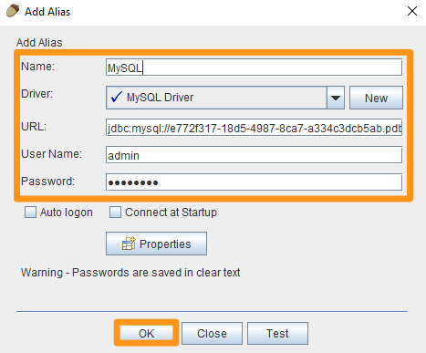

**Dernière mise à jour le 22/09/2022**

## Objectif

Il est possible de consulter le contenu de votre base de données via une interface. Pour cela, il existe plusieurs moyens de s'y connecter.

**Découvrez comment vous connecter à votre base de données sur votre serveur de bases de données.**

## Prérequis

- Disposer d'une [instance CloudDB](https://www.ovh.com/fr/cloud/cloud-databases/){.external} (incluse dans une offre d'[hébergement web Performance](https://www.ovhcloud.com/fr/web-hosting/)).
- Être connecté à votre [espace client OVHcloud](https://www.ovh.com/auth/?action=gotomanager&from=https://www.ovh.com/fr/&ovhSubsidiary=fr){.external}.

## En pratique

> [!primary]
>
> Il est à noter que les offres [CloudDB](https://www.ovh.com/fr/cloud-databases){.external} ne donnent pas accès au système de gestion de base de données, mais aux bases de données hébergées sur celui-ci. 
> <br> - Il n'y a pas d'accès super utilisateur « root ». 
> <br> - Les commandes SQL génériques fonctionnent normalement, et les logiciels de type HeidiSQL, SQuirreL SQL ou Adminer sont pleinement compatibles.
> 

### Se connecter à une base de données MySQL ou MariaDB

> [!primary]
>
> MariaDB étant un dérivé de MySQL, les différentes commandes sont exactement les mêmes pour ces deux types de bases de données.
> 

#### Par phpMyAdmin OVHcloud 

Rendez-vous dans votre [espace client OVHcloud](https://www.ovh.com/auth/?action=gotomanager&from=https://www.ovh.com/fr/&ovhSubsidiary=fr){.external}. Cliquez sur l'onglet `Web Cloud`, puis sur `Base de données`{.action}. Sélectionnez le nom de votre serveur de bases de données.

Depuis l'onglet `Informations générales`, vous trouverez le lien d'accès dans le cadre **« Administration de la base de données »** sous la mention « Interface utilisateur ».

{.thumbnail}

Vous arrivez sur la page de connexion de phpMyAdmin.

{.thumbnail}

- **Serveur :** renseignez le nom d'hôte de votre serveur visible dans l'onglet `Informations générales`, dans le cadre **« Administration de la base de données »** sous la mention « Nom d'hôte » de la partie **SQL**.
- **Utilisateur :** renseignez le nom d'utilisateur créé dans l'onglet `Utilisateurs et droits` de votre serveur de bases de données.
- **Mot de passe :** renseignez le mot de passe associé à l'utilisateur concerné.
- **Port :** renseignez le port mentionné dans l'onglet `Informations générales`, dans le cadre **« Administration de la base de données »** sous la mention « Port» de la partie **SQL**.

Si la connexion aboutit, la page suivante de phpMyAdmin apparaîtra.

{.thumbnail}

> [!warning]
>
> **En cas d'erreur :**
> <br> - Erreur #1045, cela signifie que l'identification est incorrecte. Il faut donc vérifier votre nom d'utilisateur et/ou votre mot de passe.
> <br> - Erreur #2005, il est conseillé de vérifier le nom du serveur et si celui-ci est bien fonctionnel.
>

#### Connexion à la base de données hors espace client

> [!warning]
>
> Si vous utilisez une offre "Cloud DB"/"SQL Privé", n'oubliez pas d'autoriser votre IP à l'aide du guide sur la [configuration de votre serveur de base de données](https://docs.ovh.com/fr/clouddb/configurer-optimiser-son-serveur-de-base-de-donnees/#gerer-vos-acces).
>

Afin de vous connecter à votre base de données, assurez-vous de récupérer les informations suivantes :

- **Serveur :** le nom d'hôte de votre serveur est visible dans l'onglet `Informations générales`de votre serveur de bases de données, dans le cadre **« Administration de la base de données »** sous la mention « Nom d'hôte » de la partie **SQL**.
- **Utilisateur :** le nom d'utilisateur créé dans l'onglet `Utilisateurs et droits` de votre serveur de bases de données.
- **Mot de passe :** le mot de passe associé à l'utilisateur concerné.
- **Port :** le port est visible dans l'onglet `Informations générales`de votre serveur de bases de données, dans le cadre **« Administration de la base de données »** sous la mention « Port» de la partie **SQL**.
- **Nom de la base de données :** les bases de données sont listées dans l'onglet `Bases de données` de votre serveur de bases de données.

##### 1. Connexion en ligne de commande

```bash
mysql --host=serveur --user=utilisateur --port=port --password=password nom_de_la_base
```

##### 2. Connexion par script PHP

```php
1. <?php
2. $db = new PDO('mysql:host=host;port=port;dbname=dbname', 'username', 'password');
3. ?>
```

##### 3. Connexion par logiciel (SQuirreL SQL)

> [!primary]
>
> Dans notre exemple nous utilisons le logiciel open source SQquirreL, mais d'autres interfaces comme HeidiSQL ou Adminer sont pleinement compatibles. 

- Lancez SQuirreL SQL et cliquez sur `Aliases`{.action}, puis sur `+`{.action}

{.thumbnail}

- Remplissez les champs ci-dessous puis validez avec le bouton `OK`{.action} :
    - **Name** : Choisissez un nom
    - **Driver** : Choisissez "MySQL Driver"
    - **URL** : Indiquez l'adresse du serveur et le port sous la forme jdbc:mysql://server:port
    - **User Name** : Indiquez le nom d'utilisateur
    - **Password** : Indiquez le mot de passe

{.thumbnail}

- Validez à nouveau avec le bouton `Connect`{.action}

{.thumbnail}

Vous êtes maintenant bien connecté à votre base de données :

{.thumbnail}


##### 4. Connexion par phpMyAdmin

Vous pouvez utiliser votre propre interface phpMyAdmin pour explorer le contenu de votre base de données. Pour cela, installez phpMyAdmin sur votre propre serveur ou hébergement web. Durant cette installation, veillez à bien paramétrer les informations de votre serveur de bases de données et de votre base de données souhaitée afin que phpMyAdmin puisse s'y connecter.


### Se connecter a une base de données PostgreSQL 


Afin de vous connecter à votre base de données, assurez-vous de récupérer les informations suivantes :

- **Serveur :** le nom d'hôte de votre serveur est visible dans l'onglet `Informations générales`de votre serveur de bases de données, dans le cadre **« Administration de la base de données »** sous la mention « Nom d'hôte » de la partie **SQL**.
- **Utilisateur :** le nom d'utilisateur créé dans l'onglet `Utilisateurs et droits` de votre serveur de bases de données.
- **Mot de passe :** le mot de passe associé à l'utilisateur concerné.
- **Port :** le port est visible dans l'onglet `Informations générales`de votre serveur de bases de données, dans le cadre **« Administration de la base de données »** sous la mention « Port» de la partie **SQL**.
- **Nom de la base de données :** les bases de données sont listées dans l'onglet `Bases de données` de votre serveur de bases de données.

#### Connexion en ligne de commande

```bash
psql --host=serveur --port=port --user=utilisateur --password=password nom_de_la_base
```

#### Connexion par script PHP

```php
1. <?php
2. $myPDO = new PDO('pgsql:host=host;port=port;dbname=dbname', 'username', 'password');
3. ?>
```

#### Connexion par logiciel (SQuirreL SQL)

> [!primary]
>
> Dans notre exemple nous utilisons le logiciel open source SQquirreL, mais d'autres interfaces comme HeidiSQL ou Adminer sont pleinement compatibles.

- Lancez SQuirreL SQL et cliquez sur `Aliases`{.action}, puis sur `+`{.action}

{.thumbnail}

- Remplissez les champs ci-dessous puis validez avec le bouton `OK`{.action} :
    - **Name** : Choisissez un nom
    - **Driver** : Choisissez "PostgreSQL"
    - **URL** : Indiquez l'adresse du serveur et le port sous la forme jdbc:postgresql://server:port/database
    - **User Name** : Indiquez le nom d'utilisateur
    - **Password** : Indiquez le mot de passe

{.thumbnail}

- Validez à nouveau avec le bouton `Connect`{.action}

{.thumbnail}

Vous êtes maintenant bien connecté à votre base de données :

{.thumbnail}

## Aller plus loin

Pour des prestations spécialisées (référencement, développement, etc), contactez les [partenaires OVHcloud](https://partner.ovhcloud.com/fr/).

Si vous souhaitez bénéficier d'une assistance à l'usage et à la configuration de vos solutions OVHcloud, nous vous proposons de consulter nos différentes [offres de support](https://www.ovhcloud.com/fr/support-levels/).

Échangez avec notre communauté d'utilisateurs sur <https://community.ovh.com>.

