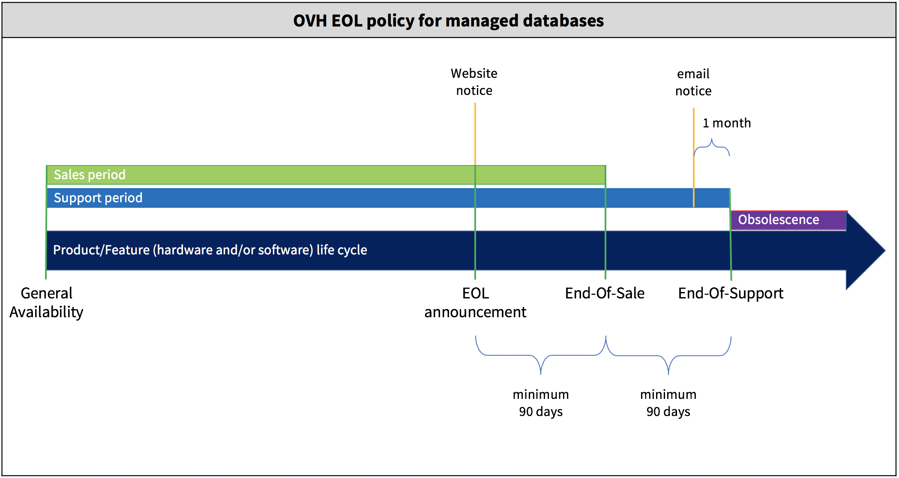

> [!primary]
> Tłumaczenie zostało wygenerowane automatycznie przez system naszego partnera SYSTRAN. W niektórych przypadkach mogą wystąpić nieprecyzyjne sformułowania, na przykład w tłumaczeniu nazw przycisków lub szczegółów technicznych. W przypadku jakichkolwiek wątpliwości zalecamy zapoznanie się z angielską/francuską wersją przewodnika. Jeśli chcesz przyczynić się do ulepszenia tłumaczenia, kliknij przycisk „Zaproponuj zmianę” na tej stronie.
>

**Ostatnia aktualizacja z dnia 29/06/2022**

## Wprowadzenie

Zarządzane bazy danych OVHcloud oferują kilka systemów zarządzania bazami danych (SGBD), takich jak MySQL lub PostgreSQL. Każda wersja oprogramowania dociera w dowolnym momencie do końca sprzedaży i do końca obsługi. Usługa może być następnie aktualizowana przez OVH lub przestać działać ("koniec życia"). Chcemy, abyś zrozumiał cykl życia zarządzanych baz danych OVHcloud, dzięki czemu będziesz mógł w pełni przewidywać i przygotowywać własne zmiany.

**Zapoznaj się z polityką dotyczącą wycofania z eksploatacji baz danych zarządzanych przez OVHcloud.**

## Wymagania początkowe

Posiadanie co najmniej jednej z 3 poniższych ofert:

- Korzystanie z jednej z baz danych zawartych w ofercie [Hosting WWW](https://www.ovhcloud.com/pl/web-hosting/).
- Jedna [instancja CloudDB](https://www.ovh.pl/cloud/cloud-databases/){.external} (zawarta w usłudze[hosting www Performance](https://www.ovhcloud.com/pl/web-hosting/).
- Pakiet bazy danych [Start SQL](https://www.ovhcloud.com/pl/web-hosting/options/start-sql/).

## W praktyce

### Produkty

Produkty objęte tą polityką wycofania z eksploatacji to:

- Usługi Public Cloud Databases, dedykowane instancje SGBD dostępne w sieci publicznej ([sprawdź zapowiedzi](https://docs.ovh.com/gb/en/clouddb/clouddb-eos-eol/)).

- Usługi Cloud Databases Web Hosting (znane również jako usługi SQLPrive), dedykowane instancje SGBD dostępne poprzez sieć Web Hosting ([patrz ogłoszenia](https://docs.ovh.com/gb/en/hosting/sql_eos_eol)).

- Usługi SharedSQL Web Hosting, bazy danych MySQL dostępne za pośrednictwem sieci Web Hosting ([patrz ogłoszenia](https://docs.ovh.com/gb/en/hosting/sql_eos_eol)).

### Definicje i wytyczne polityki wycofania z eksploatacji

EOL = End Of Life

#### Ogłoszenie o zakończeniu życia ("End of Life" - EOL)

Jest to publikacja dat zakończenia sprzedaży i zakończenia obsługi. OVHcloud zwykle przestrzega 90-dniowego okresu pomiędzy ogłoszeniem końca życia a jego stosowaniem.

#### Koniec sprzedaży ("End of Sale")

Produkt objęty postępowaniem nie może być już zamawiał po tym terminie. Jak zapowiedziano powyżej, zasada ta ma zastosowanie co najmniej 90 dni po ogłoszeniu wycofania z eksploatacji.

#### Zakończenie pomocy ("End of Support")

Data, do której klient może otrzymać pomoc w odniesieniu do produktu zgodnie z warunkami umowy o świadczenie usług lub ogólnymi warunkami gwarancji.
Po tym terminie produkt nie jest już przedmiotem usług wsparcia i jest uważany za przestarzały.
Stosuje się co najmniej 6 miesięcy po ogłoszeniu wycofania z eksploatacji.

#### Okres przestarzałości

Występuje po zakończeniu obsługi.

W przypadku przestarzałości usługi zarządzania bazami danych OVHcloud może ona skorzystać z obydwu wymienionych poniżej przypadków.
Ponieważ mogą wystąpić konsekwencje dla Twojej usługi, otrzymasz powiadomienie e-mailem co najmniej miesiąc przed upływem terminu wygaśnięcia umowy.

**Aktualizacja usługi**

Twoja usługa pozostaje aktywna i aktualizujemy jej system DMS do nowej wersji głównej.
Ten rodzaj aktualizacji może spowodować u Twoich aplikacji niepożądane zachowania. Dlatego radzimy klientom przewidywać zmiany w wersjach bazy danych i nie czekać na zakończenie obsługi.

**Zakończenie usługi**

Zamiast aktualizować system DBMS od Twojej usługi do następnej głównej wersji, możemy podjąć decyzję o zakończeniu świadczenia usługi z kilku powodów, takich jak:

- Aktualizacja jest odradzana przez producenta systemu DBMS.

- Rozwój systemu zarządzania przedziałami emisji zakończył się.

Rezygnacja może zostać dokonana na dwa sposoby, w zależności od przypadku:

- Zatrzymamy odnawianie usługi. W takim przypadku usługa zostanie zawieszona na koniec okresu abonamentowego.

- Zawieszamy usługę i opłacamy nadwyżkę.

## Sprawdź również

Dołącz do społeczności naszych użytkowników na stronie<https://community.ovh.com/en/>.