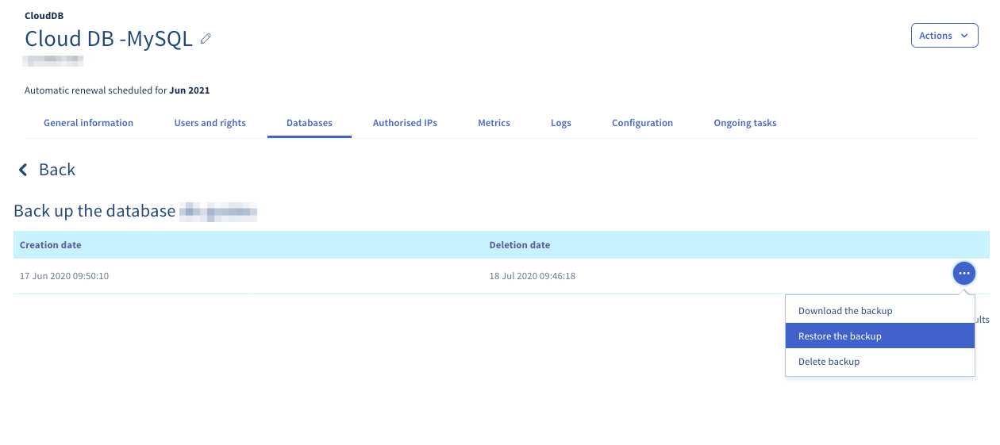
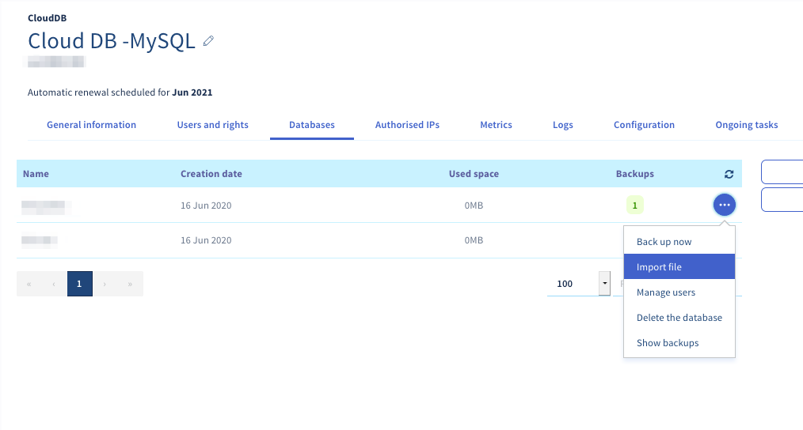
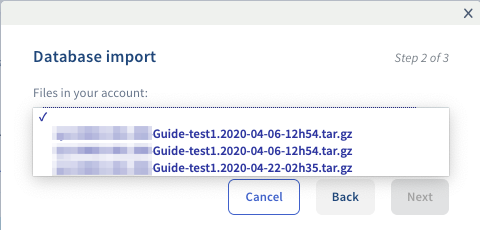
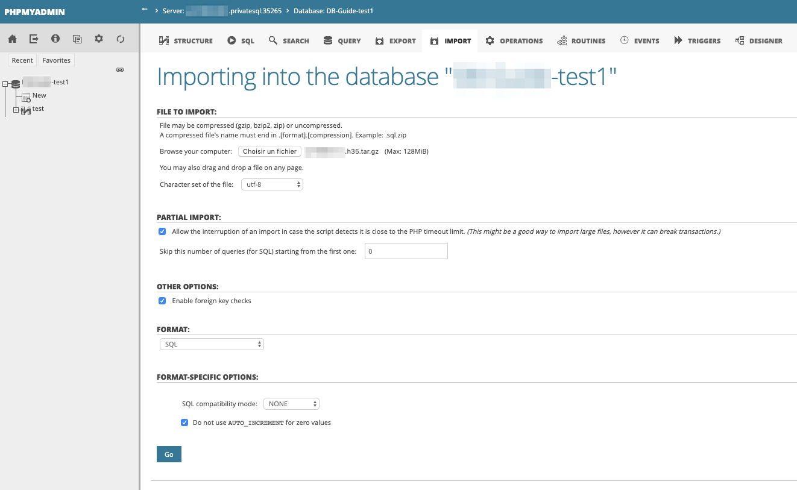

**Last updated 29th June 2022**

## Objective

Following an error on your database, you must be able to restore a backup or import a local database. 

**This guide explains how to restore and import your database onto your database server.**

## Requirements

- You must have a [CloudDB instance](https://www.ovh.ie/cloud/cloud-databases/) (included in a [Performance web hosting plan](https://www.ovhcloud.com/en-ie/web-hosting/)).
- Access to the [OVHcloud Control Panel](https://www.ovh.com/auth/?action=gotomanager&from=https://www.ovh.ie/&ovhSubsidiary=ie)

## Instructions

> [!primary]
>
> Please note that the [CloudDB](https://www.ovh.ie/cloud/cloud-databases/) solutions do not give access to the database management system, but to the databases hosted on it.
> <br> - Please note that there is no "root" access.
> <br> - Generic SQL commands work normally, and software such as HeidiSQL, SQuirreL or Adminer is fully compatible.

### Restoring and importing a database from the Control Panel

Log in to your [OVHcloud Control Panel](https://www.ovh.com/auth/?action=gotomanager&from=https://www.ovh.ie/&ovhSubsidiary=ie) and select `Web Cloud`{.action} in the top navigation bar. Click `Databases`{.action}, then choose the database name concerned. Next, switch to the `Databases` tab.

In the **Backups** column, the number corresponds to the available backups for your database.

#### Restoring a specific backup

Click the `...`{.action} button to the right of the database, then click `Show backups`{.action}.

The list of available backups will appear. Click on the `...`{.action} button to the right of the backup you want to restore, then `Restore the backup`{.action}.

{.thumbnail}

> [!warning]
>
> Restoration involves overwriting the contents of the database, potentially resulting in data loss. If you are unsure, please create a backup beforehand.
> 

#### Importing a local backup

Click on the `...`{.action} button to the right of the database, then click `Import file`{.action}.

{.thumbnail}

There are two ways of doing this:

##### 1\. Importing a new file

Click on **Import a new file**, then `Next`{.action}.

Specify a name for your imported file, click `Browse`{.action} to select it, confirm with `Submit`{.action}, and then click `Next`{.action}.

> [!warning]
>
> The file must be in .sql, .txt, or .gz format.
> 

{.thumbnail}

If you wish, tick **Empty the current database** before importing, and **Send an email when importing is complete** to be informed of the completion of the operation using the primary email address of your OVHcloud account. Then click `Confirm`{.action}.

##### 2\. Using an existing file

If you had already imported a file before, you can choose the **Use an existing file** option.

Then choose the file from the dropdown menu and click `Next`{.action}.

{.thumbnail}

If you wish, tick **Empty the current database** before importing, and **Send an email when importing is complete** to be informed of the completion of the operation using the primary email address of your OVHcloud account. Then click `Confirm`{.action}.

### Importing MySQL or MariaDB databases outside the OVHcloud Control Panel

In some cases, the RAM available in your database server does not allow you to carry out the desired import outside the Control Panel. If this is the case, we recommend using the [tool available in the OVHcloud Control Panel](./#restoring-and-importing-a-database-from-the-control-panel).

#### Importing MySQL or MariaDB databases with phpMyAdmin

To import your database directly from phpMyAdmin, you will need to log in to the interface first. To do this, you can refer to the [section in this guide](https://docs.ovh.com/ie/en/clouddb/connecting-to-database-on-database-server/#logging-in-to-a-mysql-or-mariadb-database).

Once you have logged in to phpMyAdmin, select your database by clicking on its name.

Then click on the `Import`{.action} tab.

Select your backup file by clicking `Browse`{.action}. (Please note that the file cannot exceed 100 MB).

> [!primary]
>
> We recommend splitting your database into several files if it exceeds 100 MB and importing these files from phpMyAdmin.<br>
> You can import files larger than 100 MB in the OVHcloud Control Panel by following the step [Restoring and importing a database from the Control Panel](./#restoring-and-importing-a-database-from-the-control-panel).

Keep the default options and click `Run`{.action} to start the import.

{.thumbnail}

#### Exporting a MySQL or MariaDB database from the command line

This action is only possible via [SSH](https://docs.ovh.com/ie/en/hosting/web_hosting_ssh_on_web_hosting_packages/) from an OVHcloud Web Hosting plan.

```bash
cat database_name.sql | mysql --host=server --user=username --port=port --password=password database_name
```

#### Importing a MySQL or MariaDB database from a PHP file

```php
1. <?php
2. echo "Your database is being restored.......";
3. system("cat database_name.sql | mysql --host=server --user=username --port=port --password=password database_name");
4. echo "Completed. Your database is in place on this Web Hosting plan.";
5. ?>
```

> [!warning]
>
> - To prevent someone from accessing this file containing sensitive data, you can [secure access to it](https://docs.ovh.com/ie/en/hosting/how_to_password_protect_a_directory_on_your_website/).
> - This action is only possible on an OVHcloud Web Hosting plan.
>

### Importing PostgreSQL databases from the OVHcloud Control Panel

In some cases, the RAM available in your database server may not be sufficient to perform the desired import. If this is the case, we recommend using the [tool available in the OVHcloud Control Panel](./#restoring-and-importing-a-database-from-the-control-panel).

#### Importing a PostgreSQL database from the command line

This action is only possible via [SSH](https://docs.ovh.com/ie/en/hosting/web_hosting_ssh_on_web_hosting_packages/) from an OVHcloud Web Hosting plan, in stable or higher versions.

```bash
psql --host=server --port=port --user=username --password=password database_name < database_name.sql
```

#### Importing a PostgreSQL database from a PHP file

```php
1. <?php
2. echo "Your database is being restored.......";
3. system("PGPASSWORD=password psql --host=server --port=port --user=username --password=password database_name < database_name.sql");
4. echo "Completed. Your database is in place on this Web Hosting plan.";
5. ?>
```

> [!warning]
>
> - To prevent someone from accessing this file containing sensitive data, you can [secure access to it](https://docs.ovh.com/ie/en/hosting/how_to_password_protect_a_directory_on_your_website/).
> - This action is only possible on an OVHcloud Web Hosting plan.
>

## Go further

For specialised services (SEO, development, etc.), contact [OVHcloud partners](https://partner.ovhcloud.com/en-ie/).

If you would like assistance using and configuring your OVHcloud solutions, please refer to our [support offers](https://www.ovhcloud.com/en-ie/support-levels/).

Join our community of users on <https://community.ovh.com/en/>.