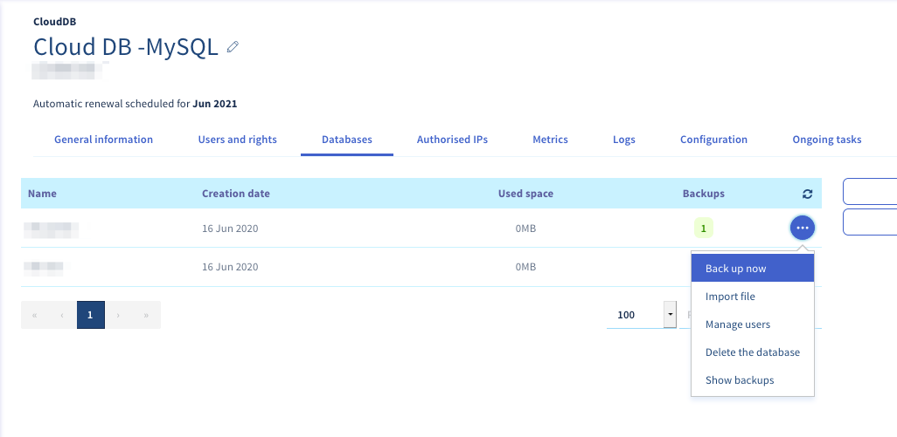

> [!primary]
> Esta traducción ha sido generada de forma automática por nuestro partner SYSTRAN. En algunos casos puede contener términos imprecisos, como en las etiquetas de los botones o los detalles técnicos. En caso de duda, le recomendamos que consulte la versión inglesa o francesa de la guía. Si quiere ayudarnos a mejorar esta traducción, por favor, utilice el botón «Contribuir» de esta página.
>

**Última actualización: 01/03/2023**

## Objetivo

Su base de datos puede contener una gran cantidad de información esencial para su sitio web. Por lo tanto, es muy importante que podamos realizar una copia de seguridad o exportarla.

**Esta guía explica cómo realizar el backup y la exportación de la base de datos desde un servidor de bases de datos.**

## Requisitos

- Tener una [instancia Web Cloud Databases](https://www.ovh.es/cloud/cloud-databases/) (incluida en un plan de [hosting Performance](https://www.ovhcloud.com/es-es/web-hosting/))
- Haber iniciado sesión en el [área de cliente de OVHcloud](https://www.ovh.com/auth/?action=gotomanager&from=https://www.ovh.es/&ovhSubsidiary=es).

## Procedimiento

> Tenga en cuenta que las soluciones [Web Cloud Databases](https://www.ovh.es/cloud/cloud-databases/){.external} no permiten acceder al sistema de gestión de bases de datos, sino a las bases de datos alojadas en él.
> <br> - Tenga en cuenta que no hay acceso "root".
> <br> - Los comandos genéricos SQL funcionan con normalidad, y software como HeidiSQL, SQLuireL o Admin es totalmente compatible.

### Guardar y exportar una base de datos desde el área de cliente

Acceda al [área de cliente de OVHcloud](https://www.ovh.com/auth/?action=gotomanager&from=https://www.ovh.es/&ovhSubsidiary=es). Haga clic en la pestaña `Web` y seleccione `Base de datos`{.action}. Seleccione el nombre del servidor de bases de datos. Acceda a la pestaña `Bases de datos`.

En la columna **"Copias de seguridad"**, la cifra corresponde al número de copias de seguridad disponibles para la base de datos.

> [!primary]
>
> - Las copias de seguridad se realizan automáticamente una vez al día.
> en todas sus bases de datos.
> - Las copias de seguridad automáticas y manuales se conservan durante 30 días.
> Una vez transcurrido este plazo, se eliminarán automáticamente.

#### 1\. Realizar una copia de seguridad manual 

Haga clic en el botón `...`{.action} a la derecha de la base de datos y, a continuación, en `Guardar`{.action}.

{.thumbnail}

#### 2\. Exportar una copia de seguridad

Haga clic en el botón `...`{.action} a la derecha de la base de datos y, seguidamente, en `Mostrar las copias de seguridad`{.action}.

{.thumbnail}

Se mostrará una lista de las copias de seguridad disponibles. Haga clic en el botón `...`{.action} a la derecha de la copia de seguridad seleccionada y, seguidamente, en `Descargar la copia de seguridad`{.action} para descargar la copia de seguridad.

### Copia de seguridad y exportación de una base de datos fuera del área de cliente

#### 1\. Exportar una base de datos MySQL o MariaDB

 En algunos casos, la RAM disponible en el servidor de bases de datos puede no permitir la exportación deseada. En ese caso, le recomendamos que utilice la herramienta OVHcloud en el área de cliente. que le permitirá utilizar recursos externos a su solución. Consulte el apartado ["Guardar y exportar una base de datos desde el área de cliente"](./#guardar-y-exportar-una-base-de-datos-desde-el-area-de-cliente) de esta guía.

##### 1\.1 Exportar mi base de datos MySQL o MariaDB desde phpMyAdmin OVHcloud

Para exportar su base de datos directamente desde phpMyAdmin, es necesario conectarse previamente. Para ello, consulte la guía ["Conectarse a una base de datos".](../coneccion-base-de-datos-servidor-bdd).

Una vez conectado a phpMyAdmin, haga clic en el nombre de la base de datos que quiere exportar y, seguidamente, en la pestaña `Exportar`{.action}.

Hay dos modos de exportación posibles. Si no necesita ayuda específica, le recomendamos que utilice el modo **rápido** en formato **SQL**.

{.thumbnail}

##### 1\.2 Exportar la base de datos MySQL o MariaDB en línea de comandos

```bash
mysqldump —host=servidor —user=usuario —port=puerto —contraseña=contraseña nombre_de_la_BD > nombre_de_la_BD.sql
```

##### 1\.3 Exportar mi base de datos MySQL o MariaDB desde un script PHP


```php
1. <?php echo "Se está guardando la base.......";
2. system("mysqldump --host=serveur --user=utilisateur --port=port --password=password nom_de_la_base > nom_de_la_base.sql");
3. echo "Ya se acabó. Puede consultar la base de datos por FTP".
4. ?>
```

> [!warning]
>
> - Si desea evitar que un tercero acceda a este archivo de datos sensibles, consulte la guía Proteger el acceso a él: [Proteger el panel de administración del sitio web con un archivo .htaccess](https://docs.ovh.com/es/hosting/compartido-htaccess-como-proteger-el-acceso-a-un-directorio-por-autenticacion/).
> - Esta acción solo es posible desde un alojamiento de OVHcloud compartido.
>

#### 2\. Exportación e importación de bases de datos PostgreSQL fuera del área de cliente

 En algunos casos, la RAM disponible en el servidor de bases de datos puede no permitir la exportación deseada. En ese caso, le recomendamos que utilice la herramienta OVHcloud en el área de cliente. que le permitirá utilizar recursos externos a su solución. Consulte el apartado ["Guardar y exportar una base de datos desde el área de cliente"](./#guardar-y-exportar-una-base-de-datos-desde-el-area-de-cliente) de esta guía.
 
##### 2\.1 Exportar la base de datos PostgreSQL en línea de comandos

```bash
pg_dump —host=servidor —port=puerto —user=usuario —password=contraseña nombre_de_la_BD > nombre_de_la_BD.sql
```

##### 2\.2 Exportar mi base PostgreSQL desde un script PHP


```php
1. <?php echo "Se está guardando la base.......";
2. system("PGPASSWORD=contraseña pg_dump —host=servidor —port=puerto —user=usuario —password=contraseña nombre_de_la_BD > nombre_de_la_BD.sql");
3. echo "Ya se acabó. Puede consultar la base de datos por FTP".
4. ?>
```

> [!warning]
>
> - Si desea evitar que un tercero acceda a este archivo de datos sensibles, consulte la guía Proteger el acceso a él: [Proteger el panel de administración del sitio web con un archivo .htaccess](https://docs.ovh.com/es/hosting/compartido-htaccess-como-proteger-el-acceso-a-un-directorio-por-autenticacion/).
> - Esta acción solo es posible desde un alojamiento de OVHcloud compartido.
>

## Más información

[Restaurar e importar una base de datos en su servidor de bases de datos](../restaurar-importar-base-de-datos)

Para servicios especializados (posicionamiento, desarrollo, etc.), contacte con [partners de OVHcloud](https://partner.ovhcloud.com/es-es/).

Si quiere disfrutar de ayuda para utilizar y configurar sus soluciones de OVHcloud, puede consultar nuestras distintas soluciones [pestañas de soporte](https://www.ovhcloud.com/es-es/support-levels/).

Interactúe con nuestra comunidad de usuarios en <https://community.ovh.com/en/>.