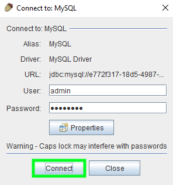

> [!primary]
> Questa traduzione è stata generata automaticamente dal nostro partner SYSTRAN. I contenuti potrebbero presentare imprecisioni, ad esempio la nomenclatura dei pulsanti o alcuni dettagli tecnici. In caso di dubbi consigliamo di fare riferimento alla versione inglese o francese della guida. Per aiutarci a migliorare questa traduzione, utilizza il pulsante "Modifica" di questa pagina.
>

**Ultimo aggiornamento: 29/06/2022**

## Obiettivo

Vuoi utilizzare MySQL o MariaDB per i tuoi database?

### Cose un database MySQL?

MySQL è un modello di database relazionale sviluppato per ottimizzare le prestazioni in lettura.

Questo motore è open source e la sua casa madre è Oracle.

### Cose un database MariaDB?

MariaDB è un derivato (fork) del modello di database MySQL.

Questo motore è compatibile al 100% ed è stato progettato per essere più "libero" del suo fratello maggiore MySQL. Contrariamente alla versione di Oracle, tutti i bug e la roadmap sono pubblicamente accessibili. Inoltre, utilizza XtraDB in sostituzione del motore di storage InnoDB e ha introdotto ulteriori ottimizzazioni per garantire un aumento delle performance.

**Scopri come creare e gestire i tuoi database MySQL o MariaDB**

## Prerequisiti

- Disporre di una [istanza CloudDB](https://www.ovh.it/cloud/cloud-databases/){.external} (inclusa in un'offerta di[hosting web performance](https://www.ovhcloud.com/fr/web-hosting/)
- Avere accesso allo [Spazio Cliente OVHcloud](https://www.ovh.com/auth/?action=gotomanager&from=https://www.ovh.it/&ovhSubsidiary=it)
- Consulta la guida [all'avvio di CloudDB](https://docs.ovh.com/it/clouddb/iniziare-a-utilizzare-clouddb/)

## Procedura

### Connettiti al database

> [!primary]
>
> Ricordiamo che questa offerta non dà accesso all’host ma ai database ospitati su di esso. È possibile utilizzare tutti i comandi SQL generici e i software come HeidiSQL o SQuirreL SQL sono totalmente compatibili.
> 

> [!primary]
>
> MariaDB è un derivato di MySQL, è quindi possibile utilizzare gli stessi comandi per entrambi i database.
> 

Per accedere al tuo database, sono necessarie queste informazioni:

- Disporre dell'indirizzo della tua istanza CloudDB
- Aver attivato la porta della tua istanza CloudDB
- Disporre del nome utente della tua istanza CloudDB
- Disporre della password associata all'utente
- Disporre del nome del tuo database

Questi dati sono disponibili nella sezione Web del tuo [Spazio Cliente OVHcloud](https://www.ovh.com/auth/?action=gotomanager&from=https://www.ovh.it/&ovhSubsidiary=it).

Se necessario, consulta la guida: [Inziare a utilizzare CloudDB](https://docs.ovh.com/it/clouddb/iniziare-a-utilizzare-clouddb/)

#### Connessione da riga di comando

```bash
mysql --host=server --user=utente --port=porta --password=password nome_database
```

#### Connessione con script PHP

```php
1. <?php
2. $db = new PDO('mysql:host=host;port=porta;dbname= nome_database', 'utente', 'password');
3. ?>
```

#### Connessione da software (SQuirreL SQL)

- Avvia SQuirreL SQL, clicca su `Aliases`{.action} e poi su `+`{.action}.

{.thumbnail}

- Completa i campi qui sotto e clicca su `OK`{.action} per confermare:
    - **Name**: scegli un nome
    - **Driver**: scegli `MySQL Driver`
    - **URL**: inserisci l’indirizzo del server e la porta in formato `jdbc:mysql://server:porta`
    - **User Name**: inserisci il nome utente
    - **Password**: inserisci la password

{.thumbnail}

- Clicca su `Connect`{.action} per confermare.

{.thumbnail}

A questo punto, sei connesso al tuo database:

{.thumbnail}

#### Connessione con phpMyAdmin

Puoi utilizzare phpMyAdmin per esplorare il contenuto del tuo database. installa phpMyAdmin sul tuo server o hosting Web. Durante l'installazione, assicurati di configurare correttamente le informazioni del tuo server CloudDB e del database desiderato in modo che phpMyAdmin possa connettersi.

### Esporta e importa un database MySQL o MariaDB

- **Esportare il tuo database da riga di comando**

```bash
mysqldump --host=server --user=utente --port=porta --password=password nome_database > nome_database.sql
```

- **Importare il tuo database da riga di comando**

```bash
cat nome_database.sql | mysql --host=server --user=utente --port=porta --password=password nome_database
```

> [!primary]
>
> In alcuni casi, è possibile che la RAM disponibile nella tua istanza CloudDB non permetta di realizzare l'esportazione o l'importazione desiderata. In questo caso, ti consigliamo di utilizzare il tool OVHcloud nello Spazio Cliente. Se necessario, consulta la documentazione ["Iniziare a utilizzare il servizio CloudDB"](https://docs.ovh.com/it/clouddb/iniziare-a-utilizzare-clouddb/).
>

## Per saperne di più

Per prestazioni specializzate (referenziamento, sviluppo, ecc...), contatta i [partner OVHcloud](https://partner.ovhcloud.com/it/).

Per usufruire di un supporto per l'utilizzo e la configurazione delle soluzioni OVHcloud, è possibile consultare le nostre soluzioni [offerte di supporto](https://www.ovhcloud.com/it/support-levels/).

Contatta la nostra Community di utenti all'indirizzo <https://community.ovh.com>.