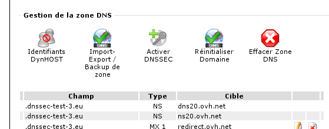
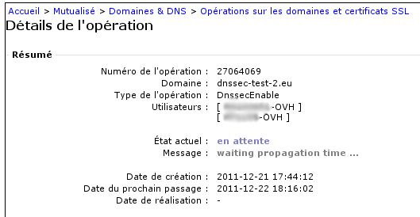
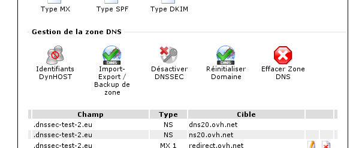

## Požadavky

- Vaše doména musí být registrována u OVH. Díky této podmínce je také nutné mít aktuální DNS záznamy v registru. 
- Musí jít o jednu z následujících domén: .co.uk, .com, .net, .eu, .fr, .be .pl, .re, .pm, .yt, .wf, .tf, .info, .li, .ch, .biz, .de, .sx, .org, .se, .nl, .in, .us, .at, .nu, .la, .ac, .cz, .me, .sh, .io, .uk, .me.uk, .org.uk, nebo jakoukoli jinou, v nedávné době uvolněnou doménu jako například .london, .club, .xyz, .wiki, .ink a všechny ostatní Donuts domény (ostatní domény přijdou již brzy).


## Dva vzorové případy

- Jestliže hostujete svoji doménu na DNS serverech třetí strany (Vašem dedikovaném serveru či na jiném serveru), je potřeba se řídit podle příručky na adrese [prirucky.ovh.cz/prirucky](http://prirucky.ovh.cz/prirucky), která Vám vysvětlí jak si vygenerovat svůj klíč, podepsat svoji zónu a schválit OVH veřejný klíč pro aktualizaci DS záznamu na straně registru.

- Nebo používáte sdílené DNS u OVH. Tato možnost je rozebrána v této příručce. Poté budeme spravovat klíče, jejich periodickou rotaci, aktualizaci DS záznamu a podpis zóny v pro Vás názorných krocích.


V případě, že máte pochynosti, můžete se podívat do svého [manažeru](https://www.ovh.cz/managerv3) v sekci "Webhosting" >> "Domény & DNS" >> "Shrnutí". Jestliže zmíněné DNS servery jsou typu: nsXX.ovh.net a dnsXX.ovh.net, pak využíváte DNS servery OVH.


## Aktivace
Jestliže je Vaše zóna hostována u OVH a aktivní DNS pro Vaši doménu jsou rovněž OVH, měli byste vidět tlačítko "Povolit DNSSEC" v sekci "Webhosting" >> "Domény & DNS" >> "Zóna DNS" >> "Správa DNS zóny"

{.thumbnail}
Protože se postaráme o klíče, DS záznam a podpis zóny, není potřeba, abyste dělali cokoli jiného.
Jakmile je provedena žádost o aktivaci DNSSEC, budete si moci podrobnosti o operaci zobrazit v Manažeru v3 v sekci: "Webhosting" >> "Domény & DNS" >> "Probíhající operace".

{.thumbnail}
Naleznete komentář, který Vám vysvětlí současný probíhající krok. Povolení DNSSEC na doméně vyžaduje zhruba 24 hodin času.


## Deaktivace
Jděte do sekce "Webhosting" >> "Domény & DNS" >> "Zóna DNS" >> "Správa DNS zóny". Jestliže jste předtím povolili DNSSEC, měli byste vidět tlačítko nazvané "Zakázat DNSSEC". Berte na vědomí, že jestliže právě probíhá aktivace, budete muset počkat do dokončení této operace (tlačítko bude v takovém případě šedé), nežli zakážete používat DNSSEC nastavení pro Vaší doménu.

{.thumbnail}


## Metoda 1: Pomocí Firefox či Chrome
Můžete instalovat plugin do Firefoxu, který ověří, zda je stránka chráněna pomocí DNSSEC a případě že ano, zobrazí i výsledek schvalování. Plugin je [dostupný zde](http://www.dnssec-validator.cz/). Jakmile tento plugin nainstalujete, zobrazí se Vám ikona klíče vlevo od adresy ve Vašem prohlížeči. Pro domény, kde je klíč zelený, byla IP adresa stránek ověřena pomocí DNSSEC.

{.thumbnail}
Jestliže je klíč oranžový, znamená to, že rekurzivní DNS Vašeho ISP nepodporuje DNSSEC. Avšak: můžete použít alternativní DNS servery pro provdení schválení. Firefox modul nabízí seznam, ze kterého můžete pomocí kliknutí pravým myšítkem vstoupit na možnost "Nastavení".

Alfa verze tohoto pluginu je také dostupná pro Chrome: [url=https://chrome.google.com/webstore/detail/hpmbmjbcmglolhjdcbicfdhmgmcoeknm] Zde[/ url].


## Metoda 2: Z konzole s root právy
Pro ověření, že je DNSSEC správně nastaveno na doméně můžete použít nástroj dig. Pro ověření DNSSEC je potřeba znát veřejný klíč roota (který je přiřazen ke klíči, který je v root zóně "."). Tento klíč je dostupný na několika místech na Internetu. Pro jednoduchost jsme ho zde uvedli. Vám stačí si ho jen zkopírovat do souboru /etc/trusted-key.key (vše je na jedné řádce):


```
. 172717 IN DNSKEY 257 3 8 AwEAAagAIKlVZrpC6Ia7gEzahOR+9W29euxhJhVVLOyQbSEW0O8gcCjF
FVQUTf6v58fLjwBd0YI0EzrAcQqBGCzh/RStIoO8g0NfnfL2MTJRkxoX
bfDaUeVPQuYEhg37NZWAJQ9VnMVDxP/VHL496M/QZxkjf5/Efucp2gaD
X6RS6CXpoY68LsvPVjR0ZSwzz1apAzvN9dlzEheX7ICJBBtuA6G3LQpz
W5hOA2hzCTMjJPJ8LbqF6dsV6DoBQzgul0sGIcGOYl7OyQdXfZ57relS
Qageu+ipAdTTJ25AsRTAoub8ONGcLmqrAmRLKBP1dfwhYB4N7knNnulq
QxA+Uk1ihz0=
```


Berte na vědomí, že ho nelze zkopírovat aniž byste neověřili jeho autentizaci. V DNSSEC, jako v jakémkoli kryptografickém systému založeném na pravdivém řetězci, je význam root položky, která je pravdivá z definice, označen velkými písmeny. Jeho oficiální distribuce je [u IANA](https://data.iana.org/root-anchors/), a samotné soubory jsou podepsány od GPG.
Příkaz ke spuštění je náledující (hledáme ověření IP u www.eurid.eu):

```
$ dig +sigchase www.eurid.eu
;; RRset to chase:
www.eurid.eu. 544 IN CNAME eurid.eu.
[...]
;; WE HAVE MATERIAL, WE NOW DO VALIDATION
;; VERIFYING DS RRset for eu. with DNSKEY:55231: success
;; OK We found DNSKEY (or more) to validate the RRset
;; Ok, find a Trusted Key in the DNSKEY RRset: 19036
;; VERIFYING DNSKEY RRset for . with DNSKEY:19036: success

;; Ok this DNSKEY is a Trusted Key, DNSSEC validation is ok: SUCCESS
```


Poslední řádka ukazuje, že schválení proběhlo úspěšně, protože pravdivý řetězec může být úspěšně navýšen a vše je v pořádku až do známého veřejného klíče root zóny.

Jestliže dostanete následující zprávu dig did not find the root key in /etc/trusted-key.key:

```
$ dig +sigchase www.eurid.eu
No trusted keys present
```


## Metoda 3: V konzoli bez předchozího získání root klíče
Jestliže nemůžete získat veřejný klíč jak je popsáno výše, můžete věřit třetímu DNS serveru, který to ověří za Vás. Některé rekurzivní DNS servery schvalující DNSSEC jsou dostupné pro veřejnost pomocí různých entit. Například tento [DNS-OARC](https://www.dns-oarc.net/oarc/services/odvr), který používáme v příkladu níže, kde máme za cíl ověřit is IP u www.eurid.eu:


```
$ dig +dnssec www.eurid.eu @149.20.64.21

; <<>> DiG 9.7.3 <<>> +dnssec www.eurid.eu @149.20.64.21
;; global options: +cmd
;; Got answer:
;; ->>HEADER<<- opcode: QUERY, status: NOERROR, id: 26117
;; flags: qr rd ra ad; QUERY: 1, ANSWER: 6, AUTHORITY: 7, ADDITIONAL: 16
[...]
```


Je zde vidět přítomnost "flag" "ad", což nám indikuje, že odpověď, kterou jste obdrželi byla schválena rekursivním řešením.

