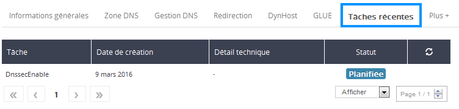

## Prerequisites

- Your domain name must be registered with OVH, a technical requirement due to the need for DS records to be up-to-date on the registry.
- It must contain one of the following extensions: .co.uk, .com, .net, .eu, .fr, .be .pl, .re, .pm, .yt, .wf, .tf, .info, .li, .ch, .biz, .de, .sx, .org, .se, .nl, .in, .us, .at, .nu, .la, .ac, .cz, .me, .sh, .io, .uk, .me.uk, .org.uk, or any other recently-released new extension, such as .london, .club, .xyz, .wiki, .ink, and all other Donuts extensions, (other extensions coming soon).


## Two examples

- Either you host your domain on third-party name servers (your dedicated server, or any other machine).

- Or you use the OVH shared DNS servers, which is the case study covered by this guide. Then we manage the keys, their periodic rotation, the update of the DS record and the zone signing, in a transparent way for you.


If you are unsure of which example applies to you, you can check in your [control panel](https://www.ovh.com/manager/web) by selecting your domain and then going to "DNS management". If the listed DNS servers are displayed as follows: nsXX.ovh.net and dnsXX.ovh.net, or Xns200.anycast.me then you are on the OVH DNS servers.


## Activation

- First of all you have to sign in to your 
[control panel](https://www.ovh.com/manager/web).


Then select the relevant domain name in the "Domains" section.

{.thumbnail}

- You can make sure that you are using OVH dns servers in the "DNS management" section.


{.thumbnail}

- Once you have checked the DNS, click on the Secured Delegation (DNSSEC) button.


{.thumbnail}

- A pop-up window will appear so that you can confirm the operation. You will be told that it may take around 24 hours to activate DNSSEC.


{.thumbnail}

- The secured delegation button will then become animated.


{.thumbnail}

- You can then check in the "operations in progress" tab to see if the operation has begun.


{.thumbnail}


## Deactivation
To disable DNSSEC, select your domain again and then click on the button to disable DNSSEC. A new pop-up window will appear so that you can confirm the operation. Please note that if activation is in progress, you must wait until it completes (the button will be greyed out), so as not to leave the DNSSEC configuration of your domain in intermediate status.

{.thumbnail}


## Method 1: By using Firefox or Chrome
You can install a Firefox add-on that checks whether or not the websites that you visit are secured by DNSSEC. This extension is [available here](http://www.dnssec-validator.cz/). Once installed, you will see a key to the left of your browser's address bar. For domains where the key is green, the website IP has been verified by DNSSEC.

{.thumbnail}
If the key is orange it means that your internet service provider's recursive DNS server does not support DNSSEC. There is no need to worry: you can use alternate DNS servers. The Firefox module offers a list, which you can access by right-clicking the key and then selecting "Preferences".

An alpha version of this extension is also available for Chrome on [url=https://chrome.google.com/webstore/detail/hpmbmjbcmglolhjdcbicfdhmgmcoeknm]this page[/ url].


## Method 2: In console mode, with prior notification of the root key
To verify that DNSSEC is correctly configured for a domain, you can use the dig tool. To check for DNSSEC, the tool needs to know the public root key (This key signs the key which signs the "." root zone ). This key is available in several places on the Internet. To make things easier, we have reproduced it here, you can copy it as it is in the file /etc/trusted-key.key (everything must be on the same line):


```
. 172717 IN DNSKEY 257 3 8 AwEAAagAIKlVZrpC6Ia7gEzahOR+9W29euxhJhVVLOyQbSEW0O8gcCjF
FVQUTf6v58fLjwBd0YI0EzrAcQqBGCzh/RStIoO8g0NfnfL2MTJRkxoX
bfDaUeVPQuYEhg37NZWAJQ9VnMVDxP/VHL496M/QZxkjf5/Efucp2gaD
X6RS6CXpoY68LsvPVjR0ZSwzz1apAzvN9dlzEheX7ICJBBtuA6G3LQpz
W5hOA2hzCTMjJPJ8LbqF6dsV6DoBQzgul0sGIcGOYl7OyQdXfZ57relS
Qageu+ipAdTTJ25AsRTAoub8ONGcLmqrAmRLKBP1dfwhYB4N7knNnulq
QxA+Uk1ihz0=
```


Please note that you should not copy it without verifying its authenticity, because with DNSSEC, as in any crypto system based on a chain of trust, the importance of root items that we can trust is paramount. Its official distribution point is [IANA](https://data.iana.org/root-anchors/), and the file itself is signed by GPG.
The command to run is as follows, here we are trying to verify the IP of the www.eurid.eu website:

```
$ dig +sigchase www.eurid.eu
;; RRset to chase:
www.eurid.eu. 544 IN CNAME eurid.eu.
[...]
;; WE HAVE MATERIAL, WE NOW DO VALIDATION
;; VERIFYING DS RRset for eu. with DNSKEY:55231: success
;; OK We found DNSKEY (or more) to validate the RRset
;; Ok, find a Trusted Key in the DNSKEY RRset: 19036
;; VERIFYING DNSKEY RRset for . with DNSKEY:19036: success

;; Ok this DNSKEY is a Trusted Key, DNSSEC validation is ok: SUCCESS
```


The last line indicates that the validation was successful, because the chain of trust could be raised successfully and everything is fine, up to the known public key of the root zone.

If you get the following message it means that dig did not find the root key in /etc/trusted-key.key:

```
$ dig +sigchase www.eurid.eu
No trusted keys present
```


## Method 3: In console mode, without prior submission of the root key
If you cannot submit the public key as above, you can trust a third-party DNS server to validate for you. Some recursive DNS servers which verify DNSSEC are made ​​available to the public by various entities. Please note, for example those of [DNS-OARC](https://www.dns-oarc.net/oarc/services/odvr), that we use in the example below, where we aim to verify the www.eurid.eu website's IP:


```
$ dig +dnssec www.eurid.eu @149.20.64.21

; <<>> DiG 9.7.3 <<>> +dnssec www.eurid.eu @149.20.64.21
;; global options: +cmd
;; Got answer:
;; ->>HEADER<<- opcode: QUERY, status: NOERROR, id: 26117
;; flags: qr rd ra ad; QUERY: 1, ANSWER: 6, AUTHORITY: 7, ADDITIONAL: 16
[...]
```


In this instance, it is the presence of the "ad" flag which tells us that the reponse that you receive is valid for the recursive resolver.

