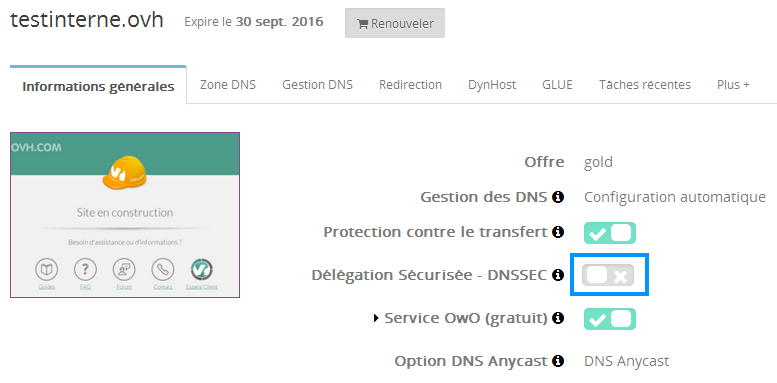

## Vereisten

- Uw domeinnaam moet worden geregistreerd bij OVH, een technisch vereiste vanwege de noodzaak voor DNS-records om up-to-date te zijn in het register.
- Het moet een van de volgende extensies bevatten: .co.uk, .com, .net, .eu, .fr, .be .pl, .re, .pm, .yt, .wf, .tf, .info, .li, .ch, .biz, .de, .sx, .org, .se, .nl, .in, .us, .at, .nu, .la, .ac, .cz, .me, .sh, .io, .uk, .me.uk, .org.uk, of een andere onlangs uitgebrachte nieuwe extensie, zoals .london, .club, .xyz, .wiki, .ink, en alle andere Donuts extensies, (andere extensies verschijnen binnenkort).


## Twee praktijkgevallen

- U kunt uw domein hosten op derde partij DNS servers (uw dedicated server of een andere machine). 

- U kunt ook gebruik maken van shared DNS bij OVH. Dit is het praktijkgeval dat wordt beschreven in deze handleiding. We zullen dan de keys, hun periodieke rotatie, de update van het DS-record en de zone signature op een transparante manier voor u beheren.


Indien u twijfels heeft kunt u dit controleren door naar uw [manager](https://www.ovh.com/manager/web) te gaan door uw domein te selecteren en vervolgens naar 'DNS beheer' te gaan. 

Wanneer de DNS servers als volgt worden weergegeven: 
nsXX.ovh.net and dnsXX.ovh.net, or Xns200.anycast.me dan heeft u de OVH DNS-servers op de juiste manier ingesteld.


## Activering

- Allereerst dient u zich in te loggen op uw [control panel](https://www.ovh.com/manager/web).


Selecteer vervolgens de relevante domeinnaam in het 'Domeinen' gedeelte.

{.thumbnail}

- In het 'DNS beheer' gedeelte kunt u nagaan of u OVH DNS servers gebruikt.


{.thumbnail}

- Zodra u de DNS gecontroleerd heeft klikt u op de 'Beveiligde Delegatie' (DNSSEC) knop.


{.thumbnail}

- Er zal een pop-up venster verschijnen zodat u de procedure kunt bevestigen. U zult de melding krijgen dat de activering van DNSSEC tot 24 uur kan duren.


{.thumbnail}

- De beveiligde delegatie-knop wordt dan gekleurd.


{.thumbnail}

- Vervolgens kunt u in de 'Lopende Acties' tab kijken of de procedure van start is gegaan.


{.thumbnail}


## Deactivering
Om DNSSEC uit te schakelen selecteert u opnieuw uw domein en klikt u op de knop  DNSSEC deactiveren. Er zal een nieuw pop-venster verschijnen waarmee u de actie kunt bevestigen.   

Hou er rekening mee dat als de activering wordt uitgevoerd u dient te wachten totdat deze is voltooid (de knop zal grijs zijn). Hiermee wordt voorkomen dat de DNSSEC configuratie van uw domein in een tussenstadium blijft staan.

{.thumbnail}


## Methode 1: gebruik van Firefox en Chrome
U kunt een Firefox extensie gebruiken, die het mogelijk maakt om te controleren of de sites die u bezoekt, worden beveiligd door DNSSEC, en zo ja, wat het resultaat is van de validatie. Deze extensie [url = http://www.dnssec-validator.cz/]vindt u hier[/url]. Eenmaal geïnstalleerd, ziet u een toets aan de linkerkant van de adresbalk van uw browser. Voor domeinen waar de key groen is, werd het IP geverifieerd via DNSSEC.

{.thumbnail}
Als de key oranje is dan betekent dit dat de recursieve DNS van uw ISP geen DNSSEC ondersteunt. Dit hoeft geen probleem te zijn: u kunt gebruik maken van alternatieve DNS servers om deze validatie uit te voeren. De Firefox module biedt een lijst die u kunt bekijken door met de rechtermuisknop te klikken op de key en vervolgens de optie "Voorkeuren" te kiezen.

Een alpha-versie van deze extensie is ook beschikbaar voor Chrome op [deze pagina](https://chrome.google.com/webstore/detail/hpmbmjbcmglolhjdcbicfdhmgmcoeknm).


## Methode 2: via de console-modus, met voorafgaande opgave van de root key
Om te controleren of DNSSEC correct is geconfigureerd voor een domein, kunt u gebruik maken van hetdig tool. Voor het uitvoeren van de DNSSEC validatie, heeft u de public root key nodig (waarmee de key is gesigneerd, die de root-zone "." heeft gesigneerd). Deze key is te vinden op verschillende plaatsen op het internet. Om het makkelijker te maken, hebben we hieronder de key weergegeven, die u kunt kopiëren zoals deze in het bestand /etc/trusted-key.key is te vinden (alles dient op dezelfde regel te zijn):


```
. 172717 IN DNSKEY 257 3 8 AwEAAagAIKlVZrpC6Ia7gEzahOR+9W29euxhJhVVLOyQbSEW0O8gcCjF
FVQUTf6v58fLjwBd0YI0EzrAcQqBGCzh/RStIoO8g0NfnfL2MTJRkxoX
bfDaUeVPQuYEhg37NZWAJQ9VnMVDxP/VHL496M/QZxkjf5/Efucp2gaD
X6RS6CXpoY68LsvPVjR0ZSwzz1apAzvN9dlzEheX7ICJBBtuA6G3LQpz
W5hOA2hzCTMjJPJ8LbqF6dsV6DoBQzgul0sGIcGOYl7OyQdXfZ57relS
Qageu+ipAdTTJ25AsRTAoub8ONGcLmqrAmRLKBP1dfwhYB4N7knNnulq
QxA+Uk1ihz0=
```


Let op, kopieer dit niet zonder zijn authenticiteit te controleren. Met DNSSEC, zoals in elk cryptografisch systeem dat op een "chain of trust" werkt, is het principe van de root items die per definitie worden vertrouwd het voornaamst. Het officiële distributiepunt is [op IANA](https://data.iana.org/root-anchors/), en het bestand zelf wordt gesigneerd met GPG.
Het uit te voeren commando is als volgt, we willen hier het IP valideren van www.eurid.eu:

```
$ dig +sigchase www.eurid.eu
;; RRset to chase:
www.eurid.eu. 544 IN CNAME eurid.eu.
[...]
;; WE HAVE MATERIAL, WE NOW DO VALIDATION
;; VERIFYING DS RRset for eu. with DNSKEY:55231: 
success
;; OK We found DNSKEY (or more) to validate the RRset
;; Ok, find a Trusted Key in the DNSKEY RRset: 19036
;; VERIFYING DNSKEY RRset for . with DNSKEY:19036: 
success

;; Ok this DNSKEY is a Trusted Key, DNSSEC validation is ok: SUCCESS
```


De laatste regel geeft aan dat de validatie is geslaagd, omdat de "chain of trust" met succes kan worden verhoogd en alles in orde is, tot aan de public key van de root zone.

Indien u de volgende melding krijgt, dan had dig de root key niet gevonden in /etc/trusted-key.key:

```
$ dig + sigchase www.eurid.eu
No trusted keys present
```


## Methode 3: in console modus, zonder voorafgaande invoering van de root key
Indien u de public key niet kunt invoeren zoals hierboven, dan is er nog een derde DNS server, die de validatie voor u kan doen. Sommige recursieve DNS servers, die DNSSEC valideren, staan ter beschikking van het publiek door verschillende instanties. Een voorbeeld ervan is [DNS-OARC](https://www.dns-oarc.net/oarc/services/odvr), welke we in onderstaand voorbeeld gebruiken, waar we de IP van www.eurid.eu proberen te valideren:


```
$ dig + dnssec www.eurid.eu @ 149.20.64.21

; << >> DiG 9.7.3 << >> + dnssec www.eurid.eu 
@149.20.64.21
,, global options: + cmd
,, Got answer:
; ->>HEADER<<- opcode: QUERY, status: NOERROR, id: 26117
,, flags: qr rd ra ad; QUERY: 1, ANSWER: 6, AUTHORITY: 7, ADDITIONAL: 16
[...]
```


Hier is de "ad" vlag aanwezig, welke aangeeft dat de response die u ontvangt, gevalideerd is door de recursive resolver.

