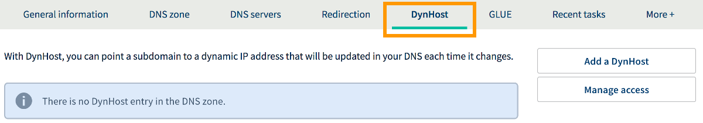
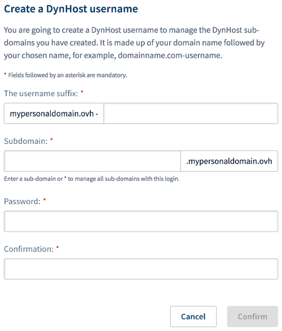
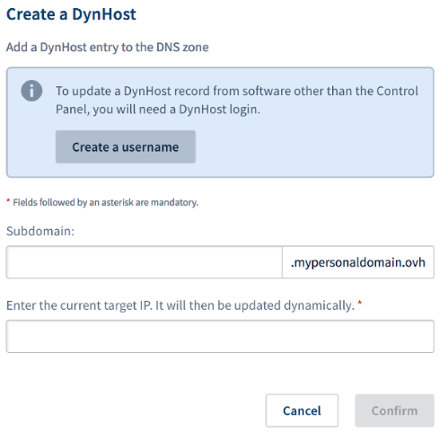
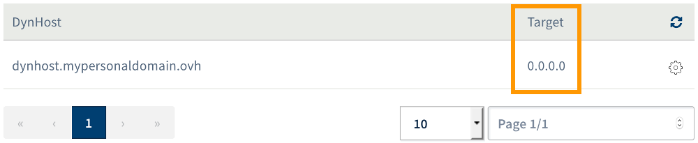

**Last updated 19th July 2018**

## Objective

A Domain Name System (DNS) zone is a domain name’s config file. It is composed of technical information, otherwise called ‘records’. For a number of applications, such as hosting your own gaming server without a fixed IP address, dynamically updating a DNS record may be necessary to avoid any prolonged service interruptions. 

**Find out how to configure a dynamic DNS record (DynHost) for your OVH domain name.**

## Requirements

- permission to manage the domain name from the [OVH Control Panel](https://www.ovh.com/auth/?action=gotomanager){.external}
- the OVH domain name configuration (on OVH's DNS servers)
- The DynHost record you are about to create must not already exist as an A record in your domain name’s OVH DNS zone.

> [!warning]
>
> - If your domain name does not use OVH's DNS servers, you will need to contact the service provider managing its configuration in order to find out what approach you need to take.
> 
> - If your domain name is registered with OVH, you can check if the domain name is using our configuration. To do this, go to the [OVH Control Panel](https://www.ovh.com/auth/?action=gotomanager){.external}, select the domain concerned, and go to the `DNS servers`{.action} tab.
>

## Instructions

### Step 1: Create a DynHost username.

The first step involves creating a DynHost username. Once you do so, you can then update the dynamic DNS record you would like to create. First of all, log in to the [OVH Control Panel](https://www.ovh.com/auth/?action=gotomanager){.external}, click `Domains`{.action} in the services bar on the left-hand side, then choose the domain name concerned. Next, go to the `DynHost`{.action} tab.

{.thumbnail}

Click on the `Manage access`{.action} button, then `Create a username`{.action}. In the pop-up window, enter the following information:

|Information|Description|
|---|---|
|Username suffix|Define a suffix for the DynHost username you are creating.|
|Subdomain|Specify the subdomain you are creating the dynamic DNS record for.|
|Password|Define a password for the DynHost username, then confirm it.|

Once you have filled in all of the required fields, click `Confirm`{.action}. The username will then appear in the table on the current page. Repeat this step if you need additional DynHost usernames.

{.thumbnail}

### Step 2: Create the dynamic DNS record (DynHost).

This second step involves creating the DNS record that must be updated dynamically. As a reminder, it must not already exist in your domain name’s OVH DNS zone as an A record. For advice on how to check this and delete the A record if necessary, please read our guide to [Editing an OVH DNS zone](https://docs.ovh.com/gb/en/domains/web_hosting_how_to_edit_my_dns_zone/){.external}.

Once you are ready to create the DynHost record, go to the `DynHost`{.action} tab, then click `Add a DynHost`{.action}. In the pop-up window, enter the following information:

|Information|Description|
|---|---|
|Subdomain|Enter the subdomain that the DNS record must be dynamically updated for. This subdomain must be identical to the one you entered when you created the DynHost username.|
|Target IP|Enter the IP address that must currently be used by the DNS record. In accordance with DynHost principles, the IP will then be updated.|

Once you have filled in all of the required fields, click `Confirm`{.action}. The DynHost record will then appear in the table on the current page. Repeat this step if you need additional DynHost records.

{.thumbnail}

### Step 3: Automate the DynHost change.

Now that the username and the DynHost record have been created, this final step involves automating updates to the DNS record, so they are made dynamically. To do this, you need to use a client that regularly checks if the target IP has changed, so that it can be updated as required.

> [!warning]
>
> You will need to rely on your own knowledge to set up and configure the client. We have provided general information on how to proceed below. Nevertheless, we recommend contacting a specialist provider if you encounter any difficulties. We will not be able to assist you with this ourselves. 
>

There is a wide range of options for this, so please note that this client may already be installed on your server or computer. Otherwise, it may already be available on your router’s interface, if it is compatible. Once you have chosen and installed the client, you will need to configure it using the details for the DynHost username you created in step 1.

Depending on the client you are using, you may need to provide an update URL address, as well as further information on the DynHost username and subdomain concerned. If this is the case, use the URL template below, and take care to replace the generic information with your own information:

http://www.ovh.com/nic/update?system=dyndns&hostname=**$HOSTNAME**&myip=**$IP**

|Information|Replace with|
|---|---|
|$HOSTNAME|The subdomain you are modifying the DNS configuration for.|
|$IP|The new target IP address.|

To check that the target IP address has been updated, go to the `DynHost`{.action} tab in the OVH Control Panel. Check the IP address that appears in the `Target`{.action} column.

{.thumbnail}

## Go further

Join our community of users on <https://community.ovh.com/en/>.