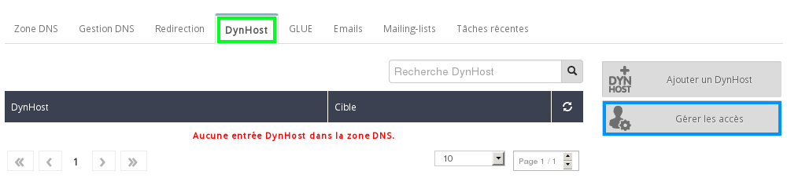
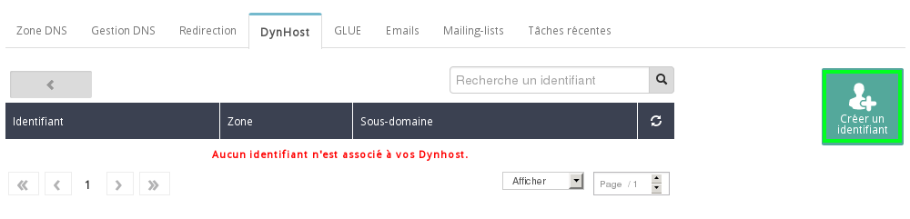
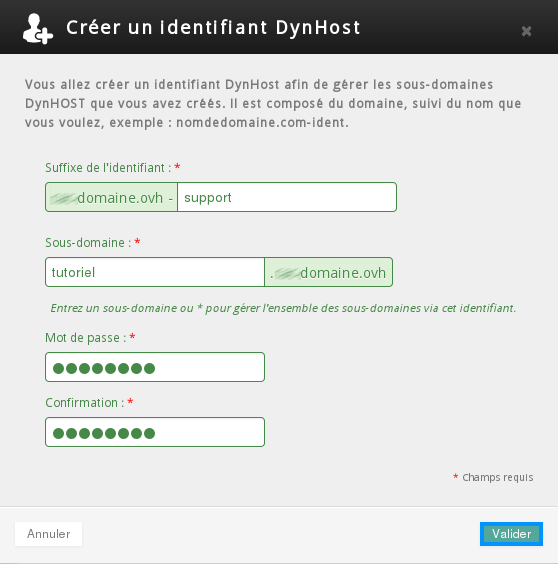
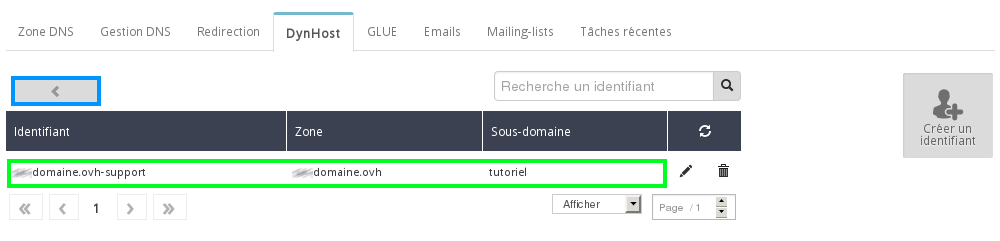
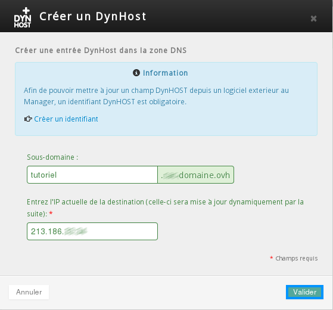
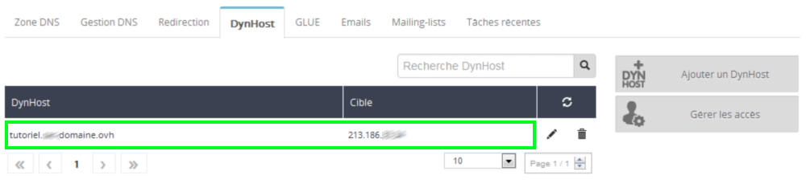
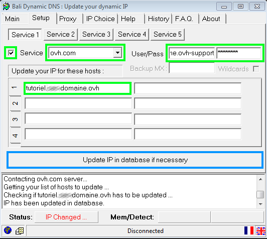
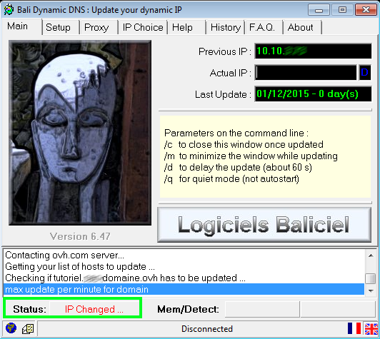
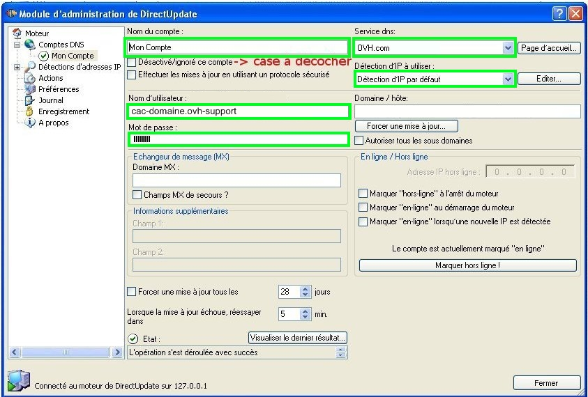

## Vaatimukset

- OVH:lle rekisteröity verkkotunnus
- Käytät OVH:n nimipalvelimia verkkotunnuksellasi

## Määritelmät

- IP-osoite

Internetissä tietokoneet kommunikoivat keskenään TCP/IP-protokollalla, joka identifioi jokaisen verkon ja jokaisen tietokoneen osoitteen muodossa: xxx.xxx.xxx.xxx

- Nimipalvelin(DNS)

Käyttäjät kommunikoivat IP-osoitteiden avulla, joiden muistaminen olisi toivotonta. Asian helpottamiseksi numeeriset osoitteet on muunnettu helpommin muistettaviksi aseman nimiksi tai osoitteiksi: nämä ovat nimipalvelimia (DNS eli Domain Name System).

## Mihin DynHostia käytetään?
Jos sinulla on internetyhteys, IP-osoitteesi saattaa vaihtua jokaisella yhdistyskerralla.
DynHOSTin avulla verkkotunnuksen tai aliverkkotunnuksen voi asettaa osoittamaan IP-osoitetteeseen, ja jos se muuttuu, muuttamaan sitää reaaliajassa tunnuksen ja salasanana avulla. 
Näin voit ylläpitää webhotelliasi oman internetyhteytesi kautta.

## Kirjautuminen hallintapaneeliin

- Kirjaudu hallintapaneeliin käyttäjätunnuksillasi.

- Klikkaa "Kirjaudu" toimenpiteen vahvistamiseksi

{.thumbnail}

## Verkkotunnuksen valinta

- Valitse vasemmanpuoleisesta valikosta "Verkkotunnukset" ja sitten verkkotunnuksen" johon haluat luoda DynHostin.

{.thumbnail}

## Yhteyksien hallinta

- Klikkaa kuvaketta DynHost, sitten "Yhteyksien hallinta"

{.thumbnail}

- Klikkaa sitten "Luo tunnus"

{.thumbnail}

- Ilmoita ikkunassa pyydetyt tiedot:

- Käyttäjätunnus
- Verkkotunnus
- Salasana

- Kilkkkaa sitten "Vahvista".

{.thumbnail}
Voit nähdä luomasi tilin sekä liitetyn aliverkkotunnuksen.

- Klikkaa seuraavaksi painiketta paluu.

{.thumbnail}

## DynHostin luominen
-Klikkaa "Lisää DynHost".

{.thumbnail}
Ilmoita tässä:

- aliverkkotunnus, johon DynHost asetetaan.
- nykyisen kohteenIP-osoite
- Klikkaa sitten "Vahvista"

{.thumbnail}
Huomaa:

- Kentän luomisessa kestää 24 tuntia

- Nyt voit nähdä luomasi DynHostin aliverkkotunnuksen ja IP-osoitteen kanssa.

{.thumbnail}
Huomaa:

- A-tyypin rekisteröinnin luonti DNS-alueella on automaattinen

## Bali Dynamic DNS (ilmainen)

- Täytä Bali Dynamic DNS -työkalussa tarvittavat kentät vihreällä ja klikkaa sitten "Update IP in database if necessary".

{.thumbnail}

- Tila "IP changed" tulee näkvyiin, mikä tarkoittaa että IP-osoitteesi on päivitetty.

{.thumbnail}

## Direct Update (Shareware)
Direct Update -työkalussa riittää pyydettyjen kenttien vihreällä täyttäminen ja laatikon "Deaktivoi/älä huomioi tiliä" rastittaminen.

{.thumbnail}

