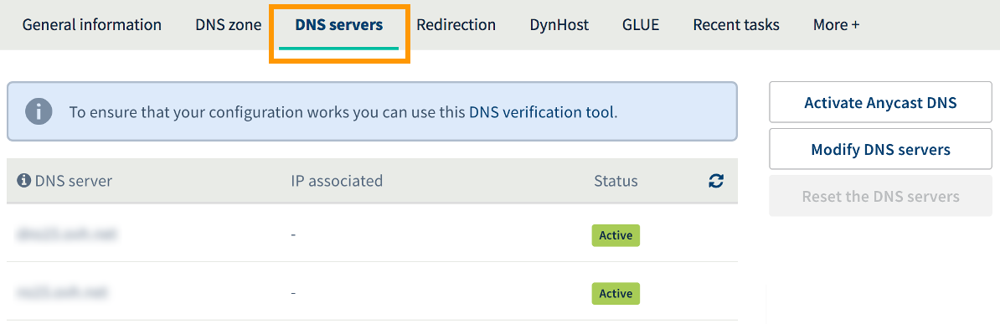
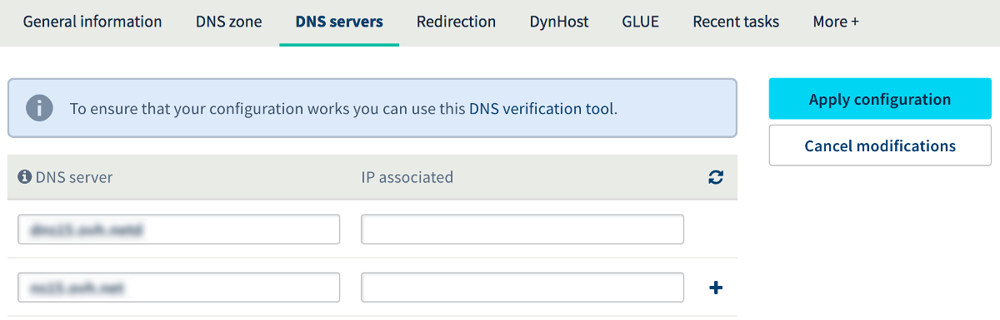

**Last updated May 11th, 2018**

## Objective

DNS servers are designed to store DNS configurations for domain names. These configuration areas, which are called DNS zones, contain technical information in the form of records. DNS records are usually used to link your domain name to the server (or servers) that host your website and email addresses.

In other words, these records stored on DNS servers are what make your domain names accessible on the internet.

**Find out how to edit the DNS servers for your OVH domain name.**

## Requirements

- You must have a domain name registered with OVH.
- You must have the [appropriate permissions to manage](https://docs.ovh.com/gb/en/customer/managing-contacts/){.external}. the domain name from your [OVH Control Panel](https://www.ovh.com/auth/?action=gotomanager){.external}.
- You must be logged in to your [OVH Control Panel](https://www.ovh.com/auth/?action=gotomanager){.external}.

> [!warning]
>
> If your domain name is not registered with OVH, you will need to edit the DNS servers using the interface given by the service provider that manages it.
>

## Instructions

**We strongly recommend taking great care when you edit a domain name’s DNS servers.** Incorrect changes could render your website inaccessible, and prevent your email addresses from receiving new emails. By learning more about the impact of modifying DNS servers, you can get a better understanding of the changes you will make.

When you modify your domain name’s DNS servers, you are modifying its DNS configuration. The new configuration replaces the old one, and is stored on the newly-set DNS servers. Technically, the domain then uses a new DNS zone.

However, it is important to note that:

- The content of the old DNS configuration is not automatically replicated in the new configuration. Please ensure that your new configuration includes all of the information required for the services associated with your domain name to work properly (e.g. your website and email addresses).

- If you only want to edit a single element of your current DNS configuration (e.g. one DNS record), we recommend following our guide to editing the DNS zone instead: [Editing an OVH DNS zone](https://docs.ovh.com/gb/en/domains/web_hosting_how_to_edit_my_dns_zone/){.external}.

- Some of the organisations that manage the domain name extensions (registries) have special requirements regarding DNS Servers (amount of nameservers, value of records, ...). In case of doubt, check with the registry responsible for the domain ending.

> [!warning]
>
> Before you start making any changes, please ensure that the changes you are about to make will not render your domain name inaccessible. If you are unsure about this, please check with the person asking you to make these changes.
>

### Step 1: Access the area for managing your domain’s OVH DNS servers

First of all, log in to your [OVH Control Panel](https://www.ovh.com/auth/?action=gotomanager){.external}, click `Domains`{.action} in the services bar on the left-hand side, then choose the domain name concerned. Next, go to the `DNS servers`{.action} tab.

The table that appears will show the DNS servers currently set with OVH for your domain name. Several DNS servers may be listed, each with their own row in the table.

{.thumbnail}

### Step 2: Edit your domain’s DNS servers

To start editing your DNS servers, click the `Modify DNS servers`{.action} button.

In the text fields, replace the current DNS server details with the information for the new servers you would like to set. To add more servers to the current list, click the `+`{.action} icon to the right of the last table line. An additional row will then appear in the table, with text fields you can complete.

Once you have entered this information, click `Apply configuration`{.action}. The statuses for the DNS servers will then update in the table, showing the new information that you have just provided.

> [!primary]
>
> By clicking the `Reset the DNS servers`{.action} button, you can change the current DNS servers by automatically resetting them to the original OVH DNS servers. We advise only using this option if you would like to use OVH’s DNS servers again. 
>

{.thumbnail}

### Step 3: Wait for the modifications to fully propagate

Once you have made the required changes, you will need to wait for them to become fully effective. Two successive time periods need to be taken into account:

- The change made on the OVH side needs to be taken into account by the organisation that manages your domain name extension (registry). You can track the progress for this in your [OVH Control Panel](https://www.ovh.com/auth/?action=gotomanager){.external} by going to the `Domains`{.action} section in the services bar on the left-hand side, then `Ongoing operations`{.action}.

- Once the change has been taken into account by the organisation managing your domain name extension, you will need to wait for a maximum of 48 hours for the changes you have made to fully propagate.

## Go further

[Editing an OVH DNS zone](https://docs.ovh.com/gb/en/domains/web_hosting_how_to_edit_my_dns_zone/){.external}.

Join our community of users on <https://community.ovh.com/en/>.
