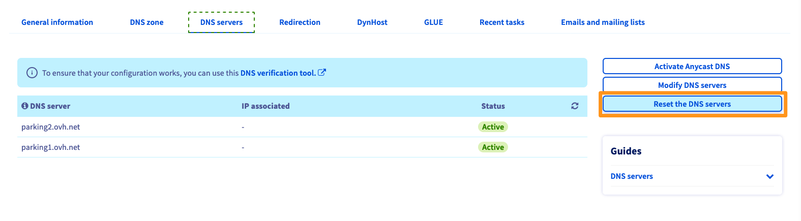

**Last updated 18th February 2021**

## Objective

### Understanding DNS 

DNS stands for **D**omain **N**ame **S**ystem and is a set of elements used to map a domain name to an IP address.

See the full explanation in our guide on [Editing an OVHcloud DNS zone](../web_hosting_how_to_edit_my_dns_zone/#understanddns).

### DNS servers 

**DNS servers** contain DNS configuration files for domain names, called **DNS zones**.

{.thumbnail}

DNS servers are generally used in groups of two (primary and secondary), in order to obtain redundancy in the event of one of the DNS servers failing.

**This guide explains how to edit the DNS servers for your OVHcloud domain name.**

<iframe width="560" height="315" src="https://www.youtube-nocookie.com/embed/BvrUi26ShzI" frameborder="0" allow="accelerometer; autoplay; clipboard-write; encrypted-media; gyroscope; picture-in-picture" allowfullscreen></iframe>

## Requirements

- a [domain name](https://www.ovhcloud.com/en/domains/) registered with OVHcloud
- access to the [OVHcloud Control Panel](https://ca.ovh.com/auth/?action=gotomanager&from=https://www.ovh.com/world/&ovhSubsidiary=we)

> [!primary]
>
> If your domain name is not registered with OVHcloud, you will need to modify the DNS servers using the interface provided by the service provider that manages it.
>

## Instructions

> [!warning]
>
> **We recommend taking care when you modify a domain name’s DNS servers.** A misconfiguration can make your website inaccessible or prevent your email addresses from receiving new emails. By learning more about the impact of making configuration changes, you can get a better understanding of the changes you will make.
>

When you modify your domain name’s DNS servers, you are modifying its DNS configuration. The new DNS configuration replaces the old one and is stored on the newly-defined DNS servers. Technically, the domain name then uses a new DNS zone.

However, it is important to note that:

- When declaring different DNS servers (for example: OVHcloud DNS servers replacing external ones), the content of the old DNS configuration is not automatically replicated in the new configuration. Ensure that your new DNS zone includes all of the DNS records required for the services associated with your domain name to work correctly (for example, your website and email addresses).

- If you only want to modify one element of your current DNS configuration (i.e. a DNS record), we recommend following our guide to [modify the DNS zone](../web_hosting_how_to_edit_my_dns_zone/) instead.

- Some organisations and registries managing domain name extensions have specific requirements for DNS servers (number of name servers, value of records, etc.). If in doubt, check with the registry responsible for the domain.

Please ensure that the modifications will not render your domain name inaccessible. If you are unsure of this, please contact the person asking you to make these changes.

### Accessing the OVHcloud DNS server management

First, log in to the [OVHcloud Control Panel](https://ca.ovh.com/auth/?action=gotomanager&from=https://www.ovh.com/world/&ovhSubsidiary=we) and go to the `Web Cloud`{.action} section. Click `Domain names`{.action}, then choose the domain name concerned. Go to the `DNS servers`{.action} tab.

The table that appears will list the DNS servers currently set by OVHcloud for your domain name. Several DNS servers can be listed, each with its own row in the table.

> [!primary]
>
> When you use OVHcloud DNS servers, the server numbers are not linked to the service(s) you are using. Only the [DNS Anycast](https://www.ovhcloud.com/en/domains/options/dns-anycast/) option uses specific DNS servers that are automatically assigned to you.

{.thumbnail}

### Modifying DNS servers

If you would like to use external DNS servers, you will need to **replace** the current OVHcloud ones, instead of adding them to the configuration.

Click `Modify DNS servers`{.action} on the right-hand side.

In the text fields, **replace** the current DNS server values with the information about the new servers you want to set. To add more servers to the current list, click the `+`{.action} button to the right of the last table row. An additional row will then appear in the table, with text fields that you can fill in.

> [!warning]
>
> Please do not mix one DNS server group with another. 
> For example, *dns19.ovh.net* and *ns19.ovh.net* correspond to a group of OVHcloud DNS servers, they are identical and synchronised. If you add DNS servers that are external to OVHcloud (or from a different OVHcloud group), the DNS resolution will be random between the OVHcloud DNS servers and the external DNS servers entered.

Once you have entered this information, click `Apply configuration`{.action}. The statuses of the DNS servers will then be updated in the table, and will display the new information you have just provided.

{.thumbnail}

### Resetting DNS servers

By clicking the `Reset the DNS servers`{.action} button, you can reset the current DNS servers by automatically replacing them with the original OVHcloud DNS servers. We only recommend using this option if you would like to use OVHcloud DNS servers again. 

{.thumbnail}

Once you have made the required changes, there is a waiting period for them to become fully effective. Two successive periods must be taken into account:

- The change made on the OVHcloud side must be taken into account by the registry that manages your domain name extension. You can track the progress for this operation in your [OVHcloud Control Panel](https://ca.ovh.com/auth/?action=gotomanager&from=https://www.ovh.com/world/&ovhSubsidiary=we) by going to the `Domains`{.action} section, then `Ongoing operations`{.action}.
- Once the change has been taken into account by the organisation managing your domain name extension, it will take a maximum of 48 hours for the changes you have made to be fully propagated.

## Go further

[Editing an OVHcloud DNS zone](../web_hosting_how_to_edit_my_dns_zone/){.external}.

Join our community of users on <https://community.ovh.com/en/>.
