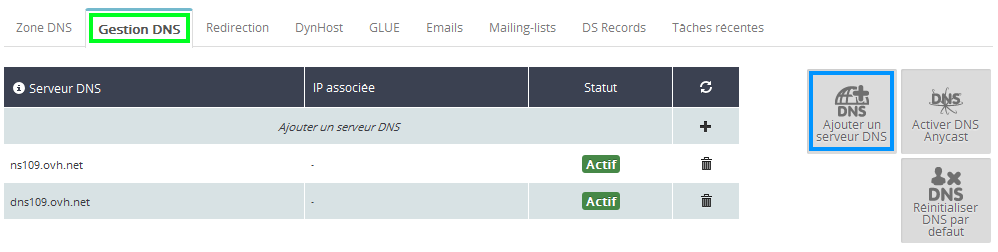
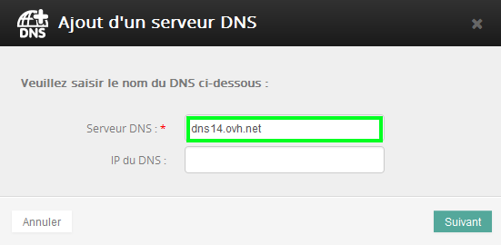
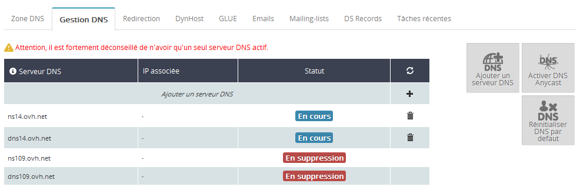
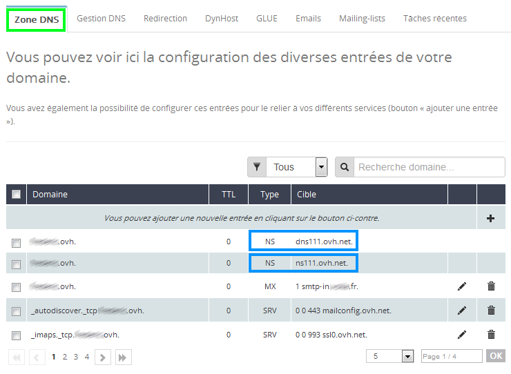

## Généralités sur les DNS

### Définition
Le DNS (ou Domain Name System) permet entre autres de traduire un nom de domaine en adresse IP afin que vos requêtes puissent arriver jusqu'au serveur cible.

{.thumbnail}

### Differences serveurs/zone DNS
- Les serveurs DNS sont les serveurs étant déclarés pour un nom de domaine. C'est donc ces serveurs qui répondront en premier avant de passer la main à la zone DNS y étant reliée.
- La zone DNS est un fichier contenant différents enregistrements indiquant entre autres les adresses des serveurs hébergeant votre site (A), ou vos mails (MX). Ces adresses peuvent être sous la forme d'adresse IP ou de noms d'hôtes.

### Pourquoi editer ses serveurs ou sa zone DNS ?
Il peut être nécessaire de modifier ses serveurs DNS quand vous changez de registrar. En effet, certains registrars ne permettent pas de continuer à utiliser leurs serveurs une fois que basculer votre domaine chez un concurrent. Il est aussi possible que vous disposiez d'un serveur dédié faisant office de serveur DNS, et que vous désirez utiliser pour gérer votre domaine. Lorsque vous désirez modifier le serveur hébergeant votre site ou vos mails suite à un changement d'hébergeur par exemple, il vous faudra modifier votre zone DNS. Une fois celle-ci mise à jour, votre domaine pointera vers ces nouveaux serveurs.

Un guide sur la zone DNS est disponible ci-dessous :

- {.ref} .

## Modification de vos serveurs DNS

### Connexion a l'espace client
- Connectez-vous dans [l'espace
client](https://www.ovh.com/manager/web){.external} à l'aide de votre couple identifiant (nic-handle) - mot de passe.
- Cliquez sur "Connexion" pour valider l'opération.

{.thumbnail}

### Selection du domaine
- Dans le menu de gauche, sélectionnez " Domaines ", puis " votre domaine " à modifier.

{.thumbnail}

### Ajout des nouveaux serveurs DNS
- Rendez-vous ensuite dans " Gestion DNS " et sélectionnez " Ajouter un serveur DNS ".

{.thumbnail}

- Indiquez le premier serveur DNS à ajouter, puis validez et faite de même pour le 2ème serveur DNS.

{.thumbnail}

### Suppression des anciens serveurs DNS
- Cliquez sur L'icône " poubelle " au niveau des 2 anciens serveurs DNS à supprimer puis validez.

{.thumbnail}

- La suppression est en cours.

{.thumbnail}

- Après quelques minutes, la mise à jour est finalisée.

{.thumbnail}

### Reinitialiser ses serveurs DNS par defaut
En cas de mauvaises manipulations de votre part, il vous est possible de remettre en place vos serveurs DNS par défaut.

- Rendez-vous dans "Gestion DNS" et sélectionnez " Réinitialiser DNS par défaut ".

{.thumbnail}

- Cliquez sur " Valider " afin de confirmer la réinitialisation.

{.thumbnail}

## Informations utiles

### Comment connaitre les serveurs DNS qu'OVH vous a attribue
Afin de savoir quels serveurs DNS OVH vous a attribué, il vous faudra récupérer cette information en cliquant sur "Zone DNS", puis en visualisant les 2 "enregistrements NS" présent dans votre zone.

{.thumbnail}

### Gestion avancee des DNS avec le Glue Registry
Afin de créer vos Glue Registry, rendez-vous sur ce guide : {.ref}

### Delais

> [!alert]
>
> Serveurs DNS
> - 
> Toutes modifications de vos serveurs DNS peut prendre jusqu'à 48h .
> - 
> Toutes modifications dans votre zone DNS peut prendre jusqu'à 24h .
> 
> 