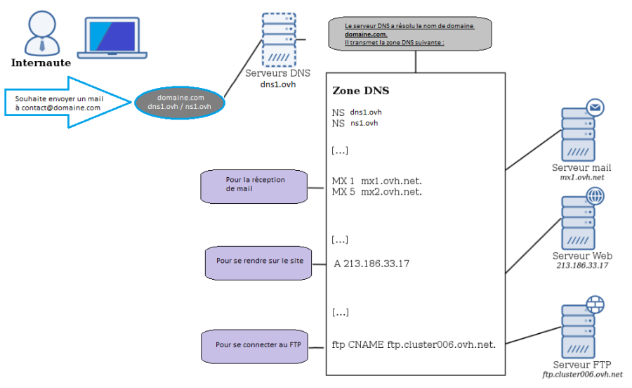
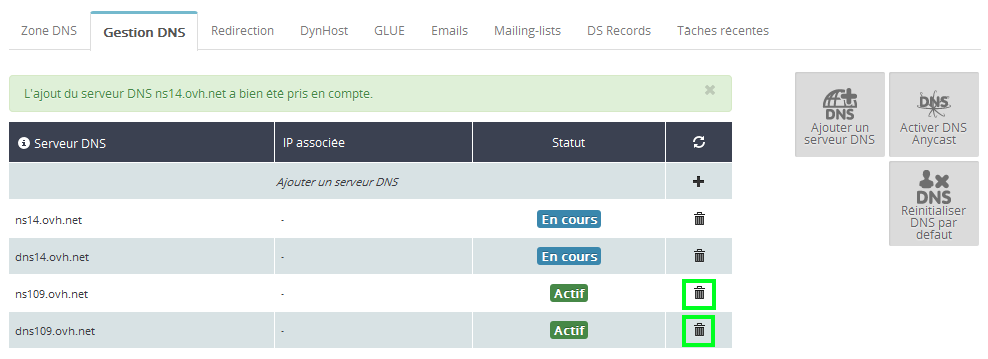
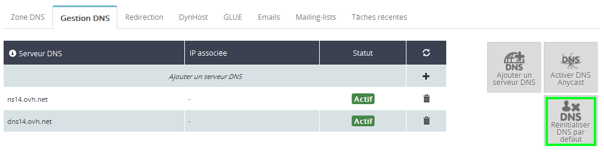
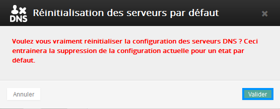

## Definizione
Il DNS (o Domain Name System) è un sistema che permette di tradurre un dominio in indirizzo IP, in modo che le tue richieste possano raggiungere il server di destinazione.

{.thumbnail}

## Differenze server/zona DNS

## Server DNS

- I server DNS sono i server dichiarati per un dominio. Rispondono per primi alle richieste e poi le reindirizzano alla zona DNS associata.

## Zona DNS

- La zona DNS è un file che contiene i diversi record corrispondenti agli indirizzi dei server che ospitano il tuo sito (A) o le tue email (MX). Questi indirizzi possono essere indirizzi IP o nomi di host.

## Perché modificare i tuoi server o la tua zona DNS?

## Server DNS
La modifica dei tuoi server DNS potrebbe essere necessaria, ad esempio, se decidi di cambiare Registrar. Alcuni di essi, infatti, non consentono di continuare a utilizzare i loro server a coloro che decidono di trasferire il proprio dominio alla concorrenza.
È possibile anche utilizzare uno dei tuoi server dedicati come server DNS, per gestire il tuo dominio.

## Zona DNS
La modifica della tua zona DNS è necessaria se decidi di cambiare il server che ospita il tuo sito o le tue email, ad esempio in seguito al passaggio a un altro provider.
Una volta che hai aggiornato la zona DNS, il tuo dominio punterà verso i nuovi server.

## Accedi al tuo Spazio Cliente OVH

- Accedi al tuo [Spazio Cliente OVH](https://www.ovh.com/manager/web), inserisci le tue credenziali e clicca su Login.

{.thumbnail}

## Seleziona il tuo dominio

- Nella sezione Domini del menu a sinistra, seleziona il dominio che vuoi modificare.

{.thumbnail}

## Aggiungi nuovi server DNS

- Clicca sulla tab Gestione DNS e poi seleziona Aggiungi un server DNS.

{.thumbnail}

- Indica il primo server DNS da aggiungere e conferma. Esegui la stessa operazione per il 2° server DNS.

{.thumbnail}

## Elimina i server DNS non necessari

- Clicca sull’icona del Cestino in corrispondenza dei server DNS da eliminare e conferma

{.thumbnail}

- L'operazione di eliminazione è in corso.

{.thumbnail}

- L'aggiornamento viene completato in pochi minuti.

{.thumbnail}

## Torna alla configurazione predefinita dei tuoi server DNS
In caso di errori nelle modifiche apportate, puoi ripristinare le impostazioni predefinite dei tuoi server DNS.

- Accedi alla sezione "Gestione DNS" e seleziona Reinizializza il DNS di default.

{.thumbnail}

- Clicca su Conferma per avviare l'operazione.

{.thumbnail}

## Come sapere quali server DNS ti ha assegnato OVH?
Per sapere quali server DNS ti ha assegnato OVH, clicca su Zona DNS e visualizza i Record NS presenti nella tua zona.

{.thumbnail}

## Gestione avanzata dei DNS con il Glue Registry
Per creare i tuoi Glue Registry, consulta questa guida:

## Quanto tempo serve perché le modifiche siano effettive?
Server DNS

- Per diventare effettive, le modifiche apportate ai tuoi server DNS possono richiedere fino a 48 ore.

Zona DNS
- Per diventare effettive, le modifiche apportate alla tua zona DNS possono richiedere fino a 24 ore.

