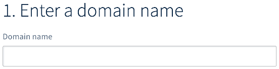
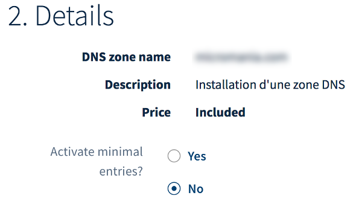
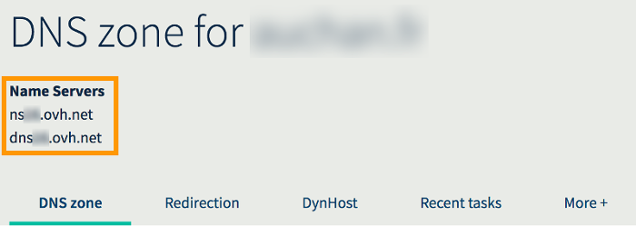

**Last updated 06th August 2018**

## Objective

A Domain Name System (DNS) zone is a domain name’s config file. It is composed of technical information, otherwise called ‘records’. DNS zones are usually used to link your domain name to the server (or servers) that host your website and email addresses.

For a number of reasons, you may need to create a DNS zone for your domain name at OVH.

**Find out how to create an OVH DNS zone for your domain name via the OVH Control Panel.**

## Requirements

- a domain name that does not already have an OVH DNS zone, and is not part of an operation or order currently being processed at OVH
- correct technical configuration for your domain name (status, SOA, etc.)
- access to the [OVH Control Panel](https://www.ovh.com/auth/?action=gotomanager){.external}

## Instructions

### Step 1: Create the DNS zone via the OVH Control Panel.

First of all, log in to the [OVH Control Panel](https://www.ovh.com/auth/?action=gotomanager){.external}. Click `Order`{.action} in the services bar on the left-hand side, then `DNS zone`{.action}.

In the page that pops up, enter the domain name you would like to create an OVH DNS for. Then wait a few moments for the tool to carry out its verifications on the domain name.

If a message appears notifying you that the DNS zone cannot be created, check that the domain name follows the requirements listed above, or ask the person managing it to do this for you. Once you have ensured that the domain name meets all requirements and is correctly configured, try again.

{.thumbnail}

Once the verifications are complete, you must choose whether to enable the minimal records for the DNS zone you are going to create. The way you set your DNS records is not permanent. You can change the records after you have created the DNS zone. 

|Enable minimal records?|Details|
|---|---|
|Yes|Select this option if you would like to customise the DNS zone yourself at a later stage.|
|No|Select this option if you are planning to use OVH services like a [Web Hosting plan](https://www.ovh.co.uk/web-hosting){.external}, since the zone has already been pre-configured.|

{.thumbnail}

Once you have selected an option, continue following the next steps until you have created the DNS zone.

### Step 2: Edit the DNS zone (optional).

Now that your domain name’s DNS zone has been created, you can edit it. This step is optional, but it may be essential if you want to ensure that any services linked to your domain name do not experience any downtime (e.g. your website and email services).

If you would like to edit this DNS zone, in the [OVH Control Panel](https://www.ovh.com/auth/?action=gotomanager){.external}, click `Domains`{.action} in the services bar on the left-hand side, then choose the domain name concerned. Go to the `DNS Zone`{.action} tab.

> [!primary]
>
> If you have just created the DNS zone but the domain name doesn’t appear under the list of services in the `Domains`{.action} section, please wait a few moments, then reload the page.
>

Once it appears, make the required changes. To learn more about how to edit a DNS zone, please read our guide to [Editing an OVH DNS zone](https://docs.ovh.com/gb/en/domains/web_hosting_how_to_edit_my_dns_zone/){.external}. Once you have modified your domain name’s OVH DNS zone, you will need to allow 4-24 hours for the changes to fully propagate and take effect.

### Step 3: Edit the DNS servers for a domain name.

Once the OVH DNS zone is ready to be used, you can then link it to your domain name. To do this, you will need to retrieve the details for the OVH DNS servers activated for your domain name in the OVH Control Panel. The servers will appear below `Name Servers`{.action}.

{.thumbnail}

Once you have the details, **edit your domain name’s DNS servers using the interface supplied by your domain name’s service provider.** Once you have modified the DNS zone configuration, you will need to allow 48 hours for the changes to fully propagate.

## Go further

[Editing an OVH DNS zone](https://docs.ovh.com/gb/en/domains/web_hosting_how_to_edit_my_dns_zone/){.external}.

Join our community of users on <https://community.ovh.com/en/>.