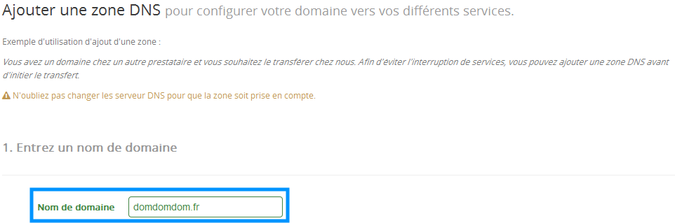
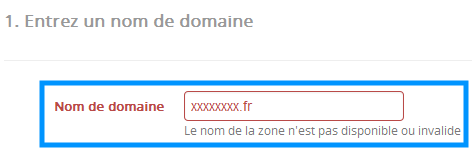
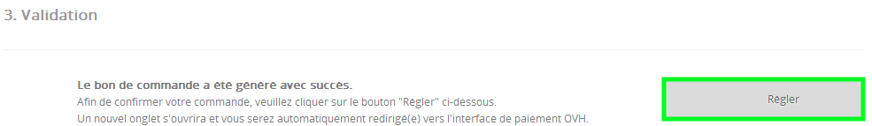
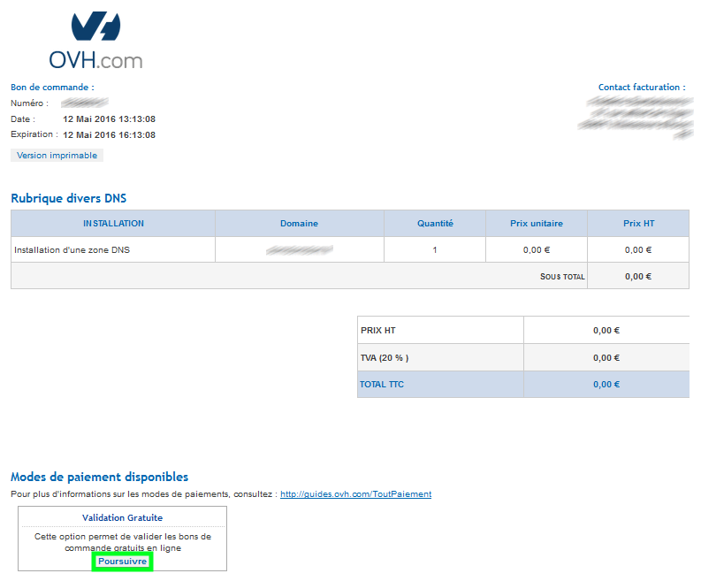
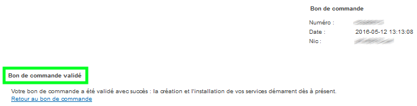

## Généralités

### Prérequis
Pour pouvoir Créer une Zone DNS pour un domaine externe, assurez-vous qu'il respecte les prérequis suivants :

- Aucune opération ou bon de commande ne doit être en cours pour ce domaine chez OVH
- Le domaine doit exister
- Le SOA du domaine doit être correctement mis en place dans sa zone DNS

## Procedure

### Étape 1 &#58; Verification du domaine
- Dans votre [espace client OVH](https://www.ovh.com/auth/?action=gotomanager){.external}, appuyez sur le bouton `Commander`{.action} situé en haut à gauche, puis sur `Zone DNS`{.action}.

{.thumbnail}

- Dans le cadre "Nom de domaine" , indiquez le domaine pour lequel créer la zone.

{.thumbnail}

> [!alert]
>
> - 
> Si le domaine indiqué n'entre pas dans les prérequis, il ne sera pas
> possible de créer de zone DNS
> 
> 

{.thumbnail}

> [!success]
>
> Si vous disposez d'un domaine n'ayant aucun serveur DNS de renseigné, OVH vous permet d'utiliser des serveurs DNS provisoires afin d'ajouter* la zone DNS :
> - 
> parking1.ovh.net
> - 
> parking2.ovh.net
> 
> 

### Étape 2 &#58; Choix du type de zone
Il vous faudra ensuite choisir le type de zone DNS :

- Minimale : Zone DNS avec les entrées minimales pour fonctionner (A, MX, CNAME, ...)
- Normale : Zone DNS avec des entrées supplémentaires (CNAME vers serveur POP/IMAP/SMTP, ...)

{.thumbnail}

### Étape 3 &#58; Validation
- Cochez la case "J'ai lu et j'accepte les contrats" .
- Cliquez ensuite sur "Générer le bon de commande" .

{.thumbnail}

- Cliquez ensuite sur "Régler" .

{.thumbnail}

- Une fois sur le bon de commande, cliquez sur "Poursuivre" .

{.thumbnail}

> [!success]
>
> La création de votre zone DNS est totalement gratuite.
> 

- Indiquez sur le code de sécurité et validez .

{.thumbnail}

### Étape 4 &#58; Confirmation de commande
Vous pourrez ensuite visualiser que votre bon de commande est bien validé.

{.thumbnail}

> [!success]
>
> Suite à la validation de votre bon de commande, un délai d'installation de
> 30mn peut être nécessaire.
> 