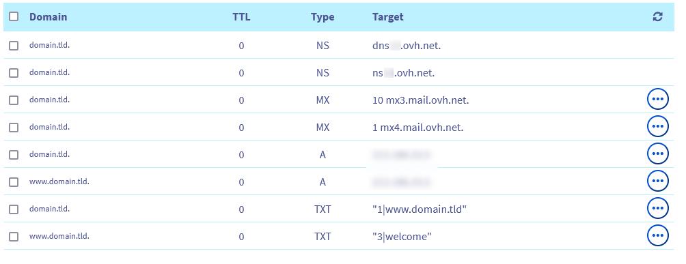

## Wprowadzenie

Strefa **D**omain **N**ame **S**ystem (**DNS**) nazwy domeny stanowi jej plik konfiguracyjny. Zawiera on informacje techniczne nazywane *rekordy DNS*. Strefa DNS jest jak ośrodek sterowania.

Możesz na przykład określić:

- Adres IP (rekordy DNS typu *A* i *AAAA*) Twojego hostingu, aby wyświetlić Twoją stronę WWW z Twoją domeną.
- Serwery e-mail (rekordy DNS typu *MX*), na które Twoja domena musi przekierować otrzymane e-maile. Możesz sprawdzić je na spersonalizowanym adresie e-mail z Twoją domeną.
- Informacje związane z bezpieczeństwem / uwierzytelnianiem usług (hosting, serwer www, serwer e-mail, itp.) powiązanych z Twoją domeną (rekordy DNS typu *SPF*, *DKIM*, *DMARC*, itp.).

W razie potrzeby zapoznaj się z naszą dokumentacją dotyczącą [rekordów DNS i edycji strefy DNS](/pages/web/domains/dns_zone_edit) w [Panelu klienta OVHcloud](https://www.ovh.com/auth/?action=gotomanager&from=https://www.ovh.pl/&ovhSubsidiary=pl).

Strefa DNS jest zainstalowana / zarejestrowana na **serwerach DNS**. Są to **serwery DNS**, które muszą być zadeklarowane u nazwy domeny, aby używać strefy DNS, którą hostują. 

**serwery DNS** działają zwykle w parze:

- Serwer DNS *główny*: przekierowuje strumienie zapytań otrzymanych przez domenę na strefę DNS, którą przechowuje dla domeny. Dzięki temu możesz wykonać *rozdzielczość DNS*, aby przekierować strumienie danych na prawidłowe usługi (serwery, stronę WWW, e-maile, itp.) powiązane z nazwą domeny.
- Serwer DNS *secondary*: ten serwer zapasowy* jest używany, jeśli serwer *główny* jest nasycony zapytaniami, jest niedostępny lub reaguje mniej szybko niż serwer *secondary*.

Niektórzy dostawcy DNS proponują 3 **serwery DNS** lub więcej do zadeklarowania w Twojej domenie, aby aktywować strefę DNS, którą hostują dla Twojej domeny.

Aby uzyskać więcej informacji na temat **serwerów DNS*, zapoznaj się z naszym [przewodnik](/pages/web/domains/dns_server_general_information) na ten temat.

Może zaistnieć konieczność utworzenia strefy DNS dla Twojej domeny w OVHcloud.

**Dowiedz się, jak utworzyć strefę DNS w OVHcloud dla Twojej domeny w Panelu klienta OVHcloud.**

## Wymagania początkowe

- Posiadanie domeny
- Nazwa domeny nie może mieć strefy DNS (aktywnej lub nieaktywnej) w OVHcloud ani podlegać operacji lub zamówieniu w trakcie realizacji.
- Dostęp do [Panelu klienta OVHcloud](https://www.ovh.com/auth/?action=gotomanager&from=https://www.ovh.pl/&ovhSubsidiary=pl){.external}.

## W praktyce

> [!warning]
>
> Dla tej samej domeny możesz utworzyć kilka stref DNS (u różnych dostawców/dostawców/hostingu DNS). Można utworzyć tylko jedną strefę DNS dla Twojej domeny. Ograniczenie to ma na celu zapobieganie *konfliktom DNS*.
>
> Aktywacja/dezaktywacja strefy DNS odbywa się po zgłoszeniu **serwerów DNS** w Twojej domenie. Możesz zmienić tę deklarację i zmienić **serwery DNS** domeny na: 
>
> - u *registrar*, u którego bezpośrednio zarejestrowałeś domenę;
> - od dostawcy zarządzającego domeną w przypadku przejścia przez wyspecjalizowanego dostawcę do zarządzania domeną.
>
> Zmiana **serwerów DNS** domeny powoduje wyłączenie konfiguracji starej strefy DNS używanej do konfiguracji nowej strefy DNS (obecnej w nowych zadeklarowanych **serwerów DNS**).
>
> Przed zmianą** serwerów DNS* zadeklarowanych u Twojej domeny sprawdź, czy konfiguracja nowej strefy DNS odpowiada Twoim oczekiwaniom.
>

### Etap 1: utworzyć strefę DNS w Panelu klienta OVHcloud

Zaloguj się do [Panelu klienta OVHcloud](https://www.ovh.com/auth/?action=gotomanager&from=https://www.ovh.pl/&ovhSubsidiary=pl){.external} i przejdź do sekcji `Web cloud`{.action}. W kolumnie po lewej stronie kliknij `Zamów`{.action}, następnie w ramce `Strefa DNS`{.action}.

Na stronie, która się wyświetla wprowadź nazwę domeny (przykład: *domain.tld*), dla której chcesz utworzyć strefę DNS. Odczekaj kilka chwil, aż narzędzie przeprowadzi weryfikację domeny.

Jeśli pojawi się komunikat informujący, że strefa DNS nie może zostać utworzona, sprawdź, czy domena spełnia niezbędne wymagania lub poproś osobę, która ją zarządza, o zrobienie tego dla Ciebie. Kiedy wszystko jest poprawne, spróbuj ponownie.

{.thumbnail}

Po zakończeniu weryfikacji, wybierz opcję aktywacji lub nie dodawania wpisów minimalnych w strefie DNS, którą utworzysz. Wybór ten nie jest ostateczny, ponieważ w przyszłości będziesz mógł [edytować rekordy strefy DNS](/pages/web/domains/dns_zone_edit).

{.thumbnail}

|Włącz minimalne wpisy?|Szczegóły|
|---|---|
|Tak|Wybierz ten wybór, jeśli chcesz samodzielnie spersonalizować strefę DNS. {.thumbnail}|
|Nie|Wybierz ten wybór, jeśli planujesz korzystać z usług OVHcloud takich jak [hosting WWW](https://www.ovhcloud.com/fr/web-hosting/){.external}, strefa jest wstępnie skonfigurowana do tego celu. {.thumbnail}|

Po dokonaniu wyboru wykonaj kolejne kroki, aż do utworzenia strefy DNS.

### Etap 2: edycja strefy DNS (opcjonalnie)

Po utworzeniu strefy DNS Twojej domeny możesz ją edytować. Operacja ta jest opcjonalna, ale może okazać się konieczna, jeśli chcesz zapewnić nieprzerwaną dostępność usług powiązanych z tą domeną (takich jak strona WWW i/lub konta e-mail).

Aby edytować strefę DNS, zapoznaj się z naszym przewodnikiem "[Edytuj strefę DNS w OVHcloud](/pages/web/domains/dns_zone_edit)".

> [!primary]
>
> Jeśli właśnie utworzyłeś strefę DNS i nazwa domeny nie wyświetla się jeszcze na liście Twoich usług (w części `Web cloud`{.action} w Panelu klienta OVHcloud, a następnie w sekcji `Domeny`{.action}), odczekaj 15-20 minut, a następnie przeładuj stronę.
>

Następnie wykonaj niezbędne operacje. Czas propagacji wprowadzonych w strefie DNS zmian wynosi od **4 do 24 godzin**.

### Etap 3: zmień serwery DNS domeny

Kiedy strefa DNS OVHcloud jest gotowa do użytku, powiąż ją z Twoją domeną, aby zastosować konfigurację, którą ona zawiera. 

Należy zatem pobrać z wyprzedzeniem **serwery DNS** OVHcloud, na których strefa DNS OVHcloud została utworzona dla Twojej domeny.

W tym celu zaloguj się do [Panelu klienta OVHcloud](https://www.ovh.com/auth/?action=gotomanager&from=https://www.ovh.pl/&ovhSubsidiary=pl){.external} i przejdź do sekcji `Web cloud`{.action}. W lewej kolumnie kliknij `Domeny`{.action} i wybierz odpowiednią strefę DNS. 

Po lewej stronie widnieje nazwa Twojej domeny, a po lewej stronie widnieje logo w kształcie globu oznaczone symbolem *DNS*. 

> [!primary]
> W tym momencie, jeśli posiadasz tylko globalne logo (bez nazwy *DNS* napisanej wewnątrz), nazwa domeny jest już zarządzana w Panelu klienta OVHcloud. 
>
> Jeśli jesteś kontaktem *Administrator* tego kontaktu, w tym przypadku możesz zmienić serwery DNS** za pomocą naszego [przewodnika](/pages/web/domains/dns_server_general_information) na ten temat.
>
> Przypominamy, że przed zmianą* serwerów DNS** zadeklarowanych u Twojej domeny sprawdź, czy konfiguracja nowej strefy DNS odpowiada Twoim oczekiwaniom.
>

Na stronie, która się wyświetla, serwery DNS używane z Twoją domeną do aktywowania strefy DNS OVHcloud wyświetlają się poniżej `Name Servers`{.action}.

{.thumbnail}

Po uzyskaniu informacji o domenie **modyfikuj serwery DNS Twojej domeny w interfejsie dostawcy zarządzającego domeną**. Czas propagacji **48 godziny** jest niezbędny, aby modyfikacja stała się efektywna.

> [!primary]
>
> Przypominamy, że przed zmianą **serwerów DNS** zadeklarowanych u Twojej domeny sprawdź, czy konfiguracja nowej strefy DNS odpowiada Twoim oczekiwaniom.
>

## Sprawdź również

[Edycja strefy DNS OVHcloud](/pages/web/domains/dns_zone_edit)

W przypadku wyspecjalizowanych usług (pozycjonowanie, rozwój, etc.) skontaktuj się z [partnerami OVHcloud](https://partner.ovhcloud.com/pl/directory/).

Jeśli chcesz otrzymywać wsparcie w zakresie konfiguracji i użytkowania Twoich rozwiązań OVHcloud, zapoznaj się z naszymi [ofertami pomocy](https://www.ovhcloud.com/pl/support-levels/).

Dołącz do społeczności naszych użytkowników na stronie <https://community.ovh.com/en/>. 