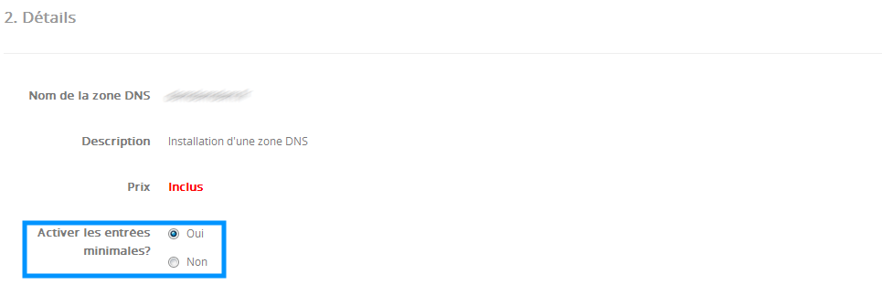
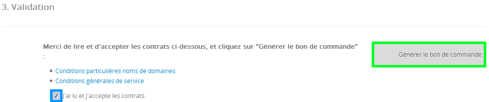

## Pré-requisitos
Para poder Criar uma zona DNS para um domínio externo assegure-se que respeita os seguintes pré-requisitos:

- Não tem nenhuma encomenda criada ou em curso na OVH
- O domínio existe
- O SOA do domínio deve estar funcional na sua atual zona DNS

## Etapa 1: Verificação do domínio

- Na rubrica domínio no seu Espaço Cliente clique em "Adicionar uma zona DNS".

{.thumbnail}

- No quadro "Nome de domínio", indique o domínio para o qual pretende criar a zona.

{.thumbnail}

## Atenção:

- Se o nome de domínio indicado não preenche os pré-requisitos não será possível que crie a zona DNS

{.thumbnail}

## Truque:
Se o seu domínio não tem servidores DNS funcionais, a OVH permite que utilize os servidores DNS provisórios de forma a que possa depois adicionar* a zona DNS:

- parking1.ovh.net
- parking2.ovh.net

(*) 48h podem ser necessárias para a propagação dos servidores DNS.

## Etapa 2: Escolha do tipo de zona
É necessário escolher o tipo de zona DNS:

- Mínima: Zona DNS com as entradas mínimas para que o domínio funcione (A, MX, CNAME, ...)
- Normal: Zona DNS com as entradas suplementares (CNAME para o servidor POP/IMAP/SMTP, ...)

{.thumbnail}

## Etapa 3: Validação

- Escolha a opção "Eu li e aceito os contratos".
- Clique de seguida em "Gerar a nota de encomenda".

{.thumbnail}

- Clique de seguida em "Pagar".

{.thumbnail}

- Após estar na nota de encomenda clique em "Prosseguir".

{.thumbnail}

## Informaçao:
A criação da sua zona DNS é totalmente gratuita.

- Indique o código de segurança e valide.

{.thumbnail}

## Etapa 4: Confirmação da encomenda
Poderá de seguida verificar que a sua encomenda foi validada corretamente.

{.thumbnail}

## Informação:
Após a validação da nota de encomenda a OVH poderá levar 30 minutos a efetuar a criação da zona DNS.

