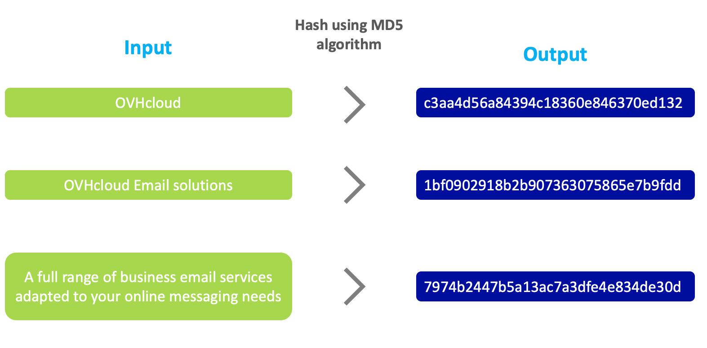
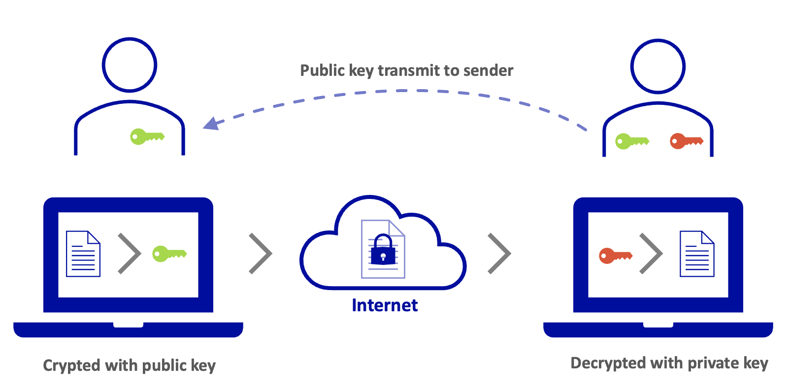
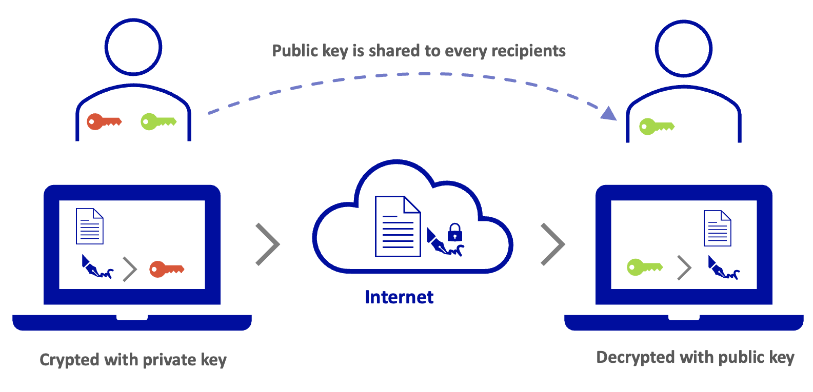

<style>
 pre {
     font-size: 14px;
 }
 pre.console {
   background-color: #fff; 
   color: #000;
   font-family: monospace;
   padding: 5px;
   margin-bottom: 5px;
 }
 pre.console code {
   border: solid 0px transparent;
   font-family: monospace !important;
   font-size: 0.90em;
   color: #000;
 }
 .small {
     font-size: 0.90em;
 }
</style>

## Objective

The DKIM (**D**omain**K**eys **I**dentified **M**ail) record allows you to sign emails to prevent identity theft. This signature works on the principle of hashing combined with asymmetric cryptography.

**This guide explains how DKIM works, and how to set it up for your email service.**

## Requirements

- Access to manage the domain name concerned in the [OVHcloud Control Panel](https://ca.ovh.com/auth/?action=gotomanager&from=https://www.ovh.com/world/&ovhSubsidiary=we), or via your DNS service provider if it is registered outside of OVHcloud
- Access to the [OVHcloud Control Panel](https://ca.ovh.com/auth/?action=gotomanager&from=https://www.ovh.com/world/&ovhSubsidiary=we)
- An OVHcloud [Exchange](https://www.ovhcloud.com/en/emails/) or external email solution with DKIM

> [!warning]
>
> If your domain name does not use OVHcloud DNS servers, you will need to modify the DKIM records in the interface of the service provider that manages your domain name configuration.
>
> If your domain name is registered with OVHcloud, you can check if it is using the OVHcloud configuration in your [Control Panel](https://ca.ovh.com/auth/?action=gotomanager&from=https://www.ovh.com/world/&ovhSubsidiary=we). To do this, go to the `DNS servers`{.action} tab, and select the domain concerned.
>

## Instructions

**Overview**

- [How does DKIM work?](#how-dkim-work)
    - [Hashing](#hash)
    - [Asymmetric encryption](#encrypt)
    - [How are hashing and asymmetric encryption used for DKIM?](#encrypt-and-hash)
    - [Why do we need to configure DNS servers?](#dns-and-dkim)
    - [Example of an email sent using DKIM](#example)
    - [What is a DKIM selector?](#selector)
- [Configuring DKIM for an OVHcloud Exchange](#internal-dkim)
    - [Full DKIM configuration](#firststep)
    - [The different states of DKIM](#status)
    - [Enable or change DKIM selector](#enable-switch)
    - [Disable and delete DKIM](#disable-delete)
- [Configuring DKIM for an email solution outside of your OVHcloud account](#external-dkim)
    - [DKIM record](#dkim-record)
    - [TXT record](#txt-record)
    - [CNAME record](#cname-record)
- [Test your DKIM](#test-dkim)

### How does DKIM work? <a name="how-dkim-work"></a>

To fully understand why DKIM can secure your email exchanges, you need to understand how it works. DKIM uses **hashing** and **asymmetric encryption** to create a secure signature. Your domain name’s **email platform** and **DNS zone** will help deliver DKIM information to your recipients.

#### Hashing <a name="hash"></a>

The principle of a **hash function** is to generate a **signature** (also called a fingerprint) from input data. Its purpose is to create a fixed sequence of characters at the output, regardless of the amount of input data. 

On the following diagram, you can see that the output will always be 32 characters using a MD5 (**M**essage **D**igest **5**) hash algorithm, while the input text may vary in size. The slightest character variation in input data completely changes the output hash, making the output signature unpredictable and tamper-proof. In the example below, the input value is passed into the MD5 hash algorithm and the output is its hash value.

{.thumbnail}

The hash function is useful when you want to check the integrity of a message. Different but similar looking input data will produce a completely different hash value with an equal length of characters in output, regardless of the input length.

#### Asymmetric encryption <a name="encrypt"></a>

The purpose of **encryption**, as its name suggests, is to encrypt the data it is given. It is **asymmetric** because the encryption key is not the same as the decryption, unlike symmetric encryption, which uses the same key to encrypt and decrypt.

Asymmetric encryption uses a **public key** and a **private key**. The public key is visible and usable by everyone. The private key is only used by the owner and is not visible to all. 

There are two uses for asymmetric encryption:

- **The input data is encrypted with the public key and decrypted by the owner of the private key**. For example, you want a third party to send you data securely. You transmit your public key without worrying about someone getting it. This third party will encrypt their data with your public key. Encrypted data can only be decrypted by the private key owner.

{.thumbnail}

- **The input data is encrypted by the private key owner and decrypted by the public key**. This use applies to authenticate a data exchange. For example, your recipients want to ensure that you are the author of the message you send them. In this case, you will encrypt your message with your private key. This message can only be decrypted by the public key that you have transmitted to everyone, which guarantees your recipients the authenticity of your message. A message decrypted by the public key can only come from the owner of the private key.

{.thumbnail}

#### How are hashing and asymmetric encryption used for DKIM? <a name="encrypt-and-hash"></a>

From the email platform, DKIM will use hashing to create a signature from certain elements of [the email header](/pages/web/emails/diagnostic_headers) and email body (email content).

The signature is then encrypted with the private key using asymmetric encryption.

#### Why do we need to configure DNS servers? <a name="dns-and-dkim"></a>

In order for a recipient to verify the sender's DKIM signature, they will need the DKIM parameters and especially the public key to decrypt it. A domain name’s [DNS zone](/pages/web/domains/dns_zone_edit) is public, which is why a DNS record is added to transmit the public key and DKIM settings to the recipient.

#### What is a DKIM selector? <a name="selector"></a>

When you enable DKIM, it works with a public/private key pair. You can assign several pairs of keys to your domain name, for example, as part of a rotation. Indeed, when you change the key pair, the old pair must remain active until all emails you sent with the old key fail to pass the DKIM check on the incoming server.

For this rotation principle to work, we're going to use something called **DKIM selectors**. A DKIM selector includes a private/public key pair. It is visible as a character string in the DKIM signature of an email after the argument `s=`. This signature is visible in [the email header](/pages/web/emails/diagnostic_headers).

**Example of a DKIM signature part**

<pre class="console"><code>
DKIM-Signature: v=1; a=rsa-sha256; d=mydomain.ovh; s=ovhex123456-selector1; c=relaxed/relaxed; t=1681877341; 
</code></pre>

The value of this selector is `s=ovhex123456-selector1`.

#### Example of an email sent using DKIM <a name="example"></a>

When you send an email from **contact@mydomain.ovh**, a signature encrypted with a private key is added to the email header.

{.thumbnail}

The recipient **recipient@otherdomain.ovh** can decrypt this signature with the public key visible in the DNS zone of **mydomain.ovh**. The signature is created from the content of the email sent. This means that if the email is modified during transit, the signature will not match with the content and this will cause the DKIM check on the destination server to fail.

{.thumbnail}

### Configuring DKIM for an OVHcloud Email Exchange <a name="internal-dkim"></a>

To configure your DKIM, you will first need to retrieve the reference for your Exchange platform. 

Click on the tab below for your solution.

In the [OVHcloud Control Panel](https://ca.ovh.com/auth/?action=gotomanager&from=https://www.ovh.com/world/&ovhSubsidiary=we), in the `Web Cloud`{.action} tab, click `Microsoft`{.action}, then `Exchange`{.action}. Next, click on the name of the Exchange service concerned. By default, your platform name will match its reference number, or it will be visible under the name you have given it (see image below).

{.thumbnail}


Also, make sure that the domain name you want to use for your emails is active in the `Associated domains`{.action} section.

{.thumbnail}

To configure DKIM, go to the website <https://api.ovh.com/console/>, log in using the `Login`{.action} button in the top right-hand corner, and enter your OVHcloud credentials.

> Visit our guide ["First Steps with the OVHcloud APIs"](/pages/account/api/first-steps) if you have never used APIs.

Go to the `/email/exchange` API section, and type "dkim" in the `Filter` box to display only the API endpoints related to DKIM.

{.thumbnail}

#### Full DKIM configuration <a name="firststep"></a>

Follow the **5 steps** below by clicking on each tab.

> [!tabs]
> **1. List of selectors**
>> Before you create one of the selectors for your domain name, you will need to retrieve the name automatically assigned to them by the Exchange platform.<br>
>> <br>
>> To do this, use the following API call:<br>
>>
>> > [!api]
>> >
>> > @api {GET} /email/exchange/{organizationName}/service/{exchangeService}/domain/{domainName}/dkimSelector
>> >
>> <br>
>>
>> - `organisationName`: Type the name of your Exchange platform in the form "hosted-zz1111111-1" or "private-zz111111-1". <br>
>> - `exchangeService`: Type the name of your Exchange platform in the form "hosted-zz1111111-1" or "private-zz111111-1". <br>
>> - `domainName`: Enter the domain name attached to your Exchange platform on which you want to enable DKIM. <br>
>>
>> *Example result:* 
>> ```
>> "ovhex123456-selector1"
>> "ovhex123456-selector2"
>> ```
>>
> **2. Create a selector**
>> You will now create a selector, generate its key pair, and generate the DNS record associated with the domain name.<br>
>><br>
>> To do this, use the following API call:<br>
>>
>> > [!api]
>> >
>> > @api {POST} /email/exchange/{organizationName}/service/{exchangeService}/domain/{domainName}/dkim
>> >
>>
>> - `organisationName`: Type the name of your Exchange platform in the form "hosted-zz1111111-1" or "private-zz111111-1".
>> - `exchangeService`: Type the name of your Exchange platform in the form "hosted-zz1111111-1" or "private-zz111111-1".
>> - `domainName`: Enter the domain name attached to your Exchange platform on which you want to enable DKIM.
>> - `autoEnableDKIM`: The DKIM will be activated immediately by ticking this box. **Do not tick this box if your domain name is not managed in the same OVHcloud customer account, or registered at another registrar**.
>> - `configureDkim`: The CNAME record will be automatically added to your domain name’s DNS zone, if it is managed in the same OVHcloud customer account as your Exchange platform. **Do not tick this box if your domain name is not managed in the same OVHcloud customer account, or registered at another registrar**.
>> - `selectorName`: Enter the name of a selector you picked up in the previous step (example: "ovhex123456-selector1"). <br>
>>
>> Click `Execute`{.action} to start creating the selector.<br>
>>
>> *Example of result:*
>> ```
>> status: "todo",
>> function: "addExchangeDomainDKIM",
>> id : 107924143,
>> "finishDate": null,
>> "todoDate": "2023-05-05T11:32:07+02:00"
>> ```
>> > [!primary]
>> >
>> > If your domain name is managed in the same OVHcloud customer account as your platform, and you have ticked `autoEnableDKIM` and `configureDkim`, go directly to the [**Different DKIM states**](#dkim-status) section below to track DKIM activation.
>>
> **3. Retrieve the DNS record**
>> You must manually configure your domain name’s DNS zone **in the following cases**:
>>
>> - Your Exchange platform is linked to a domain name that is managed in another OVHcloud customer account.<br>
>> - Your Exchange platform is linked to a domain name that is managed by another registrar.<br>
>> - You have chosen not to check the `configureDkim` box in the previous step.<br>
>>
>> To configure your DNS zone, you will need to retrieve the values of the DNS record. To do this, use the following API call:
>>
>> > [!api]
>> >
>> > @api {GET} /email/exchange/{organizationName}/service/{exchangeService}/domain/{domainName}/dkim/{selectorName}
>> >
>>
>> - `organisationName`: Type the name of your Exchange platform in the form "hosted-zz1111111-1" or "private-zz111111-1".
>> - `selectorName`: Enter the name of the selector you created in the previous step.
>> - `exchangeService`: Type the name of your Exchange platform in the form "hosted-zz1111111-1" or "private-zz111111-1".
>> - `domainName`: Enter the domain name attached to your Exchange platform on which you want to configure DKIM.
>>
>> *Example of result:*
>> ```
>> targetRecord: "ovhex123456-selector1._domainkey.1675.ac.dkim.mail.ovh.net"
>> recordType: "CNAME"
>> header: "from;to;subject;date"
>> taskPendingId: 108712689
>> status: "waitingRecord"
>> cnameIsValid: false
>> lastUpdate: "1970-01-01T00:00:00+01:00"
>> customerRecord: "ovhex123456-selector1._domainkey.mydomain.ovh"
>> selectorName: "ovhex1234565-selector1"
>> ```
>> Save the `customerRecord` and `targetRecord` values in a text file. Proceed to the next step.
>>
>> > [!primary]
>> >
>> > It is possible that the `status:` is in `todo`, this will not affect your DNS zone’s configuration.
>>
> **4. Configure the DNS record**
>> Log in to the [OVHcloud Control Panel](https://ca.ovh.com/auth/?action=gotomanager&from=https://www.ovh.com/world/&ovhSubsidiary=we). In the `Web Cloud`{.action} section, click on `Domain names`{.action} in the left column and select the relevant domain name.<br>
>> Go to the `DNS Zone`{.action} tab, then click on `Add an entry`{.action}. In the window that appears, choose `CNAME`, then enter the information according to the values retrieved previously.<br>
>>
>> If we take the values of the example in step "**3. Retrieve the DNS record**":
>>
>> - `customerRecord: "ovhex123456-selector1._domainkey.mydomain.ovh"` is the subdomain of the CNAME record. We only keep `ovhex123456-selector1._domainkey` because `.mydomain.ovh` is already prefilled. <br>
>> - `targetRecord: "ovhex123456-selector1._domainkey.1500.ab.dkim.mail.ovh.net"` is the target of the record. Add a full stop at the end to punctuate the value: `ovhex123456-selector1._domainkey.1500.ab.dkim.mail.ovh.net.`<br>
>>
>> {.thumbnail} <br>
>> 
>> Once you have entered the values, click `Next`{.action}, then `Confirm`{.action}.
>>
>> If you configure your DNS zone in a third-party interface other than OVHcloud, your CNAME record must have the following format:
>>
>> ```bash
>> ovhex123456-selector1._domainkey IN CNAME ovhex123456-selector1._domainkey.1500.ab.dkim.mail.ovh.net.
>> ```
>>
>> > [!warning]
>> >
>> > Please remember that any changes made to a DNS zone will have a propagation delay. It is usually short but can last up to 24 hours.
>>
> **5. Activating DKIM**
>> > [!warning]
>> >
>> > In the section "[**The different states of DKIM**](#dkim-status)" of this guide, check that the value `status:` is `ready` before you activate DKIM.
>>
>> To enable DKIM, use the following API call:
>>
>> > [!api]
>> >
>> > @api {POST} /email/exchange/{organizationName}/service/{exchangeService}/domain/{domainName}/dkim/{selectorName}/enable
>> >
>>
>> - `organisationName`: Type the name of your Exchange platform in the form "hosted-zz1111111-1" or "private-zz111111-1".
>> - `selectorName`: Enter the name of the selector you created.
>> - `exchangeService`: Type the name of your Exchange platform in the form "hosted-zz1111111-1" or "private-zz111111-1".
>> - `domainName`: Enter the domain name attached to your Exchange platform on which you want to enable DKIM.
>>
>> *Example of result:*
>> ```
>> id: 108716876
>> todoDate: "2023-05-05T11:30:11+02:00"
>> finishDate: null
>> status: "todo"
>> function: "enableExchangeDKIM"
>> ```
>>
>> > [!success]
>> >
>> > You have now made all the changes to enable DKIM. To ensure that DKIM is enabled, please refer to the [**Different DKIM states**](#dkim-status) section of this guide to check that the `status:` value is `inProduction`. If this is the case, your DKIM is now active.
>>

#### The different states of DKIM <a name="dkim-status"></a>

When you are running DKIM on your Exchange platform, use the API call below to check the current status of the DKIM.

> [!api]
>
> @api {GET} /email/exchange/{organizationName}/service/{exchangeService}/domain/{domainName}/dkim/{selectorName}
>

- `organisationName`: Type the name of your Exchange platform in the form "hosted-zz1111111-1" or "private-zz111111-1". <br>
- `selectorName`: Enter the name of the selector you created. <br>
- `exchangeService`: Type the name of your Exchange platform in the form "hosted-zz1111111-1" or "private-zz111111-1". <br>
- `domainName`: Enter the domain name attached to your Exchange platform that the DKIM must be present on. <br>

Then look at the value `status:` in the result:

- `todo`: The task has been initialised, it will begin. <br>
- `WaitingRecord`: DNS records are pending configuration or being validated in the domain name’s DNS zone. A regular automatic check is performed to check if the DNS record is present and correctly entered.
- `ready`: DNS records are present in the zone. DKIM can now be enabled. <br>
- `inProduction`: DKIM is well configured and activated, so it is fully operational. <br>
- `disabling`: DKIM is being disabled. <br>
- `deleting`: DKIM is being deleted. <br>

If you encounter the following error when you make the API call, the selector does not exist or has been deleted. It will have to be created.

```
Not Found (404)
{ `message`: `The requested object (selectorName = ovhemp123456-selector1) does not exist` }
```

#### Enable or change the DKIM selector <a name="enable-switch"></a>

> [!warning]
>
> The DKIM selector must be in `ready` status before it can be enabled.

To enable DKIM on a selector, use the following API call:

> [!api]
>
> @api {POST} /email/exchange/{organizationName}/service/{exchangeService}/domain/{domainName}/dkim/{selectorName}/enable
>

- `organisationName`: Type the name of your Exchange platform in the form "hosted-zz1111111-1" or "private-zz111111-1".<br>
- `selectorName`: Enter the name of an existing selector.<br>
- `exchangeService`: Type the name of your Exchange platform in the form "hosted-zz1111111-1" or "private-zz111111-1".<br>
- `domainName`: Enter the domain name attached to your Exchange platform on which you want to enable DKIM.<br>


> [!primary]
>
> During a DKIM selector rotation, you can directly activate the second selector you have created to switch over to it, while keeping the first selector active until all emails delivered with it are properly scanned by their recipient.

#### Disable and delete DKIM <a name="enable-switch"></a>

> [!warning]
>
> The DKIM selector must be in `inProduction` status before it can be disabled.


If you want to disable the DKIM without removing the selector and its key pair, use the following API call:

> [!api]
>
> @api {POST} /email/exchange/{organizationName}/service/{exchangeService}/domain/{domainName}/dkim/{selectorName}/disable
>

- `organisationName`: Type the name of your Exchange platform in the form "hosted-zz1111111-1" or "private-zz111111-1". <br>
- `selectorName`: Enter the name of the selector you want to disable. <br>
- `exchangeService`: Type the name of your Exchange platform in the form "hosted-zz1111111-1" or "private-zz111111-1". <br>
- `domainName`: Enter the domain name attached to your Exchange platform. <br>

If you want to delete the DKIM selector and its key pair, use the following API call:

> [!api]
>
> @api {DELETE} /email/exchange/{organizationName}/service/{exchangeService}/domain/{domainName}/dkim/{selectorName}
>

- `organisationName`: Type the name of your Exchange platform in the form "hosted-zz1111111-1" or "private-zz1111111-1". <br>
- `selectorName`: Enter the name of the selector you want to delete. <br>
- `exchangeService`: Type the name of your Exchange platform in the form "hosted-zz1111111-1" or "private-zz111111-1". <br>
- `domainName`: Enter the domain name attached to your Exchange platform. <br>


### Configuring DKIM for an email solution outside of your OVHcloud account <a name="external-dkim"></a>

If you would like to configure your DNS zone to add a DKIM record to it for your solution, follow the instructions below.

Log in to the [OVHcloud Control Panel](https://ca.ovh.com/auth/?action=gotomanager&from=https://www.ovh.com/world/&ovhSubsidiary=we). In the `Web Cloud`{.action} section, click on `Domain names`{.action} in the left column and select the domain name concerned.

Click on the `DNS Zone`{.action} tab, then `Add an entry`{.action}. There are 3 ways to add a record to set the DKIM in your DNS zone:

- [DKIM record](#dkim-record): A configuration that allows you to view all settings for a DKIM record.
- [TXT record](#txt-record): The record to use when all DKIM parameters have been provided to you.
- [CNAME record](#cname-record): A record used for an OVHcloud email solution or a Microsoft email server.

#### DKIM record <a name="dkim-record"></a>

This record is named DKIM on the interface but it is actually a TXT record in the zone. The purpose of the DKIM record is to make it easier to read the various parameters of the DKIM by presenting them as independent fields.

{.thumbnail}

- **Sub-domain**: Enter the DKIM selector name and add `._domainkey` as a suffix. Your domain name will be added automatically at the end.

*Example:*

```
  selector-name._domainkey.mydomain.ovh.
```

- **Version (v=)**: It is used to specify the DKIM version. It is recommended that you use it and its default value is "DKIM1".<br>
If specified, this tag must be placed first in the record and must be equal to "DKIM1" (without quotes). Records that begin with a "v=" tag with another value should be ignored.

- **Granularity (g=)**: Allows you to specify the "local" part of an email address, i.e. the part before the "@".<br>
It allows you to specify the email address or email addresses that are authorised to sign an email message with the selector's DKIM key.<br>
The default value for "g=" is "\*", which means that all email addresses are allowed to use the DKIM signature key.<br>
By specifying a value for "g=", you can limit the use of the key to a specific local portion of an email address or a range of email addresses by using wildcards (for example: "\*-group").

- **Algorithm (hash) (h=)**: Directive to specify the hash algorithms used to sign email headers. Use this tag to define a list of hash algorithms that will be used to generate a DKIM signature for a given message.

- **Key type (k=)**: Specifies the signature algorithm used to sign outgoing email messages. It allows recipients to know how the message was signed and what method is used to verify its authenticity.<br>
Possible values for the tag "k=" include "rsa" for the RSA signature algorithm and "ed25519" for the ed25519 signature algorithm. The choice of algorithm depends on the sender's security policy and the recipient's support.

- **Notes (n=)**: It is used to include notes of interest for administrators who manage the DKIM key system.<br>
These notes may be useful for documentation purposes or to help administrators understand or manage how DKIM works. The notes in "n=" are not interpreted by software and do not affect the operation of DKIM.

- **Public key (base64) (p=)**: It is used to populate DKIM public key data, which is encoded in base64.<br>
This tag is mandatory in the DKIM signature, and allows signature recipients to retrieve the public key needed to verify the authenticity of the signed message.

- **Revoke public key**: If a DKIM public key has been revoked (for example, if the private key is compromised), an empty value must be used for the "p=" tag, indicating that this public key is no longer valid. Recipients must then return an error for any DKIM signature that references a revoked key.

- **Type of service (s=)**: The "s=" tag is optional and is not present by default. It allows you to specify the type or types of services to which this DKIM record applies.<br>
Service types are defined using a colon-separated list of keywords.<br>
The recipient should ignore this record if the appropriate service type is not listed.<br>
The "s=" tag is intended to restrict the use of keys for other purposes, in case the use of DKIM is defined for other services in the future.<br>
The service types currently defined are "email" and "*" (all service types).

- **Test mode (t=y)**: Allows domain name owners to test a DKIM setup without the risk of having messages rejected or marked as spam if DKIM signature verification fails.<br>
When the "t=y" flag is used, the recipient should not treat test signed messages differently than unsigned messages. However, the recipient can follow the test result to help the signatories.

- **Sub-domains (t=s)**: Allows the use of the DKIM signature to be restricted to the domain name only (for example: @mydomain.ovh) or allow sending from the domain name and its subdomains (e.g.: @mydomain.ovh, @test.mydomain.ovh, @other.mydomain.ovh, etc.).

#### TXT record <a name="txt-record"></a>

This is the type of native record used to set the DKIM in your domain name’s DNS zone. You need to have a good understanding of its syntax to complete it.

This type of DKIM setting is recommended when the information to be entered has been communicated to you by the email service provider.

For a complete understanding of the composition of the DKIM record, see the previous part of this guide called "[DKIM Record](#dkim-record) ".

**Example of a DKIM record**

- Subdomain:

```
selector-name._domainkey.mydomain.ovh.
```

- Target:

```
"v=DKIM1; k=rsa; t=s; p=MIIBIjANBgkqhkiG9w0BAQEFAAOCAQ8AMIIBCgKCAQEAp89XeoEG9xr97E7ha3XzsAh2oaYhuvcC24EIYbKJdv//WMjKEWBZwKfQs3SOY1lKjjSTkG3lexhWzKvtBHgAQ2RCC+6hx0d96Tp2ihXj+rkIBnmzWB4eLUZRVyjS9YctQBf/YO+LRp24oAOsusinERwE1/0wXf8ot6QMC0qPxMfY8d0nVCEFfI5" "w/tGjlY2QhVASNTryr8MbHFz09f32luBUUJEw6GVgpVgkZjU0cF213pQKeZ4yp30K4620Pe5BSQuqJbOOUCnuzFNNyc7HfhF8Adx06BycHVIbmuuBqe5awoPO7a3aflpHjJW8w+f7wtCH70N6QCBNciSO6K7/QIDAQAB;"
```

#### CNAME record <a name="cname-record"></a>

The CNAME record is an alias. This means that the target value points to a URL that will itself provide the DKIM record to the server that will query the CNAME record. This type of CNAME record for setting the DKIM is common when using a Microsoft email server.

This record type is used to enable DKIM on a domain name declared for an OVHcloud Exchange solution.

### Test your DKIM <a name="test-dkim"></a>

We recommend sending an email from an account on your Exchange platform to an email address that verifies the DKIM signature on receipt.

Here is what you will find in the header of the received email:

<pre class="console"><code>
ARC-Authentication-Results: i=1; mx.example.com;
       dkim=pass header.i=@mydomain.ovh header.s=ovhex123456-selector1 header.b=KUdGjiMs;
       spf=pass (example.com: domain of test-dkim@mydomain.ovh designates 54.36.141.6 as permitted sender) smtp.mailfrom=test-dkim@mydomain.ovh
Return-Path: <test-dkim@mydomain.ovh>
</code></pre>


To retrieve the header of an email, please read our guide on [Retrieving email headers](/pages/web/emails/diagnostic_headers).

## Go further

Join our community of users on <https://community.ovh.com/en/>.
