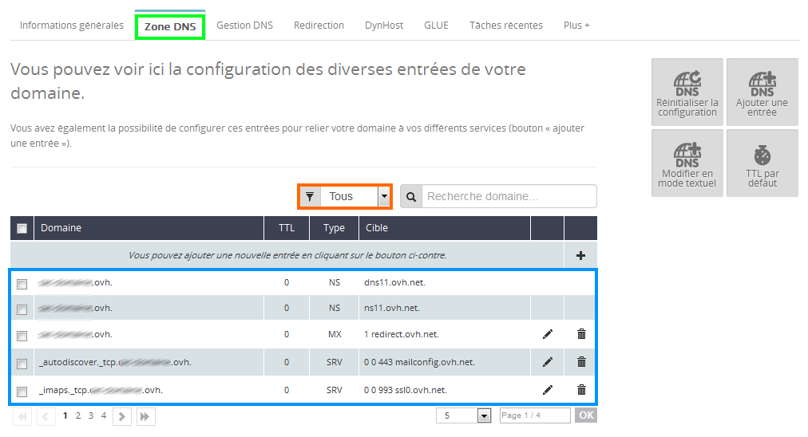
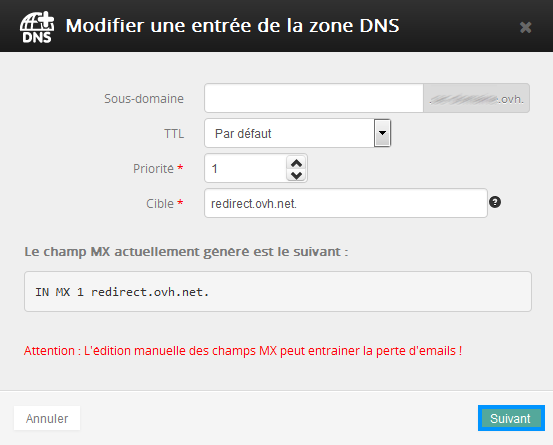
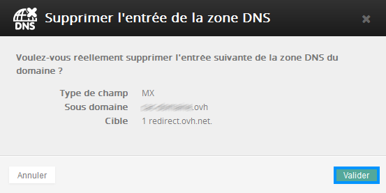
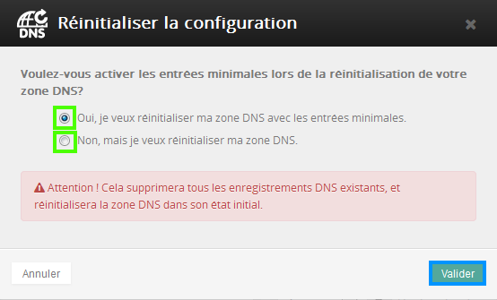
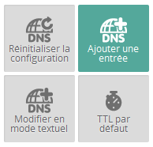
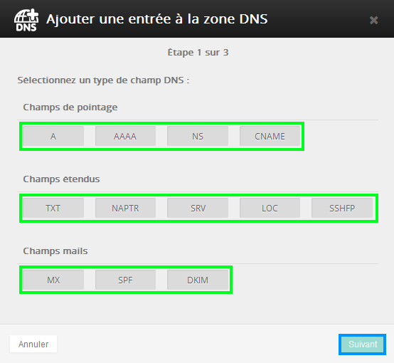
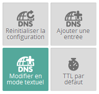
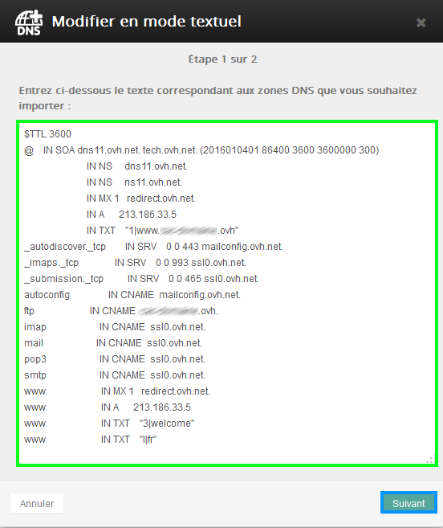
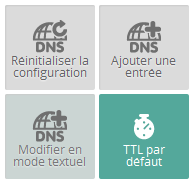
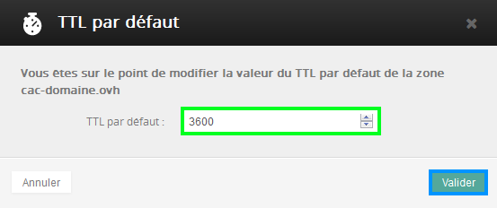

## Definition
Das DNS oder Domain Name System dient zur "Übersetzung" von Domainnamen (z.B. meine-seite.tld) in IP-Adressen (z.B. 12.34.56.78), damit Ihre Anfragen über das Netz an den Ziel-Server geleitet werden können.

{.thumbnail}

## Unterschiede zwischen DNS Server / DNS Zone

## DNS Server

- Die DNS Server sind die Nameserver, die für einen Domainnamen deklariert (im Whois eingetragen) sind. Diese Server beantworten Anfragen zur Namensauflösung der Domain.

## DNS Zone

- Die DNS Zone ist eine Datei, in der die DNS Einstellungen für die dazugehörige Domain gespeichert sind. Die DNS Zone enthält verschiedene Einträge, zum Beispiel die Adresse des/der Server(s), auf dem Ihre Domain gehostet wird (A Eintrag), oder die für die Domain zuständigen E-Mail-Server (MX Eintrag).

## Warum kann es erforderlich sein, die DNS Server zu ändern oder die DNS Zone zu bearbeiten?

## DNS Server
Wenn Sie einen Transfer einer Domain zu einem anderen Registrar durchführen, müssen Sie häufig auch deren DNS Server ändern. In der Tat erlauben die meisten Anbieter nicht die weitere Verwendung ihrer Nameserver, wenn die Domain zu einem anderen Registrar übertragen wird. Oder Sie verfügen über eigene Dedicated Server, die Sie als DNS Server für Ihre Domain verwenden möchten.

## DNS Zone
Wenn Sie den Server wechseln möchten, auf dem Ihre Website gehostet wird, oder die für die Domain zuständigen E-Mail-Server umstellen möchten (zum Beispiel nach einem Wechsel des Anbieters), müssen Sie die Einstellungen in Ihrer DNS Zone bearbeiten.
Sobald die Änderungen aktiv geworden sind - die Propagation der DNS Einstellungen nimmt einige Stunden in Anspruch - verweist Ihre Domain dann auf die neuen Server.

## Was bedeutet der TTL Wert in der DNS Zone?

## TTL / Time to Live
Der TTL Wert steht für Time to Live ("Lebensdauer") und bezeichnet den Zeitraum, in dem eine Information nach einer Änderung im Cache gehalten wird, bevor sie wieder aktualisiert wird.
Bei OVH haben neu erstellte DNS Zonen eine TTL von 1 Stunde (TTL = 3600 Sekunden).

## Verbindung mit dem Kundencenter

- Verbinden Sie sich mit Ihrer OVH Kundenkennung und dem dazugehörigen Passwort mit Ihrem [OVH Kundencenter](https://www.ovh.com/manager/web/login/).

- Klicken Sie auf "Login" um sich anzumelden.

{.thumbnail}

## Auswahl der Domain

- Klicken Sie in dem Menü auf der linken Seite unter "Domains" auf den gewünschten Domainnamen.

{.thumbnail}

## Überblick über die Einstellungen der DNS Zone
Klicken Sie auf die Rubrik "DNS Zone", um die DNS Zoneneinstellungen Ihrer Domain anzuzeigen.
Für eine bessere Übersicht können Sie diese Anzeige auch nach Eintragstypen sortieren.

{.thumbnail}

## Änderung eines Eintrags
Um einen Eintrag zu ändern klicken Sie auf das Bleistift-Icon in der Zeile mit dem gewünschten Eintrag. Bearbeiten Sie den Eintrag wie gewünscht, klicken Sie auf "Weiter" und abschließend auf "Bestätigen".

{.thumbnail}

## Löschung eines Eintrags
Um einen Eintrag zu löschen klicken Sie auf das Papierkorb-Icon in der Zeile mit dem gewünschten Eintrag und dann auf "Bestätigen".

{.thumbnail}

## Zurücksetzen der Konfiguration
Mit diesem Button können Sie die DNS Zone Ihrer Domain auf die standardmäßige Konfiguration zurücksetzen.

{.thumbnail}
Wählen Sie dazu den gewünschten Zonentyp aus und klicken Sie auf "Bestätigen":

- DNS Zone mit minimalen Einträgen zurücksetzen: Mit dieser Option wird eine Zone erstellt, die lediglich über die unbedingt notwendigen Einträge verfügt, damit Ihre Domain funktioniert.

- DNS Zone zurücksetzen: Mit dieser Option werden zusätzliche Einträge in der Zone erstellt, zum Beispiel CNAME Einträge für FTP...

{.thumbnail}

## Hinzufügen eines Eintrags
Mit diesem Button können Sie einen neuen Eintrag zu Ihrer DNS Zone hinzufügen.

{.thumbnail}
Wählen Sie einfach den gewünschten Typ des Eintrags aus, klicken Sie auf "Weiter" und erstellen Sie Ihren Zoneneintrag.

{.thumbnail}

## Änderungen im Textmodus
Mit diesem Button können Sie Ihre DNS Zone direkt im Textmodus bearbeiten.
Diese Funktion ist insbesondere für fortgeschrittene Anwender nützlich, die schnelle Änderungen an den Zoneneinstellungen durchführen möchten.

{.thumbnail}
Bearbeiten Sie einfach die gewünschten Einträge direkt im angezeigten Fenster und bestätigen Sie die Änderungen.

{.thumbnail}

## Standardmäßige TTL
Mit diesem Button können Sie die TTL (Time to Live, "Lebensdauer") Ihrer DNS Zone ändern, also den Zeitraum, in dem diese im Cache gehalten wird.

{.thumbnail}
Wählen Sie dazu einfach die gewünschte neue TTL aus und klicken Sie auf "Bestätigen".

{.thumbnail}

## A Eintrag
Ein A Eintrag weist einen Domainnamen (Hostnamen) einer IPv4 Adresse zu.
Es dürfen nicht gleichzeitig ein A Eintrag und ein CNAME Eintrag für den gleichen Hostnamen verwendet werden.

## MX Eintrag
Ein MX Eintrag legt den für die E-Mail-Adressen der Domain zuständigen E-Mail-Server fest.
Als Ziel muss zwingend ein Hostname angegeben werden, keine IP-Adresse.

## CNAME Eintrag
Ein CNAME Eintrag dient zur Erstellung eines Alias von einem Hostnamen auf einen anderen Hostnamen.
Als Ziel muss zwingend ein Hostname angegeben werden, keine IP-Adresse.
Es dürfen nicht gleichzeitig ein A Eintrag und ein CNAME Eintrag für den gleichen Hostnamen verwendet werden.

## TXT Eintrag
Mit einem TXT Eintrag können Sie zusätzliche, frei definierbare Informationen in Textform zu Ihrer DNS Zone hinzufügen.

## SPF Eintrag
Mit einem SPF Eintrag können Sie festlegen, welche Server E-Mails mit Ihrem Domainnamen versenden dürfen.

Mehr Informationen zu diesem Thema finden Sie in folgender Hilfe:

- .

## Zonecheck
Mit diesem Tool können Sie überprüfen, dass das Update Ihrer DNS Server erfolgreich durchgeführt wird.

Mehr Informationen zum Zonecheck finden Sie in folgender Hilfe:

- .

## DNSSEC
Mit dieser Option können Sie Ihre Domain gegen Cache Poisoning schützen.

Mehr Informationen zu DNSSEC finden Sie in folgender Hilfe:

- .

## Wie lange dauert es, bis DNS Änderungen aktiv sind?
DNS Server

- Änderungen an den DNS Servern können bis zu 48 Stunden benötigen, bis sie aktiv sind.

Zone DNS
- Änderungen an der DNS Zone können bis zu 24 Stunden benötigen, bis sie aktiv sind.

