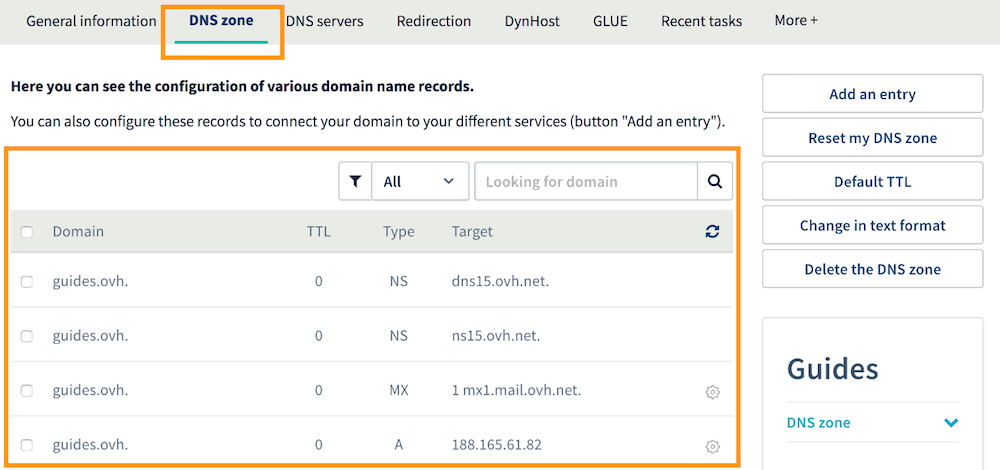
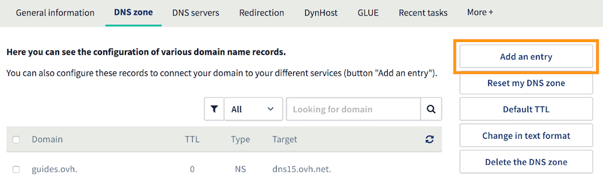
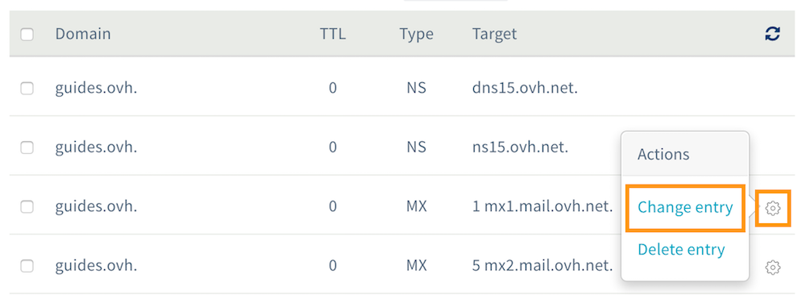
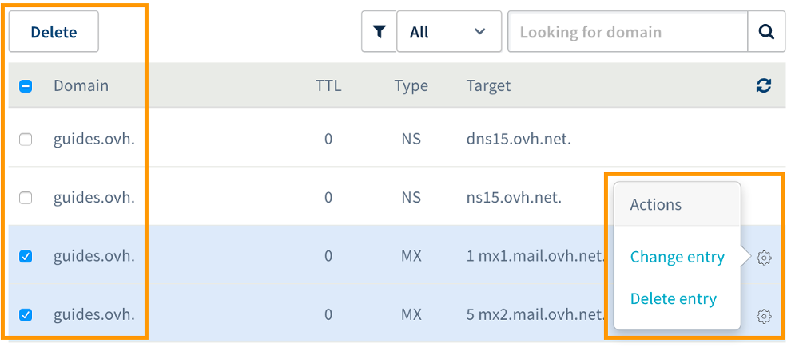

**Last updated 3rd April 2018**

## Objective

A Domain Name System (DNS) zone is a domain name’s config file. It is composed of technical information, otherwise called ‘records’. DNS zones are usually used to link your domain name to the server (or servers) that hosts your website and email addresses.

**Find out how to edit your OVH DNS zone via your Control Panel.**

## Requirements

- You must have permission to manage the domain name from your [OVH Control Panel](https://www.ovh.com/auth/?action=gotomanager){.external}.
- You must be logged in to your [OVH Control Panel](https://www.ovh.com/auth/?action=gotomanager){.external}.
- You need to use the OVH configuration for the domain name concerned (on its DNS servers).

> [!warning]
>
> - If your domain name does not use the OVH DNS servers, you will need to edit the configuration using the interface given by the service provider that manages your domain name.
> 
> - If your domain name is registered with OVH, you can check if the domain name uses our configuration. To do this, go to your [Control Panel](https://www.ovh.com/auth/?action=gotomanager){.external}, select the domain concerned, and go to the `DNS servers`{.action} tab.
>

## Instructions

**We strongly recommend taking great care when you edit a DNS zone.** Incorrect changes could make your website inaccessible, or prevent your email address from receiving new emails.

By understanding what each of these records does, you will gain a better understanding of the changes you will make if you edit your domain name’s DNS zone. We recommend reading the table below, which provides descriptions of each record.

|Record type|Description|  
|---|---|
|A|The A record is used to point a domain name to an IPv4 address. For example, the IP address of the server your website is hosted on.|
|AAAA|The AAAA record is used to point a domain name to an IPv6 address. For example, the IP address of the server your website is hosted on.|
|CNAME|The CNAME record is used for IP aliasing. It points a domain name to a different, canonical domain name. For example, if *www.mypersonaldomain.ovh* is an alias of *mypersonaldomain.ovh*, this would mean that *www.mypersonaldomain.ovh* would use the IP address (or addresses) of *mypersonaldomain.ovh*.|
|MX|The MX record is used to point a domain name to an email server. For example, the IP address of the server your email solution is hosted on. Your service provider may have several email servers. If this is the case, you will need to create multiple MX records.|
|SRV|The SRV record is used to define information on the address of a server that manages a service. For example, this record can define the address of a SIP server, or the address of a server that enables an email client to be configured automatically using autodiscover.|
|TXT|The TXT record is used to add a chosen value (in text format) to your domain name’s DNS settings. This record is often used during the verification process.|
|SPF|The SPF record is used to avoid potential identity theft via the email addresses that use your domain name. For example, this record specifies that only your email service provider’s server must be identified as a legitimate sending source. To find out more about this, you can refer to our guide to [Adding an SPF record to your domain name’s DNS configuration](https://docs.ovh.com/gb/en/domains/web_hosting_the_spf_record/){.external}.|
|CAA|The CAA record is used to list the certificate authorities authorised to deliver SSL certificates for a domain name.|

### Step 1: Access the area for managing your domain’s OVH DNS zone

First of all, log in to your [OVH Control Panel](https://www.ovh.com/auth/?action=gotomanager){.external}, click `Domains`{.action} in the services bar on the left-hand side, then choose the domain name concerned. Go to the `DNS Zone`{.action} tab.

The table that opens will display your domain name’s configuration at OVH. It is made up of several DNS records (one per row in the table). You can filter the table's contents by DNS record type, or by domain name.

{.thumbnail}

### Step 2: Edit your domain name’s DNS zone

You can edit your domain name’s OVH DNS zone by adding, modifying or deleting DNS records. There are two ways you can do this:

- **Modifying the zone manually, in text mode:** Only for users with advanced technical knowledge. In the `DNS Zone`{.action} tab, click `Change in text format`{.action}, then follow the steps provided.

- **Using our configuration assistants.**

From this point onwards, this guide will only cover configuration using our configuration assistants.

> [!primary]
>
> Take note of the information you would like to modify in your DNS zone. If you are modifying your DNS zone because a service provider has asked you to do so, the service provider should have provided you with a list of records to edit.
>

- **Add a new DNS record**

To add a new DNS record, stay on the `DNS Zone`{.action}  tab of your Control Panel, and click `Add an entry`{.action}, on the right-hand side of the table. Select the DNS record type, then follow the steps indicated.

Please ensure that the record doesn’t already exist, and that it doesn’t point to a different target. To check this, you can filter content by record type or domain. If the record already exists, modify it using the steps described below.

{.thumbnail}

- **Modifying an existing DNS record**

To modify a DNS record, stay in the `DNS Zone`{.action} tab in your Control Panel. Click the cogwheel icon to the right of the record you want to edit. Then click `Change entry`{.action}, and follow the steps indicated.

{.thumbnail}

- **Deleting a DNS record**

To delete a DNS record, stay on the `DNS Zone`{.action} tab in your Control Panel. Click the cogwheel icon to the right of the record you want to remove. Then click `Delete entry`{.action}, and follow the steps indicated.

You can delete several records at once by ticking them on the left-hand side of the table, then clicking `Delete entry`{.action}.

{.thumbnail}

### Step 3: Wait for the changes to propagate

Once you have modified your domain name’s OVH DNS zone, you will need to allow a maximum of 24 hours for the changes to fully propagate and be effective.

If you would like the propagation time to be shorter the next time you edit your OVH DNS zone, you can shorten it slightly by adjusting the TTL (*Time To Live*) that applies to all of the DNS records.
To do this, go to the `DNS Zone`{.action} tab in your Control Panel, click `Default TTL`{.action}, and follow the steps indicated.

You can also modify an individual DNS record’s TTL. You can only do this for one record at a time, by editing them or setting it when they are added.

## Go further

[General information about DNS servers](https://docs.ovh.com/gb/en/domains/web_hosting_general_information_about_dns_servers/){.external}.

[Adding an SPF record to your domain name’s configuration](https://docs.ovh.com/gb/en/domains/web_hosting_the_spf_record/){.external}.

[Protect your data from DNS cache poisoning with DNSSEC](https://www.ovh.co.uk/domains/dnssec_service.xml){.external}.

Join our community of users on <https://community.ovh.com/en/>.