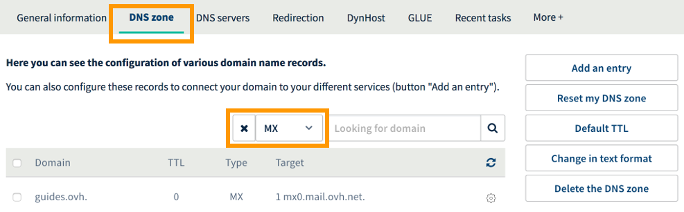

**Last updated 30th May 2018**

## Objective

An MX record is used to point a domain name to an email server. It enables servers sending emails to your email addresses to know where they must transfer them to. Your service provider is likely to have several email servers. Because of this, you will need to create several MX records.

**Find out how to add a MX record to your OVH domain name’s configuration.**

## Requirements

- You must have permission to manage the domain name from your [OVH Control Panel](https://www.ovh.com/auth/?action=gotomanager){.external}.
- You must be logged in to your [OVH Control Panel](https://www.ovh.com/auth/?action=gotomanager){.external}.
- The domain name must use the OVH configuration (i.e. the OVH DNS servers).

> [!warning]
>
> - If your domain name does not use the OVH DNS servers, you will need to modify the MX records using the interface given by the provider that manages your domain name configuration.
>
> - If your domain name is registered with OVH, you can check if it is using the OVH configuration in your [Control Panel](https://www.ovh.com/auth/?action=gotomanager){.external}. Select the domain, and go to the `DNS servers`{.action} tab.
>

## Instructions

### Step 1: Understand the basic purpose of MX records

An MX record links your domain name to your email service provider’s servers (e.g. OVH’s servers). When you are sent an email, the server sending the email will use the MX record to find out which server it should deliver to.

You can add multiple MX records to a single domain name, so you will need to define a priority for each record. By doing so, the servers sending emails to your email address will know which server they should deliver them to, by priority. However, please note that when you add multiple MX records, the servers they point to must belong to the same service provider.

Generally speaking, **changing MX records is a tricky task**. If you make any mistakes configuring MX records, your email addresses may be unable to receive new emails as a result. For this reason, we strongly advise that you take great care when carrying out these configuration changes.

### Step 2: Familiarise yourself with the OVH MX configuration

In the table below, we have listed the OVH MX configuration to use for our MX Plan solutions (both as a standalone solution, or included as part of our [OVH Web Hosting plans](https://www.ovh.co.uk/web-hosting/){.external}, [Email Pro](https://www.ovh.co.uk/emails/email-pro/){.external} and [Exchange](https://www.ovh.co.uk/emails/){.external} solutions. Our email servers also have anti-spam and anti-virus protection.

|Domain|TTL|Record type|Priority|Target|
|---|---|---|---|---|
|*leave blank*|3600|MX|1|mx0.mail.ovh.net.|
|*leave blank*|3600|MX|5|mx1.mail.ovh.net.|
|*leave blank*|3600|MX|50|mx2.mail.ovh.net.|
|*leave blank*|3600|MX|100|mx3.mail.ovh.net.|

You will now need to add these MX records to your domain name’s DNS zone configuration. The next step will help you do so, in your domain name’s OVH DNS zone.

### Step 3: Modify an OVH MX record’s configuration

To modify the MX records in your domain’s OVH configuration, log in to your [OVH Control Panel](https://www.ovh.com/auth/?action=gotomanager){.external}. Select `Domains`{.action} in the services menu on the left-hand side, click on the domain, then go to the `DNS Zone`{.action} tab.

This table displays your domain’s OVH configuration. Each row corresponds to a DNS record. To start with, please check if the MX records already exist in your domain name’s OVH DNS zone configuration. You can do this using the search filter.

{.thumbnail}

If there are already MX records and you would like to replace them, click the cogwheel icon on the right-hand side of each table row, then click `Delete record`{.action}. Please ensure, however, that you don’t delete all MX records before you add the new ones.

To add a record, click `Add record`{.action}, then select `MX`{.action}. Fill in the information required, depending on the email solution you have ordered:

- **If you have an OVH email solution:** Please refer to the information provided in [Step 2: Familiarise yourself with the OVH MX configuration](https://docs.ovh.com/gb/en/domains/web_hosting_configuring_mx_with_the_ovh_dns_zone/#step-2-familiarise-yourself-with-the-ovh-mx-configuration){.external}.

- **If you are using an email solution from another service provider:** Please refer to the information given by your service provider.

Once you have entered the information, finalise the steps, then click `Confirm`{.action}.

> [!primary]
>
> The change can take 4-24 hours to fully propagate.
>

## Go further

[General information about DNS servers](https://docs.ovh.com/gb/en/domains/web_hosting_general_information_about_dns_servers/){.external}

[Web hosting: How to edit your DNS zone](https://docs.ovh.com/gb/en/domains/web_hosting_how_to_edit_my_dns_zone/){.external}.

Join our community of users on <https://community.ovh.com/en/>.