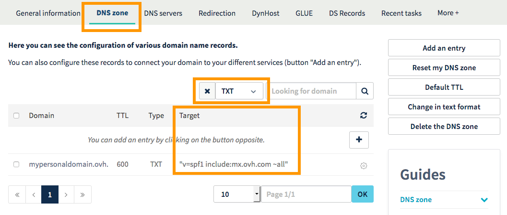
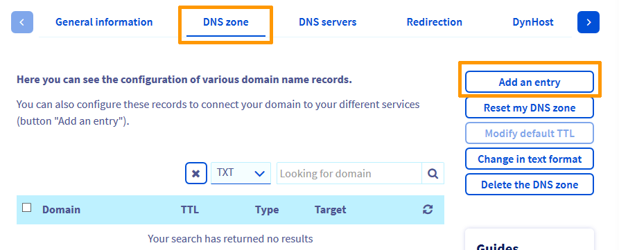
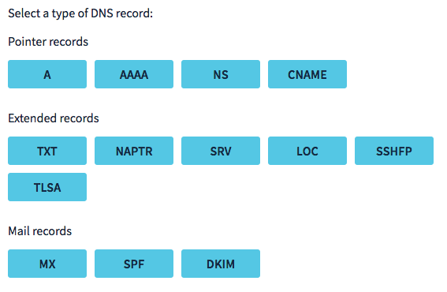
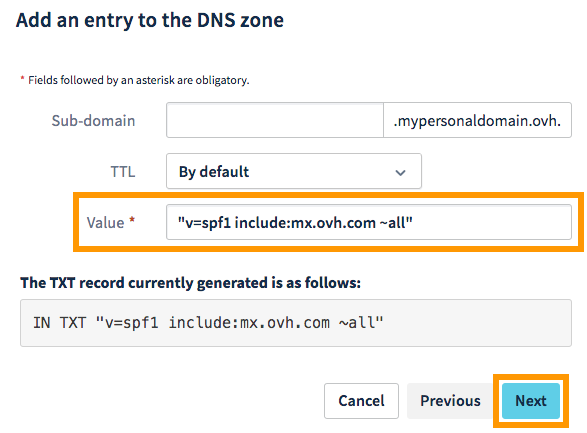
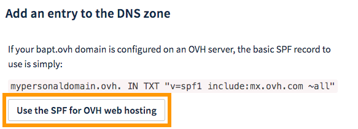
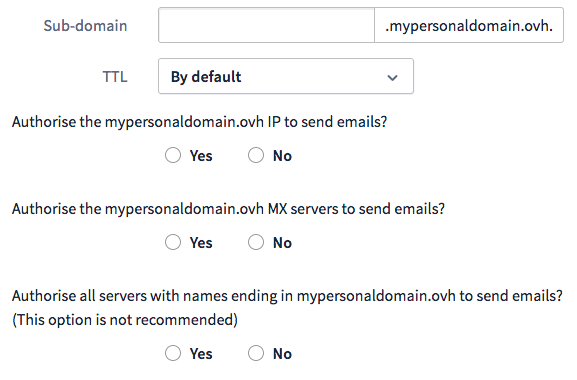

**Last updated 01/02/2018**

## Objectives

The SPF (Sender Policy Framework) allows a server that receives an email to check that it was sent by an authorised server. The SPF is added as a record in the DNS zone where the servers or IP addresses authorised to send emails from a particular domain are recorded.

**Learn to add an SPF record to the configuration of your OVH domain.**

## Requirements

- You must have the appropriate permissions to manage the domain name from your [OVH Control Panel](https://www.ovh.com/auth/?action=gotomanager){.external}.
- You must be logged in to your [OVH Control Panel](https://www.ovh.com/auth/?action=gotomanager){.external}.
- The domain name must use the OVH configuration (i.e. the OVH DNS servers).

> [!warning]
>
> If your domain name does not use the OVH configuration, you must modify the SPF record via the interface of whichever provider manages its domain name configuration.
>
> If your domain name is registered with OVH, you can check if it is using the OVH configuration in your [Control Panel](https://www.ovh.com/auth/?action=gotomanager){.external}. Select the domain and go to the `DNS servers`{.action} tab.
>

## Instructions

### Step 1: Understand the SPF record

Before adding or modifying an SPF record in your domain configuration, it is important to understand why it is useful. The SPF record helps to prevent identity theft via email addresses fraudulently using your domain name.

This is made possible by information contained in the SPF record itself, specifically:

- **Servers or IP addresses**, which can then be identified as legitimate sending sources
- **A qualifier**. This tells incoming servers how to react to an email considered as illegitimate, i.e. coming from a potentially risky source

You must therefore make sure that you enter all sending sources for emails from this domain in its SPF record. These might include own server, those of your provider, or one of the OVH email solutions.

> [!primary]
>
> The SPF record is only an indication provided to servers that receive emails, including yours. It is these servers’ responsibility to apply, or not, what is specified in the SPF record of domains whose messages they receive.
>

### Step 2: Get to know the OVH configuration

The OVH configuration applies to the following solutions:

- MX Plan (as a standalone, or part of our [OVH Web Hosting solution](https://www.ovh.co.uk/web-hosting/){.external});
- [Email Pro](https://www.ovh.co.uk/emails/email-pro/){.external};
- [Hosted Exchange](https://www.ovh.co.uk/emails/hosted-exchange/){.external}.

When you order one of these solutions, we recommend that you use an SPF record with OVH information in your domain configuration. It looks like this:

```bash
mypersonaldomain.ovh IN TXT "v=spf1 include:mx.ovh.com ~all"
```

If your domain uses the OVH configuration, you can check if an SPF record is already configured in this way. To do this, log in to your [OVH Control Panel](https://www.ovh.com/auth/?action=gotomanager){.external} and go to the services menu on the left. Select the `Domains`{.action} section. Click on the domain in question, then go to the `DNS Zone`{.action} tab.

A table should appear. This will display the configuration of your OVH domain. It is made up of several DNS records, one per row in the table.

> [!primary]
>
> If your domain is registered with OVH, you can check if it uses the OVH configuration from the `DNS Servers`{.action} tab.
>

You can filter the table to find the row with the OVH SPF record. This can appear in two different places: `TXT`{.action}or `SPF`{.action}. Use the filter to switch between them if necessary (bearing in mind that this might cause the table to look different). You should see one of the following results:

- **"v=spf1 include:mx.ovh.com ~all" is displayed in the target column**: your domain already uses the OVH configuration. If you no longer wish to use it, you must modify it in the next step.

- **An SPF record that does not correspond to OVH information is displayed in the target column**: your domain already uses a personalised SPF. You can modify it or choose the default OVH configuration in the next step.

- **No SPF record is displayed in the target column**: first, search for the record by filtering for both SPF and TXT. If an SPF record does not appear in any of the filtered results, then your domain does not use it. You can add it in the next step.

> [!primary]
>
> An SPF record is always in this format: “v=spf1 sources qualifier”. For example, the OVH SPF is: "v=spf1 include:mx.ovh.com ~all".
>

{.thumbnail}

### Step 3: Modify the SPF

To modify the SPF record in the OVH configuration of your domain, log in to your [OVH Control Panel](https://www.ovh.com/auth/?action=gotomanager){.external}. Select `Domains`{.action} in the services menu on the left-hand side, click on the domain, then go to the `DNS Zone`{.action}.

The table displays the OVH configuration of your domain. Each row corresponds to a DNS record.

To modify or add an SPF record, you should add a new entry in the OVH configuration (DNS zone) of your domain. To do this, click on `Add an entry`{.action}.

{.thumbnail}

In the window that opens, you will be offered several types of DNS record. From here, there are two ways of adding an SPF record:

- **Manually add the SPF record**. Choose this option if you have already obtained the required information (via your email management provider, or example).
- **Use our SPF configuration wizard**. Choose this option if you do not have the required information available.

The next steps will be determined by the choice you make here.

{.thumbnail}

#### Manually add an SPF record

From the record types offered, click on `TXT`{.action}, then enter the requested information. In the `Value`{.action} zone, enter the SPF record that you would like to use.

To complete this action, click on `Next`{.action}. Check that the information you have entered is correct, then click `Confirm`{.action}.

> [!primary]
>
> This change can take between 4 and 24 hours to fully propagate.
>

{.thumbnail}

#### Use the OVH SPF configuration wizard

From the record types offered, click on `SPF`{.action}. You will then have two choices:

- Use the SPF record for OVH solutions (MX Plan, Email Pro and Hosted Exchange);
- Customise the SPF record using our wizard.

##### Use the OVH SPF record

Click on the `Use the SPF for OVH web hosting`{.action}. Information on the OVH SPF record will appear. Click the `Validate`{.action} button to make the change.

> [!primary]
>
> This change can take between 4 and 24 hours to fully propagate.
>

{.thumbnail}

##### Customise the SPF record

The configuration wizard enables you to customise your SPF record according to your needs. This will require you to answer a series of questions and supply certain technical information.

|Details|Description|
|---|---|
|Subdomain|Complete if the SPF record must be applied to a subdomain of your domain (if you send emails from a subdomain, for example).|
|TTL|This is the propagation time that applies when you modify the new DNS record.|
|Authorise an IP address to send emails.|This might be necessary if your website and email addresses are hosted on a server using the same IP address (a dedicated server, for example).|
|Authorise the MX servers to send emails.|This might be necessary if the servers that receive your emails can also send them.|
|Authorise all servers whose name ends with your domain to send emails.|This option is not recommended, as it could allow too many sources to be classified as legitimate in your SPF record.|

{.thumbnail}

Under “**Do other servers send emails for your domain?**”, further information can be added:

|Details|Description|
|---|---|
|a|Enter the domain names here. This will make it legitimate for the servers hosting these sites to send emails with your addresses.|
|mx|Enter the servers that receive your emails (MX servers) here if they can also send them. TThey will then be identified as legitimate sending sources.|
|ptr|Enter the names of hosts for which *reverse DNS* is activated (via a PTR record in the DNS zone). They will then be identified as legitimate sending sources.|
|ip4|Indicates IP addresses or RIPE blocks (IPv4) authorised to send emails from your domain.|
|ip6|Indicates IP addresses or RIPE blocks (IPv6) authorised to send emails from your domain.|
|include|Enter the domain names here. This will enable use of their SPF record for your own domain. For example, OVH uses this method in our SPF configuration: "v=spf1 include:mx.ovh.com ~all". This allows OVH to manage the SPF of mx.ovh.com and to allow our customers to use it.|

Finally, under “**Does the information that you have indicated describe all the hosts that send email with your domain?**”, three choices are possible:

|Details|Description|
|---|---|
|Yes, I am sure|This specifies that servers receiving emails from your domain should reject them if they come from illegitimate sources (i.e. ones not present in your SPF record).|
|Yes, but use safe mode|This specifies that servers receiving emails from your domain should accept them if they come from illegitimate sources, but tag them as potentially illegitimate (as spam, for example).|
|No|This specifies that servers receiving emails from your domain should accept them if they come from illegitimate sources, without any particular action. However, in such cases, the email header will be increased.|

As a reminder, the SPF record is only an indication provided to servers that receive emails, including yours. It is these servers’ responsibility to apply, or not, what is specified in the SPF record of domains whose messages they receive.

Once the information is complete, click on `Next`{.action}, ensure that the information that appears is correct, then click `Confirm`{.action}.

> [!primary]
>
> This change can take between 4 and 24 hours to fully propagate.
>

## Go further

[General information on DNS servers](https://docs.ovh.com/gb/en/domains/web_hosting_general_information_about_dns_servers/){.external}.

Join our user community on [https://community.ovh.com/en/](https://community.ovh.com/en/){.external}.
