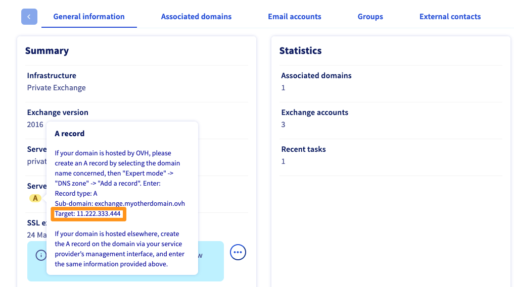

> [!primary]
> Esta traducción ha sido generada de forma automática por nuestro partner SYSTRAN. En algunos casos puede contener términos imprecisos, como en las etiquetas de los botones o los detalles técnicos. En caso de duda, le recomendamos que consulte la versión inglesa o francesa de la guía. Si quiere ayudarnos a mejorar esta traducción, por favor, utilice el botón «Contribuir» de esta página.
> 

**Última actualización: 12/09/2022**

## Objetivo

El SPF (Sender Policy Framework) permite al servidor que recibe un mensaje de correo electrónico asegurarse de que este se ha enviado correctamente desde un servidor de confianza. 

- que permite prevenir posibles usurpaciones de identidad procedentes de direcciones de correo electrónico que utilizan su dominio (spoofing). 
- también permite autentificar los mensajes de correo electrónico que envía.
- El registro SPF se añade como registro en la zona DNS del dominio.

Esto es posible gracias a la información introducida en el propio SPF, que incluye los siguientes datos:

- **direcciones de servidores y/o direcciones IP**: para poder identificarlos como fuentes de envío legítimas.
- **un calificador**: permitirá recomendar al servidor que reciba los mensajes de correo una forma de reaccionar a un mensaje considerado como no legítimo, es decir, procedente de un origen que no está listado.

Así pues, usted deberá asegurarse de indicar en el SPF los orígenes de envíos que utilice para enviar emails con su nombre de dominio. Estas fuentes pueden ser su propio servidor, el de su proveedor o una de las soluciones de correo electrónico de OVHcloud.

> **Caso práctico** <br> 
> Está enviando un email desde su dirección `contact@mydomain.ovh`.
> Solo el servidor **saliente A** (Outgoing Mail Server **A**) está declarado en el registro SPF del dominio `mydomain.ovh`.
> Cuando el servidor de recepción (Inbound Mail Server) recibe el mensaje de correo, este lee la zona DNS de su dominio `mydomain.ovh` para inspeccionar el registro SPF.
>
> - Dado que el servidor saliente **A** (Outgoing Mail Server **A**) está bien listado en el registro SPF, el mensaje se enviará normalmente a la bandeja de entrada del destinatario.
> - Al no estar incluido en el registro SPF el servidor saliente **B** (Outgoing Mail Server **B**), el mensaje enviado desde este servidor se marcará como sospechoso en la bandeja de correo entrante. Esto puede traducirse en una mención `[SPAM]` en el asunto del e-mail, la colocación en una carpeta `Correo indeseable`, o una supresión directa, según las reglas del servidor de recepción.
>
> {.thumbnail}

> [!primary]
>
> El SPF solo es una indicación proporcionada a los servidores de recepción de correo electrónico, incluyendo los suyos. Corresponde a estos últimos aplicar o no lo que se indica en el registro SPF de los nombres de dominio para los que reciben mensajes.
>

**Esta guía explica cómo configurar un registro SPF en un dominio de OVHcloud.**

## Requisitos

- Tener acceso a la gestión del dominio desde el [área de cliente de OVHcloud](https://ca.ovh.com/auth/?action=gotomanager&from=https://www.ovh.com/world/&ovhSubsidiary=ws){.external}.
- Haber iniciado sesión en el [área de cliente de OVHcloud](https://ca.ovh.com/auth/?action=gotomanager&from=https://www.ovh.com/world/&ovhSubsidiary=ws){.external}.
- El dominio debe utilizar la configuración de OVHcloud (es decir, los servidores DNS de OVHcloud).

> [!warning]
>
> Si el dominio no utiliza los servidores DNS de OVHcloud, deberá editar el SPF desde el panel que le ofrezca el proveedor que gestione la configuración de su dominio.
>
> Si el dominio está registrado en OVHcloud, puede comprobar si utiliza nuestra configuración de OVHcloud desde el [área de cliente](https://ca.ovh.com/auth/?action=gotomanager&from=https://www.ovh.com/world/&ovhSubsidiary=ws){.external}, en la pestaña `Servidores DNS`{.action}, seleccionando el dominio correspondiente.
>

## Procedimiento

### Comprobar su configuración SPF actual

Si el dominio utiliza la configuración de OVHcloud, puede comprobar si ya hay un registro SPF configurado para este último. Para ello, conéctese al [área de cliente de OVHcloud](https://ca.ovh.com/auth/?action=gotomanager&from=https://www.ovh.com/world/&ovhSubsidiary=ws){.external}. En la sección `Dominios`{.action}, seleccione el dominio correspondiente. Haga clic en la pestaña `Zona DNS`{.action}.

Se mostrará una tabla que muestra la zona DNS de su dominio en OVHcloud. Está formada por varios registros, todos ellos simbolizados por una línea de la tabla.

> [!primary]
>
> Si el dominio está registrado en OVHcloud, puede comprobar si utiliza correctamente los servidores DNS de OVHcloud desde la pestaña `Servidores DNS`{.action}.
>

Para encontrar la línea correspondiente al SPF de OVHcloud, puede utilizar un filtro de visualización en la tabla. Puede aparecer en dos lugares diferentes, seleccione en el registro de filtrado `TXT`{.action} o `SPF`{.action}, pasando de uno a otro si es necesario. En la tabla, puede encontrar lo siguiente:

- **Se mostrará** un SPF correspondiente a la información de OVHcloud de su producto: su dominio ya utiliza la configuración de OVHcloud. Si no quiere utilizarla, más adelante explicamos cómo modificar la configuración.

- **Se mostrará** un SPF que no corresponda a la información de OVHcloud: su dominio ya utiliza un SPF personalizado. Su modificación o la elección de la configuración de OVHcloud se realizan en la siguiente etapa. Si su configuración no es correcta, deberá cambiarla.

- **No se muestra ningún SPF en la columna "Destino**": Compruebe si el registro no se crea como SPF o TXT modificando el filtrado. Si no aparece ningún SPF, independientemente del filtrado, el dominio no utiliza ninguno. Más adelante explicamos cómo añadirlo.

> [!primary]
>
> Un SPF se compone siempre de la forma siguiente : "v=spf1 `orígenes` `calificador`". Por ejemplo, el SPF de OVHcloud es: "v=spf1 include:mx.ovh.ca ~all".
>

{.thumbnail}

### Configurar el registro SPF

Para añadir un registro SPF a la configuración de OVHcloud de su dominio, conéctese al [área de cliente de OVHcloud](https://ca.ovh.com/auth/?action=gotomanager&from=https://www.ovh.com/world/&ovhSubsidiary=ws){.external}.Haga clic en `Dominios`{.action} y seleccione el dominio correspondiente. A continuación, abra la pestaña `Zona DNS`{.action}.

Para añadir un registro SPF, haga clic en `Añadir un registro`{.action}.

{.thumbnail}

Se abrirá una ventana en la que podrá elegir entre varios registros DNS. Para añadir un SPF, existen dos posibilidades:

- [Añadir un registro TXT](#txtrecord) : para usuarios avanzados o que ya dispongan del registro completo. Por ejemplo, su proveedor de soluciones de correo electrónico transmite el valor.
- [Añadir un registro SPF](#spfrecord) : para los usuarios que no dispongan del registro completo. Por ejemplo, solo tiene una dirección IP o el nombre del host del servidor de correo.
- [Añadir un registro SPF](#spfrecordovhcloud)**y utilizar la configuración de OVHcloud**: para los usuarios que solo posean los productos de correo electrónico de OVHcloud en su dominio (excepto [Private Exchange](https://www.ovhcloud.com/es/emails/hosted-exchange/){.external} y Exchange Provider).

{.thumbnail}


#### Añadir un registro SPF <a name="spfrecord"></a>

Ha elegido el registro `SPF.`{.action}

El asistente de configuración le ayudará a personalizar el SPF. Para ello, deberá responder a las preguntas y proporcionar la información necesaria. Algunos elementos solicitados pueden dirigirse a usuarios experimentados.

A continuación, los explicamos en detalle:

{.thumbnail}

|Detalles|Descripción|
|---|---|
|Subdominio|Complételo si el SPF debe aplicarse a un subdominio de su dominio. Solo es aplicable si envía correo desde un subdominio.|
|TTL|Tiempo de propagación que se aplicará a la configuración de este registro DNS.|
|¿Autorizar a la IP para que envíe correo?| Marque esta casilla si su sitio web y sus direcciones de correo están alojados en un servidor que utiliza la misma dirección IP (por ejemplo, en su servidor dedicado).|
|¿Autorizar a los servidores MX para que envíen correo?|Marque esta casilla si los servidores que reciban el correo también pueden enviarlo.|
|¿Autorizar a todos los servidores cuyo nombre termine en el dominio para que envíen correo?|Opción a utilizar con precaución, ya que permite legitimar de forma muy amplia los orígenes de envío que utilizan su nombre de dominio.|


En lo relativo a la pregunta «**¿Hay otros servidores que envíen correo del dominio?**», puede completar los siguientes campos:

|Campo|Descripción|
|---|---|
|a|Introduzca aquí los dominios. Eso autorizará a los servidores que alojen los sitios web de los dominios indicados a enviar correo con sus direcciones.|
|mx|Introduzca aquí los servidores que reciban el correo (servidores MX) si también pueden enviar correo, para identificarlos como origen de envío legítimo.|
|ptr|Introduzca aquí los nombres de hosts cuyo registro *inverso* sea funcional (gracias al registro PTR en la zona DNS). para identificarlos como origen de envío legítimo.|
|ip4|Indique la IP o rango de IP (IPv4) autorizados a enviar correo con sus direcciones.|
|ip6|Indique la IP o rango de IP (IPv6) autorizados a enviar correo con sus direcciones.|
|include|Introduzca aquí los dominios con sus propias reglas SPF. Esto permitirá que estas direcciones sean compatibles con su propio dominio. Por ejemplo, OVHcloud utiliza este método en su configuración SPF:  "v=spf1 include:mx.ovh.ca ~all", lo que permite a OVHcloud gestionar el SPF de mx.ovh.ca y permitir a sus clientes utilizarlo.|

Por último, en lo relativo a la pregunta «**¿La información que ha indicado describe todos los hosts que envían correo del dominio?**», dispone de tres opciones:

|Campo|Descripción|
|---|---|
|Sí, estoy seguro|Pide a los servidores que reciban mensajes de correo procedentes de su dominio que los rechacen si provienen de un origen no legítimo  (no indicado en su SPF).|
|Sí, pero utilizar el modo seguro|Pide a los servidores que reciban mensajes de correo procedentes de su dominio que los acepten si provienen de un origen no legítimo (no indicado en su SPF), pero etiquetándolos para que puedan identificarse como susceptibles de no ser legítimos (como spam, por ejemplo).|
|No|Pide a los servidores que reciban mensajes de correo procedentes de su dominio que los acepten si provienen de un origen no legítimo  (no indicado en su SPF), sin realizar ninguna otra acción. La cabecera del email se incrementará si elige esta opción.|

Una vez completada la información, haga clic en `Siguiente`{.action}, asegúrese de que la información mostrada es correcta y haga clic en `Confirmar`{.action}.

> [!primary]
>
> Los cambios tardan entre 4 y 24 horas en propagarse y ser efectivos.
>

#### Utilizar el registro SPF de OVHcloud <a name="spfrecordovhcloud"></a>

Ha elegido el registro `SPF`{.action} y quiere aplicar la configuración de OVHcloud. Esto le permite incluir todos los servidores de correo saliente de OVHcloud para las siguientes ofertas de correo electrónico:

- Solo MX Plan o incluido en un plan de [hosting de OVHcloud](https://www.ovhcloud.com/es/web-hosting/){.external} .
- [Hosted Exchange](https://www.ovhcloud.com/es/emails/hosted-exchange/)

Haga clic en el botón `Utilizar el SPF para hosting compartido OVHcloud`{.action}, situado en la parte superior de la ventana de asistencia. Se mostrará la información relativa al SPF de OVHcloud. Haga clic en `Aceptar`{.action} para aplicar los cambios.

{.thumbnail}

> [!primary]
>
> Los cambios tardan entre 4 y 24 horas en propagarse y ser efectivos.
>

#### Añadir un registro TXT <a name="txtrecord"></a>

Entre los registros propuestos, haga clic en `TXT`{.action} y complete la información solicitada. En el campo `Valor`{.action}, introduzca el SPF que quiera utilizar.

Para finalizar, haga clic en `Siguiente`{.action}. Asegúrese de que la información es correcta y haga clic en `Confirmar`{.action}.

> [!primary]
>
> Los cambios tardan entre 4 y 24 horas en propagarse y ser efectivos.
>

{.thumbnail}

### Editar un registro SPF

Para modificar el SPF en la configuración de OVHcloud de su dominio, conéctese al [área de cliente de OVHcloud](https://ca.ovh.com/auth/?action=gotomanager&from=https://www.ovh.com/world/&ovhSubsidiary=ws){.external}.Haga clic en `Dominios`{.action} y seleccione el dominio correspondiente. A continuación, abra la pestaña `Zona DNS`{.action}.

Se mostrará una tabla con la configuración del dominio en OVHcloud. Cada línea corresponde a un registro DNS. Localice su registro TXT o SPF en esta tabla y haga clic en el botón `..`{.action} para editar la entrada.

### Configuración SPF de OVHcloud para los servicios de correo en alojamiento compartido <a name="ovhcloudspfvalue"></a>

La configuración SPF de OVHcloud general se aplica a las siguientes soluciones:

- Solo MX Plan o incluido en un plan de [hosting de OVHcloud](https://www.ovhcloud.com/es/web-hosting/).
- [Hosted Exchange](https://www.ovhcloud.com/es/emails/hosted-exchange/)

La configuración es la siguiente:

```bash
mydomain.ovh IN TXT "v=spf1 include:mx.ovh.ca ~all"
```

### Configuración SPF OVHcloud para Private Exchange 

Para la solución Private Exchange, es necesario indicar las direcciones IP del servidor de correo. Para ello, utilice el argumento `ip4` para indicar la dirección IP de su servidor Private Exchange.

```bash
mydomain.ovh IN TXT "v=spf1 ip4:11.22.33.444 ~all"
```

Si también utiliza [una solución de correo en alojamiento compartido](#ovhcloudspfvalue), puede añadir el argumento `include:mx.ovh.ca` al registro anterior, que proporciona el siguiente valor:

```bash
mydomain.ovh IN TXT "v=spf1 ip4:11.22.333.444 include:mx.ovh.ca ~all"
```

> [!primary]
> 
> Para obtener la dirección IP del servidor Private Exchange, haga clic en `Microsoft`{.action} y seleccione `Exchange`{.action}. y seleccione el servicio Private Exchange correspondiente.
>
> En la pestaña `Información general`{.action}, haga clic en el botón `A` del apartado `Diagnóstico del servidor`. En la nueva ventana, seleccione el valor.
>
> {.thumbnail}

## Más información

[Editar una zona DNS de OVHcloud](../web_hosting_como_editar_mi_zona_dns/){.external}.

[Cambiar los servidores DNS de un dominio de OVHcloud](../web_hosting_informacion_general_sobre_los_servidores_dns/){.external}.

Interactúe con nuestra comunidad de usuarios en <https://community.ovh.com/en/>.
