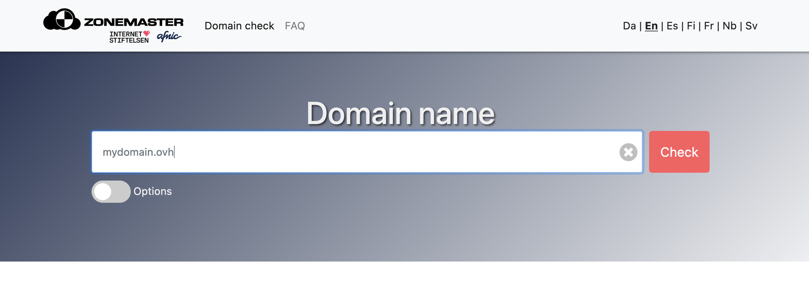
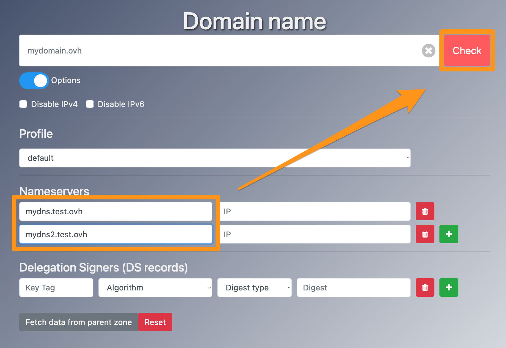
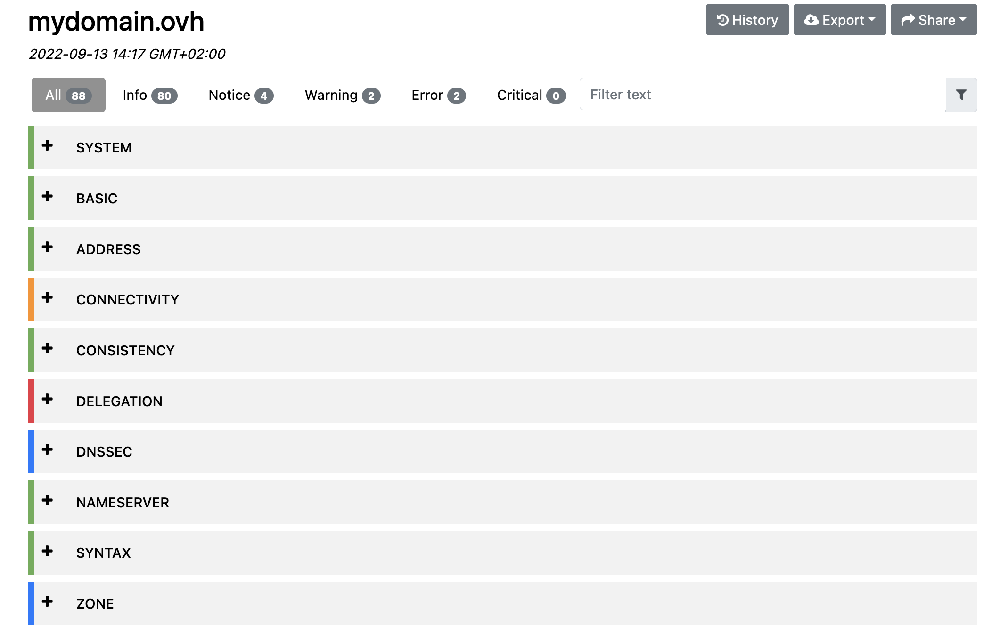

**Last updated 12th September 2022**

> [!warning]
>
> OVHcloud provides services that you are responsible for with regard to their configuration and management. It is therefore your responsibility to ensure that they function properly.
>
> This tutorial is designed to help you with common tasks. Nevertheless, we recommend contacting a [specialist provider](https://partner.ovhcloud.com/en-sg/) if you encounter any difficulties. We will not be able to assist you. You can find more information in the [Go further](#go-further) section of this guide.
>

## Objective

[Zonemaster](https://zonemaster.net/domain_check) is a tool created by the collaboration between [AFNIC](https://www.afnic.fr/en/) (French registry) and [The Swedish Internet Foundation](https://internetstiftelsen.se/en/) (Swedish registry). It allows you to analyse the Domain Name System (DNS) configuration of a domain name and identify what can be improved or corrected.

> [!primary]
>
> To get a better understanding of DNS, please read the introduction to our guide on [configuring a DNS zone](https://docs.ovh.com/sg/en/domains/web_hosting_how_to_edit_my_dns_zone/).

## Requirements

- A [domain name](https://www.ovhcloud.com/en-sg/domains/)

## Instructions

### Input field

The Zonemaster tool allows you to check a DNS configuration in place on a domain name or to test a preconfigured DNS zone on future DNS servers.

To check the current configuration of a domain name, enter your domain name, then click `Check`{.action}.

{.thumbnail}

To check a DNS configuration that has been prepared but not yet applied to the domain name concerned, select the `Options`{.action} box, and then enter the following information:

- **Nameservers**: Enter the information for the DNS server associated with a domain name, then click the `+`{.action} button to confirm your entry. Entering an IP address is optional.
- **Delegation Signers (DS records)**: If DNSSEC protection applies, enter the DS record items here, then click `+`{.action} to add the record. If the DNS servers do not use the DNSSEC protocol, you can leave these fields empty.

You can also force checks on a specific IP protocol by using the `Disable IPv6` and `Disable IPv4` checkboxes.

> **Example**:   You have the domain name mydomain.ovh, which currently uses the DNS servers "dns19.ovh.net" and "ns19.ovh.net". 
>
> You have configured a DNS zone for this domain name on the DNS servers "mydns.test.ovh" and "mydns2.test.ovh". 
> Before you change the DNS servers, you can perform an advanced search by enabling `Options`{.action}, then entering "mydns.test.ovh" and "mydns2.test.ovh" into the `Nameservers` fields. 
> Zonemaster will perform a test as if you were using the servers "mydns.test.ovh" and "mydns2.test.ovh" on mydomain.ovh. 
> {.thumbnail}

> [!primary]
>
> When you enter a domain name and click on `Fetch data from parent zone`{.action}, the DNS servers associated with the domain name will appear, along with the DNS record information (DNSSEC) if it has been configured.
> {.thumbnail}

### Result

Once the form has been validated, the results are sorted by colour code:

- **Green**: This part is functional and meets the standard criteria in its category.
- **Orange**: This part is functional, but deserves special attention. The tool has detected that this parameter has characteristics that do not fit within its category, without blocking its operation.
- **Red**: This part contains errors or missing elements that may cause a malfunction. 
- **Blue**: This is merely information, with no particular consequences for the functioning of the domain name.

{.thumbnail}

### Useful information

If you have any additional questions about Zonemaster, see the [FAQ](https://zonemaster.net/faq) on <https://zonemaster.fr/>.

## Go further 

[Editing the DNS servers for an OVHcloud domain name](https://docs.ovh.com/sg/en/domains/web_hosting_general_information_about_dns_servers/)

[Editing an OVHcloud DNS zone](https://docs.ovh.com/sg/en/domains/web_hosting_how_to_edit_my_dns_zone/)

[Securing your domain name with DNSSEC](https://docs.ovh.com/sg/en/domains/secure_your_domain_with_dnssec/)

For specialised services (SEO, development, etc.), contact [OVHcloud partners](https://partner.ovhcloud.com/en-sg/) .

If you would like assistance using and configuring your OVHcloud solutions, please refer to our [support offers](https://www.ovhcloud.com/en-sg/support-levels/).

Join our community of users on <https://community.ovh.com/en/>.
